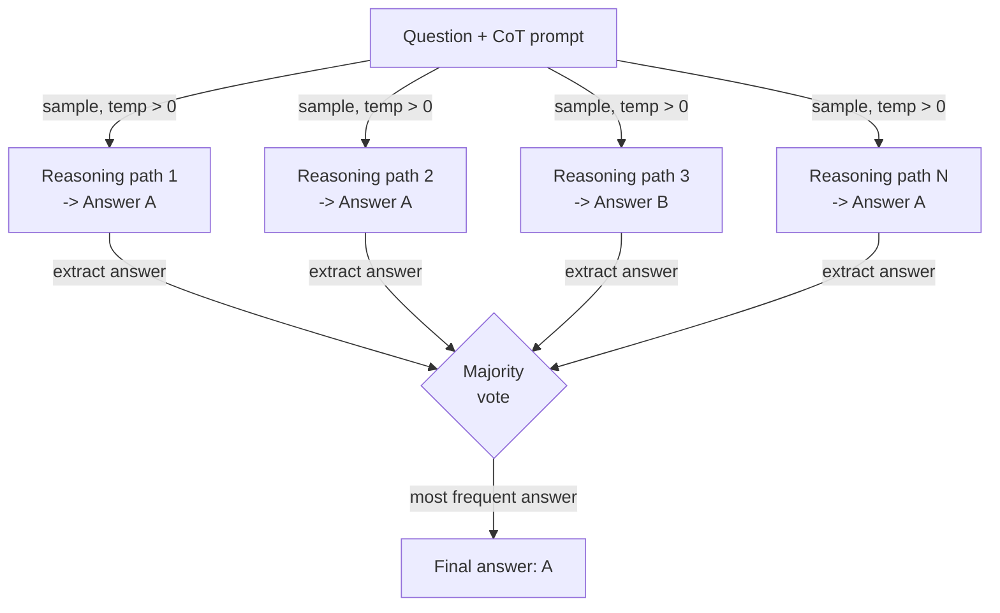

# Self-consistency

## Definition

Self-consistency is a prompting technique introduced by Wang et al. (2022) that addresses a fundamental weakness of chain-of-thought (CoT) prompting: a single reasoning path can lead to a confident but wrong answer. The insight is that correct answers tend to be robust — multiple independent reasoning paths that approach a problem from different angles should converge on the same answer — while incorrect answers tend to be fragile and inconsistent across paths. By sampling many reasoning chains at temperature > 0 and taking the majority vote over their final answers, self-consistency acts as a weak but practical ensemble method that significantly reduces reasoning errors without any model fine-tuning.

The relationship to CoT is direct: self-consistency is CoT with repeated sampling. A standard CoT prompt produces one chain of reasoning and one answer; self-consistency produces N chains (typically 10–40) and N answers, then aggregates. The temperature setting is critical: you need diversity in the reasoning paths, so greedy decoding (temperature=0) defeats the purpose. A temperature in the range 0.5–0.8 usually provides enough diversity for effective voting while keeping each individual chain coherent. On benchmarks like GSM8K (math word problems), AQuA (algebraic reasoning), and SVAMP, self-consistency improves CoT accuracy by 10–20 percentage points at the cost of N times more inference calls.

What makes self-consistency practically useful — and distinct from simply adding a self-evaluation step — is that it requires no additional model calls for "checking" or "critiquing." The voting mechanism is purely statistical: whichever answer appears most frequently among N samples wins. This makes it simple to implement, model-agnostic, and straightforward to tune (simply vary N). The main limitation is cost: N completions cost N times as much. Self-consistency is therefore best applied to tasks where accuracy is worth the inference budget — math, multi-step reasoning, and high-stakes classification — rather than to latency-sensitive or token-cost-sensitive applications.

## How it works



### Generating diverse reasoning paths

The first step is to prompt the model with a standard few-shot CoT prompt — a set of example (question, step-by-step reasoning, answer) triples followed by the new question. The key departure from standard CoT is that you call the API N times with temperature > 0 rather than once with temperature 0. Each call is statistically independent; the model explores a different decomposition of the problem, may use different intermediate variables or calculation orders, and may even make different intermediate errors — but if the underlying answer is correct, most paths will still reach it. The number of samples N is a hyperparameter: more samples reduce variance but increase cost. In the original paper, N=40 is used for maximum accuracy; in practice, N=10–20 often recovers most of the benefit at lower cost.

### Extracting and normalizing answers

After collecting N completions, you must extract the final answer from each reasoning chain. For well-structured CoT prompts, the answer is typically in the last sentence after a phrase like "The answer is..." or "Therefore, X." For numeric answers, normalization matters: "3/4", "0.75", and "75%" are the same answer and must map to the same canonical form before voting. For classification or short-answer tasks, the extraction is usually a substring match or a simple parse. Extraction robustness is the most fragile part of the pipeline — if the model produces a chain that does not end with a clearly parsable answer, that path must be discarded or assigned to an "unknown" bucket.

### Majority voting

The aggregation step is a frequency count over extracted answers. The most common answer wins. Ties can be broken by choosing the answer from the path with the highest log-probability, or simply by returning the tied answers with their vote counts for human review. The statistical intuition is that errors are diverse (different wrong answers for different reasons) while correct answers are concentrated (most paths arrive at the same right answer). This property holds most strongly for tasks with a unique correct answer, such as arithmetic, symbolic reasoning, and fact-based QA. For open-ended generation tasks — summarization, creative writing, code — self-consistency is less applicable because majority vote over essays is not well-defined.

## When to use / When NOT to use

| Use when | Avoid when |
|----------|------------|
| Task has a single correct answer and CoT accuracy is insufficient | Latency is a hard constraint (N times inference calls are unacceptable) |
| Multi-step arithmetic or algebraic reasoning with known error rates | Token cost is the primary concern and you cannot afford N completions |
| High-stakes classification where a few percentage points of accuracy matter | The task is open-ended generation where majority voting is not meaningful |
| You want accuracy improvement without fine-tuning or additional models | The model already achieves near-ceiling accuracy at N=1 — diminishing returns |
| The reasoning paths need to be auditable (you can inspect all N chains) | Answer extraction is unreliable due to inconsistent output format |

## Comparisons

| Criterion | Self-consistency | Chain-of-thought (CoT) | Self-evaluation |
|-----------|-----------------|------------------------|-----------------|
| Number of LLM calls | N (typically 10–40) | 1 | 2 (generate + critique) |
| Accuracy improvement | High — 10–20pp on reasoning benchmarks | Moderate — substantial over direct prompting | Moderate — depends on model self-critique quality |
| Cost | High — linear in N | Low | Low-moderate |
| Implementation complexity | Low — sample N times and vote | Very low | Moderate — requires designing a critique prompt |
| Works without external feedback | Yes | Yes | Yes |
| Best task type | Math, symbolic reasoning, factual QA | Most reasoning tasks | Tasks where the model can detect its own errors |
| Note | More reliable than CoT but proportionally more expensive | Simpler baseline — try before self-consistency | Complementary — can be combined for further gains |

## Code examples

### Self-consistency with OpenAI API

```python
# Self-consistency: sample N CoT paths and take majority vote
# pip install openai

import os, re
from collections import Counter
from openai import OpenAI

client = OpenAI(api_key=os.environ["OPENAI_API_KEY"])

FEW_SHOT = """Q: Roger has 5 tennis balls. He buys 2 cans with 3 each. How many now?
A: 5 + (2 x 3) = 5 + 6 = 11. The answer is 11.

Q: Cafeteria had 23 apples, used 20, bought 6 more. How many now?
A: 23 - 20 = 3. 3 + 6 = 9. The answer is 9.

Q: {question}
A:"""


def extract_answer(text: str) -> str | None:
    m = re.search(r"[Tt]he answer is\s+([^.\n]+)", text)
    return m.group(1).strip().rstrip(".,;") if m else None


def self_consistency(question: str, n: int = 10, temp: float = 0.7) -> dict:
    """Sample n CoT paths and return majority vote answer with confidence."""
    answers, completions = [], []
    for i in range(n):
        resp = client.chat.completions.create(
            model="gpt-4o-mini",
            messages=[{"role": "user", "content": FEW_SHOT.format(question=question)}],
            temperature=temp,
            max_tokens=300,
        )
        text = resp.choices[0].message.content.strip()
        completions.append(text)
        ans = extract_answer(text)
        if ans:
            answers.append(ans)
        print(f"  Path {i+1:>2}: {ans!r}")

    if not answers:
        return {"answer": None, "votes": {}}
    counts = Counter(answers)
    winner, votes = counts.most_common(1)[0]
    return {"answer": winner, "confidence": votes / len(answers), "votes": dict(counts)}


if __name__ == "__main__":
    q = ("Janet's ducks lay 16 eggs per day. She eats 3 and bakes with 4. "
         "She sells the rest at $2/egg. How much does she make daily?")
    r = self_consistency(q, n=10)
    print(f"\nAnswer    : {r['answer']}")
    print(f"Confidence: {r['confidence']:.0%}")
    print(f"Votes     : {r['votes']}")
```

### Numeric answer normalization for robust voting

```python
# Normalize numeric answers before majority voting
# Handles fractions, decimals, currency, and percentage strings

import re
from collections import Counter
from fractions import Fraction


def normalize_numeric(raw: str) -> str:
    """Canonicalize a raw answer string to a float string for voting."""
    raw = raw.strip().lower()
    raw = re.sub(r"[$%,]", "", raw)
    m = re.match(r"^(\d+)/(\d+)$", raw)
    if m:
        return str(float(Fraction(int(m.group(1)), int(m.group(2)))))
    try:
        return str(float(raw))
    except ValueError:
        return raw


def majority_vote(answers: list[str]) -> str | None:
    normalized = [normalize_numeric(a) for a in answers]
    return Counter(normalized).most_common(1)[0][0] if normalized else None


if __name__ == "__main__":
    raw = ["18", "18.0", "$18", "18", "17", "18", "18", "17", "18", "18"]
    print("Majority:", majority_vote(raw))  # -> "18.0"
```

## Practical resources

- [Self-Consistency Improves Chain of Thought Reasoning in Language Models (Wang et al., 2022)](https://arxiv.org/abs/2203.11171) — Original paper with benchmarks on GSM8K, AQuA, SVAMP, StrategyQA, and ARC.
- [Chain-of-Thought Prompting Elicits Reasoning in Large Language Models (Wei et al., 2022)](https://arxiv.org/abs/2201.11903) — The CoT paper that self-consistency builds on; essential background.
- [OpenAI — Chat completions API reference](https://platform.openai.com/docs/api-reference/chat/create) — Reference for `temperature`, `n`, and `logprobs` parameters used in self-consistency implementations.
- [Anthropic — Prompt engineering overview](https://docs.anthropic.com/en/docs/build-with-claude/prompt-engineering/overview) — Includes guidance on sampling and chain-of-thought for Claude models.

## See also

- [Prompt engineering](/docs/prompt-engineering)
- [Chain-of-thought (CoT)](/docs/reasoning-patterns/cot)
- [Prompt ensembling](/docs/prompt-engineering/prompt-ensembling)
