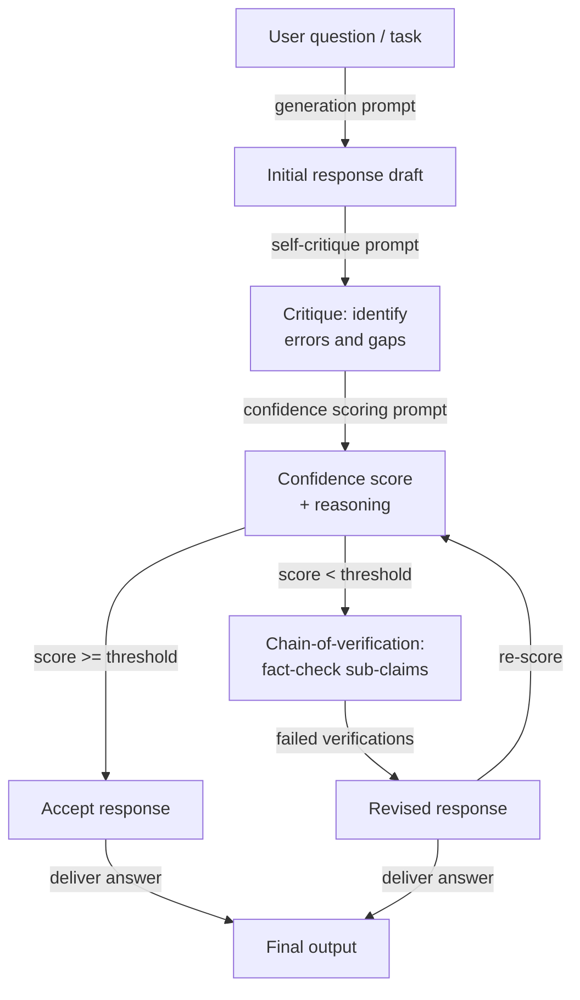

# Self-evaluation and calibration

## Definition

Self-evaluation refers to prompting a language model to critique, verify, or score its own previously generated output. Rather than treating the model's first response as final, a self-evaluation step asks the model to act as its own reviewer — checking for factual errors, logical inconsistencies, incomplete reasoning, or failure to follow instructions — and then either to flag problems or to generate an improved response. The model uses the same weights and context window for both roles, which is both a strength (no additional model is needed) and a fundamental limitation (the model may have systematic blind spots it cannot self-detect).

Calibration is the narrower, quantitative dimension of self-evaluation. A model is *well-calibrated* if its expressed confidence matches its empirical accuracy: when it says it is 80% confident, it should be correct roughly 80% of the time. Most LLMs are poorly calibrated out of the box — they express high confidence even on questions they answer incorrectly, a phenomenon known as *overconfidence* or *epistemic overreach*. Calibration techniques prompt the model to produce an explicit numeric confidence score alongside each answer, and then the system can use that score to route uncertain answers to human review, to trigger additional verification steps, or to abstain from answering altogether.

Together, self-evaluation and calibration address two distinct but related failure modes. Self-evaluation addresses *correctness*: the model produced an answer, but is it right? Calibration addresses *uncertainty awareness*: does the model know when it doesn't know? Both are necessary for deploying LLMs in high-stakes settings. A model that catches its own errors is more reliable; a model that knows what it doesn't know is more trustworthy. The techniques covered here — self-critique, confidence scoring, and chain-of-verification — are increasingly standard components of production LLM pipelines.

## How it works



### Self-critique

Self-critique is the simplest self-evaluation method. After generating an initial response, you append a second prompt that asks the model to review its own output against explicit criteria. Good self-critique prompts are *specific* about what to check: factual accuracy, logical consistency, completeness, instruction adherence, tone, or safety. Vague prompts like "Is this response good?" produce shallow, superficial critiques. Specific prompts like "List any factual claims in the response that you are less than 90% confident about, and explain why" produce actionable feedback.

The quality of self-critique improves substantially when you instruct the model to adopt an adversarial stance — to actively look for problems rather than to confirm the response is fine. Phrases like "Challenge each key claim", "Find at least one flaw", and "What would a skeptic object to?" bias the model toward useful criticism rather than validation. Constitutional AI (Anthropic, 2022) systematizes this by defining a set of "principles" the model must check the response against before revising — effectively creating a structured critique rubric that can be audited.

A critical failure mode of self-critique is *sycophantic validation*: the model praises its own response and finds no problems, especially when the original response was already plausible-sounding but wrong. This is most pronounced in smaller models and least pronounced in models that have been fine-tuned with critique data. Mitigations include: using a separate model instance for critique, injecting deliberate errors into the draft to test if the critique step catches them, and requiring the critique to be a structured list rather than free prose (making "no issues" a harder claim to defend).

### Calibration and confidence scoring

Confidence scoring prompts ask the model to produce an explicit probability or ordinal rating alongside each answer. A minimal version is a simple request appended to the answer prompt: "After your answer, state your confidence as a percentage from 0 to 100, where 100 means you are certain and 0 means you are guessing." More sophisticated versions ask for a breakdown by claim: "For each factual statement in your response, rate your confidence (high / medium / low) and identify the source of uncertainty."

Numeric confidence scores from LLMs must be treated with skepticism. Raw verbalized probabilities are not well-calibrated in the statistical sense — a model that says "70% confident" is not systematically right 70% of the time on those questions. However, they are *monotonically useful*: questions where the model reports low confidence tend to be harder and more error-prone than questions where it reports high confidence. This means verbalized confidence scores are useful for *ranking* and *routing* (send low-confidence answers to review) even if they are not useful for exact probability estimation.

Calibration can be improved post-hoc through temperature scaling or Platt scaling applied to the model's log-probabilities, but these require a labeled dataset. At the prompt level, you can improve relative calibration by asking the model to compare its confidence against reference questions of known difficulty ("I am as confident as I would be about the capital of France vs. an obscure historical date").

### Chain-of-verification

Chain-of-verification (CoVe, Dhuliawala et al., 2023) structures self-evaluation as a multi-step verification pipeline: generate a baseline response, then explicitly plan a set of verification questions that would confirm or refute the key claims in that response, answer those verification questions independently (without looking at the original response to reduce confirmation bias), and finally produce a revised response informed by the verification results. This decomposition is important because it forces the model to separate *claim generation* from *claim verification*, reducing the chance that the same reasoning error propagates through both steps.

The verification questions should be atomic — each should test a single, specific sub-claim. For example, if the baseline response states "Python 3.10 introduced structural pattern matching and the walrus operator", the verification questions should be: "In which Python version was structural pattern matching introduced?" and "In which Python version was the walrus operator introduced?" Answering these independently often surfaces factual errors that the original response confidently asserted.

## When to use / When NOT to use

| Use when | Avoid when |
|----------|------------|
| The task is high-stakes and factual correctness is critical (medical, legal, financial) | Latency is a hard constraint — self-evaluation adds at least one full inference round-trip |
| You want a built-in uncertainty signal without a separate evaluator model | The model's domain is one where self-evaluation is systematically unreliable (e.g., very recent events beyond training cutoff) |
| Output quality is highly variable across runs and you need a filtering mechanism | The task is simple and well-constrained — self-evaluation overhead exceeds accuracy benefit |
| You need to route uncertain answers to human review automatically | The model is too small to produce reliable self-critiques (< 7B parameters typically yields poor self-evaluation) |
| Responses contain multiple independent factual claims that can be verified atomically | You need exact probability calibration — verbalized confidence scores are not statistically calibrated |
| Building a pipeline where the model must detect its own hallucinations | The original generation is already at ceiling accuracy — self-critique adds cost with no accuracy gain |

## Comparisons

| Criterion | Self-evaluation | Self-consistency | External evaluation |
|-----------|----------------|-----------------|---------------------|
| Additional model calls | 1–3 (critique, score, verify) | N (typically 10–40) | 1 (separate evaluator) |
| Requires separate model | No — same model reviews itself | No | Yes — typically a stronger or specialized model |
| Catches factual errors | Yes, if self-critique is well-prompted | Partially — inconsistent facts may survive majority vote | Yes, more reliably |
| Provides uncertainty score | Yes — explicit confidence rating | Implicit — vote spread is a proxy for confidence | Yes — evaluator can output a score |
| Reduces hallucination | Yes, especially with CoVe | Partially — voting reduces but does not eliminate hallucination | More reliably, but adds cost and latency |
| Implementation effort | Moderate — requires careful critique prompt design | Low — sample N times and vote | High — requires evaluator prompt, separate API call, possibly a separate model |
| Best use case | Single-turn high-stakes Q&A, factual generation | Multi-step math and reasoning | Enterprise pipelines with strong correctness requirements |

## Code examples

### Self-evaluation with critique step using Anthropic SDK

```python
# Self-evaluation pipeline: generate → critique → score → revise
# pip install anthropic

import os
from anthropic import Anthropic

client = Anthropic(api_key=os.environ["ANTHROPIC_API_KEY"])
MODEL = "claude-opus-4-5"


def generate_initial(question: str) -> str:
    """Step 1: Generate an initial response."""
    response = client.messages.create(
        model=MODEL,
        max_tokens=512,
        messages=[{"role": "user", "content": question}],
    )
    return response.content[0].text.strip()


def critique_response(question: str, response: str) -> str:
    """Step 2: Critique the initial response for errors and gaps."""
    prompt = f"""You are a rigorous fact-checker and critic. Review the response below and identify:
1. Any factual claims you are less than fully confident about
2. Logical inconsistencies or gaps in reasoning
3. Missing context that would be important for the user

Question: {question}

Response to critique:
{response}

Provide a structured critique. If you find no issues, you must still explain why you believe the response is correct. Do not simply validate the response."""

    critique = client.messages.create(
        model=MODEL,
        max_tokens=512,
        messages=[{"role": "user", "content": prompt}],
    )
    return critique.content[0].text.strip()


def score_confidence(question: str, response: str, critique: str) -> dict:
    """Step 3: Produce an explicit confidence score based on the critique."""
    prompt = f"""Given the question, the response, and the critique below, assign a confidence score.

Question: {question}

Response:
{response}

Critique:
{critique}

Output in this exact format:
CONFIDENCE: [integer 0-100]
REASONING: [one sentence explaining the score]
SHOULD_REVISE: [yes/no]"""

    result = client.messages.create(
        model=MODEL,
        max_tokens=128,
        messages=[{"role": "user", "content": prompt}],
    )
    text = result.content[0].text.strip()

    # Parse structured output
    confidence, reasoning, should_revise = None, "", False
    for line in text.splitlines():
        if line.startswith("CONFIDENCE:"):
            try:
                confidence = int(line.split(":", 1)[1].strip())
            except ValueError:
                pass
        elif line.startswith("REASONING:"):
            reasoning = line.split(":", 1)[1].strip()
        elif line.startswith("SHOULD_REVISE:"):
            should_revise = "yes" in line.lower()

    return {"confidence": confidence, "reasoning": reasoning, "should_revise": should_revise}


def revise_response(question: str, initial: str, critique: str) -> str:
    """Step 4: Produce a revised response informed by the critique."""
    prompt = f"""Revise the response below to address the issues identified in the critique.
Preserve correct information. Be explicit about any remaining uncertainty.

Question: {question}

Original response:
{initial}

Critique to address:
{critique}

Revised response:"""

    revised = client.messages.create(
        model=MODEL,
        max_tokens=512,
        messages=[{"role": "user", "content": prompt}],
    )
    return revised.content[0].text.strip()


def self_evaluate(question: str, confidence_threshold: int = 75) -> dict:
    """Full self-evaluation pipeline: generate, critique, score, conditionally revise."""
    print("=== Step 1: Generating initial response ===")
    initial = generate_initial(question)
    print(initial[:200], "...\n" if len(initial) > 200 else "\n")

    print("=== Step 2: Critiquing response ===")
    critique = critique_response(question, initial)
    print(critique[:200], "...\n" if len(critique) > 200 else "\n")

    print("=== Step 3: Scoring confidence ===")
    score = score_confidence(question, initial, critique)
    print(f"Confidence : {score['confidence']}")
    print(f"Reasoning  : {score['reasoning']}")
    print(f"Revise?    : {score['should_revise']}\n")

    final = initial
    if score["should_revise"] or (score["confidence"] is not None and score["confidence"] < confidence_threshold):
        print("=== Step 4: Revising response ===")
        final = revise_response(question, initial, critique)
        print(final[:200], "...\n" if len(final) > 200 else "\n")
    else:
        print("=== Step 4: Skipped — confidence above threshold ===\n")

    return {
        "question": question,
        "initial_response": initial,
        "critique": critique,
        "confidence_score": score,
        "final_response": final,
        "was_revised": final != initial,
    }


if __name__ == "__main__":
    q = ("What were the main causes of the 2008 financial crisis, "
         "and which regulatory changes were enacted in response?")
    result = self_evaluate(q, confidence_threshold=80)
    print("=== Final answer ===")
    print(result["final_response"])
    print(f"\nRevised: {result['was_revised']}")
    print(f"Confidence: {result['confidence_score']['confidence']}")
```

### Chain-of-verification for factual claims

```python
# Chain-of-Verification (CoVe): decompose claims, verify independently, revise
# pip install anthropic

import os
from anthropic import Anthropic

client = Anthropic(api_key=os.environ["ANTHROPIC_API_KEY"])
MODEL = "claude-opus-4-5"


def extract_verification_questions(response: str) -> list[str]:
    """Generate atomic verification questions for each factual claim."""
    prompt = f"""Read the response below and generate a list of atomic verification questions
— one per distinct factual claim. Each question should be answerable independently
without referring to the original response.

Response:
{response}

Output as a numbered list of questions only. No preamble."""

    result = client.messages.create(
        model=MODEL,
        max_tokens=400,
        messages=[{"role": "user", "content": prompt}],
    )
    text = result.content[0].text.strip()
    questions = []
    for line in text.splitlines():
        line = line.strip()
        if line and line[0].isdigit():
            # Strip leading number and punctuation
            q = line.lstrip("0123456789.)- ").strip()
            if q:
                questions.append(q)
    return questions


def verify_claim(question: str) -> dict:
    """Answer a single verification question independently."""
    prompt = f"""Answer the following question as accurately as possible.
If you are uncertain, say so explicitly and explain why.

Question: {question}

Answer:"""

    result = client.messages.create(
        model=MODEL,
        max_tokens=150,
        messages=[{"role": "user", "content": prompt}],
    )
    answer = result.content[0].text.strip()
    uncertain = any(w in answer.lower() for w in ("uncertain", "unsure", "not sure", "don't know", "unclear"))
    return {"question": question, "answer": answer, "uncertain": uncertain}


def revise_with_verifications(original_response: str, verifications: list[dict]) -> str:
    """Produce a revised response informed by independent verification results."""
    verification_block = "\n".join(
        f"Q: {v['question']}\nA: {v['answer']}\n" for v in verifications
    )
    prompt = f"""Revise the response below using the independent verification answers provided.
Correct any inaccuracies. Where verifications indicate uncertainty, acknowledge that uncertainty explicitly.

Original response:
{original_response}

Independent verifications:
{verification_block}

Revised response:"""

    result = client.messages.create(
        model=MODEL,
        max_tokens=600,
        messages=[{"role": "user", "content": prompt}],
    )
    return result.content[0].text.strip()


def chain_of_verification(question: str) -> dict:
    """Full CoVe pipeline for a factual question."""
    # Step 1: Baseline response
    baseline = client.messages.create(
        model=MODEL,
        max_tokens=400,
        messages=[{"role": "user", "content": question}],
    ).content[0].text.strip()

    # Step 2: Plan verification questions
    vqs = extract_verification_questions(baseline)
    print(f"Generated {len(vqs)} verification questions.")

    # Step 3: Answer each verification question independently
    verifications = [verify_claim(q) for q in vqs]
    uncertain_count = sum(1 for v in verifications if v["uncertain"])
    print(f"Uncertain claims: {uncertain_count}/{len(verifications)}")

    # Step 4: Revise using verification results
    revised = revise_with_verifications(baseline, verifications)

    return {
        "question": question,
        "baseline": baseline,
        "verification_questions": vqs,
        "verifications": verifications,
        "revised": revised,
        "uncertain_claims": uncertain_count,
    }


if __name__ == "__main__":
    q = "Summarize the key milestones in the development of transformer models from 2017 to 2023."
    result = chain_of_verification(q)
    print("\n=== Baseline ===")
    print(result["baseline"])
    print("\n=== Revised (after CoVe) ===")
    print(result["revised"])
    print(f"\nUncertain claims flagged: {result['uncertain_claims']}/{len(result['verifications'])}")
```

## Practical resources

- [Self-Refine: Iterative Refinement with Self-Feedback (Madaan et al., 2023)](https://arxiv.org/abs/2303.17651) — Introduces and evaluates iterative self-critique and revision across seven diverse text generation tasks; the foundational reference for self-evaluation pipelines.
- [Chain-of-Verification Reduces Hallucination in Large Language Models (Dhuliawala et al., 2023)](https://arxiv.org/abs/2309.11495) — Proposes CoVe, the structured verification planning approach described in this article, with experiments on list-based QA and long-form generation.
- [Constitutional AI: Harmlessness from AI Feedback (Bai et al., 2022)](https://arxiv.org/abs/2212.08073) — Demonstrates systematic self-critique against a defined set of principles at scale; the production precedent for structured self-evaluation rubrics.
- [Language Models (Mostly) Know What They Know (Kadavath et al., 2022)](https://arxiv.org/abs/2207.05221) — Studies whether LLMs can accurately report their own uncertainty; shows that calibration is possible but imperfect, providing the empirical basis for confidence scoring techniques.
- [Calibration of Large Language Models Using Their Generations (Kapoor et al., 2024)](https://arxiv.org/abs/2403.07221) — Surveys post-hoc calibration methods including verbalized confidence and compares them against log-probability baselines across GPT-4 and Claude families.

## See also

- [Prompt engineering](/docs/prompt-engineering)
- [Self-consistency](/docs/prompt-engineering/self-consistency)
- [Debiasing techniques](/docs/prompt-engineering/debiasing-techniques)
- [Evaluation metrics](/docs/evaluation-metrics)
