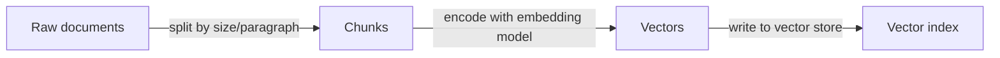
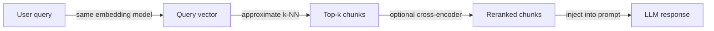

# RAG architecture

## Definition

RAG (Retrieval-Augmented Generation) architecture defines how raw documents are transformed into retrievable knowledge and how that knowledge is injected into an LLM at inference time. The pipeline has two main phases: an offline **indexing** phase that processes and stores documents, and an online **retrieval** phase that fetches relevant context for each user query.

Design choices in this architecture directly affect the quality, latency, and cost of the final system. Chunk size controls how much context each retrieved segment carries — smaller chunks are more precise but may lack context, while larger chunks reduce retrieval recall. The choice of [embedding](/docs/rag/embeddings) model determines how semantically meaningful the vector space is, and whether to use dense, sparse, or hybrid retrieval affects coverage for both semantic and keyword-based queries.

Advanced setups extend the base pipeline with query rewriting (rephrasing queries before embedding), multi-hop retrieval (chaining multiple retrievals), reranking (a cross-encoder that rescores top-k candidates), and citation extraction (attributing answers to source chunks). Each extension adds latency and complexity but can significantly improve answer quality for demanding use cases. See [vector databases](/docs/rag/vector-databases) for indexing options.

## How it works

### Indexing phase

Documents are ingested, split into chunks, and stored in a vector index.



### Retrieval phase

At query time, the query is embedded and similar chunks are retrieved and optionally reranked.



**Chunk:** Documents are split into segments (by paragraph, sentence, or fixed token count); overlap and metadata can be added to each chunk. **Embed and index:** Chunks are encoded into vectors via an [embedding](/docs/rag/embeddings) model and stored in a [vector database](/docs/rag/vector-databases). **Query:** The user's query is embedded with the same encoder; **retrieve** fetches the top-k similar chunks using dense or hybrid search. **Rank:** An optional reranker (e.g. cross-encoder) rescores the top candidates before they are formatted into the LLM prompt.

## When to use / When NOT to use

| Scenario | Use | Don't use |
|---|---|---|
| Knowledge base is large and frequently updated | Yes — chunking + indexing handles scale | No — fine-tuning is expensive to retrain |
| Answers need source attribution | Yes — chunks carry provenance metadata | No — vanilla LLM generation loses attribution |
| Queries are highly keyword-specific | Yes — hybrid retrieval combines dense + sparse | No — pure dense retrieval may miss exact matches |
| Knowledge fits in the context window | Maybe — simpler to just stuff the prompt | Yes — no need for a retrieval layer |
| Real-time latency is critical | With optimizations — caching, smaller models | Avoid reranking + multi-hop at very low latency budgets |

## Comparisons

| Approach | Chunk size | Retrieval type | Reranker | Typical use |
|---|---|---|---|---|
| Naive RAG | Fixed 512 tokens | Dense only | None | Prototyping |
| Advanced RAG | Semantic / overlapping | Hybrid (dense + BM25) | Cross-encoder | Production Q&A |
| Modular RAG | Variable, with metadata | Hybrid + filters | Learned reranker | Enterprise search |
| Multi-hop RAG | Small for precision | Dense per hop | Optional | Complex reasoning |

## Pros and cons

| Pros | Cons |
|---|---|
| Keeps knowledge up-to-date without retraining | Adds indexing and retrieval latency |
| Provides source attribution for answers | Chunking strategy significantly impacts quality |
| Scales to millions of documents | Requires maintaining a vector index |
| Composable with reranking and filtering | Query-document mismatch can hurt recall |

## Code examples

```python
from langchain_openai import OpenAIEmbeddings, ChatOpenAI
from langchain_community.vectorstores import Chroma
from langchain.text_splitter import RecursiveCharacterTextSplitter
from langchain.chains import RetrievalQA

# --- Indexing ---
splitter = RecursiveCharacterTextSplitter(chunk_size=512, chunk_overlap=64)
docs = splitter.create_documents([open("document.txt").read()])

embeddings = OpenAIEmbeddings()
vectorstore = Chroma.from_documents(docs, embeddings)

# --- Retrieval + Generation ---
retriever = vectorstore.as_retriever(search_kwargs={"k": 4})
qa_chain = RetrievalQA.from_chain_type(
    llm=ChatOpenAI(model="gpt-4o-mini"),
    retriever=retriever,
    return_source_documents=True,
)

result = qa_chain.invoke({"query": "What does the document say about X?"})
print(result["result"])
```

## Practical resources

- [LangChain – RAG architecture](https://python.langchain.com/docs/use_cases/question_answering/) — End-to-end RAG walkthrough with LangChain components
- [LlamaIndex – Document processing and indexing](https://docs.llamaindex.ai/en/stable/module_guides/loading/) — Ingestion, chunking, and indexing pipelines
- [Anthropic – RAG best practices](https://docs.anthropic.com/en/docs/build-with-claude/retrieval-augmented-generation) — Claude-specific RAG guidance and tips

## See also

- [RAG](/docs/rag)
- [Vector databases](/docs/rag/vector-databases)
- [Embeddings](/docs/rag/embeddings)
