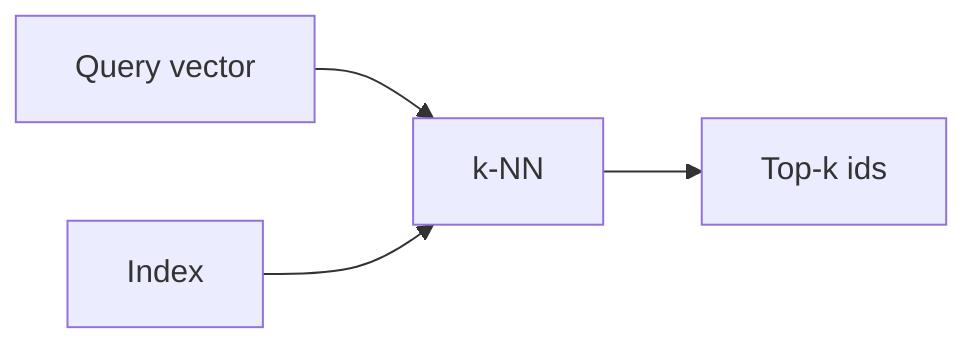

# Vector databases

## Definition

Vector databases store high-dimensional vectors (embeddings) and support fast similarity search (e.g. k-NN, approximate nearest neighbor). They are the backbone of retrieval in RAG.

They sit between [embeddings](/docs/rag/embeddings) (which produce the vectors) and the [RAG](/docs/rag) retriever (which needs the top-k chunks). Unlike keyword search, they support semantic similarity: “customer support” can match “help desk” if the [embedding](/docs/rag/embeddings) model maps them close together. See [RAG architecture](/docs/rag/architecture) for how the index fits into the full pipeline.

## How it works

Documents are [embedded](/docs/rag/embeddings) and their vectors are written to an **index** (e.g. HNSW, IVF, or flat for small datasets). At query time, the **query vector** is compared against the index via **k-NN** (or approximate k-NN for scale); the index returns **top-k ids** (and optionally the vectors or stored metadata). You then fetch the corresponding chunks and pass them to the LLM. Options include Pinecone, Weaviate, Chroma, pgvector, and others; choice depends on scale, latency, and whether you need metadata filtering.

## Use cases

Vector stores are used whenever you need fast similarity search over many embeddings (RAG, recommendations, dedup).

- Storing and querying document embeddings for RAG
- Real-time similarity search at scale (e.g. recommendations, dedup)
- Combining vector search with metadata filters (e.g. by date, category)

## External documentation

- [Chroma – Get started](https://docs.trychroma.com/getting-started)
- [Pinecone – Vector database docs](https://docs.pinecone.io/)
- [pgvector](https://github.com/pgvector/pgvector) — Vector similarity search in PostgreSQL

## See also

- [RAG](/docs/rag)
- [Embeddings](/docs/rag/embeddings)
- [Semantic search](/docs/semantic-search)
