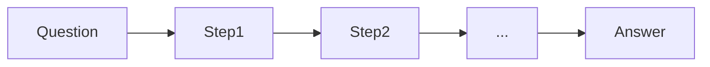

# Chain-of-thought (CoT)

## Definition

Chain-of-thought (CoT) prompting asks the model to output intermediate reasoning steps before the final answer. This often improves accuracy on math, logic, and multi-step tasks.

It is one of the simplest [reasoning patterns](/docs/reasoning-patterns): no tools or search, just prompting. Use it when the task benefits from explicit steps (e.g. arithmetic, deduction) and you want to avoid [fine-tuning](/docs/llms/fine-tuning). For exploring multiple solution paths, see [tree of thoughts](/docs/reasoning-patterns/tot); for tool-using agents, see [ReAct](/docs/reasoning-patterns/react).

## How it works

You give the model a **question** (or task) and ask it to reason step by step. The model produces **Step1**, **Step2**, … (intermediate reasoning) and then the **answer**. **Zero-shot CoT**: add “Let’s think step by step” (or similar) to the prompt. **Few-shot CoT**: include example (question, steps, answer) triples so the model mimics the format. The model generates the sequence in one pass; you can optionally parse the steps and verify or score them. Quality depends on [prompt engineering](/docs/llms/prompt-engineering) and model capability.

## Use cases

Chain-of-thought is most useful when the task benefits from explicit intermediate steps (math, logic, code).

- Math and arithmetic where intermediate steps improve accuracy
- Logic puzzles and multi-step deduction
- Code or design reasoning where showing steps aids debugging

## External documentation

- [Chain-of-Thought Prompting (Wei et al.)](https://arxiv.org/abs/2201.11903) — CoT paper
- [OpenAI – Prompt engineering](https://platform.openai.com/docs/guides/prompt-engineering) — Includes reasoning and step-by-step guidance

## See also

- [Tree of thoughts](/docs/reasoning-patterns/tot)
- [Prompt engineering](/docs/llms/prompt-engineering)
