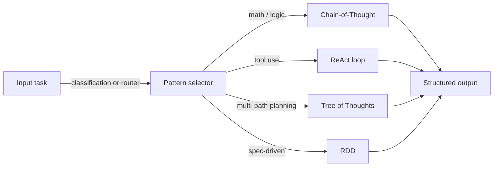
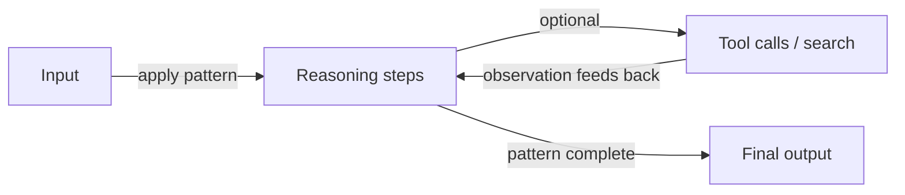

# Reasoning patterns

## Definition

Reasoning patterns are structured ways to elicit or organize model reasoning: chain-of-thought (step-by-step), tree-of-thoughts (explore branches), ReAct (reason + act), and RDD (retrieval-decision-design), among others. Using a clear pattern improves **reliability** (more consistent reasoning) and **debuggability** (you can inspect steps or actions).

They are used in [prompt engineering](/docs/prompt-engineering) (e.g. CoT) and inside [agents](/docs/agents) (e.g. ReAct, RDD). Without a reasoning pattern, models tend to produce flat, unstructured responses that skip steps — a reasoning pattern acts as scaffolding that makes the model's thought process explicit, inspectable, and correctable. Patterns can also be combined: CoT can run inside a ReAct agent's thought step, and ToT can feed candidates into an RDD decision loop.

Choosing a pattern depends on the task complexity, available compute, and whether the system has access to external tools or knowledge. CoT is the lowest-cost starting point; ReAct adds tool use; ToT adds search over multiple paths; RDD adds spec-grounded compliance. Most production systems combine at least two patterns.

## How it works

### Pattern selection



### Generic reasoning loop



You feed **input** (question, task) into a **pattern**: the pattern constrains how the model reasons or acts (e.g. "think step by step", or thought–action–observation loops). The model produces an **output** (answer, action sequence). Prompts or system design encourage the model to show reasoning (e.g. "Think step by step") or to interleave thought and action. Patterns can be combined (e.g. [CoT](/docs/reasoning-patterns/cot) inside an [agent](/docs/agents) loop). See the linked pages for each pattern's details.

## When to use / When NOT to use

| Scenario | Use reasoning patterns | Don't use |
|---|---|---|
| Multi-step math, logic, or coding | Yes — CoT improves accuracy significantly | No — single-shot prompting often fails on complex reasoning |
| Tool-using agents | Yes — ReAct structures each action with a thought | No — direct tool calling without reasoning increases errors |
| Planning over many solution branches | Yes — ToT explores and scores alternatives | No — CoT is cheaper if one path is usually correct |
| Tasks requiring spec compliance | Yes — RDD enforces retrieved specifications | No — freeform generation for creative open-ended tasks |
| Simple factual lookups | No — reasoning patterns add unnecessary cost | Yes — direct retrieval or lookup is faster |

## Comparisons

| Pattern | Core mechanism | Cost | Best task type | Composable with |
|---|---|---|---|---|
| Chain-of-Thought (CoT) | Sequential reasoning steps | Low (1 call) | Math, logic, deduction | ReAct, ToT, RDD |
| Tree of Thoughts (ToT) | Branch, score, expand | High (N calls) | Planning, search, creative | CoT per branch |
| ReAct | Thought–action–observation loop | Medium (1 call + tools) | Tool-using agents | CoT, RDD |
| RDD | Retrieve spec → decide → generate → validate | Medium–high | Compliance, spec-driven gen | ReAct, RAG |

## Pros and cons

| Pros | Cons |
|---|---|
| Makes model reasoning explicit and inspectable | Adds tokens (cost and latency) |
| Significantly improves accuracy on structured tasks | Wrong reasoning pattern for the task can hurt quality |
| Enables debugging by inspecting intermediate steps | Not all models follow patterns reliably |
| Composable — patterns can be nested or combined | Complex combinations increase prompt engineering effort |

## Code examples

```python
from openai import OpenAI

client = OpenAI()

def chain_of_thought(question: str) -> str:
    """Zero-shot CoT: append 'Let's think step by step' to elicit reasoning."""
    response = client.chat.completions.create(
        model="gpt-4o-mini",
        messages=[
            {
                "role": "user",
                "content": f"{question}\n\nLet's think step by step.",
            }
        ],
    )
    return response.choices[0].message.content

answer = chain_of_thought("If a train travels 60 km/h for 2.5 hours, how far does it go?")
print(answer)
```

## Practical resources

- [Chain-of-Thought Prompting (Wei et al.)](https://arxiv.org/abs/2201.11903) — Original CoT paper establishing step-by-step reasoning
- [ReAct: Synergizing Reasoning and Acting (Yao et al.)](https://arxiv.org/abs/2210.03629) — ReAct paper introducing thought–action–observation loops
- [Tree of Thoughts (Yao et al.)](https://arxiv.org/abs/2305.10601) — ToT paper on multi-path reasoning and search
- [Anthropic – Prompt engineering overview](https://docs.anthropic.com/en/docs/build-with-claude/prompt-engineering/overview) — Practical guidance on CoT and structured reasoning

## See also

- [Chain-of-thought](/docs/reasoning-patterns/cot)
- [Tree of thoughts](/docs/reasoning-patterns/tot)
- [ReAct](/docs/reasoning-patterns/react)
- [RDD](/docs/reasoning-patterns/rdd)
