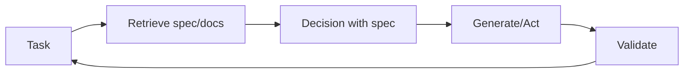

# Retrieval-decision-design (RDD)

## Definition

**RDD (retrieval-decision-design)** is a reasoning pattern that ties together **retrieval** (fetching relevant specs, docs, or examples), **decision** (making choices aligned with specs or policies), and **design** (producing outputs that satisfy requirements). It is often used in spec-driven development: behavior is guided by explicit specifications that are retrieved and enforced during generation.

## How it works

1. **Retrieval:** Given the current task, retrieve relevant specification fragments, examples, or constraints (e.g. from a vector store or structured specs).
2. **Decision:** Use the retrieved context to decide next steps, allowed actions, or output format.
3. **Design:** Generate or execute in line with the spec; optionally validate outputs against the spec.

This can be implemented in an [agent](/docs/agents) loop: retrieve spec → reason with spec in context → act or generate → validate → repeat. The diagram below shows the cycle: **task** triggers **retrieve**; retrieved spec feeds **decision**; **generate/act** produces output; **validate** checks against the spec and can loop back to the task (e.g. retry or refine).

## Use cases

RDD is a fit when outputs must align with retrievable specs (compliance, policy, or documented requirements).

- Spec-driven agents that retrieve requirements and validate outputs
- Compliance and policy-aware generation (e.g. legal, safety)
- Code or config generation aligned with documented specs

## Pros and cons

| Pros | Cons |
|------|------|
| Outputs align with specs | Requires good spec coverage and retrieval |
| Reduces drift and ad-hoc behavior | Extra retrieval and validation cost |
| Fits regulated or safety-critical flows | Spec design and maintenance overhead |

## External documentation

- [RAG paper (Lewis et al.)](https://arxiv.org/abs/2005.11401) — Retrieval component used in RDD
- [LangChain – Agents and tools](https://python.langchain.com/docs/concepts/agents/) — Orchestration patterns

## See also

- [Spec-driven development](/docs/spec-driven-development)
- [RAG](/docs/rag)
- [Agents](/docs/agents)
- [ReAct](/docs/reasoning-patterns/react)
