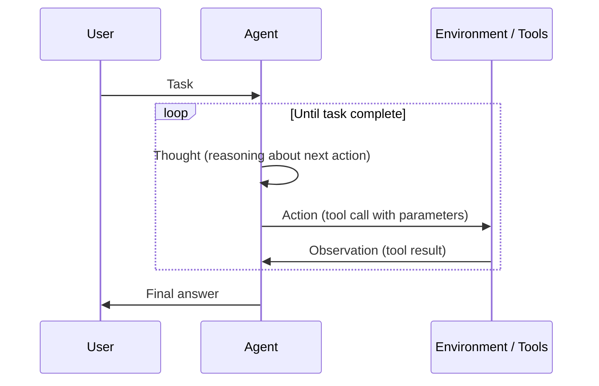
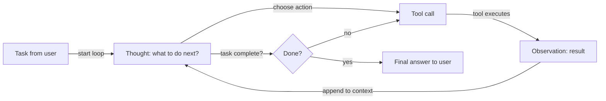

# ReAct (Reasoning + Acting)

## Definition

ReAct is a paradigm where the model alternates **reasoning** (what to do next, why) and **acting** (tool calls). The observation from the environment feeds back into the next reasoning step, forming a loop until the task is done. This interleaving reduces errors caused by blind or repetitive tool use, because each action is preceded by an explicit rationale.

The core contribution of the ReAct paper is showing that combining reasoning traces and action steps in a single LLM call outperforms either alone: pure reasoning (CoT) misses factual grounding, and pure action (tool calling without thought) is error-prone and hard to debug. By making thoughts visible, ReAct also produces interpretable agent traces that humans can inspect and correct.

It is the standard pattern for [agents](/docs/agents) that use tools. Often combined with [chain-of-thought](/docs/reasoning-patterns/cot) (reasoning inside the thought step) and with [RDD](/docs/reasoning-patterns/rdd) when retrieved specifications should guide each decision.

## How it works

### Thought–action–observation loop



### Agent decision flow



Prompt format is **Thought → Action → Observation → Thought → … → Final Answer**. The **user** gives a **task**; the **agent** produces a **thought** (reasoning about what to do), then an **action** (e.g. tool call). The **environment/tools** return an **observation**, which is appended to the context for the next thought. The model decides when to call tools and when to conclude. Frameworks like LangChain and LlamaIndex implement ReAct-style agents with tool registration and message handling.

## When to use / When NOT to use

| Scenario | Use ReAct | Don't use ReAct |
|---|---|---|
| Agent using multiple tools (search, calculator, API) | Yes — thought before action reduces tool misuse | No — if only one tool is needed, simpler function calling suffices |
| Debuggable agent behavior required | Yes — thought traces are inspectable and loggable | No — for black-box pipelines where traces aren't needed |
| Multi-step research with evolving context | Yes — each observation informs the next thought | No — single-shot retrieval + generation is faster and cheaper |
| High-reliability tasks (e.g. code execution) | Yes — reasoning before acting catches likely errors | No — for simple CRUD tasks with no ambiguity |
| Very low latency requirements | No — thought generation adds tokens per step | Yes — direct function calling is faster when reasoning is unnecessary |

## Comparisons

| Pattern | Has explicit thought | Has tool use | Loop | Best for |
|---|---|---|---|---|
| CoT | Yes | No | No | Static reasoning tasks |
| ReAct | Yes | Yes | Yes | Tool-using agents |
| Function calling (no thought) | No | Yes | No | Simple, deterministic tool invocations |
| RDD | Yes (spec-guided) | Yes | Yes | Compliance and spec-driven agents |

## Pros and cons

| Pros | Cons |
|---|---|
| Reduces blind or repetitive tool calls | Extra tokens per step (thought overhead) |
| Produces interpretable, debuggable traces | Loop can run too long if stopping criteria are weak |
| Works well with LangChain/LlamaIndex out of the box | Requires well-defined tool schemas and error handling |
| Naturally handles multi-step tasks | Thought quality depends on the underlying model |

## Code examples

```python
from langchain_openai import ChatOpenAI
from langchain.agents import create_react_agent, AgentExecutor
from langchain_community.tools import DuckDuckGoSearchRun
from langchain import hub

# Load a pre-built ReAct prompt template
prompt = hub.pull("hwchase17/react")

# Define tools
tools = [DuckDuckGoSearchRun()]

# Create ReAct agent
llm = ChatOpenAI(model="gpt-4o-mini", temperature=0)
agent = create_react_agent(llm=llm, tools=tools, prompt=prompt)
executor = AgentExecutor(agent=agent, tools=tools, verbose=True, max_iterations=5)

# Run — the agent will produce Thought/Action/Observation traces
result = executor.invoke({"input": "What is the current population of Tokyo?"})
print(result["output"])
```

## Practical resources

- [ReAct: Synergizing Reasoning and Acting in LLMs (Yao et al.)](https://arxiv.org/abs/2210.03629) — Original ReAct paper with benchmarks on HotpotQA, Fever, and ALFWorld
- [LangChain – ReAct agent](https://python.langchain.com/docs/concepts/agents/) — ReAct-style agents with tool registration in LangChain
- [Anthropic – Tool use guide](https://docs.anthropic.com/en/docs/build-with-claude/tool-use) — Claude's native tool use, which follows ReAct-style thought–act patterns

## See also

- [Agents](/docs/agents)
- [Reasoning patterns](/docs/reasoning-patterns)
- [Chain-of-thought](/docs/reasoning-patterns/cot)
- [RDD](/docs/reasoning-patterns/rdd)
