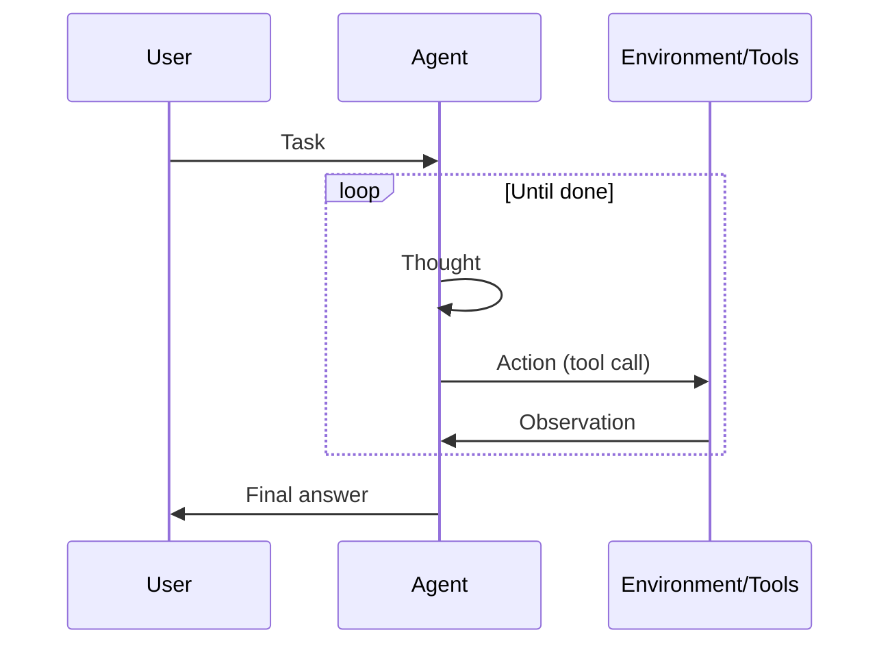

# ReAct (Reasoning + Acting)

## Definition

ReAct is a paradigm where the model alternates **reasoning** (what to do next, why) and **acting** (tool calls). The observation from the environment feeds back into the next reasoning step, forming a loop until the task is done.

It is the standard pattern for [agents](/docs/agents) that use tools: each action is preceded by a thought, which reduces blind or repetitive tool use. Often combined with [chain-of-thought](/docs/reasoning-patterns/cot) (reasoning inside the thought) and with [RDD](/docs/reasoning-patterns/rdd) when specs guide decisions.

## How it works

Prompt format is **Thought → Action → Observation → Thought → … → Final Answer**. The **user** gives a **task**; the **agent** produces a **thought** (reasoning about what to do), then an **action** (e.g. tool call). The **environment/tools** return an **observation**, which is appended to the context for the next thought. The loop continues until the agent outputs a final answer. The model decides when to call tools and when to conclude, which reduces arbitrary or repetitive actions. The sequence diagram below summarizes this flow; frameworks like LangChain implement ReAct-style agents with tool registration and message handling.

## Use cases

ReAct fits agent workflows where each tool call should be preceded by a clear reasoning step.

- Agents that use tools (search, calculator, API) with explicit reasoning
- Reducing arbitrary or repetitive tool calls by interleaving thought
- Debuggable agent behavior via visible thought–action–observation traces

## External documentation

- [ReAct: Synergizing Reasoning and Acting in LLMs (Yao et al.)](https://arxiv.org/abs/2210.03629) — Original ReAct paper
- [LangChain – ReAct agent](https://python.langchain.com/docs/concepts/agents/) — ReAct-style agents in LangChain

## See also

- [Agents](/docs/agents)
- [Chain-of-thought](/docs/reasoning-patterns/cot)
- [RDD](/docs/reasoning-patterns/rdd)
