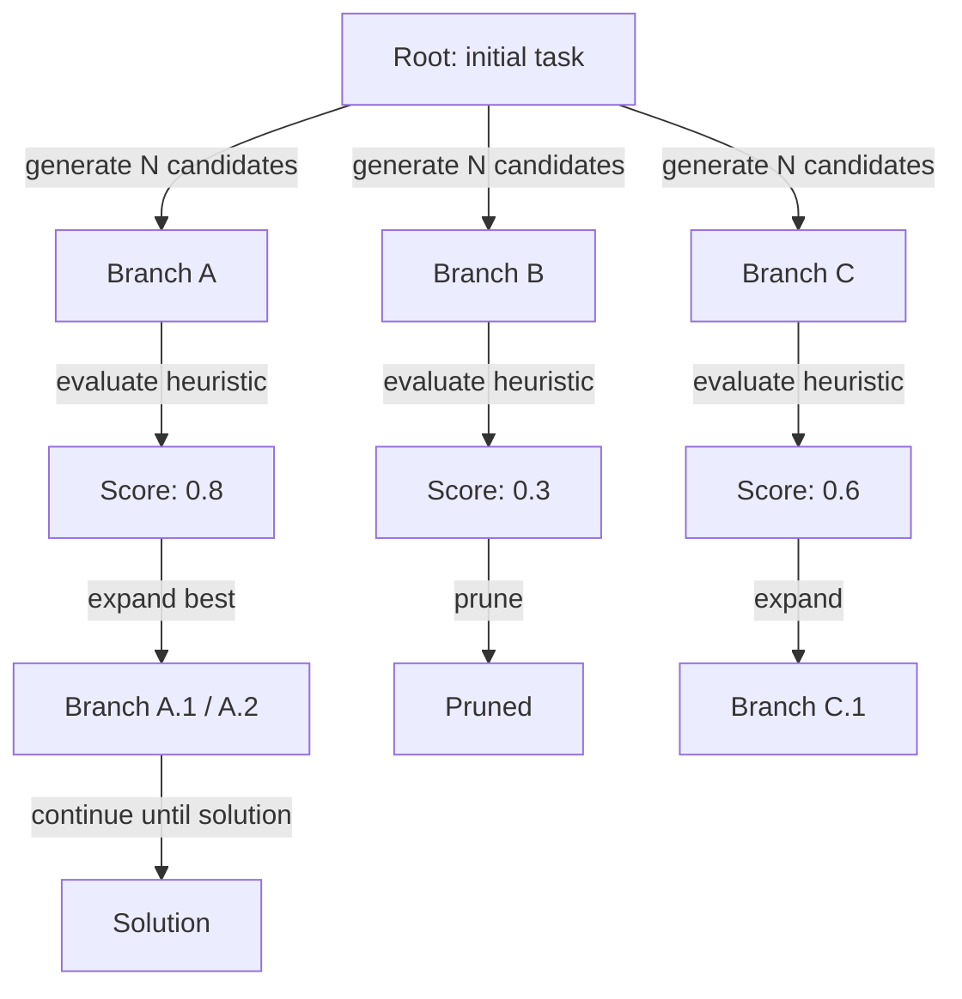
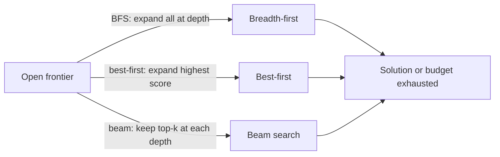

# Tree of thoughts (ToT)

## Definition

Tree of thoughts (ToT) extends CoT by maintaining multiple reasoning branches simultaneously. At each step, the model generates several candidate continuations; a heuristic or a separate evaluation model scores them, and a search algorithm (best-first, beam search, or BFS) decides which branches to expand further.

The key insight is that hard problems — planning, game playing, complex proofs — may require backtracking or exploring alternatives before committing. A single [chain-of-thought](/docs/reasoning-patterns/cot) path has no mechanism to recover from a poor intermediate step; ToT explicitly maintains a frontier of promising branches and prunes unpromising ones, much like classical tree search algorithms (MCTS, A*) applied to language generation.

Use it when a single [chain-of-thought](/docs/reasoning-patterns/cot) path might get stuck (e.g. game moves, multi-step planning) and you can afford multiple LLM calls. It trades compute for better search over the space of solutions. See [reasoning patterns](/docs/reasoning-patterns) for the full set of options.

## How it works

### Tree expansion and pruning



### Search strategies



Start from a **root** (e.g. the question or initial state). **Branch**: at each step, generate several continuations (e.g. next reasoning steps or moves). **Score** each branch with a heuristic or a separate model call (e.g. "how promising is this partial solution on a scale of 1–10?"). **Expand** the best node(s) and repeat; prune low-scoring branches to limit cost. The tree is built incrementally until a solution is found or a depth/budget limit is reached. Branching factor and max depth are key hyperparameters controlling the cost/quality tradeoff.

## When to use / When NOT to use

| Scenario | Use ToT | Don't use ToT |
|---|---|---|
| Game playing or puzzle solving with many moves | Yes — exploring branches is essential | No — CoT sufficient for single-path puzzles |
| Complex multi-step planning with backtracking | Yes — ToT can recover from dead ends | No — simpler tasks don't need backtracking |
| Creative generation with many valid options | Yes — generate and score multiple drafts | No — single creative output doesn't need it |
| High-volume production inference | No — multiple LLM calls are expensive | Yes — use CoT or direct prompting instead |
| Hard real-time constraints | No — ToT latency is high | Yes — not suitable for sub-second responses |

## Comparisons

| Approach | Paths explored | Scoring | Cost | Best for |
|---|---|---|---|---|
| CoT | 1 | None | Low (1 call) | Linear multi-step tasks |
| Self-consistency | N (parallel) | Majority vote | Medium (N calls) | Tasks with verifiable answers |
| ToT | N (sequential, pruned) | Heuristic / model | High (N+ calls) | Planning, search, creative |
| MCTS (classical) | N (simulation) | Reward signal | Very high | Game AI with clear reward |

## Pros and cons

| Pros | Cons |
|---|---|
| Explores and recovers from dead ends | Very high token and API cost |
| Produces higher-quality solutions on hard tasks | Requires a good scoring/evaluation function |
| Mirrors classical search — principled and adaptable | Complex to implement compared to CoT |
| Branching factor is tunable for cost/quality tradeoff | Not all tasks benefit from multi-path search |

## Code examples

```python
from openai import OpenAI

client = OpenAI()

def generate_thoughts(state: str, n: int = 3) -> list[str]:
    """Generate N candidate next steps from the current state."""
    response = client.chat.completions.create(
        model="gpt-4o-mini",
        messages=[
            {
                "role": "user",
                "content": (
                    f"Current reasoning state:\n{state}\n\n"
                    f"Generate {n} distinct possible next reasoning steps. "
                    "Number each one."
                ),
            }
        ],
    )
    raw = response.choices[0].message.content
    # Simple parse: split on numbered lines
    return [line.strip() for line in raw.split("\n") if line.strip() and line[0].isdigit()]

def score_thought(state: str, thought: str) -> float:
    """Score a thought's promise on a 0-1 scale."""
    response = client.chat.completions.create(
        model="gpt-4o-mini",
        messages=[
            {
                "role": "user",
                "content": (
                    f"Rate how promising this reasoning step is for solving the task "
                    f"(0 = dead end, 1 = very promising).\n\n"
                    f"State: {state}\nThought: {thought}\n\nScore (0.0–1.0):"
                ),
            }
        ],
    )
    try:
        return float(response.choices[0].message.content.strip())
    except ValueError:
        return 0.5

# Simple best-first ToT (depth 2, branching factor 3)
task = "Plan 3 steps to build a minimal RAG chatbot."
candidates = generate_thoughts(task, n=3)
scored = [(thought, score_thought(task, thought)) for thought in candidates]
best = max(scored, key=lambda x: x[1])
print("Best next step:", best[0])
```

## Practical resources

- [Tree of Thoughts (Yao et al.)](https://arxiv.org/abs/2305.10601) — Original ToT paper with game-of-24 and creative writing benchmarks
- [LangChain – Agents and planning](https://python.langchain.com/docs/concepts/agents/) — ToT and related planning patterns
- [Princeton NLP – ToT repository](https://github.com/princeton-nlp/tree-of-thought-llm) — Reference implementation from the paper authors

## See also

- [Chain-of-thought](/docs/reasoning-patterns/cot)
- [Reasoning patterns](/docs/reasoning-patterns)
- [Agents](/docs/agents)
