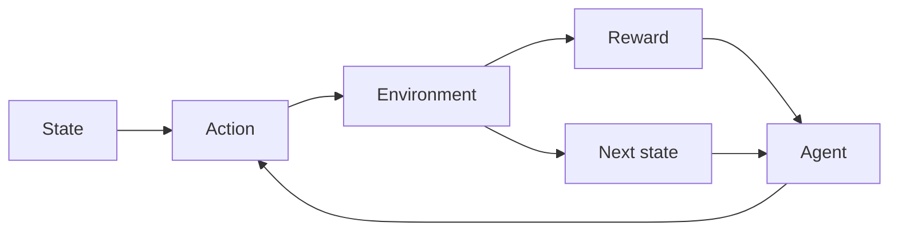

# Reinforcement learning (RL)

## Definition

Reinforcement learning trains agents to maximize cumulative reward in an environment. The agent takes actions, receives observations and rewards, and improves its policy (e.g. value-based, policy gradient, actor-critic).

It differs from [supervised](/docs/fundamentals/machine-learning) and [unsupervised](/docs/fundamentals/machine-learning) learning because feedback is sparse and delayed (rewards), and the agent must explore. Used in games, robotics, and [LLM](/docs/llms) alignment (RLHF). For high-dimensional states/actions, see [deep RL](/docs/drl).

## How it works

The setting is usually an **MDP**: the **agent** sees a **state**, chooses an **action**, and the **environment** returns a **reward** and **next state**. The agent improves its policy (mapping from state to action) to maximize cumulative reward. **Value-based** methods (e.g. Q-learning, DQN) learn a value function and derive the policy; **policy gradient** methods (e.g. PPO, SAC) optimize the policy directly. Exploration (e.g. epsilon-greedy, entropy bonus) is needed because rewards are only observed for actions taken. Algorithms differ in how they handle off-policy data, continuous actions, and scaling to large state spaces.

## Use cases

Reinforcement learning applies wherever an agent learns from rewards and sequential decisions (games, control, alignment).

- Game playing (e.g. Atari, Go, poker) and simulation
- Robotics control and continuous control (e.g. manipulation)
- LLM alignment (e.g. RLHF) and sequential decision systems

## External documentation

- [Reinforcement Learning (Sutton & Barto)](http://incompleteideas.net/book/the-book-2nd.html) — Free online book
- [Spinning Up in Deep RL (OpenAI)](https://spinningup.openai.com/)

## See also

- [Deep RL](/docs/drl)
- [Machine learning](/docs/fundamentals/machine-learning)
- [Agents](/docs/agents)
