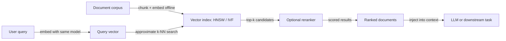

# Semantic search

## Definition

Semantic search is a retrieval paradigm that returns results based on meaning and intent rather than exact keyword matching. A user query and the documents in the corpus are both encoded into dense vector representations (embeddings), and retrieval is performed by finding the documents whose vectors are most similar to the query vector — typically using cosine similarity or dot product. Because the embedding space is learned from large corpora, queries like "affordable accommodation" correctly retrieve documents containing "cheap hotels" even though they share no keywords.

The core insight is that a well-trained embedding model maps semantically similar text to nearby points in a high-dimensional vector space. This is achieved through contrastive training objectives: similar sentences are pulled together and dissimilar ones pushed apart. Models like Sentence-BERT, OpenAI Ada, and Cohere Embed are trained specifically for retrieval tasks, learning to distinguish subtle differences in meaning that a bag-of-words model would miss. The dimensionality of the embedding (commonly 768 to 3072) determines the expressiveness of the representation, while the choice of similarity function and approximate nearest-neighbor (ANN) index determines retrieval speed and accuracy.

Semantic search is the retrieval backbone of [RAG (Retrieval-Augmented Generation)](/docs/rag): user queries are embedded and matched against a library of pre-indexed document chunks, and the top results are injected into the LLM's context window. It also underpins recommendation systems ("similar items"), deduplication pipelines, and clustering. Hybrid search — combining semantic (dense) retrieval with keyword (sparse, BM25) retrieval and re-ranking the combined results — often outperforms either approach alone, especially for queries that mix natural language intent with specific technical terms or identifiers.

## How it works

### Embedding and indexing

Documents are chunked (for long-form content), embedded using a bi-encoder model, and stored in a vector index. The index can be a flat brute-force index (for small corpora), or an approximate nearest-neighbor index such as HNSW (Hierarchical Navigable Small World) or IVF (Inverted File Index) for large-scale retrieval.

### Query execution



### Hybrid search and reranking

Pure semantic search can miss results where exact terms matter (product codes, names, technical identifiers). Hybrid search runs both dense (semantic) and sparse (BM25 keyword) retrieval and merges results using Reciprocal Rank Fusion or a learned combination. A cross-encoder reranker then scores the top candidates by jointly encoding the query and each document — more accurate but slower than the bi-encoder retrieval step.

## When to use / When NOT to use

| Use when | Avoid when |
|----------|------------|
| Users express intent in natural language and exact keyword matching produces poor recall | Users always search with exact product codes, IDs, or structured filters |
| Corpus contains paraphrased or diverse phrasing for the same concepts | Corpus is small enough that full-text search with good tokenization suffices |
| Building RAG pipelines that need relevant context retrieval | Latency requirements cannot accommodate vector index lookup |
| Recommendation and "similar item" features in user-facing products | Privacy constraints prevent embedding documents in third-party models |

## Comparisons

| Method | Matching strategy | Strengths | Limitations |
|--------|------------------|-----------|-------------|
| Keyword (BM25) | Exact term frequency | Fast, interpretable, handles rare terms | Misses synonyms and paraphrases |
| Semantic (dense) | Embedding similarity | Handles synonymy, intent, context | Misses rare exact-match terms; needs embedding model |
| Hybrid (BM25 + dense) | Combined ranking | Best of both worlds | More infrastructure complexity |
| Cross-encoder reranker | Joint query-doc scoring | Highest accuracy | Slow; used only for top-k candidates |

## Pros and cons

| Pros | Cons |
|------|------|
| Handles natural language queries robustly | Requires embedding model and vector index infrastructure |
| Works across languages if a multilingual model is used | Embedding quality determines retrieval ceiling; poor models produce poor results |
| Scales to millions of documents with ANN indexes | ANN indexes introduce recall-latency tradeoffs |
| Enables powerful RAG and recommendation systems | Chunking strategy and embedding granularity require careful tuning |

## Code examples

### Semantic search with Sentence-BERT and FAISS (Python)

```python
from sentence_transformers import SentenceTransformer
import faiss
import numpy as np

model = SentenceTransformer("all-MiniLM-L6-v2")

# Index a small corpus
corpus = [
    "How to fine-tune a transformer model on a custom dataset",
    "Introduction to reinforcement learning from human feedback",
    "Best practices for deploying machine learning models to production",
    "Understanding attention mechanisms in neural networks",
    "Data augmentation techniques for computer vision tasks",
]

corpus_embeddings = model.encode(corpus, convert_to_numpy=True)
corpus_embeddings = corpus_embeddings / np.linalg.norm(corpus_embeddings, axis=1, keepdims=True)

# Build a FAISS index (inner product = cosine similarity on normalized vectors)
index = faiss.IndexFlatIP(corpus_embeddings.shape[1])
index.add(corpus_embeddings.astype(np.float32))

# Query
query = "how to deploy ML models"
query_embedding = model.encode([query], convert_to_numpy=True)
query_embedding = query_embedding / np.linalg.norm(query_embedding)

scores, indices = index.search(query_embedding.astype(np.float32), k=3)

print(f"Query: {query}\nTop results:")
for rank, (score, idx) in enumerate(zip(scores[0], indices[0])):
    print(f"  {rank + 1}. [{score:.3f}] {corpus[idx]}")
```

## Practical resources

- [Sentence-BERT (SBERT)](https://www.sbert.net/) — Dense retrieval models, documentation, and pre-trained checkpoints
- [FAISS documentation (Meta AI)](https://faiss.ai/) — Efficient similarity search and clustering library
- [LangChain – Vector stores](https://python.langchain.com/docs/concepts/vectorstores/) — Integrating semantic search into RAG pipelines
- [Pinecone – What is semantic search?](https://www.pinecone.io/learn/semantic-search/) — Practical explainer with examples
- [Cohere – Embed API](https://docs.cohere.com/reference/embed) — Multilingual embeddings for retrieval

## See also

- [Embeddings](/docs/rag/embeddings)
- [Vector databases](/docs/rag/vector-databases)
- [RAG](/docs/rag)
