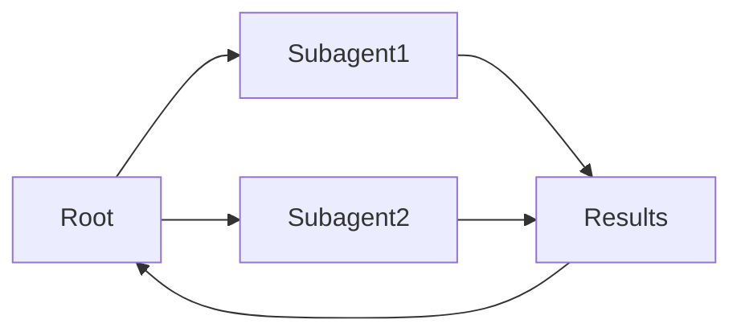

# Subagents

## Definition

**Subagents** are agents that sit within a hierarchy: a parent agent delegates sub-tasks to child agents (subagents), which may in turn delegate to further subagents. This structures complex work and keeps each agent focused.

They are one way to implement [multi-agent](/docs/agents/multi-agent-systems) systems with a clear chain of responsibility. The root [agent](/docs/agents) owns the user-facing goal; subagents handle focused sub-tasks (e.g. [retrieval](/docs/rag), code execution, validation). Often used with [spec-driven development](/docs/spec-driven-development) or [RDD](/docs/reasoning-patterns/rdd) so subagents receive and follow specs.

## How it works

The **root** agent receives the task, breaks it into sub-tasks, and assigns them to **Subagent1**, **Subagent2**, etc. (by role or capability). Each subagent runs its own loop (possibly with tools and an LLM) and returns **results** to the root. The root **aggregates** results (e.g. merges, selects, or passes to another subagent) and either continues the loop or returns to the user. Subagents can be specialized (e.g. retrieval, code, critique) and use the same or different models. Clear contracts (inputs/outputs or tools) and error handling make the hierarchy debuggable and reusable.

## Use cases

Subagents help when a task naturally splits into focused sub-tasks that can be delegated and aggregated.

- Root agent delegating retrieval, generation, and validation to subagents
- Complex workflows (e.g. research, code review) with focused sub-tasks
- Reusing the same subagent in different parent workflows

## External documentation

- [From Prototypes to Agents with ADK – Google Codelabs](https://codelabs.developers.google.com/your-first-agent-with-adk#0) — ADK multi-agent systems with hierarchy
- [LangChain – Multi-agent workflows](https://python.langchain.com/docs/concepts/multi_agent/) — Workflow and subagent patterns

## Pros and cons

| Pros | Cons |
|------|------|
| Clear separation of concerns | Coordination and latency |
| Scalable to complex tasks | Need clear contracts and error handling |
| Reusable subagent capabilities | Debugging across hierarchy can be hard |

## See also

- [Agents](/docs/agents)
- [Multi-agent systems](/docs/agents/multi-agent-systems)
- [RDD](/docs/reasoning-patterns/rdd)
- [Spec-driven development](/docs/spec-driven-development)
