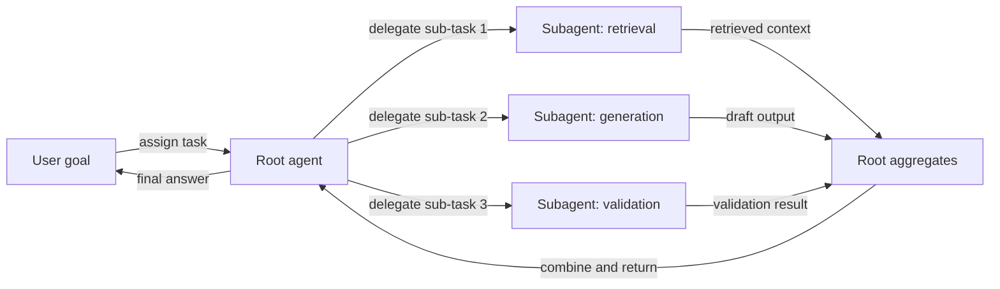
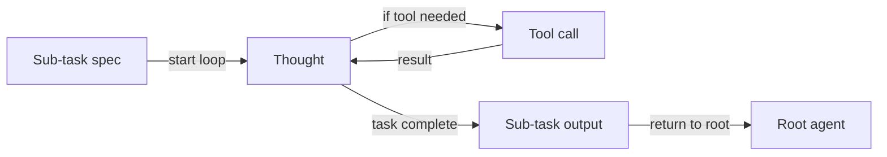

# Subagents

## Definition

**Subagents** are agents that sit within a hierarchy: a parent agent delegates sub-tasks to child agents (subagents), which may in turn delegate to further subagents. This hierarchical structure keeps each agent focused on a narrow, well-defined responsibility rather than attempting to handle everything in a single loop.

They are one way to implement [multi-agent](/docs/agents/multi-agent-systems) systems with a clear chain of responsibility and ownership. The root [agent](/docs/agents) owns the user-facing goal and is responsible for the final answer; subagents handle focused sub-tasks such as [retrieval](/docs/rag), code execution, validation, or formatting. The root agent coordinates timing, aggregates results, and decides when to retry or escalate.

Often used with [spec-driven development](/docs/spec-driven-development) or [RDD](/docs/reasoning-patterns/rdd) so subagents receive explicit, testable specifications for their outputs. The subagent pattern scales naturally: as a workflow grows more complex, new subagents can be added for new responsibilities without restructuring the root agent's logic.

## How it works

### Hierarchical delegation



### Subagent internal loop



The **root** agent receives the task, breaks it into sub-tasks, and assigns them to **Subagent 1**, **Subagent 2**, etc. (by role or capability). Each subagent runs its own loop (possibly with tools and an LLM) and returns **results** to the root. The root **aggregates** results (e.g. merges, selects, or passes to another subagent) and either continues the loop or returns to the user. Subagents can be specialized (e.g. retrieval, code, critique) and use the same or different models. Clear contracts (inputs/outputs or tool schemas) and error handling make the hierarchy debuggable and reusable.

## When to use / When NOT to use

| Scenario | Use subagents | Don't use subagents |
|---|---|---|
| Task decomposes into parallel independent sub-tasks | Yes — subagents can run concurrently | No — if sub-tasks are tightly coupled and sequential, the root can handle them inline |
| Reusing the same capability across workflows | Yes — same subagent can be called from different roots | No — one-off tasks don't benefit from the abstraction |
| Sub-tasks require different tools or models | Yes — each subagent can have its own configuration | No — if one model with all tools is sufficient |
| Debugging and testing individual subtask logic | Yes — subagents have clear inputs/outputs, easy to unit-test | No — if the task is simple enough to test end-to-end |
| Rapid prototyping or simple workflows | No — hierarchy adds coordination overhead | Yes — a single agent loop is simpler and faster to iterate on |

## Comparisons

| Approach | Structure | Delegation | Re-usability | Debugging |
|---|---|---|---|---|
| Single agent | Flat loop | None | Low | Trace one loop |
| Multi-agent (peer) | Flat / mesh | Peer-to-peer | Medium | Trace multiple loops |
| Subagent (hierarchical) | Tree | Root → children | High | Trace per level |
| Pipeline / chain | Sequential | Step-to-step | Medium | Step output inspection |

## Pros and cons

| Pros | Cons |
|---|---|
| Clear separation of concerns — each subagent does one thing | Coordination overhead (latency, token cost, state passing) |
| Scalable — add new subagents for new responsibilities | Need clear input/output contracts and error handling |
| Reusable — same subagent plugged into different root workflows | Debugging across hierarchy levels can be complex |
| Root agent logic stays clean and high-level | Multiple LLM calls increase total cost |

## Code examples

```python
from langchain_openai import ChatOpenAI
from langchain_core.messages import HumanMessage, SystemMessage

llm = ChatOpenAI(model="gpt-4o-mini")

# --- Define subagents ---

def retrieval_subagent(query: str) -> str:
    """Retrieve relevant context (simulated here)."""
    # In production: query a vector store
    return f"[Context for '{query}': RAG stands for Retrieval-Augmented Generation...]"

def generation_subagent(query: str, context: str) -> str:
    """Generate an answer given context."""
    response = llm.invoke([
        SystemMessage(content="Answer the question using only the provided context."),
        HumanMessage(content=f"Context:\n{context}\n\nQuestion: {query}"),
    ])
    return response.content

def validation_subagent(answer: str, context: str) -> str:
    """Check if the answer is grounded in the context."""
    response = llm.invoke([
        SystemMessage(content="Check if the answer is fully supported by the context. Reply PASS or FAIL with a reason."),
        HumanMessage(content=f"Context:\n{context}\n\nAnswer:\n{answer}"),
    ])
    return response.content

# --- Root agent orchestrates ---

def root_agent(user_query: str) -> str:
    context = retrieval_subagent(user_query)
    draft = generation_subagent(user_query, context)
    validation = validation_subagent(draft, context)

    if "FAIL" in validation.upper():
        # Retry once with explicit instruction
        draft = generation_subagent(
            user_query + " (be precise and grounded)",
            context,
        )

    return draft

print(root_agent("What is RAG?"))
```

## Practical resources

- [From Prototypes to Agents with ADK – Google Codelabs](https://codelabs.developers.google.com/your-first-agent-with-adk#0) — ADK multi-agent systems with hierarchical agent composition
- [LangChain – Multi-agent workflows](https://python.langchain.com/docs/concepts/multi_agent/) — Workflow and subagent patterns with LangGraph
- [Anthropic – Multi-agent frameworks](https://docs.anthropic.com/en/docs/build-with-claude/tool-use#multi-agent-frameworks) — Guidance on building hierarchical agent systems with Claude

## See also

- [Agents](/docs/agents)
- [Multi-agent systems](/docs/agents/multi-agent-systems)
- [RDD](/docs/reasoning-patterns/rdd)
- [Spec-driven development](/docs/spec-driven-development)
