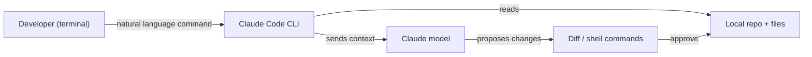

# Claude Code

## Definition

Claude Code is Anthropic's AI-powered coding assistant that brings [Claude](/docs/case-studies/claude) into every layer of the development workflow. Unlike editor extensions that bolt AI onto an existing IDE, Claude Code is designed as a **multi-environment tool**: it runs as a CLI in the terminal, as an extension in VS Code and JetBrains, in the browser, on iOS, and in Slack. This makes it the natural choice when development spans multiple environments or when terminal-first workflows are important.

The tool gives Claude direct access to the local file system, shell commands, and project context. In the terminal, you can ask Claude to explore a codebase, explain architecture, generate code, run tests, and apply diffs — all without leaving the command line. In the IDE, Claude Code surfaces inline edits and visual diffs identical to those in Cursor. The `CLAUDE.md` file (or `.claude/CLAUDE.md`) serves the same role as `.cursorrules`: it provides persistent project-level instructions that steer Claude's style, conventions, and knowledge of the codebase.

Compared to [Cursor](/docs/tools/cursor), Claude Code is model-locked to Claude but adds terminal depth and mobile/web access. Compared to [GitHub Copilot](/docs/tools/github-copilot), it offers deeper multi-file agent editing and CLI-first workflows but requires a Claude subscription (Pro, Teams, or Enterprise) or API access via Amazon Bedrock or Google Vertex AI.

## How it works

### Terminal workflow



### IDE workflow


### Key features

**CLI** — run `claude` in any terminal to ask questions or apply changes. **IDE extension** — inline edits and diffs in VS Code and JetBrains. **`CLAUDE.md`** — persistent project instructions for steering Claude. **Subagents** — background tasks running autonomously via the Anthropic Agent SDK. **MCP** — Model Context Protocol for tool use (databases, APIs). **Skills** — reusable prompt programs for recurring tasks.

## When to use / When NOT to use

| Scenario | Use Claude Code | Do NOT use Claude Code |
|----------|----------------|------------------------|
| Terminal-first development and CLI workflows | Yes — purpose-built CLI agent | |
| Cross-environment use (terminal, IDE, web, mobile) | Yes — single tool across all environments | |
| Deep multi-file refactoring with diffs | Yes — terminal + IDE both support this | |
| JetBrains or VS Code inline AI | Yes — official extensions available | |
| Staying in an existing VS Code setup with less friction | | [GitHub Copilot](/docs/tools/github-copilot) has lower switching cost |
| Neovim or non-VS Code / non-JetBrains IDEs | | [GitHub Copilot](/docs/tools/github-copilot) covers more editors |
| Multi-model backend selection | | [Cursor](/docs/tools/cursor) lets you switch between Claude, GPT-4o, and local models |

## Comparisons

| Feature | Claude Code | Cursor | GitHub Copilot |
|---------|------------|--------|---------------|
| Primary interface | Terminal + IDE extension | VS Code fork | IDE extension |
| Terminal / CLI | Yes (primary) | No | No |
| IDE support | VS Code, JetBrains | VS Code only | VS Code, JetBrains, Neovim |
| Model | Claude (Anthropic) | Multiple (Claude, GPT-4o) | OpenAI / GitHub |
| Project rules | `CLAUDE.md` | `.cursorrules` | None |
| Agent depth | High (subagents, SDK) | Composer | Copilot Workspace (preview) |
| Access | Subscription or Bedrock/Vertex | Subscription | Subscription |

## Pros and cons

| Pros | Cons |
|------|------|
| CLI-first enables scripting and headless automation | Model-locked to Claude; no multi-model selection |
| Multi-environment (terminal, IDE, web, iOS, Slack) | Requires Claude subscription or API access |
| `CLAUDE.md` provides persistent project context | Less mature ecosystem vs VS Code extensions |
| Subagents enable background autonomous tasks | CLI learning curve for developers new to terminal workflows |

## Code examples

```bash
# Terminal workflow: explore a codebase and apply a change
claude "Explain the authentication flow in this project"

# Generate and apply a refactor
claude "Refactor the UserService class to use dependency injection"

# Run with a specific CLAUDE.md context already loaded
# CLAUDE.md example:
# This is a Python FastAPI project using PostgreSQL and SQLAlchemy.
# Follow PEP 8, use type hints everywhere, and write tests with pytest.
# The database session is managed via get_db() in app/database.py.
claude "Add an endpoint to list users with pagination"
```

## Tips for effective use

- Write a `CLAUDE.md` at the repo root describing the stack, conventions, and key files — Claude reads it at the start of every session.
- Use `claude --dangerously-skip-permissions` only in sandboxed CI environments, never on production machines.
- For large codebases, explicitly mention file paths in your request (`"In src/auth/service.ts, refactor..."`) to focus context.
- Combine terminal Claude Code with IDE extension: explore and plan in the terminal, apply diffs visually in VS Code.
- Use subagents for background tasks (e.g. running tests, generating docs) while you continue other work.

## Practical resources

- [Anthropic — Claude Code](https://www.anthropic.com/claude-code) — Product overview and feature highlights
- [Claude Code — Quickstart](https://docs.anthropic.com/en/docs/claude-code/quickstart) — Installation, setup, and first commands
- [Claude Code — IDE integrations](https://docs.anthropic.com/en/docs/claude-code/ide-integrations) — VS Code and JetBrains setup
- [Claude Code — CLAUDE.md](https://docs.anthropic.com/en/docs/claude-code/memory) — Project-level instructions and memory
- [Anthropic Agent SDK](https://docs.anthropic.com/en/docs/agents) — Building subagents and autonomous workflows

## See also

- [Claude](/docs/case-studies/claude)
- [Cursor](/docs/tools/cursor)
- [GitHub Copilot](/docs/tools/github-copilot)
- [Agents](/docs/agents)
- [Spec-driven development](/docs/spec-driven-development)
- [LLMs](/docs/llms)
