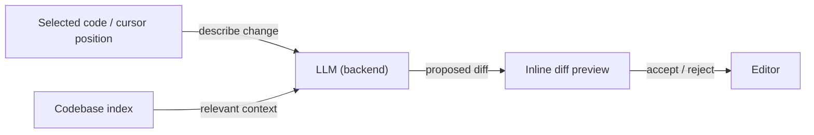

# Cursor

## Definition

Cursor is an AI-powered code editor forked from VS Code that embeds [LLMs](/docs/llms) directly into every part of the editing experience. Unlike extensions bolted onto an existing editor, Cursor owns the entire editor surface, which allows it to build features such as multi-file diff previews, codebase-wide semantic search, and chat with full project context that are difficult to replicate through extension APIs alone.

The editor supports multiple model backends (Claude 3.5/3.7, GPT-4o, local models via Ollama) and allows users to define project-level instructions through `.cursorrules` files, steering the model's style, conventions, and tooling assumptions. Context is managed through an embedding-based codebase index that makes relevant files available to the model without manual selection, enabling workflows closer to pair programming than inline autocomplete.

Compared to [GitHub Copilot](/docs/tools/github-copilot), Cursor offers deeper project context, inline diff-based edits, and a full chat panel; compared to [Claude Code](/docs/tools/claude-code), it is a GUI-first experience centered on the editor rather than the terminal. All three tools use [LLMs](/docs/llms) for code generation, but differ in interface, context management, and agent depth.

## How it works

### Inline edit (Cmd+K)



### Chat panel (Cmd+L)


### Key features

**Codebase index** — embeds the repo for semantic search. **Composer** — multi-file agent-style edits. **Tab completion** — context-aware next-line and block completion. **`.cursorrules`** — persistent project instructions for the model. **MCP support** — tool use via the Model Context Protocol.

## When to use / When NOT to use

| Scenario | Use Cursor | Do NOT use Cursor |
|----------|-----------|-------------------|
| In-editor coding with full project context | Yes — codebase indexing provides deep context | |
| Multi-file refactoring with visual diffs | Yes — Composer and diff views | |
| Pair programming with explanations in chat | Yes — persistent chat panel | |
| Terminal-first or headless environments | | Use [Claude Code](/docs/tools/claude-code) CLI instead |
| IDE-agnostic completion in JetBrains or Neovim | | Use [GitHub Copilot](/docs/tools/github-copilot) for broader IDE coverage |
| Lightweight extension on existing VS Code | | Copilot or Codeium add-ons have less overhead |

## Comparisons

| Feature | Cursor | GitHub Copilot | Claude Code |
|---------|--------|---------------|-------------|
| Base interface | Full VS Code fork | IDE extension | Terminal + IDE extension |
| Project context | Codebase index (embeddings) | Open files only | Full repo via CLI |
| Multi-file edits | Yes (Composer) | Limited | Yes (terminal + IDE) |
| Agent capabilities | Composer, MCP | Copilot Workspace | Claude agents |
| Model choice | Multiple (Claude, GPT-4o, local) | OpenAI / GitHub | Claude (Anthropic) |
| Rules / config | `.cursorrules` file | No project rules | `CLAUDE.md` |
| Pricing | Subscription (hobby free tier) | Subscription | Subscription (Pro+) |

## Pros and cons

| Pros | Cons |
|------|------|
| Deep project context via codebase indexing | Requires switching from existing VS Code setup |
| Supports multiple LLM backends | Codebase indexing may expose code to third-party servers |
| Project-level rules steer model behavior | Heavy resource usage compared to lightweight extensions |
| Visual diff previews make edits reviewable | Context limits still apply; very large repos need selective inclusion |

## Code examples

```jsonc
// .cursorrules — project instructions for the model
{
  "rules": [
    "This is a TypeScript/React project using Tailwind CSS.",
    "Prefer functional components and hooks over class components.",
    "Always add JSDoc comments to exported functions.",
    "Use the existing `api/` client for all HTTP calls; do not use fetch directly.",
    "Tests are written with Vitest; always add a test for new utility functions."
  ]
}
```

## Tips for effective use

- Keep `.cursorrules` short and specific — long rules dilute the model's attention.
- Use `@file` or `@folder` mentions in chat to pin relevant context.
- For large repos, exclude generated files (`node_modules`, `dist`, `.next`) from the codebase index to reduce noise.
- Accept Composer suggestions incrementally — review each diff before accepting the next change.
- Pair Cursor with a linter and type checker so the model gets immediate feedback on generated code quality.

## Practical resources

- [Cursor — Documentation](https://docs.cursor.com/) — Official guides including setup, features, and `.cursorrules`
- [Cursor — Models](https://docs.cursor.com/settings/models) — Configuring LLM backends and API keys
- [Cursor — MCP](https://docs.cursor.com/context/mcp) — Model Context Protocol tool integrations
- [Cursor changelog](https://cursor.com/changelog) — Feature releases and updates

## See also

- [Agents](/docs/agents)
- [GitHub Copilot](/docs/tools/github-copilot)
- [Claude Code](/docs/tools/claude-code)
- [Spec-driven development](/docs/spec-driven-development)
- [LLMs](/docs/llms)
