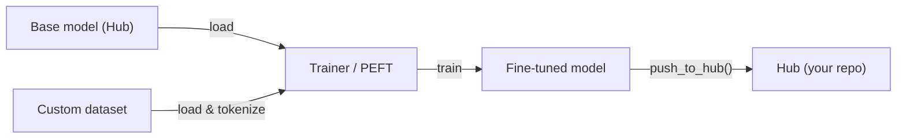

# Hugging Face

## Definition

Hugging Face is the central open-source platform for machine learning: it hosts the **Hub** (over 500,000 public models and 50,000 datasets), provides the `transformers` library for loading and running pretrained models, and offers tooling for [fine-tuning](/docs/llms/fine-tuning), evaluation, and deployment. It covers [NLP](/docs/nlp), computer vision, speech, and [multimodal](/docs/multimodal-ai) models through a unified API, making it practical to switch between tasks and architectures without learning new interfaces.

The `transformers` library runs on [PyTorch](/docs/frameworks/pytorch), TensorFlow, and JAX. A `from_pretrained("model-name")` call downloads model weights, tokenizers, and configuration from the Hub automatically. The same abstraction works for [BERT](/docs/transformers/bert), [GPT-style](/docs/transformers/gpt) decoders, diffusion models, vision transformers, and whisper-class speech models. `datasets` provides efficient streaming and preprocessing of large datasets, and `accelerate` adds distributed training and mixed-precision with minimal code changes.

Hugging Face also integrates with the broader AI ecosystem: models hosted on the Hub can be used directly in [LangChain](/docs/tools/langchain) and [LlamaIndex](/docs/tools/llamaindex) as inference backends, and the `peft` library enables parameter-efficient [fine-tuning](/docs/llms/fine-tuning) (LoRA, QLoRA) so [LLMs](/docs/llms) can be adapted with consumer hardware. Spaces provides zero-configuration demo hosting using Gradio or Streamlit, bridging research and public access.

## How it works

### Loading and inference


### Fine-tuning workflow



### Key libraries

**`transformers`** — model loading, inference, tokenization. **`datasets`** — efficient data loading and preprocessing. **`accelerate`** — distributed training and mixed precision. **`peft`** — LoRA and QLoRA parameter-efficient fine-tuning. **`evaluate`** — metrics (BLEU, ROUGE, accuracy). **`diffusers`** — diffusion model pipelines.

## When to use / When NOT to use

| Scenario | Use Hugging Face | Do NOT use Hugging Face |
|----------|-----------------|------------------------|
| Loading and running a pretrained NLP or vision model | Yes — `from_pretrained` provides a unified API | |
| Fine-tuning an LLM on a custom dataset | Yes — Trainer + PEFT (LoRA/QLoRA) | |
| Sharing models and datasets with the community | Yes — Hub with model cards and versioning | |
| Production serving at high throughput | | Use vLLM, TGI, or TorchServe for optimized inference |
| Real-time edge deployment | | TFLite or ONNX Runtime are better suited |
| Training from scratch a large proprietary model | | Cloud provider tools (TPU pods, SLURM) may be preferred |

## Pros and cons

| Pros | Cons |
|------|------|
| Unified API across hundreds of architectures | Large dependency footprint for simple use cases |
| Hub provides model cards, versioning, and discoverability | Some models are research-quality with limited support |
| PEFT enables fine-tuning with limited hardware | Inference throughput not optimized vs specialized servers |
| Active community and frequent updates | Frequent API changes can break existing code |

## Code examples

```python
# Load a pretrained text-classification model and run inference
from transformers import pipeline

classifier = pipeline("sentiment-analysis", model="distilbert-base-uncased-finetuned-sst-2-english")
result = classifier("Hugging Face makes NLP accessible to everyone.")
print(result)  # [{'label': 'POSITIVE', 'score': 0.9998}]

# Fine-tune with PEFT (LoRA) on a custom dataset
from transformers import AutoModelForCausalLM, AutoTokenizer, TrainingArguments, Trainer
from peft import get_peft_model, LoraConfig, TaskType
import datasets

model_name = "meta-llama/Llama-3.2-1B"
tokenizer = AutoTokenizer.from_pretrained(model_name)
base_model = AutoModelForCausalLM.from_pretrained(model_name)

lora_config = LoraConfig(task_type=TaskType.CAUSAL_LM, r=8, lora_alpha=32)
model = get_peft_model(base_model, lora_config)
model.print_trainable_parameters()  # shows only ~0.1% of params are trainable
```

## Comparisons

| Feature | Hugging Face Transformers | Direct API (OpenAI, Anthropic) |
|---------|--------------------------|-------------------------------|
| Model access | Open-source models from Hub | Proprietary frontier models |
| Cost | Free to run (pay for your hardware) | Per-token API cost |
| Control | Full access to weights and internals | Black box, limited control |
| Fine-tuning | First-class (Trainer, PEFT) | Limited (OpenAI fine-tune API) |
| Deployment | Self-managed (vLLM, TGI, TFLite) | Managed by provider |
| Best for | Research, custom fine-tuning, privacy | Quick production integration |

## Practical resources

- [Hugging Face documentation](https://huggingface.co/docs) — Full platform docs including Hub, Transformers, and Spaces
- [Transformers library](https://huggingface.co/docs/transformers) — API reference, pipelines, and model cards
- [Hugging Face NLP course](https://huggingface.co/learn/nlp-course/) — Free end-to-end course covering Transformers and fine-tuning
- [PEFT documentation](https://huggingface.co/docs/peft) — LoRA, QLoRA, and other parameter-efficient methods
- [Hugging Face Hub](https://huggingface.co/models) — Browse and filter 500k+ models by task, language, and license

## See also

- [Transformers](/docs/transformers)
- [LLMs](/docs/llms)
- [Fine-tuning](/docs/llms/fine-tuning)
- [RAG](/docs/rag)
- [Frameworks](/docs/frameworks/pytorch)
