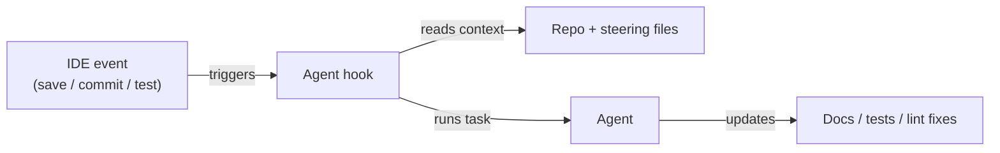

# Kiro

## Definition

Kiro is an **AI-powered IDE** from Amazon Web Services that operationalizes [spec-driven development](/docs/spec-driven-development) as a first-class workflow. Rather than providing free-form AI completion, Kiro structures AI assistance around a deliberate progression: a developer's prompt is expanded into structured **requirements**, **system designs**, and a breakdown of **implementation tasks**. This process keeps intent explicit and auditable, reducing the ambiguity that comes with vibe-coding approaches where a single prompt drives unconstrained generation.

The distinguishing capability is **agent hooks**: autonomous [agents](/docs/agents) triggered by events in the development workflow (file saves, git commits, test runs) that perform maintenance tasks such as updating documentation, regenerating tests, or checking code against style rules. This event-driven model means quality gates are automated rather than manually invoked. **Autopilot** extends hooks to longer multi-step tasks that run with developer checkpoints, suitable for larger features or refactors.

Kiro is built on a VS Code–compatible foundation (Open VSX extension registry, familiar themes and keybindings) and integrates the **Model Context Protocol (MCP)** for connecting agents to external data sources — databases, documentation APIs, and internal tools. A **Kiro CLI** surfaces the same spec-driven and agent workflows in the terminal. The combination makes Kiro a natural fit for teams that want structure and traceability as they move from prototype to production.

## How it works

### Spec-driven workflow


### Agent hooks (event-driven)



### Key features

**Spec pipeline** — prompt → requirements → design → tasks. **Agent hooks** — event-triggered agents for docs, tests, and optimization. **Autopilot** — multi-step agent runs with checkpoints. **Steering files** — project-level configuration for agent behavior. **MCP integration** — connect to external APIs, databases, and docs. **Kiro CLI** — terminal access to spec-driven and agent workflows. **VS Code compatible** — Open VSX extensions, familiar settings.

## When to use / When NOT to use

| Scenario | Use Kiro | Do NOT use Kiro |
|----------|---------|-----------------|
| Spec-driven development with structured requirements | Yes — core workflow | |
| Automating docs, tests, and lint on file save | Yes — agent hooks are purpose-built for this | |
| Prototype-to-production with traceability | Yes — explicit spec trail from prompt to tasks | |
| Quick inline completions and ghost text | | [GitHub Copilot](/docs/tools/github-copilot) or [Cursor](/docs/tools/cursor) are lighter |
| Non-VS Code environments (JetBrains, Neovim) | | Kiro is VS Code–based; use Copilot for broader IDE coverage |
| Terminal-first Claude-powered workflows | | [Claude Code](/docs/tools/claude-code) fits better |

## Pros and cons

| Pros | Cons |
|------|------|
| Turns prompts into structured specs, reducing ambiguity | More structured workflow may feel heavyweight for small tasks |
| Agent hooks automate repetitive quality checks | Newer platform; ecosystem smaller than VS Code extensions |
| MCP integration connects agents to real data sources | AWS-backed, which may raise data residency questions |
| VS Code–compatible, reducing migration friction | Autopilot's checkpointing requires developer availability |

## Code examples

```yaml
# .kiro/steering.yaml — configure agent behavior and project standards
project:
  name: my-api-service
  stack: [Python, FastAPI, PostgreSQL, pytest]

hooks:
  on_save:
    - task: update_docstrings
      scope: changed_files
    - task: lint_and_format
      tools: [ruff, black]

  on_commit:
    - task: generate_missing_tests
      coverage_threshold: 80

  on_test_fail:
    - task: analyze_failure
      suggest_fix: true

autopilot:
  require_approval_on:
    - database_migrations
    - new_dependencies
    - public_api_changes

mcp:
  connections:
    - name: internal_docs
      url: https://docs.internal.example.com/mcp
    - name: postgres_dev
      url: postgresql://localhost:5432/dev
```

## Tips for effective use

- Review the generated requirements and system design before executing tasks — corrections at the spec stage are cheaper than in code.
- Configure agent hooks conservatively at first (one or two tasks) and expand as you gain confidence in agent output quality.
- Use steering files to encode team conventions so all agents and Autopilot runs follow consistent standards.
- Connect your internal documentation via MCP so Kiro's agents have access to proprietary context.
- Commit steering files and spec artifacts to version control to track how requirements evolve over time.

## Practical resources

- [Kiro — AI IDE](https://kiro.dev/) — Product overview, features, and pricing
- [Kiro — Documentation](https://kiro.dev/docs/chat) — Guides for chat, hooks, and steering files
- [Kiro — Agent hooks](https://kiro.dev/docs/hooks) — Event-driven agent configuration
- [Model Context Protocol](https://modelcontextprotocol.io/) — MCP spec for connecting agents to external tools

## See also

- [Spec-driven development](/docs/spec-driven-development)
- [Agents](/docs/agents)
- [Cursor](/docs/tools/cursor)
- [LLMs](/docs/llms)
