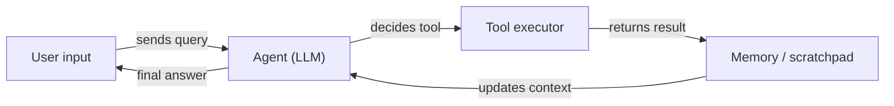

# LangChain

## Definition

LangChain is an open-source framework for building applications powered by [large language models](/docs/llms). It provides composable abstractions for prompts, chains, agents, and retrieval, letting developers wire together model providers, memory stores, tools, and document loaders with minimal boilerplate. The framework ships with prebuilt integrations for dozens of LLM providers (OpenAI, Anthropic, Mistral, local via Ollama) and vector stores (Pinecone, Chroma, FAISS).

At its core, LangChain centers on the concept of **chains**: sequences of steps where the output of one step feeds into the next. **Agents** extend chains by giving the LLM a reasoning loop: it decides which tool to call, receives the result, and continues until it produces a final answer. LangSmith, the companion observability platform, provides tracing, evaluation, and dataset management for production LangChain apps.

It complements [LlamaIndex](/docs/tools/llamaindex) (which emphasizes data indexing and retrieval quality) by focusing on composable orchestration and agent loops. Use LangChain when you need flexible chaining, multi-step [prompt engineering](/docs/prompt-engineering) workflows, or [agents with tools](/docs/agents), and you want a large ecosystem of ready-made integrations.

## How it works

### Components

LangChain decomposes an LLM application into modular components: **LLMs / chat models** (the inference backend), **prompt templates** (structured input construction), **output parsers** (structured extraction), **retrievers** (fetch relevant documents from a [vector database](/docs/rag/vector-databases)), and **tools** (external APIs, search, code execution).

### Chains and LCEL

The **LangChain Expression Language (LCEL)** composes components with a pipe syntax (`prompt | llm | parser`). The resulting chain is lazy, streamable, and batchable. A simple RAG chain: retrieve documents → format into a prompt → call the LLM → parse the answer.

### Agents



### Observability with LangSmith

LangSmith wraps chains and agents with trace logging, enabling latency analysis, prompt testing, and dataset-driven evaluation without modifying application code.

## When to use / When NOT to use

| Scenario | Use LangChain | Do NOT use LangChain |
|----------|--------------|----------------------|
| Building agents that call multiple APIs and tools | Yes — agent abstractions and tool integrations are first-class | |
| RAG over your own documents with a quick setup | Yes — many loaders and retriever integrations | |
| Production RAG needing deep chunking and retrieval tuning | | Prefer [LlamaIndex](/docs/tools/llamaindex) for fine-grained control |
| Single-turn completions with no retrieval or tools | | Overhead is unnecessary; call the API directly |
| Tracing and evaluating LLM calls in production | Yes — LangSmith integration | |
| Tight latency budget and minimal dependencies | | Framework overhead may add latency; consider a thin client |

## Comparisons

| Feature | LangChain | LlamaIndex |
|---------|-----------|------------|
| Primary focus | Orchestration, chains, agents | Data indexing and retrieval |
| Agent support | First-class (tool calling, LCEL) | Via query engines as tools |
| RAG control | High-level, many integrations | Fine-grained chunking, node parsers |
| Observability | LangSmith (tracing, evals) | Via integrations |
| Learning curve | Moderate | Moderate |
| Best for | Multi-step workflows, agents | Deep RAG over large document corpora |

## Pros and cons

| Pros | Cons |
|------|------|
| Large ecosystem of integrations (100+ LLMs, stores, tools) | Abstractions can obscure errors and add debugging friction |
| LCEL makes chains composable and streamable | API surface changes frequently across versions |
| LangSmith provides production-grade tracing and evals | Can add latency and dependency overhead for simple use cases |
| Strong community and documentation | Multiple ways to do the same thing can be confusing |

## Code examples

```python
# Minimal RAG chain using LangChain Expression Language (LCEL)
from langchain_openai import ChatOpenAI, OpenAIEmbeddings
from langchain_community.vectorstores import FAISS
from langchain_core.prompts import ChatPromptTemplate
from langchain_core.output_parsers import StrOutputParser
from langchain_core.runnables import RunnablePassthrough

# 1. Build a vector store from documents
texts = ["LangChain composes LLM pipelines.", "LCEL uses pipe syntax."]
vectorstore = FAISS.from_texts(texts, embedding=OpenAIEmbeddings())
retriever = vectorstore.as_retriever()

# 2. Define prompt
prompt = ChatPromptTemplate.from_template(
    "Answer based on context:\n{context}\n\nQuestion: {question}"
)

# 3. Compose chain with LCEL
chain = (
    {"context": retriever, "question": RunnablePassthrough()}
    | prompt
    | ChatOpenAI(model="gpt-4o-mini")
    | StrOutputParser()
)

print(chain.invoke("What does LCEL use?"))
# -> "LCEL uses pipe syntax."
```

## Tips for effective use

- Use LCEL (pipe syntax) instead of legacy `LLMChain` for all new code — it is streamable, batchable, and easier to debug.
- Instrument every chain and agent with LangSmith tracing from day one; retroactively adding tracing is harder.
- Keep tool descriptions short and precise — the agent's ability to select the right tool depends on the description quality.
- Use `RunnablePassthrough` and `RunnableParallel` to pass data through the chain without transforming it.
- For production RAG, add reranking (e.g. Cohere rerank) between the retriever and the LLM to improve answer quality.

## Practical resources

- [LangChain documentation](https://python.langchain.com/docs/) — Full API reference, guides, and tutorials
- [LangChain — Agents](https://python.langchain.com/docs/concepts/agents/) — Agent concepts and how to build tool-calling agents
- [LangChain — RAG](https://python.langchain.com/docs/use_cases/question_answering/) — Question answering and retrieval use cases
- [LangSmith](https://smith.langchain.com/) — Tracing, evaluation, and dataset management
- [LCEL overview](https://python.langchain.com/docs/expression_language/) — Composing chains with pipe syntax

## See also

- [RAG](/docs/rag)
- [Agents](/docs/agents)
- [LlamaIndex](/docs/tools/llamaindex)
