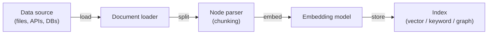

# LlamaIndex

## Definition

LlamaIndex (formerly GPT Index) is a data framework that bridges [large language models](/docs/llms) and your own data sources. Its primary purpose is ingesting, indexing, and querying documents, databases, and APIs so that LLMs can answer questions grounded in private or domain-specific information. It provides a high degree of control over every stage of [retrieval-augmented generation](/docs/rag): data loading, node parsing (chunking), embedding selection, index construction, retrieval strategy, reranking, and response synthesis.

Where [LangChain](/docs/tools/langchain) emphasizes composable orchestration and agent loops, LlamaIndex is optimized for the **data layer**: you can swap chunking strategies, retrieval algorithms, and synthesis approaches without rebuilding the pipeline. It ships with query engines, chat engines, and sub-question decomposition out of the box. Multiple index types (vector, summary, knowledge graph, keyword) can be combined in a single query for hybrid retrieval.

LlamaIndex also supports [agents](/docs/agents): query engines can be registered as tools, and agent reasoning loops (ReAct, OpenAI function calling) can select which engine to query. An evaluation suite (faithfulness, relevance, context precision) helps diagnose RAG quality and guides chunking or retrieval tuning for production.

## How it works

### Ingestion pipeline



### Query pipeline


### Key abstractions

**Nodes** are the unit of retrieval — chunks of a document with metadata. **Index** stores nodes and supports vector, keyword, or graph-based lookup. **Query engine** wraps index + retriever + synthesizer into a single callable. **Chat engine** maintains conversation history. **Sub-question engine** decomposes complex queries into simpler ones distributed across multiple indices.

## When to use / When NOT to use

| Scenario | Use LlamaIndex | Do NOT use LlamaIndex |
|----------|---------------|----------------------|
| RAG over large document corpora with chunking control | Yes — fine-grained node parsers and multiple index types | |
| Connecting LLMs to internal databases and APIs | Yes — data connectors for SQL, Notion, Slack, S3, etc. | |
| Evaluating retrieval faithfulness and relevance | Yes — built-in evaluation modules | |
| Multi-step agent workflows calling many external APIs | | Prefer [LangChain](/docs/tools/langchain) for richer agent tooling |
| Simple single-turn completions without retrieval | | Overhead is unnecessary; call the LLM API directly |
| Production pipeline needing LangSmith tracing | | Integrate with LangChain or use a dedicated tracing tool |

## Comparisons

| Feature | LlamaIndex | LangChain |
|---------|------------|-----------|
| Primary focus | Data indexing and retrieval (RAG) | Orchestration, chains, agents |
| Chunking control | Fine-grained node parsers | High-level text splitters |
| Index types | Vector, keyword, graph, summary, hybrid | Primarily vector via retrievers |
| Evaluation | Built-in (faithfulness, relevance) | Via LangSmith |
| Agent support | Query engines as tools, ReAct | First-class LCEL agent |
| Best for | Deep RAG over large corpora | Multi-step agent orchestration |

## Pros and cons

| Pros | Cons |
|------|------|
| Fine-grained control over every RAG stage | Steeper learning curve than simple LLM wrappers |
| Multiple index types including knowledge graphs | Fewer non-RAG integrations compared to LangChain |
| Built-in evaluation suite for production RAG | Some abstractions add verbosity |
| Composable pipelines that swap components easily | Documentation can lag behind rapid releases |

## Code examples

```python
# Simple RAG pipeline with LlamaIndex
from llama_index.core import VectorStoreIndex, SimpleDirectoryReader
from llama_index.llms.openai import OpenAI
from llama_index.core import Settings

# Configure LLM and embedding model
Settings.llm = OpenAI(model="gpt-4o-mini")

# 1. Load documents from a directory
documents = SimpleDirectoryReader("./data").load_data()

# 2. Build a vector index (embeds and stores nodes automatically)
index = VectorStoreIndex.from_documents(documents)

# 3. Create a query engine with top-k retrieval
query_engine = index.as_query_engine(similarity_top_k=3)

# 4. Query
response = query_engine.query("What are the main topics covered?")
print(response)
```

## Tips for effective use

- Choose chunk size based on your documents: 256–512 tokens works well for factual Q&A; 1024+ for summarization tasks.
- Use a reranker (e.g. `SentenceTransformerRerank`) to improve retrieval precision without changing the index.
- Combine a vector index for semantic search with a keyword index for exact-match retrieval using a `QueryFusionRetriever`.
- Run the built-in evaluation suite periodically during development to catch regressions in retrieval quality.
- Use `IngestionPipeline` with a `RedisDocumentStore` for incremental ingestion so documents are not re-embedded on re-run.

## Practical resources

- [LlamaIndex documentation](https://docs.llamaindex.ai/) — Full guides, API reference, and tutorials
- [LlamaIndex — RAG guide](https://docs.llamaindex.ai/en/stable/module_guides/deploying/rag/) — Ingestion, indexing, and query pipelines
- [LlamaIndex — Agents](https://docs.llamaindex.ai/en/stable/module_guides/deploying/agents/) — Building agents with query engines as tools
- [LlamaIndex — Evaluation](https://docs.llamaindex.ai/en/stable/module_guides/evaluating/) — Faithfulness, relevance, and context precision metrics
- [LlamaHub](https://llamahub.ai/) — Community data connectors, tools, and integrations

## See also

- [RAG](/docs/rag)
- [LangChain](/docs/tools/langchain)
- [Vector databases](/docs/rag/vector-databases)
