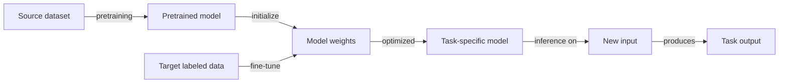

# Transfer learning

## Definition

Transfer learning is a machine learning technique that leverages knowledge acquired on a source task or domain to improve performance on a different, but related, target task. Instead of training a model from scratch, a **pretrained model** — already trained on large data (e.g., ImageNet, web-scale text) — serves as the starting point. The model's learned representations encode general-purpose features (edges, textures, language syntax, semantics) that transfer well across related domains.

The core motivation is data efficiency: labeled data for the target task is often scarce or expensive to collect, but pretraining on abundant unlabeled or labeled data elsewhere creates a strong initialization. **Fine-tuning** then adjusts the pretrained weights to the specifics of the target task, requiring far fewer gradient steps and labeled examples than training from scratch. This paradigm is now standard in [NLP](/docs/nlp) — BERT, GPT, and their descendants are pretrained on billions of tokens and fine-tuned on downstream tasks — and in [computer vision](/docs/cv), where ImageNet-pretrained backbones are adapted to medical imaging, satellite imagery, and more.

The effectiveness of transfer learning depends on **domain similarity**: transferring between closely related tasks (e.g., English-to-French NLP, natural-to-medical images) works well, while transferring across very different domains (e.g., text models to tabular data) may require more task-specific adaptation. Modern parameter-efficient techniques — **LoRA**, **adapters**, and **prompt tuning** — enable fine-tuning large models with a fraction of the original compute by updating only a small subset of parameters. See [few-shot learning](/docs/few-shot-learning) and [zero-shot learning](/docs/zero-shot-learning) for the extreme cases where target examples are minimal or absent.

## How it works

### Pretraining

A large model is trained on a **source dataset** using a general objective (e.g., next-token prediction for LLMs, ImageNet classification for vision encoders). This step is compute-intensive and done once; the pretrained checkpoint is then distributed for reuse.

### Fine-tuning strategies



Three common strategies differ in how many parameters are updated:

### Full fine-tuning

All model parameters are updated on the target task. Most expressive but requires significant compute and risks **catastrophic forgetting** (overwriting source knowledge).

### Head-only / feature extraction

Freeze the pretrained backbone and train only a new task-specific head (e.g., a linear classifier on top of frozen BERT embeddings). Compute-efficient but less expressive.

### Parameter-efficient fine-tuning (PEFT)

Methods like **LoRA** inject small trainable rank-decomposition matrices into transformer layers. Only these matrices are updated (~0.1–1% of total parameters), preserving source knowledge while adapting the model efficiently. **Adapters** insert small bottleneck modules between transformer layers. **Prompt tuning** prepends learnable soft tokens to the input while keeping the model frozen.

## When to use / When NOT to use

| Scenario | Use transfer learning | Avoid transfer learning |
|---|---|---|
| Limited labeled data for target task | Yes — core use case; pretrained features compensate | No — train from scratch only when data is abundant |
| Related source and target domains | Yes — representations transfer effectively | No — dissimilar domains may require domain-specific pretraining |
| Large pretrained model available | Yes — start from the best available checkpoint | No — if no suitable pretrained model exists for the modality |
| Real-time inference with strict latency | Partial — use PEFT or smaller models to minimize overhead | — |
| Tabular or structured data (no pretrained model) | No — gradient boosting or purpose-built nets may work better | — |

## Comparisons

| Strategy | Parameters updated | Data needed | Compute cost | Risk of forgetting |
|---|---|---|---|---|
| Train from scratch | All | Large | High | None |
| Full fine-tuning | All | Medium | Medium | High |
| Head-only / linear probe | Head only | Low | Low | None |
| LoRA / adapters (PEFT) | ~0.1–1% | Low | Low | Low |
| Zero-shot (no fine-tuning) | None | None | Minimal | None |

## Pros and cons

| Pros | Cons |
|---|---|
| Dramatically reduces data and compute requirements | Catastrophic forgetting can degrade source knowledge |
| Faster convergence — starts from a strong initialization | Negative transfer if source and target domains are too dissimilar |
| Proven across NLP, vision, audio, and multimodal tasks | Large pretrained models require significant memory |
| PEFT techniques enable fine-tuning on commodity hardware | Fine-tuning may not fully adapt to highly specialized domains |

## Code examples

Fine-tuning a pretrained BERT model for text classification using Hugging Face Transformers:

```python
from transformers import AutoTokenizer, AutoModelForSequenceClassification, Trainer, TrainingArguments
from datasets import load_dataset
import numpy as np
from sklearn.metrics import accuracy_score

# Load a small sentiment dataset
dataset = load_dataset("imdb")
tokenizer = AutoTokenizer.from_pretrained("bert-base-uncased")

def tokenize(batch):
    return tokenizer(batch["text"], truncation=True, padding="max_length", max_length=128)

dataset = dataset.map(tokenize, batched=True)
dataset.set_format("torch", columns=["input_ids", "attention_mask", "label"])

# Load pretrained BERT with a classification head (2 classes)
model = AutoModelForSequenceClassification.from_pretrained(
    "bert-base-uncased", num_labels=2
)

def compute_metrics(pred):
    labels = pred.label_ids
    preds = np.argmax(pred.predictions, axis=1)
    return {"accuracy": accuracy_score(labels, preds)}

training_args = TrainingArguments(
    output_dir="./bert-imdb",
    num_train_epochs=3,
    per_device_train_batch_size=16,
    per_device_eval_batch_size=32,
    evaluation_strategy="epoch",
    save_strategy="epoch",
    load_best_model_at_end=True,
    logging_steps=100,
)

trainer = Trainer(
    model=model,
    args=training_args,
    train_dataset=dataset["train"].select(range(2000)),  # Subset for demo
    eval_dataset=dataset["test"].select(range(500)),
    compute_metrics=compute_metrics,
)

trainer.train()
```

## Practical resources

- [Hugging Face – Transfer learning course](https://huggingface.co/course/chapter1/4?fw=pt) — Hands-on introduction to fine-tuning transformers for NLP tasks
- [TensorFlow – Transfer learning tutorial](https://www.tensorflow.org/tutorials/images/transfer_learning) — Step-by-step guide using MobileNetV2 for image classification
- [LoRA: Low-Rank Adaptation of Large Language Models (Hu et al., 2022)](https://arxiv.org/abs/2106.09685) — Foundational PEFT paper enabling efficient fine-tuning of large models
- [PEFT library (Hugging Face)](https://huggingface.co/docs/peft/) — Unified API for LoRA, adapters, prompt tuning, and other PEFT methods

## See also

- [Fine-tuning](/docs/llms/fine-tuning)
- [Few-shot learning](/docs/few-shot-learning)
