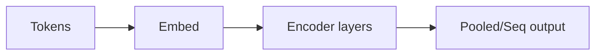

# BERT

## Definition

BERT is a transformer **encoder** model pretrained with masked language modeling (MLM) and next-sentence prediction. It produces contextual embeddings that are fine-tuned for downstream NLP tasks.

Unlike [GPT](/docs/transformers/gpt)-style decoders, BERT uses **bidirectional** context (left and right of each token), which helps for understanding tasks (e.g. [NLP](/docs/nlp) classification, NER, QA) rather than open-ended generation. It is often used as a frozen or fine-tuned encoder in [RAG](/docs/rag) and search pipelines.

## How it works

**Tokens** are tokenized and embedded (token + position embeddings). The **encoder layers** apply bidirectional self-attention and FFNs; each token’s representation is influenced by all other tokens. Output can be **pooled** (e.g. [CLS] for sentence-level tasks) or **sequence** (one vector per token for NER, QA). Pretraining: randomly mask tokens and predict them (MLM), and predict whether two sentences are consecutive (NSP). **Fine-tuning** adds a task head (e.g. linear classifier) and updates the model (or only the head) on labeled data.

## Use cases

BERT-style models excel when you need rich contextual representations for understanding (classification, NER, QA) rather than generation.

- Named entity recognition and relation extraction
- Search and retrieval (semantic matching, relevance ranking)
- Question answering and natural language inference

## External documentation

- [BERT: Pre-training of Deep Bidirectional Transformers (Devlin et al.)](https://arxiv.org/abs/1810.04805)
- [Hugging Face – BERT](https://huggingface.co/docs/transformers/model_doc/bert)

## See also

- [Transformers](/docs/transformers)
- [GPT](/docs/transformers/gpt)
- [NLP](/docs/nlp)
