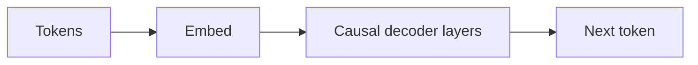

# GPT

## Definition

GPT refers to decoder-only transformer models trained to predict the next token (autoregressive). Scaling these models has led to today's large language models (LLMs) capable of few-shot and zero-shot tasks.

Decoder-only design is well-suited for **generation**: at each step the model conditions on previous tokens and predicts the next. [LLMs](/docs/llms) built on this idea are then instruction-tuned and aligned (e.g. RLHF) for chat and tool use. For understanding-only tasks, [BERT](/docs/transformers/bert)-style encoders can be more parameter-efficient.

## How it works

**Tokens** are embedded and fed into **causal decoder layers**: each position can attend only to itself and previous positions (masked self-attention), so the model cannot “see” the future. The **next token** is predicted from the last position’s representation (often with a linear layer and softmax over the vocabulary). **Training** maximizes the likelihood of the next token given the preceding context (teacher forcing). **Inference** generates autoregressively: sample or greedily pick the next token, append it, and repeat until a stop condition. [Prompt engineering](/docs/llms/prompt-engineering) and [fine-tuning](/docs/llms/fine-tuning) shape how the model uses this mechanism for tasks.

## Use cases

Decoder-only models are the backbone of chat, code, and any task that benefits from autoregressive generation or few-shot prompting.

- Text and code generation (completion, summarization, dialogue)
- Few-shot and zero-shot classification via prompts
- Assistants and chatbots built on instruction-tuned models

## External documentation

- [Improving Language Understanding by Generative Pre-Training (OpenAI)](https://cdn.openai.com/research-covers/language-unsupervised/language_understanding_paper.pdf)
- [Hugging Face – GPT-2](https://huggingface.co/docs/transformers/model_doc/gpt2)

## See also

- [Transformers](/docs/transformers)
- [LLMs](/docs/llms)
- [Prompt engineering](/docs/llms/prompt-engineering)
