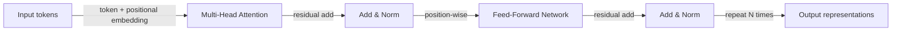

# Transformers

## Definition

Transformers are neural architectures based on **self-attention**: each token attends to all others to compute contextual representations. They avoid recurrence and enable parallelization, scaling to very long sequences and large models (BERT, GPT, etc.).

They underpin modern [LLMs](/docs/llms) and have been extended to [multimodal](/docs/multimodal-ai) and [vision](/docs/cv) models. Encoder-only ([BERT](/docs/transformers/bert)) and decoder-only ([GPT](/docs/transformers/gpt)) variants are most common today; the encoder-decoder layout remains used for sequence-to-sequence tasks.

The "Attention Is All You Need" paper (2017) introduced the transformer by removing the recurrent loop entirely and replacing it with scaled dot-product attention. This made training fully parallelizable, enabling models to be trained on far larger datasets than RNN-based predecessors. Positional encodings replace the implicit ordering of recurrence; residual connections and layer normalization stabilize gradient flow through many layers. These design choices, combined with the feed-forward sub-layer for per-position computation, form the fundamental building block that has scaled to hundreds of billions of parameters.

## How it works



### Self-attention mechanism

**Attention:** Input is projected into Query (Q), Key (K), and Value (V) matrices. Attention weights are computed as softmax(QK^T / sqrt(d_k)), then applied to V. Each token's output is a weighted combination of all tokens' values — capturing global context in one step.

### Multi-head attention

**Multi-head attention:** Multiple attention heads run in parallel, each learning different relational patterns (syntax, coreference, semantics). Their outputs are concatenated and projected, giving the model richer representational capacity than a single attention head.

### Encoder vs. decoder

**Encoder-only (e.g. BERT):** All tokens attend to all others (bidirectional). Best for understanding tasks. **Decoder-only (e.g. GPT):** Causal masking ensures each position only attends to past tokens, enabling autoregressive generation. **Encoder-decoder:** Used for tasks like translation where the input sequence is fully encoded before decoding the output.

## When to use / When NOT to use

| Scenario | Use transformers? | Notes |
|---|---|---|
| NLP classification, NER, QA | Yes | Encoder-only (BERT-style) is the default |
| Text generation, chat, code | Yes | Decoder-only (GPT-style) is the standard |
| Low-resource edge inference | With caution | Distilled or quantized variants recommended |
| Short sequences with clear locality | With caution | CNNs or RNNs may be more efficient |
| Sequence-to-sequence (translation) | Yes | Encoder-decoder transformers excel here |
| Vision tasks | Yes | Vision Transformer (ViT) patches work well |

## Comparisons

| Aspect | RNN / LSTM | CNN | Transformer |
|---|---|---|---|
| Long-range dependencies | Moderate | Poor | Excellent |
| Parallelizable training | No | Yes | Yes |
| Context window | Limited by unrolling | Fixed receptive field | Configurable (up to 1M+ tokens) |
| Memory cost at inference | Low (fixed state) | Low | High (KV cache grows with context) |
| State-of-the-art NLP | No | No | Yes |

## Pros and cons

| Pros | Cons |
|---|---|
| Parallelizable, scalable | High compute and memory |
| Strong at long-range dependencies | Requires large data |
| Unified architecture for many tasks | Interpretability challenges |
| Pretrained models widely available | Quadratic attention cost with sequence length |

## Code examples

```python
# Self-attention from scratch with PyTorch
import torch
import torch.nn as nn
import torch.nn.functional as F
import math

class MultiHeadSelfAttention(nn.Module):
    def __init__(self, d_model: int, num_heads: int):
        super().__init__()
        assert d_model % num_heads == 0
        self.d_k = d_model // num_heads
        self.num_heads = num_heads
        self.W_qkv = nn.Linear(d_model, 3 * d_model, bias=False)
        self.W_o   = nn.Linear(d_model, d_model, bias=False)

    def forward(self, x: torch.Tensor, causal: bool = False) -> torch.Tensor:
        B, T, C = x.shape
        qkv = self.W_qkv(x).split(C, dim=2)
        q, k, v = [t.view(B, T, self.num_heads, self.d_k).transpose(1, 2) for t in qkv]
        scale  = math.sqrt(self.d_k)
        scores = (q @ k.transpose(-2, -1)) / scale         # (B, heads, T, T)
        if causal:
            mask = torch.tril(torch.ones(T, T, device=x.device)).bool()
            scores = scores.masked_fill(~mask, float('-inf'))
        weights = F.softmax(scores, dim=-1)
        out = (weights @ v).transpose(1, 2).contiguous().view(B, T, C)
        return self.W_o(out)

# Test with a dummy batch
attn  = MultiHeadSelfAttention(d_model=64, num_heads=4)
x     = torch.randn(2, 10, 64)   # batch=2, seq_len=10, d_model=64
print(attn(x).shape)             # (2, 10, 64)
```

## Practical resources

- [Attention Is All You Need (Vaswani et al.)](https://arxiv.org/abs/1706.03762) — Original transformer paper
- [Hugging Face – Summary of the models](https://huggingface.co/docs/transformers/model_summary) — Overview of transformer model families
- [The Illustrated Transformer](https://jalammar.github.io/illustrated-transformer/) — Best visual explanation of the architecture

## See also

- [BERT](/docs/transformers/bert)
- [GPT](/docs/transformers/gpt)
- [LLMs](/docs/llms)
