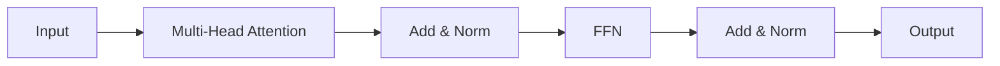

# Transformers

## Definition

Transformers are neural architectures based on **self-attention**: each token attends to all others to compute contextual representations. They avoid recurrence and enable parallelization, scaling to very long sequences and large models (BERT, GPT, etc.).

They underpin modern [LLMs](/docs/llms) and have been extended to [multimodal](/docs/multimodal-ai) and [vision](/docs/cv) models. Encoder-only ([BERT](/docs/transformers/bert)) and decoder-only ([GPT](/docs/transformers/gpt)) variants are most common today; the encoder-decoder layout remains used for sequence-to-sequence tasks.

## How it works

- **Attention:** Query, Key, Value are computed from inputs; attention weights combine values.
- **Multi-head attention:** Multiple attention heads capture different relations.
- **Encoder-decoder or decoder-only:** Encoder (e.g. BERT) sees full sequence; decoder (e.g. GPT) uses causal masking for autoregressive generation.

The diagram below shows one block: input goes through multi-head attention (with add and norm), then a feed-forward network (FFN), then add and norm again. Encoder stacks use bidirectional attention; decoder stacks use causal (masked) attention so each position only sees past tokens. Residual connections and layer norm stabilize training. Stacking many such blocks and scaling width and depth yields the large models used for [NLP](/docs/nlp) and beyond.

## Use cases

Transformers underpin most modern NLP and multimodal systems; encoder-only, decoder-only, and encoder-decoder variants suit different tasks.

- BERT-style: named entity recognition, search relevance, question answering
- GPT-style: text generation, code completion, chat and dialogue
- Multimodal transformers for vision-language tasks

## Pros and cons

| Pros | Cons |
|------|------|
| Parallelizable, scalable | High compute and memory |
| Strong at long-range dependencies | Requires large data |
| Unified architecture for many tasks | Interpretability challenges |

## External documentation

- [Attention Is All You Need (Vaswani et al.)](https://arxiv.org/abs/1706.03762) — Original transformer paper
- [Hugging Face – Summary of the models](https://huggingface.co/docs/transformers/model_summary) — Transformer model families
- [The Illustrated Transformer](https://jalammar.github.io/illustrated-transformer/) — Visual explanation of the architecture

## See also

- [BERT](/docs/transformers/bert)
- [GPT](/docs/transformers/gpt)
- [LLMs](/docs/llms)
