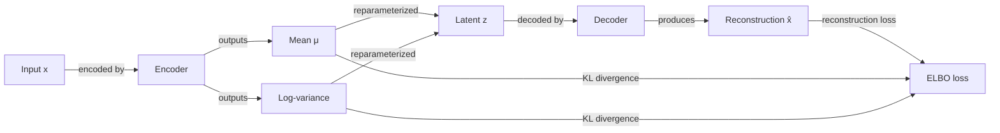

# Variational autoencoders (VAEs)

## Definition

Variational Autoencoders (VAEs), introduced by Kingma & Welling in 2013, are a class of generative model that learns a structured **latent space** by combining an autoencoder architecture with variational Bayesian inference. The encoder maps input data to a probability distribution over latent codes (rather than a single point), and the decoder maps sampled latent codes back to reconstructed outputs. This probabilistic formulation forces the latent space to be smooth and continuous, enabling meaningful interpolation and unconditional generation.

The training objective is the **Evidence Lower Bound (ELBO)**: a reconstruction term that pushes decoded outputs to match inputs, plus a KL divergence term that regularizes the latent distribution toward a prior (typically a standard normal). The **reparameterization trick** — sampling z = μ + σ·ε where ε ~ N(0, I) — allows gradients to flow through the sampling operation, making end-to-end training with backpropagation possible.

Compared to [GANs](/docs/gans), VAEs are easier to train (no adversarial dynamic), provide an explicit (though approximate) likelihood, and offer a well-structured latent space suitable for interpolation and representation learning. However, the KL regularization and the reconstruction loss (typically MSE or BCE) tend to produce blurrier samples than GANs or [diffusion models](/docs/diffusion-models). VAEs remain the workhorse for anomaly detection, controllable generation, and as the compression backbone in **latent diffusion** (Stable Diffusion uses a VAE encoder/decoder around its diffusion process).

## How it works

### Encoder

The **encoder** q(z|x) maps input **x** to the parameters of a Gaussian distribution over the latent variable z: a mean vector **μ** and a log-variance vector **log σ²**. This is implemented as a neural network with two output heads.

### Reparameterization and sampling

A latent vector **z** is sampled as z = μ + σ · ε, where ε ~ N(0, I). This keeps sampling differentiable so gradients flow back through μ and σ to the encoder weights.

### Decoder

The **decoder** p(x|z) maps **z** back to the data space, producing the **reconstructed output** x̂. The reconstruction quality is measured by a reconstruction loss (MSE for continuous data, BCE for binary).

### Training objective (ELBO)

```
Loss = Reconstruction loss + β · KL(q(z|x) || p(z))
```

The KL term penalizes the encoder for deviating from the prior N(0, I), ensuring the latent space is compact and smooth. β-VAE uses β > 1 to increase disentanglement.



### Generation at inference

To generate new samples, **z is drawn from the prior** N(0, I) — bypassing the encoder entirely — and passed through the decoder. Because the KL term ensures the latent space is dense and smooth, most random z vectors produce coherent outputs.

## When to use / When NOT to use

| Scenario | Use VAE | Avoid VAE |
|---|---|---|
| Smooth latent interpolation needed | Yes — continuous, structured latent space | No — GANs do not guarantee smooth interpolation |
| Anomaly detection via reconstruction error | Yes — high reconstruction error signals anomalies | No — if a discriminative threshold is simpler |
| Representation learning with uncertainty | Yes — probabilistic encoder captures input uncertainty | No — if a deterministic encoder (e.g., SimCLR) suffices |
| Photorealistic image generation | No — outputs tend to be blurry compared to GANs/diffusion | — |
| Applications requiring exact likelihood | Partial — ELBO is a lower bound, not exact | — |

## Comparisons

| Model | Latent structure | Sample sharpness | Training | Likelihood |
|---|---|---|---|---|
| VAE | Smooth, regularized | Blurry | Stable | Approximate (ELBO) |
| GAN | No explicit latent | Sharp | Unstable | None |
| Diffusion | Implicit (noise schedule) | Very sharp | Stable | Approximate |
| AE (plain) | Unregularized | Sharp | Stable | None |

## Pros and cons

| Pros | Cons |
|---|---|
| Stable, principled training via ELBO | Samples are often blurrier than GANs or diffusion |
| Explicit (lower-bound) likelihood for evaluation | KL term can over-regularize, reducing expressiveness |
| Smooth latent space supports interpolation | Posterior collapse — encoder ignores z when decoder is too powerful |
| Useful for anomaly detection and representation learning | Reconstruction loss is a proxy; may not match perceptual quality |

## Code examples

Minimal VAE on MNIST using PyTorch:

```python
import torch
import torch.nn as nn
import torch.nn.functional as F
from torchvision import datasets, transforms
from torch.utils.data import DataLoader

class VAE(nn.Module):
    def __init__(self, latent_dim=20):
        super().__init__()
        # Encoder
        self.fc1 = nn.Linear(784, 400)
        self.fc_mu = nn.Linear(400, latent_dim)
        self.fc_logvar = nn.Linear(400, latent_dim)
        # Decoder
        self.fc3 = nn.Linear(latent_dim, 400)
        self.fc4 = nn.Linear(400, 784)

    def encode(self, x):
        h = F.relu(self.fc1(x))
        return self.fc_mu(h), self.fc_logvar(h)

    def reparameterize(self, mu, logvar):
        std = torch.exp(0.5 * logvar)
        eps = torch.randn_like(std)
        return mu + eps * std

    def decode(self, z):
        h = F.relu(self.fc3(z))
        return torch.sigmoid(self.fc4(h))

    def forward(self, x):
        mu, logvar = self.encode(x.view(-1, 784))
        z = self.reparameterize(mu, logvar)
        return self.decode(z), mu, logvar

def elbo_loss(recon_x, x, mu, logvar):
    bce = F.binary_cross_entropy(recon_x, x.view(-1, 784), reduction="sum")
    kl = -0.5 * torch.sum(1 + logvar - mu.pow(2) - logvar.exp())
    return bce + kl

model = VAE()
optimizer = torch.optim.Adam(model.parameters(), lr=1e-3)
loader = DataLoader(
    datasets.MNIST(".", download=True, transform=transforms.ToTensor()),
    batch_size=128, shuffle=True
)

for epoch in range(5):
    total_loss = 0
    for x, _ in loader:
        recon, mu, logvar = model(x)
        loss = elbo_loss(recon, x, mu, logvar)
        optimizer.zero_grad(); loss.backward(); optimizer.step()
        total_loss += loss.item()
    print(f"Epoch {epoch+1} | Loss: {total_loss / len(loader.dataset):.2f}")

# Generate new samples
with torch.no_grad():
    z = torch.randn(16, 20)
    samples = model.decode(z).view(16, 1, 28, 28)
```

## Practical resources

- [Auto-Encoding Variational Bayes (Kingma & Welling, 2013)](https://arxiv.org/abs/1312.6114) — Original VAE paper introducing ELBO and the reparameterization trick
- [PyTorch – VAE example](https://github.com/pytorch/examples/tree/main/vae) — Official minimal implementation
- [β-VAE (Higgins et al., 2017)](https://openreview.net/forum?id=Sy2fchgYl) — Extension for disentangled latent representations
- [Latent Diffusion Models (Rombach et al.)](https://arxiv.org/abs/2112.10752) — How VAE compression underpins Stable Diffusion

## See also

- [GANs](/docs/gans)
- [Diffusion models](/docs/diffusion-models)
