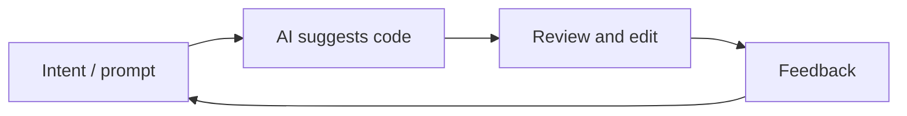

# Vibe coding

## Definition

Vibe coding is a style of software development where you work **iteratively with AI assistance**: you describe intent in natural language, get code or edits from an [LLM](/docs/llms) or coding tool, then refine by feedback and context rather than writing every line from scratch. The “vibe” is the loose, exploratory flow—you steer by intent and feel, and the model fills in implementation details.

It contrasts with fully spec-first or plan-then-code approaches (e.g. [spec-driven development](/docs/spec-driven-development)): you often start with a rough idea and let [prompt engineering](/docs/llms/prompt-engineering), [agents](/docs/agents), and tools (e.g. [Cursor](/docs/tools/cursor), [Claude Code](/docs/tools/claude-code)) suggest and edit code. Useful for prototypes, scripting, and tasks where speed and iteration matter more than upfront design.

## How it works

You give the **model** (or IDE tool) **context**: open files, cursor position, or a short prompt (“add a test for this”, “refactor to use async”). The **model** returns suggested code or diffs; you **accept, edit, or reject** and optionally add **feedback** (“use a different library”, “make it shorter”). The loop repeats until the result matches what you want. Tools often provide project-aware context (indexed codebase, [RAG](/docs/rag)-style retrieval) so suggestions stay relevant. Success depends on clear intent, good tooling, and knowing when to take over or refine the output.

## Use cases

Vibe coding fits when you want to move fast with AI assistance and are okay iterating in the loop rather than nailing the spec first.

- Prototyping and scripting (e.g. one-off scripts, small tools)
- Boilerplate, tests, and refactors where the intent is easy to state
- Learning or exploring a codebase by asking the AI to implement or explain
- Pairing with [agents](/docs/agents) or [autonomous agents](/docs/autonomous-agents) that write and edit code from descriptions

## Pros and cons

| Pros | Cons |
|------|------|
| Fast iteration and less typing | Can obscure understanding if you never read the code |
| Good for exploration and learning | May produce brittle or overfitted code without review |
| Low friction for small tasks | Hard to scale to large, consistent systems without specs |
| Works well with [agents](/docs/agents) and IDEs | Depends on model quality and context |

## External documentation

- [Antigravity – Vibe coding](https://www.antigravityai.io/) — Agent-first IDE that emphasizes vibe coding
- [Kiro – Spec-driven and Autopilot](https://kiro.dev/) — Balancing structure with AI-driven flow

## See also

- [Spec-driven development](/docs/spec-driven-development) — More structured, spec-first approach
- [Agents](/docs/agents) — AI that can write and edit code
- [Cursor](/docs/tools/cursor) — IDE built for AI-assisted coding
- [Prompt engineering](/docs/llms/prompt-engineering)
