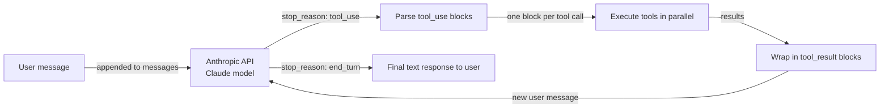

# Anthropic Tool Use

## Definition

**Anthropic Tool Use** (manchmal auch "function calling" genannt) ist Claudes nativer Mechanismus zur strukturierten und zuverlässigen Interaktion mit externen Systemen. Anstatt Claude aufzufordern, Text zu produzieren, den man dann parst, um einen Funktionsnamen und Argumente zu finden, beschreibt man die Tools als JSON-Schemas in der API-Anfrage, und Claude gibt einen strukturierten `tool_use`-Block mit dem genauen Tool-Namen und einem JSON-Objekt mit validierten Argumenten zurück. Der eigene Code führt das Tool aus, verpackt das Ergebnis in einem `tool_result`-Block und sendet es als nächste Gesprächsrunde zurück an Claude – eine Schleife, die sich fortsetzt, bis Claude eine endgültige Textantwort produziert.

Die Designphilosophie ist bewusst minimalistisch: Anthropic Tool Use ist eine Fähigkeit der Model-API, kein Framework. Es gibt keine Orchestrierungsschicht, kein eingebautes Gedächtnis, keine Agentenschleife – das schreibt man selbst. Dies bietet maximale Kontrolle und minimalen Abstraktions-Overhead. Für einfache bis mittlere Tool-Use-Anwendungsfälle ist das Ergebnis sauber, lesbar und leicht zu debuggen. Für komplexe Multi-Agenten-Systeme würde man Anthropic Tool Use typischerweise mit einem Framework wie LangGraph oder einem eigenen Orchestrator kombinieren.

Claude-Modelle wurden speziell für Tool Use trainiert, was bedeutet, dass sie starke Leistung zeigen beim Entscheiden, *wann* ein Tool aufgerufen werden soll (kein unnötiger Aufruf), *wie* Argumente aus natürlicher Sprache korrekt befüllt werden, und *wie* mit mehrdeutigen oder unterspezifizierten Anfragen umgegangen wird – durch Nachfragen statt Halluzinieren von Argumenten. Parallele Tool-Aufrufe (mehrere `tool_use`-Blöcke in einer einzigen Antwort) und mehrstufige Tool-Nutzung (mehrere Runden von Tool-Aufrufen vor einer endgültigen Antwort) werden beide nativ unterstützt.

## Funktionsweise

### Tool-Definitionen: JSON Schema

Jedes Tool wird als JSON-Objekt mit drei Pflichtfeldern beschrieben: `name` (ein String-Bezeichner), `description` (eine natürlichsprachliche Erklärung, was das Tool tut und wann es verwendet werden soll – dies ist das wichtigste Feld zur Steuerung von Claudes Entscheidung) und `input_schema` (ein JSON-Schema-Objekt, das die erwarteten Argumente definiert). Das `input_schema` folgt dem Standard-JSON-Schema-Entwurf und unterstützt String-, Zahlen-, Boolean-, Array-, Objekt-Typen, Pflichtfelder, Enum-Werte und verschachtelte Schemas. Claude liest die Tool-Beschreibungen, um zu entscheiden, welches Tool aufgerufen werden soll; präzisere Beschreibungen führen zu genauerer Tool-Auswahl.

### tool_use- und tool_result-Nachrichtentypen

Wenn Claude entscheidet, ein Tool zu verwenden, gibt es eine Antwort mit `stop_reason: "tool_use"` und einem `content`-Array zurück, das einen oder mehrere `tool_use`-Blöcke enthält. Jeder Block hat eine `id` (ein eindeutiger String wie `"toolu_01abc..."`), einen `name` (passend zu einer der Tool-Definitionen) und einen `input` (ein JSON-Objekt mit den validierten Argumenten). Die Anwendung extrahiert diese Blöcke, führt jeden Tool-Aufruf aus und konstruiert eine neue Nachricht mit `role: "user"`, deren Inhalt eine Liste von `tool_result`-Blöcken ist – einen pro Tool-Aufruf, abgeglichen über `tool_use_id`. Der `tool_result`-Block enthält die Ausgabe als String oder strukturiertes Content-Array. Dieses Hin-und-Her setzt sich fort, bis Claude `stop_reason: "end_turn"` mit einer einfachen Textantwort zurückgibt.

### Parallele Tool-Aufrufe

Claude kann mehrere `tool_use`-Blöcke in einer einzigen Antwort ausgeben, wenn es feststellt, dass mehrere Tools gleichzeitig aufgerufen werden können – zum Beispiel die Suche in zwei verschiedenen Datenbanken oder das Abrufen des Wetters für drei Städte auf einmal. Die Anwendung sollte mehrere `tool_use`-Blöcke erkennen und sie parallel ausführen (z. B. mit `asyncio.gather` oder einem Thread-Pool), bevor die `tool_result`-Antwort konstruiert wird. Parallele Aufrufe reduzieren die Gesamtlatenz im Vergleich zu sequenziellen Einzelaufruf-Runden erheblich, und Claude wurde trainiert, diese Fähigkeit einzusetzen, wenn es sinnvoll ist.

### Mehrstufige Tool-Nutzung

Komplexe Aufgaben erfordern oft mehrere Runden von Tool-Aufrufen, bevor Claude eine endgültige Antwort produzieren kann: eine Entität nachschlagen, dann Details dazu abrufen, dann etwas aus diesen Details berechnen. Jede Runde fügt der Konversationshistorie eine Assistentennachricht (mit `tool_use`-Blöcken) und eine Benutzernachricht (mit `tool_result`-Blöcken) hinzu. Die Konversationshistorie wird bei jedem API-Aufruf vollständig gesendet, was Claude vollständigen Kontext darüber gibt, was versucht wurde und was die Ergebnisse waren. Dieses zustandslose Design bedeutet, dass man selbst für die Pflege und das Kürzen der Nachrichtenliste verantwortlich ist – es gibt kein eingebautes Gedächtnis oder Zustandsmanagement.



## Wann verwenden / Wann NICHT verwenden

| Verwenden wenn | Vermeiden wenn |
|---|---|
| Direkte Kontrolle über die Tool-Aufruf-Schleife ohne Framework-Overhead gewünscht wird | Eine Multi-Agenten-Koordinationsschicht benötigt wird – Anthropic Tool Use ist Single-Agent |
| Engste Integration mit Claude-spezifischen Funktionen (Streaming, Extended Thinking) benötigt wird | Framework-Komfort wie automatisches Gedächtnis, eingebaute Tool-Bibliotheken oder Rollenverwaltung benötigt wird |
| Der Anwendungsfall 1-10 Tools und einen klar definierten Konversationsfluss hat | Das Tool-Set sehr groß ist und semantische Tool-Auswahl im großen Maßstab benötigt wird |
| Ein Produktionssystem mit minimalen Abhängigkeiten aufgebaut wird | Schnelles Prototyping mit vorgefertigten Integrationen gewünscht wird (stattdessen LangChain oder CrewAI verwenden) |
| Maximale Portabilität benötigt wird – nur das Anthropic SDK und eigener Code | Das Team deklarative Agentenkonfiguration gegenüber dem Schreiben von Orchestrierungscode bevorzugt |

## Vergleiche

| Kriterium | Anthropic Tool Use | OpenAI Function Calling |
|---|---|---|
| **Schema-Format** | JSON Schema mit `name`-, `description`-, `input_schema`-Feldern | JSON Schema mit `name`-, `description`-, `parameters`-Feldern – nahezu identische Struktur |
| **Streaming-Tool-Aufrufe** | Unterstützt: `input_json_delta`-Ereignisse streamen Argument-Tokens in Echtzeit | Unterstützt: `function_call`-Argument-Streaming über Delta-Ereignisse |
| **Parallele Tool-Aufrufe** | Unterstützt: mehrere `tool_use`-Blöcke in einer einzigen Antwort | Unterstützt: mehrere `tool_calls`-Einträge in einer einzigen Antwort |
| **Zuverlässigkeit / Argumentgenauigkeit** | Stark: Claude-Modelle sind speziell für präzise Tool-Nutzung trainiert | Stark: GPT-4-Klasse-Modelle haben robustes Function Calling |
| **Modellunterstützung** | Claude-3-Familie und höher (Haiku, Sonnet, Opus) | GPT-3.5-turbo, GPT-4, GPT-4o und höher |
| **Tool-Ergebnis-Format** | `tool_result`-Content-Block mit `tool_use_id`-Referenz | `tool`-Rollennachricht mit `tool_call_id`-Referenz |
| **Erweiterte Funktionen** | Computer-Use-Tools (Beta), Dokument-Tools | Code Interpreter, File Search (Assistants API) |

## Code-Beispiele

```python
import anthropic
import json
from typing import Any

# Initialize the Anthropic client
client = anthropic.Anthropic()  # reads ANTHROPIC_API_KEY from environment

# --- Tool definitions using JSON Schema ---
# The 'description' field is critical: Claude uses it to decide when to call each tool.
# The 'input_schema' defines the expected arguments with types and required fields.

tools = [
    {
        "name": "get_weather",
        "description": (
            "Get current weather information for a specific city. "
            "Use this when the user asks about weather conditions, temperature, or forecasts."
        ),
        "input_schema": {
            "type": "object",
            "properties": {
                "city": {
                    "type": "string",
                    "description": "The city name, e.g. 'London' or 'New York'",
                },
                "units": {
                    "type": "string",
                    "enum": ["celsius", "fahrenheit"],
                    "description": "Temperature unit. Defaults to celsius.",
                },
            },
            "required": ["city"],
        },
    },
    {
        "name": "search_knowledge_base",
        "description": (
            "Search an internal knowledge base for information on AI topics. "
            "Use this when the user asks a factual question about AI frameworks, models, or concepts."
        ),
        "input_schema": {
            "type": "object",
            "properties": {
                "query": {
                    "type": "string",
                    "description": "The search query string",
                },
                "max_results": {
                    "type": "integer",
                    "description": "Maximum number of results to return. Default: 3.",
                    "minimum": 1,
                    "maximum": 10,
                },
            },
            "required": ["query"],
        },
    },
    {
        "name": "create_summary",
        "description": (
            "Create a structured summary of provided content. "
            "Use this to format research findings or information into a clean summary."
        ),
        "input_schema": {
            "type": "object",
            "properties": {
                "content": {
                    "type": "string",
                    "description": "The content to summarize",
                },
                "format": {
                    "type": "string",
                    "enum": ["bullet_points", "paragraph", "table"],
                    "description": "Output format for the summary",
                },
            },
            "required": ["content", "format"],
        },
    },
]

# --- Tool execution functions ---
# In production, these would call real APIs. Here they return simulated results.

def get_weather(city: str, units: str = "celsius") -> dict:
    """Simulated weather API call."""
    return {
        "city": city,
        "temperature": 22 if units == "celsius" else 72,
        "units": units,
        "condition": "partly cloudy",
        "humidity": "65%",
    }

def search_knowledge_base(query: str, max_results: int = 3) -> list[dict]:
    """Simulated knowledge base search."""
    return [
        {"title": f"Result {i+1} for '{query}'", "snippet": f"Relevant information about {query}..."}
        for i in range(min(max_results, 3))
    ]

def create_summary(content: str, format: str) -> str:
    """Simulated summary creation."""
    if format == "bullet_points":
        return f"• Key point from: {content[:50]}...\n• Additional insight\n• Conclusion"
    return f"Summary: {content[:100]}..."

def execute_tool(tool_name: str, tool_input: dict) -> Any:
    """Dispatch tool calls to the appropriate function."""
    if tool_name == "get_weather":
        return get_weather(**tool_input)
    elif tool_name == "search_knowledge_base":
        return search_knowledge_base(**tool_input)
    elif tool_name == "create_summary":
        return create_summary(**tool_input)
    else:
        return {"error": f"Unknown tool: {tool_name}"}

# --- Multi-turn tool use loop ---

def run_agent(user_message: str) -> str:
    """
    Run a multi-turn tool use loop until Claude produces a final answer.
    Returns the final text response.
    """
    messages = [{"role": "user", "content": user_message}]

    while True:
        response = client.messages.create(
            model="claude-opus-4-5",
            max_tokens=4096,
            tools=tools,
            messages=messages,
            system=(
                "You are a helpful AI assistant with access to weather data, "
                "a knowledge base, and a summary tool. "
                "Use tools when needed to answer questions accurately."
            ),
        )

        # Append the assistant's response to the conversation history
        messages.append({"role": "assistant", "content": response.content})

        # Check if we're done
        if response.stop_reason == "end_turn":
            # Extract the final text from the response content
            for block in response.content:
                if hasattr(block, "text"):
                    return block.text
            return "No text response found."

        # Handle tool use: execute all tool_use blocks
        if response.stop_reason == "tool_use":
            tool_results = []

            for block in response.content:
                if block.type == "tool_use":
                    print(f"  Calling tool: {block.name}({json.dumps(block.input)})")

                    # Execute the tool and get the result
                    result = execute_tool(block.name, block.input)

                    # Wrap result in a tool_result block
                    # The tool_use_id links this result to the specific tool call
                    tool_results.append({
                        "type": "tool_result",
                        "tool_use_id": block.id,
                        "content": json.dumps(result),  # serialize to string
                    })

            # Add tool results as a user message to continue the conversation
            messages.append({"role": "user", "content": tool_results})

        else:
            # Unexpected stop reason — return what we have
            break

    return "Agent loop ended unexpectedly."

# --- Run examples ---

print("Example 1: Weather + Knowledge base (potential parallel calls)")
answer = run_agent(
    "What is the weather in Paris right now, and also search for information about LangGraph?"
)
print("Answer:", answer)

print("\nExample 2: Multi-turn tool use")
answer = run_agent(
    "Search for information about CrewAI and then create a bullet-point summary of the results."
)
print("Answer:", answer)
```

## Praktische Ressourcen

- [Anthropic Tool Use Dokumentation](https://docs.anthropic.com/en/docs/build-with-claude/tool-use) — Offizieller Leitfaden zu Tool-Definitionen, Nachrichtenfluss, parallelen Aufrufen und Best Practices für Tool-Beschreibungen.
- [Anthropic Python SDK Referenz](https://github.com/anthropics/anthropic-sdk-python) — Vollständiges SDK mit typisierten Antwortobjekten, Async-Unterstützung und Streaming für Tool Use.
- [Anthropic Cookbook: Tool-Use-Beispiele](https://github.com/anthropics/anthropic-cookbook/tree/main/tool_use) — Praktische Notebooks, die Einzel- und Multi-Tool-Muster, parallele Aufrufe und Computer Use demonstrieren.
- [OpenAI Function Calling Dokumentation](https://platform.openai.com/docs/guides/function-calling) — Nützliche Referenz zum Vergleich der beiden Ansätze; Konzepte übertragen sich trotz unterschiedlicher Bezeichnungen gut.

## Siehe auch

- [Überblick über Agent-Frameworks](/docs/agents/frameworks-overview)
- [KI-Agenten](/docs/agents)
- [Multi-Agenten-Systeme](/docs/agents/multi-agent-systems)
- [ReAct](/docs/reasoning-patterns/react)
