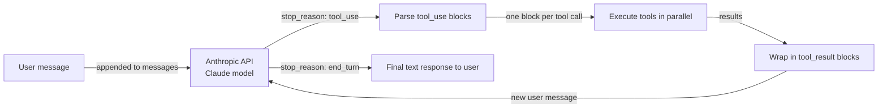

# Anthropic Tool Use

## Definition

**Anthropic Tool Use** (manchmal als "Function Calling" bezeichnet) ist Claudes nativer Mechanismus zur Interaktion mit externen Systemen auf strukturierte, zuverlässige Weise. Anstatt Claude aufzufordern, Text auszugeben, den Sie dann parsen, um einen Funktionsnamen und Argumente zu finden, beschreiben Sie Ihre Werkzeuge als JSON-Schemas in der API-Anfrage, und Claude gibt einen strukturierten `tool_use`-Block mit dem genauen Werkzeugnamen und einem JSON-Objekt validierter Argumente zurück. Ihr Code führt das Werkzeug aus, verpackt das Ergebnis in einem `tool_result`-Block und sendet es als nächsten Gesprächszug zurück an Claude — eine Schleife, die fortgesetzt wird, bis Claude eine abschließende Textantwort produziert.

Die Designphilosophie ist intentionaler Minimalismus: Anthropic Tool Use ist eine Fähigkeit der Modell-API, kein Framework. Es gibt keine Orchestrierungsschicht, kein eingebautes Gedächtnis, keine Agentenschleife — diese schreiben Sie selbst. Das gibt maximale Kontrolle und minimalen Abstraktions-Overhead. Für einfache bis mittlere Anwendungsfälle ist das Ergebnis sauber, lesbar und einfach zu debuggen. Für komplexe Multi-Agenten-Systeme würden Sie Anthropic Tool Use typischerweise mit einem Framework wie LangGraph oder einem eigenen Orchestrator kombinieren.

Claude-Modelle wurden speziell auf Werkzeugnutzung trainiert, was bedeutet, dass sie eine starke Leistung zeigen bei der Entscheidung, *wann* ein Werkzeug aufzurufen ist (nicht unnötig aufrufen), *wie* Argumente korrekt aus natürlicher Sprache befüllt werden, und *wie* mit mehrdeutigen Anfragen umgegangen wird — indem um Klärung gebeten wird, statt Argumente zu halluzinieren. Parallele Werkzeugaufrufe (mehrere `tool_use`-Blöcke in einer einzelnen Antwort) und mehrstufige Werkzeugnutzung (mehrere Runden von Werkzeugaufrufen vor einer abschließenden Antwort) werden beide nativ unterstützt.

## Funktionsweise

### Werkzeugdefinitionen: JSON-Schema

Jedes Werkzeug wird als JSON-Objekt mit drei Pflichtfeldern beschrieben: `name` (ein String-Bezeichner), `description` (eine natürlichsprachige Erklärung, was das Werkzeug tut und wann es verwendet werden soll — dies ist das wichtigste Feld zur Steuerung von Claudes Entscheidung) und `input_schema` (ein JSON-Schema-Objekt, das die erwarteten Argumente definiert). Das `input_schema` folgt dem Standard-JSON-Schema-Draft und unterstützt String-, Zahlen-, Boolean-, Array- und Objekt-Typen, Pflichtfelder, Enum-Werte und verschachtelte Schemas. Claude liest die Werkzeugbeschreibungen, um zu entscheiden, welches Werkzeug aufgerufen werden soll; präzisere Beschreibungen führen zu genauerer Werkzeugauswahl.

### Nachrichtentypen tool_use und tool_result

Wenn Claude entscheidet, ein Werkzeug zu verwenden, gibt es eine Antwort mit `stop_reason: "tool_use"` und ein `content`-Array zurück, das einen oder mehrere `tool_use`-Blöcke enthält. Jeder Block hat eine `id` (ein eindeutiger String wie `"toulu_01abc..."`), einen `name` (der einer Ihrer Werkzeugdefinitionen entspricht) und ein `input` (ein JSON-Objekt mit den validierten Argumenten). Ihre Anwendung extrahiert diese Blöcke, führt jeden Werkzeugaufruf aus und erstellt eine neue Nachricht mit `role: "user"`, deren Inhalt eine Liste von `tool_result`-Blöcken ist — einen pro Werkzeugaufruf, passend per `tool_use_id`. Dieses Hin und Her geht weiter, bis Claude `stop_reason: "end_turn"` mit einer einfachen Textantwort zurückgibt.

### Parallele Werkzeugaufrufe

Claude kann mehrere `tool_use`-Blöcke in einer einzelnen Antwort ausgeben, wenn es feststellt, dass mehrere Werkzeuge gleichzeitig aufgerufen werden können — zum Beispiel das Durchsuchen zweier verschiedener Datenbanken oder das Abrufen des Wetters für drei Städte auf einmal. Ihre Anwendung sollte mehrere `tool_use`-Blöcke erkennen und diese parallel ausführen (z.B. mit `asyncio.gather` oder einem Thread-Pool), bevor die `tool_result`-Antwort erstellt wird. Parallele Aufrufe reduzieren die Gesamtlatenz erheblich im Vergleich zu sequentiellen Einzelaufruf-Runden.

### Mehrstufige Werkzeugnutzung

Komplexe Aufgaben erfordern oft mehrere Runden von Werkzeugaufrufen, bevor Claude eine abschließende Antwort geben kann: eine Entität nachschlagen, dann Details abrufen, dann etwas aus diesen Details berechnen. Jede Runde fügt eine Assistentennachricht (mit `tool_use`-Blöcken) und eine Benutzernachricht (mit `tool_result`-Blöcken) zur Gesprächshistorie hinzu. Die Gesprächshistorie wird bei jedem API-Aufruf vollständig übermittelt, sodass Claude vollständigen Kontext hat. Dieses zustandslose Design bedeutet, dass Sie für die Pflege und das Trimmen der Nachrichtenliste verantwortlich sind — es gibt kein eingebautes Gedächtnis oder Zustandsmanagement.



## Wann verwenden / Wann NICHT verwenden

| Verwenden wenn | Vermeiden wenn |
|---|---|
| Sie direkte Kontrolle über die Werkzeugaufruf-Schleife ohne Framework-Overhead wünschen | Sie eine Multi-Agenten-Koordinationsschicht benötigen — Anthropic Tool Use ist für einzelne Agenten |
| Sie die engste Integration mit Claude-spezifischen Funktionen benötigen (Streaming, erweitertes Denken) | Sie Framework-Annehmlichkeiten wie automatisches Gedächtnis oder eingebaute Werkzeugbibliotheken benötigen |
| Ihr Anwendungsfall 1–10 Werkzeuge und einen gut definierten Gesprächsablauf hat | Ihr Werkzeugsatz sehr groß ist und Sie semantische Werkzeugauswahl im großen Maßstab benötigen |
| Sie ein Produktionssystem aufbauen und minimale Abhängigkeiten wünschen | Sie schnelles Prototyping mit vorgefertigten Integrationen wünschen (verwenden Sie stattdessen LangChain oder CrewAI) |
| Sie maximale Portabilität benötigen — nur das Anthropic SDK und Ihren eigenen Code | Ihr Team deklarative Agentenkonfiguration gegenüber dem Schreiben von Orchestrierungscode bevorzugt |

## Vergleiche

| Kriterium | Anthropic Tool Use | OpenAI Function Calling |
|---|---|---|
| **Schema-Format** | JSON-Schema mit `name`-, `description`-, `input_schema`-Feldern | JSON-Schema mit `name`-, `description`-, `parameters`-Feldern — nahezu identische Struktur |
| **Streaming-Werkzeugaufrufe** | Unterstützt: `input_json_delta`-Ereignisse streamen Argument-Token in Echtzeit | Unterstützt: `function_call`-Argument-Streaming via Delta-Ereignisse |
| **Parallele Werkzeugaufrufe** | Unterstützt: mehrere `tool_use`-Blöcke in einer einzelnen Antwort | Unterstützt: mehrere `tool_calls`-Einträge in einer einzelnen Antwort |
| **Zuverlässigkeit / Argumentgenauigkeit** | Stark: Claude-Modelle sind speziell auf präzise Werkzeugnutzung trainiert | Stark: GPT-4-Klasse-Modelle haben robustes Function Calling |
| **Modellunterstützung** | Claude-3-Familie und höher (Haiku, Sonnet, Opus) | GPT-3.5-turbo, GPT-4, GPT-4o und höher |
| **Werkzeugergebnis-Format** | `tool_result`-Inhaltsblock mit `tool_use_id`-Referenz | `tool`-Rollennachricht mit `tool_call_id`-Referenz |
| **Erweiterte Funktionen** | Computer-Use-Werkzeuge (Beta), Dokumentenwerkzeuge | Code-Interpreter, Dateisuche (Assistants API) |

## Code-Beispiele

```python
import anthropic
import json
from typing import Any

# Initialize the Anthropic client
client = anthropic.Anthropic()  # reads ANTHROPIC_API_KEY from environment

# --- Tool definitions using JSON Schema ---
# The 'description' field is critical: Claude uses it to decide when to call each tool.
# The 'input_schema' defines the expected arguments with types and required fields.

tools = [
    {
        "name": "get_weather",
        "description": (
            "Get current weather information for a specific city. "
            "Use this when the user asks about weather conditions, temperature, or forecasts."
        ),
        "input_schema": {
            "type": "object",
            "properties": {
                "city": {
                    "type": "string",
                    "description": "The city name, e.g. 'London' or 'New York'",
                },
                "units": {
                    "type": "string",
                    "enum": ["celsius", "fahrenheit"],
                    "description": "Temperature unit. Defaults to celsius.",
                },
            },
            "required": ["city"],
        },
    },
    {
        "name": "search_knowledge_base",
        "description": (
            "Search an internal knowledge base for information on AI topics. "
            "Use this when the user asks a factual question about AI frameworks, models, or concepts."
        ),
        "input_schema": {
            "type": "object",
            "properties": {
                "query": {
                    "type": "string",
                    "description": "The search query string",
                },
                "max_results": {
                    "type": "integer",
                    "description": "Maximum number of results to return. Default: 3.",
                    "minimum": 1,
                    "maximum": 10,
                },
            },
            "required": ["query"],
        },
    },
    {
        "name": "create_summary",
        "description": (
            "Create a structured summary of provided content. "
            "Use this to format research findings or information into a clean summary."
        ),
        "input_schema": {
            "type": "object",
            "properties": {
                "content": {
                    "type": "string",
                    "description": "The content to summarize",
                },
                "format": {
                    "type": "string",
                    "enum": ["bullet_points", "paragraph", "table"],
                    "description": "Output format for the summary",
                },
            },
            "required": ["content", "format"],
        },
    },
]

# --- Tool execution functions ---
# In production, these would call real APIs. Here they return simulated results.

def get_weather(city: str, units: str = "celsius") -> dict:
    """Simulated weather API call."""
    return {
        "city": city,
        "temperature": 22 if units == "celsius" else 72,
        "units": units,
        "condition": "partly cloudy",
        "humidity": "65%",
    }

def search_knowledge_base(query: str, max_results: int = 3) -> list[dict]:
    """Simulated knowledge base search."""
    return [
        {"title": f"Result {i+1} for '{query}'", "snippet": f"Relevant information about {query}..."}
        for i in range(min(max_results, 3))
    ]

def create_summary(content: str, format: str) -> str:
    """Simulated summary creation."""
    if format == "bullet_points":
        return f"• Key point from: {content[:50]}...\n• Additional insight\n• Conclusion"
    return f"Summary: {content[:100]}..."

def execute_tool(tool_name: str, tool_input: dict) -> Any:
    """Dispatch tool calls to the appropriate function."""
    if tool_name == "get_weather":
        return get_weather(**tool_input)
    elif tool_name == "search_knowledge_base":
        return search_knowledge_base(**tool_input)
    elif tool_name == "create_summary":
        return create_summary(**tool_input)
    else:
        return {"error": f"Unknown tool: {tool_name}"}

# --- Multi-turn tool use loop ---

def run_agent(user_message: str) -> str:
    """
    Run a multi-turn tool use loop until Claude produces a final answer.
    Returns the final text response.
    """
    messages = [{"role": "user", "content": user_message}]

    while True:
        response = client.messages.create(
            model="claude-opus-4-5",
            max_tokens=4096,
            tools=tools,
            messages=messages,
            system=(
                "You are a helpful AI assistant with access to weather data, "
                "a knowledge base, and a summary tool. "
                "Use tools when needed to answer questions accurately."
            ),
        )

        # Append the assistant's response to the conversation history
        messages.append({"role": "assistant", "content": response.content})

        # Check if we're done
        if response.stop_reason == "end_turn":
            # Extract the final text from the response content
            for block in response.content:
                if hasattr(block, "text"):
                    return block.text
            return "No text response found."

        # Handle tool use: execute all tool_use blocks
        if response.stop_reason == "tool_use":
            tool_results = []

            for block in response.content:
                if block.type == "tool_use":
                    print(f"  Calling tool: {block.name}({json.dumps(block.input)})")

                    # Execute the tool and get the result
                    result = execute_tool(block.name, block.input)

                    # Wrap result in a tool_result block
                    # The tool_use_id links this result to the specific tool call
                    tool_results.append({
                        "type": "tool_result",
                        "tool_use_id": block.id,
                        "content": json.dumps(result),  # serialize to string
                    })

            # Add tool results as a user message to continue the conversation
            messages.append({"role": "user", "content": tool_results})

        else:
            # Unexpected stop reason — return what we have
            break

    return "Agent loop ended unexpectedly."

# --- Run examples ---

print("Example 1: Weather + Knowledge base (potential parallel calls)")
answer = run_agent(
    "What is the weather in Paris right now, and also search for information about LangGraph?"
)
print("Answer:", answer)

print("\nExample 2: Multi-turn tool use")
answer = run_agent(
    "Search for information about CrewAI and then create a bullet-point summary of the results."
)
print("Answer:", answer)
```

## Praktische Ressourcen

- [Anthropic Tool Use Dokumentation](https://docs.anthropic.com/en/docs/build-with-claude/tool-use) — Offizieller Leitfaden zu Werkzeugdefinitionen, Nachrichtenfluss, parallelen Aufrufen und Best Practices für Werkzeugbeschreibungen.
- [Anthropic Python SDK Referenz](https://github.com/anthropics/anthropic-sdk-python) — Vollständiges SDK mit typisierten Antwortobjekten, Async-Unterstützung und Streaming für Werkzeugnutzung.
- [Anthropic Cookbook: Werkzeugnutzungs-Beispiele](https://github.com/anthropics/anthropic-cookbook/tree/main/tool_use) — Praktische Notebooks, die Einzel- und Mehrwerkzeug-Muster, parallele Aufrufe und Computer-Use demonstrieren.
- [OpenAI Function Calling Dokumentation](https://platform.openai.com/docs/guides/function-calling) — Nützliche Referenz zum Vergleich der beiden Ansätze; Konzepte korrespondieren trotz Benennungsunterschieden eng.

## Siehe auch

- [Agent-Frameworks-Übersicht](/docs/agents/frameworks-overview)
- [KI-Agenten](/docs/agents)
- [Multi-Agenten-Systeme](/docs/agents/multi-agent-systems)
- [ReAct](/docs/reasoning-patterns/react)
