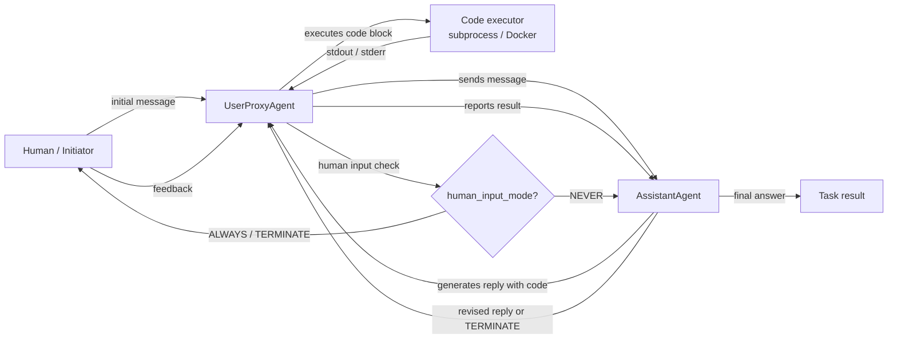

# AutoGen

## Definition

AutoGen ist ein Open-Source-Framework, das von Microsoft Research entwickelt wurde, um **Multi-Agenten-konversationale KI-Systeme** zu bauen. Die Kernidee ist einfach: Agenten kommunizieren durch den Austausch von Nachrichten in einer strukturierten Konversation, und das Framework übernimmt die Weiterleitung, das Turn-Taking und die Beendigungslogik. Anders als rollenbasierte Frameworks wie CrewAI, die Agenten als Personas mit Aufgaben definieren, werden AutoGen-Agenten primär durch ihr **Konversationsverhalten** definiert – wie sie auf Nachrichten reagieren, ob sie Code ausführen können und wann sie die Kontrolle an einen anderen Agenten oder einen Menschen übergeben.

Der wichtigste Grundbaustein des Frameworks ist der `ConversableAgent` – eine Basisklasse, die je nach Konfiguration jede Rolle spielen kann. Zwei Spezialisierungen decken die häufigsten Muster ab: `AssistantAgent` (LLM-gestützt, antwortet mit Plänen und Code) und `UserProxyAgent` (optional von einem Menschen oder Code-Executor gestützt, führt Code lokal aus und speist Ergebnisse zurück). Dieses Zwei-Agenten-Muster ist von Haus aus leistungsstark: Man erhält eine Code-Schreib-Schleife, bei der der Assistent Lösungen vorschlägt und der Proxy sie ausführt und Ergebnisse meldet, ohne zusätzliches Gerüst.

AutoGen unterstützt auch **Gruppen-Chats**, bei denen drei oder mehr Agenten abwechselnd zu einer gemeinsamen Konversation beitragen, die von einem `GroupChatManager` verwaltet wird. Dies ermöglicht Muster wie Expertenpanels, Debattenschleifen und modulare Pipelines, bei denen jeder Agent einen bestimmten Schritt übernimmt. Human-in-the-Loop ist eine erstklassige Funktion: Der `UserProxyAgent` kann jederzeit pausieren und einen Menschen um Input bitten, was ihn gut geeignet für Forschungs- und Experimentier-Workflows macht, bei denen man den Agenten während der Ausführung inspizieren oder umlenken möchte.

## Funktionsweise

### ConversableAgent: der universelle Baustein

`ConversableAgent` ist die Basisklasse für alle AutoGen-Agenten. Er enthält eine System-Nachricht, eine optionale LLM-Konfiguration, eine Liste registrierter Funktionen (Tools) und eine Reihe von Regeln, wann eine Konversation beendet werden soll (`is_termination_msg`). Jeder Agent hat eine `generate_reply`-Methode, die entscheidet, welche Nachricht als nächstes gesendet werden soll, basierend auf der Konversationshistorie. Agenten können als Human-Proxy-Agenten (sie pausieren und fragen nach Input), LLM-Agenten (sie generieren Antworten mit einem LLM) oder Executor-Agenten (sie führen Code ohne LLM-Aufrufe aus) konfiguriert werden. Diese Flexibilität bedeutet, dass eine einzige Basisklasse das gesamte Spektrum von vollständig automatisierten bis vollständig manuellen Agenten abdeckt.

### AssistantAgent und UserProxyAgent

`AssistantAgent` ist ein `ConversableAgent`, der als hilfreicher KI-Assistent vorkonfiguriert ist: Er hat eine Standard-Systemnachricht, die ihn ermutigt, Python-Code-Blöcke für Aufgaben vorzuschlagen, die Berechnungen erfordern. `UserProxyAgent` ist vorkonfiguriert, um Code-Blöcke in einem lokalen Docker-Container oder Subprocess auszuführen, Ergebnisse zu melden und optional einen Menschen um Input zu bitten, wenn er nicht automatisch fortfahren kann. Zusammen bilden sie die kanonische AutoGen-Zwei-Agenten-Schleife: Der Assistent schlägt Code vor, der Proxy führt ihn aus, die Ausgabe wird an den Assistenten zurückgegeben, und die Schleife läuft, bis die Aufgabe erledigt ist oder eine Abbruchbedingung eintritt. Dieses Muster ist besonders leistungsstark für Datenanalyse, Automatisierungsskripte und ML-Experimente.

### Gruppen-Chats und GroupChatManager

Für Workflows mit drei oder mehr Agenten bietet AutoGen `GroupChat` und `GroupChatManager`. `GroupChat` hält die Liste der teilnehmenden Agenten und die gemeinsame Nachrichtenhistorie. `GroupChatManager` ist selbst ein `ConversableAgent`, der als Moderator agiert: Nach jeder Nachricht wählt er den nächsten Sprecher (entweder durch eine Round-Robin-Regel, eine benutzerdefinierte Auswahlfunktion oder eine LLM-basierte Auswahlstrategie). Gruppen-Chats ermöglichen Expertenpanel-Muster, bei denen ein Forscher, ein Programmierer und ein Prüfer abwechselnd tätig sind, oder mehrstufige Pipelines, bei denen jeder Agent eine Phase übernimmt. Der Manager kann die Konversation auch beenden, wenn eine globale Bedingung erfüllt ist.

### Code-Ausführung und Human-in-the-Loop

AutoGens Code-Ausführungsschicht ist konfigurierbar: Agenten können Code lokal (Subprocess), in einem Docker-Container (isoliert) oder über einen benutzerdefinierten Executor ausführen. Der `UserProxyAgent` erkennt Code-Blöcke in den Nachrichten des Assistenten und führt sie automatisch aus, wenn `human_input_mode="NEVER"`. Die Einstellung `human_input_mode="ALWAYS"` oder `"TERMINATE"` schiebt die Ausführung hinter eine menschliche Genehmigung vor, was sichere Human-in-the-Loop-Muster für Produktion oder sensible Workflows ermöglicht. Dies macht AutoGen besonders gut geeignet für agentische Coding-Aufgaben, Data-Science-Automatisierung und Forschungsumgebungen, in denen ein Mensch die Ausgaben überprüfen soll, bevor sie wirksam werden.



## Wann verwenden / Wann NICHT verwenden

| Verwenden wenn | Vermeiden wenn |
|---|---|
| Agenten benötigt werden, die Code als Teil des Workflows schreiben und ausführen | Code-Ausführung nicht benötigt wird und der Konversations-Overhead unerwünscht ist |
| Human-in-the-Loop an konfigurierbaren Checkpoints gewünscht wird | Vollständig automatisierte Pipelines, bei denen menschliche Eingriffe unerwünscht sind |
| Der Workflow Forschung, Experimente oder iterative Verfeinerung umfasst | Eine deklarative, opinionierte API benötigt wird – AutoGen erfordert mehr manuelle Konfiguration |
| Ein Multi-Agenten-Expertenpanel oder Debatten-Muster gewünscht wird (Gruppen-Chat) | Deterministische, testbare Pipelines benötigt werden – nicht-deterministische Konversationen sind schwerer zu unit-testen |
| Agentische Coding-Assistenten oder Data-Science-Automatisierung prototypisiert werden | Produktionslatenz kritisch ist – Multi-Turn-Konversationsschleifen fügen erheblichen Overhead hinzu |

## Vergleiche

| Kriterium | AutoGen | CrewAI | LangGraph |
|---|---|---|---|
| **Kernmetapher** | Agenten als Konversationsteilnehmer | Agenten als rollenspielende Crew-Mitglieder | Agentenverhalten als zustandsbehafteter Graph |
| **Zustandsverwaltung** | Implizit: geteilte Nachrichtenhistorie im GroupChat | Implizit: Aufgabenkontext und Crew-Gedächtnis | Explizit: TypedDict-Zustand geteilt über alle Knoten |
| **Code-Ausführung** | Erstklassig: UserProxyAgent führt Code-Blöcke automatisch aus | Nur über externe Tools | Über Tool-Knoten im Graph |
| **Human-in-the-Loop** | Erstklassig: `human_input_mode` bei jedem Agenten | Begrenzt: nur manuelle Eingriffe | Erstklassig: `interrupt_before` / `interrupt_after` bei Graph-Knoten |
| **Lernkurve** | Mittel: intuitiv für Python-Entwickler, aber Gruppen-Chat-Routing kann komplex sein | Niedrig: deklarative API ist leicht zu erlernen | Hoch: erfordert graphbasiertes Denken |

## Code-Beispiele

```python
import os
import autogen

# --- LLM configuration ---
# AutoGen uses a list of configs for load balancing / fallback.
# Set your OPENAI_API_KEY or use an Anthropic-compatible config.
llm_config = {
    "config_list": [
        {
            "model": "gpt-4o",
            "api_key": os.environ.get("OPENAI_API_KEY"),
        }
    ],
    "temperature": 0.1,
    "timeout": 120,
}

# --- Two-agent pattern: AssistantAgent + UserProxyAgent ---
# The assistant writes code; the proxy executes it and reports results.

assistant = autogen.AssistantAgent(
    name="data_analyst",
    system_message=(
        "You are a data analysis expert. When given a task, write Python code to solve it. "
        "Always verify your results by printing them. "
        "Reply TERMINATE when the task is fully complete."
    ),
    llm_config=llm_config,
)

user_proxy = autogen.UserProxyAgent(
    name="user_proxy",
    human_input_mode="NEVER",       # fully automated; change to "ALWAYS" for human review
    max_consecutive_auto_reply=10,  # safety limit on auto-replies
    is_termination_msg=lambda msg: "TERMINATE" in msg.get("content", ""),
    code_execution_config={
        "work_dir": "/tmp/autogen_workspace",
        "use_docker": False,         # set True to execute in an isolated Docker container
    },
)

# Kick off the two-agent conversation
user_proxy.initiate_chat(
    assistant,
    message=(
        "Analyze the following data and compute the mean, median, and standard deviation. "
        "Data: [12, 45, 23, 67, 34, 89, 11, 56, 78, 42]"
    ),
)


# --- Group chat pattern: researcher, coder, reviewer ---
# Three specialized agents collaborate on a more complex task.

researcher = autogen.AssistantAgent(
    name="researcher",
    system_message=(
        "You are a research specialist. Find information and summarize findings. "
        "Do not write code — delegate code tasks to the coder."
    ),
    llm_config=llm_config,
)

coder = autogen.AssistantAgent(
    name="coder",
    system_message=(
        "You are a Python expert. Write clean, well-commented code when asked. "
        "Always include error handling and print results clearly."
    ),
    llm_config=llm_config,
)

reviewer = autogen.AssistantAgent(
    name="reviewer",
    system_message=(
        "You are a critical reviewer. After the researcher and coder have finished, "
        "review the outputs for accuracy and completeness. "
        "Reply TERMINATE when you are satisfied with the result."
    ),
    llm_config=llm_config,
)

group_proxy = autogen.UserProxyAgent(
    name="group_proxy",
    human_input_mode="NEVER",
    max_consecutive_auto_reply=15,
    is_termination_msg=lambda msg: "TERMINATE" in msg.get("content", ""),
    code_execution_config={"work_dir": "/tmp/autogen_group", "use_docker": False},
)

# GroupChat manages turn order and shared message history
group_chat = autogen.GroupChat(
    agents=[group_proxy, researcher, coder, reviewer],
    messages=[],
    max_round=12,
    speaker_selection_method="auto",  # LLM-based speaker selection
)

manager = autogen.GroupChatManager(
    groupchat=group_chat,
    llm_config=llm_config,
)

group_proxy.initiate_chat(
    manager,
    message=(
        "Research the top 3 Python libraries for data visualization in 2025. "
        "Then write a code example using the most popular one to plot a bar chart."
    ),
)
```

## Praktische Ressourcen

- [AutoGen offizielle Dokumentation](https://microsoft.github.io/autogen/) — Vollständige Framework-Referenz für Agenten, Gruppen-Chat, Code-Ausführung und Tool Use.
- [AutoGen GitHub-Repository](https://github.com/microsoft/autogen) — Quellcode, Issue-Tracker und eine umfangreiche Sammlung von Beispiel-Notebooks.
- [AutoGen-Paper: "AutoGen: Enabling Next-Gen LLM Applications via Multi-Agent Conversation" (Wu et al., 2023)](https://arxiv.org/abs/2308.08155) — Originales Forschungspapier, das das konversationsgesteuerte Multi-Agenten-Design motiviert.
- [AutoGen Studio](https://microsoft.github.io/autogen/docs/autogen-studio/getting-started) — No-Code-UI zum Aufbauen und Testen von AutoGen-Workflows, nützlich für das Prototyping.

## Siehe auch

- [Überblick über Agent-Frameworks](/docs/agents/frameworks-overview)
- [CrewAI](/docs/agents/crewai)
- [LangGraph](/docs/agents/langgraph)
- [Multi-Agenten-Systeme](/docs/agents/multi-agent-systems)
- [KI-Agenten](/docs/agents)
