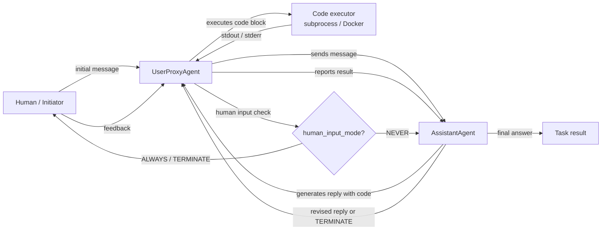

# AutoGen

## Definition

AutoGen ist ein von Microsoft Research entwickeltes Open-Source-Framework zum Aufbau von **Multi-Agenten-Konversations-KI-Systemen**. Seine Kernidee ist einfach: Agenten kommunizieren durch den Austausch von Nachrichten in einer strukturierten Konversation, und das Framework übernimmt die Routing-, Turn-Taking- und Terminierungslogik. Im Gegensatz zu rollenbasierten Frameworks wie CrewAI, die Agenten als Personas mit Aufgaben definieren, werden AutoGen-Agenten primär durch ihr **Gesprächsverhalten** definiert — wie sie auf Nachrichten reagieren, ob sie Code ausführen können und wann sie die Kontrolle an einen anderen Agenten oder einen Menschen übergeben.

Die wichtigste Grundkomponente des Frameworks ist der `ConversableAgent` — eine Basisklasse, die je nach Konfiguration jede Rolle spielen kann. Zwei Spezialisierungen decken die häufigsten Muster ab: `AssistantAgent` (durch ein LLM gestützt, antwortet mit Plänen und Code) und `UserProxyAgent` (optional durch einen Menschen oder Code-Executor gestützt, führt Code lokal aus und liefert Ergebnisse zurück). Dieses Zwei-Agenten-Muster ist von Anfang an leistungsstark: Man erhält eine Code-Schreibschleife, in der der Assistent Lösungen vorschlägt und der Proxy sie ausführt und Ergebnisse meldet, ohne zusätzliches Scaffolding.

AutoGen unterstützt auch **Gruppenchats**, bei denen drei oder mehr Agenten abwechselnd zu einer gemeinsamen Konversation beitragen, die von einem `GroupChatManager` verwaltet wird. Human-in-the-loop ist ein erstklassiges Feature: Der `UserProxyAgent` kann pausieren und jederzeit nach menschlicher Eingabe fragen, was ihn gut für Forschungs- und Experimentier-Workflows geeignet macht, bei denen man einen Menschen bei der Ausführung beaufsichtigen oder umlenken möchte.

## Funktionsweise

### ConversableAgent: der universelle Baustein

`ConversableAgent` ist die Basisklasse für alle AutoGen-Agenten. Er enthält eine Systemnachricht, eine optionale LLM-Konfiguration, eine Liste registrierter Funktionen (Werkzeuge) und eine Reihe von Regeln, wann eine Konversation beendet werden soll (`is_termination_msg`). Jeder Agent hat eine `generate_reply`-Methode, die anhand der Gesprächshistorie entscheidet, welche Nachricht als nächstes gesendet werden soll. Agenten können als menschliche Proxy-Agenten (sie pausieren und fragen nach Eingabe), LLM-Agenten (sie generieren Antworten mit einem LLM) oder Executor-Agenten (sie führen Code ohne LLM-Aufrufe aus) konfiguriert werden. Diese Flexibilität bedeutet, dass eine einzige Basisklasse das gesamte Spektrum von vollständig automatisierten bis zu vollständig manuellen Agenten abdeckt.

### AssistantAgent und UserProxyAgent

`AssistantAgent` ist ein `ConversableAgent`, der als hilfreicher KI-Assistent vorkonfiguriert ist: Er hat eine Standard-Systemnachricht, die ihn ermutigt, Python-Code-Blöcke für Aufgaben vorzuschlagen, die Berechnungen erfordern. `UserProxyAgent` ist vorkonfiguriert, um Code-Blöcke in einem lokalen Docker-Container oder Subprocess auszuführen, Ergebnisse zu melden und optional nach menschlicher Eingabe zu fragen, wenn er nicht automatisch fortfahren kann. Gemeinsam bilden sie die kanonische AutoGen-Zwei-Agenten-Schleife: Der Assistent schlägt Code vor, der Proxy führt ihn aus, die Ausgabe fließt zurück an den Assistenten, und die Schleife läuft weiter, bis die Aufgabe erledigt ist oder eine Abbruchbedingung eintritt. Dieses Muster ist besonders mächtig für Datenanalyse, Automatisierungsskripte und ML-Experimente.

### Gruppenchats und GroupChatManager

Für Workflows mit drei oder mehr Agenten bietet AutoGen `GroupChat` und `GroupChatManager`. `GroupChat` enthält die Liste der teilnehmenden Agenten und die gemeinsame Nachrichtenhistorie. `GroupChatManager` ist selbst ein `ConversableAgent`, der als Moderator agiert: Nach jeder Nachricht wählt er den nächsten Sprecher aus (entweder nach einer Round-Robin-Regel, einer benutzerdefinierten Auswahlfunktion oder einer LLM-basierten Auswahlstrategie). Gruppenchats ermöglichen Expertengremien-Muster, bei denen ein Forscher, ein Programmierer und ein Reviewer abwechselnd tätig sind, oder mehrstufige Pipelines, bei denen jeder Agent eine Phase übernimmt.

### Code-Ausführung und Human-in-the-Loop

Die Code-Ausführungsschicht von AutoGen ist konfigurierbar: Agenten können Code lokal (Subprocess), in einem Docker-Container (isoliert) oder über einen benutzerdefinierten Executor ausführen. Der `UserProxyAgent` erkennt Code-Blöcke in den Nachrichten des Assistenten und führt sie automatisch aus, wenn `human_input_mode="NEVER"`. Das Setzen von `human_input_mode="ALWAYS"` oder `"TERMINATE"` schaltet die Ausführung hinter menschliche Genehmigung, was sichere Human-in-the-Loop-Muster für Produktions- oder sensible Workflows ermöglicht. Dies macht AutoGen besonders gut geeignet für agentenbasierte Coding-Aufgaben, Data-Science-Automatisierung und Forschungsumgebungen.



## Wann verwenden / Wann NICHT verwenden

| Verwenden wenn | Vermeiden wenn |
|---|---|
| Sie Agenten benötigen, die Code als Teil des Workflows schreiben und ausführen | Code-Ausführung nicht benötigt wird und Konversations-Overhead unerwünscht ist |
| Sie Human-in-the-Loop an konfigurierbaren Checkpoints wünschen | Vollautomatische Pipelines, bei denen menschliche Eingriffe unerwünscht sind |
| Ihr Workflow Forschung, Experimente oder iterative Verfeinerung beinhaltet | Sie eine deklarative, meinungsstarke API benötigen — AutoGen erfordert mehr manuelle Konfiguration |
| Sie ein Multi-Agenten-Expertengremium oder Debattenmuster wünschen (Gruppenchat) | Sie deterministische, testbare Pipelines benötigen — nicht-deterministische Konversationen sind schwieriger zu testen |
| Sie agentenbasierte Coding-Assistenten oder Data-Science-Automatisierung prototypisieren | Produktionslatenz kritisch ist — Multi-Turn-Konversationsschleifen fügen erheblichen Overhead hinzu |

## Vergleiche

| Kriterium | AutoGen | CrewAI | LangGraph |
|---|---|---|---|
| **Kernmetapher** | Agenten als Gesprächsteilnehmer | Agenten als rollenspielfähige Crew-Mitglieder | Agentenverhalten als zustandsbehafteter Graph |
| **Zustandsverwaltung** | Implizit: gemeinsame Nachrichtenhistorie in GroupChat | Implizit: Aufgabenkontext und Crew-Gedächtnis | Explizit: TypedDict-Zustand über alle Knoten geteilt |
| **Code-Ausführung** | Erstklassig: UserProxyAgent führt Code-Blöcke automatisch aus | Nur über externe Werkzeuge | Über Werkzeugknoten im Graphen |
| **Human-in-the-Loop** | Erstklassig: `human_input_mode` an jedem Agenten | Begrenzt: nur manuelle Eingriffe | Erstklassig: `interrupt_before` / `interrupt_after` an Graphknoten |
| **Lernkurve** | Mittel: intuitiv für Python-Entwickler, aber Gruppenchat-Routing kann komplex sein | Niedrig: deklarative API einfach zu erlernen | Hoch: erfordert graphbasiertes Denken |

## Code-Beispiele

```python
import os
import autogen

# --- LLM configuration ---
# AutoGen uses a list of configs for load balancing / fallback.
# Set your OPENAI_API_KEY or use an Anthropic-compatible config.
llm_config = {
    "config_list": [
        {
            "model": "gpt-4o",
            "api_key": os.environ.get("OPENAI_API_KEY"),
        }
    ],
    "temperature": 0.1,
    "timeout": 120,
}

# --- Two-agent pattern: AssistantAgent + UserProxyAgent ---
# The assistant writes code; the proxy executes it and reports results.

assistant = autogen.AssistantAgent(
    name="data_analyst",
    system_message=(
        "You are a data analysis expert. When given a task, write Python code to solve it. "
        "Always verify your results by printing them. "
        "Reply TERMINATE when the task is fully complete."
    ),
    llm_config=llm_config,
)

user_proxy = autogen.UserProxyAgent(
    name="user_proxy",
    human_input_mode="NEVER",       # fully automated; change to "ALWAYS" for human review
    max_consecutive_auto_reply=10,  # safety limit on auto-replies
    is_termination_msg=lambda msg: "TERMINATE" in msg.get("content", ""),
    code_execution_config={
        "work_dir": "/tmp/autogen_workspace",
        "use_docker": False,         # set True to execute in an isolated Docker container
    },
)

# Kick off the two-agent conversation
user_proxy.initiate_chat(
    assistant,
    message=(
        "Analyze the following data and compute the mean, median, and standard deviation. "
        "Data: [12, 45, 23, 67, 34, 89, 11, 56, 78, 42]"
    ),
)


# --- Group chat pattern: researcher, coder, reviewer ---
# Three specialized agents collaborate on a more complex task.

researcher = autogen.AssistantAgent(
    name="researcher",
    system_message=(
        "You are a research specialist. Find information and summarize findings. "
        "Do not write code — delegate code tasks to the coder."
    ),
    llm_config=llm_config,
)

coder = autogen.AssistantAgent(
    name="coder",
    system_message=(
        "You are a Python expert. Write clean, well-commented code when asked. "
        "Always include error handling and print results clearly."
    ),
    llm_config=llm_config,
)

reviewer = autogen.AssistantAgent(
    name="reviewer",
    system_message=(
        "You are a critical reviewer. After the researcher and coder have finished, "
        "review the outputs for accuracy and completeness. "
        "Reply TERMINATE when you are satisfied with the result."
    ),
    llm_config=llm_config,
)

group_proxy = autogen.UserProxyAgent(
    name="group_proxy",
    human_input_mode="NEVER",
    max_consecutive_auto_reply=15,
    is_termination_msg=lambda msg: "TERMINATE" in msg.get("content", ""),
    code_execution_config={"work_dir": "/tmp/autogen_group", "use_docker": False},
)

# GroupChat manages turn order and shared message history
group_chat = autogen.GroupChat(
    agents=[group_proxy, researcher, coder, reviewer],
    messages=[],
    max_round=12,
    speaker_selection_method="auto",  # LLM-based speaker selection
)

manager = autogen.GroupChatManager(
    groupchat=group_chat,
    llm_config=llm_config,
)

group_proxy.initiate_chat(
    manager,
    message=(
        "Research the top 3 Python libraries for data visualization in 2025. "
        "Then write a code example using the most popular one to plot a bar chart."
    ),
)
```

## Praktische Ressourcen

- [AutoGen offizielle Dokumentation](https://microsoft.github.io/autogen/) — Vollständige Framework-Referenz zu Agenten, Gruppenchat, Code-Ausführung und Werkzeugnutzung.
- [AutoGen GitHub-Repository](https://github.com/microsoft/autogen) — Quellcode, Issue-Tracker und eine umfangreiche Sammlung von Beispiel-Notebooks.
- [AutoGen-Paper: "AutoGen: Enabling Next-Gen LLM Applications via Multi-Agent Conversation" (Wu et al., 2023)](https://arxiv.org/abs/2308.08155) — Originales Forschungspaper, das das konversationsgesteuerte Multi-Agenten-Design motiviert.
- [AutoGen Studio](https://microsoft.github.io/autogen/docs/autogen-studio/getting-started) — No-Code-UI zum Erstellen und Testen von AutoGen-Workflows, nützlich für Prototyping.

## Siehe auch

- [Agent-Frameworks-Übersicht](/docs/agents/frameworks-overview)
- [CrewAI](/docs/agents/crewai)
- [LangGraph](/docs/agents/langgraph)
- [Multi-Agenten-Systeme](/docs/agents/multi-agent-systems)
- [KI-Agenten](/docs/agents)
