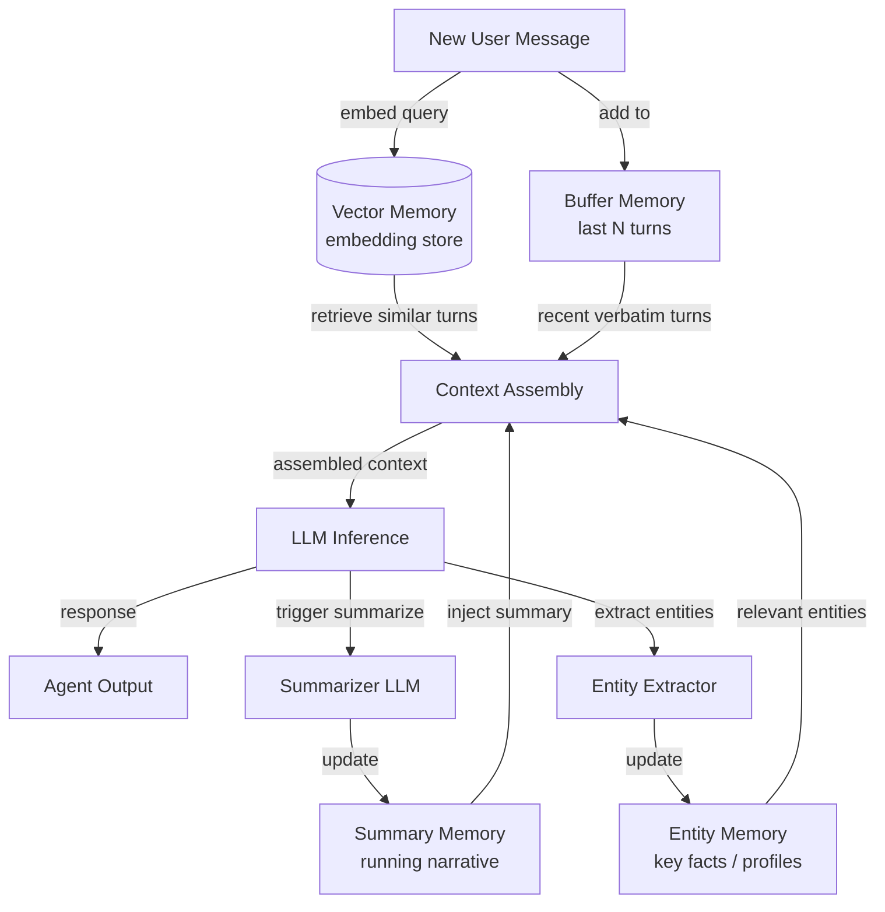

# Konversationsgedächtnis

## Definition

Konversationsgedächtnis bezeichnet die Gesamtheit der Techniken, die es einem Chat-Agenten ermöglichen, Informationen aus früheren Gesprächsrunden zu behalten und zu nutzen. Anders als Retrieval-Augmented Generation, das externe Dokumente einbezieht, befasst sich das Konversationsgedächtnis ausschließlich damit, was zwischen dem Benutzer und dem Agenten bereits gesagt wurde. Dies richtig umzusetzen trennt einen frustrierenden Chatbot, der einen auffordert, sich zu wiederholen, von einem Agenten, der sich wirklich aufmerksam anfühlt.

Es gibt mehrere unterschiedliche Strategien zur Verwaltung des Konversationsverlaufs, jede mit unterschiedlichen Kompromissen zwischen Kosten, Wiedergabetreue und Skalierbarkeit. Der einfachste Ansatz – jede Nachricht wörtlich zu behalten – funktioniert gut für kurze Gespräche, erschöpft aber schnell das Kontextfenster des Modells. Ausgefeiltere Muster verwenden Zusammenfassung oder semantische Indexierung, um den Verlauf zu komprimieren oder selektiv das abzurufen, was für die aktuelle Runde am relevantesten ist.

Die Wahl des richtigen Gedächtnismusters hängt stark von der erwarteten Gesprächslänge, der Bedeutung des genauen Wortlauts gegenüber der semantischen Bedeutung und den Kostenbeschränkungen des Deployments ab. In der Praxis kombinieren Produktions-Chat-Agenten oft zwei oder mehr Muster: einen kurzfristigen wörtlichen Puffer für unmittelbare Kohärenz und eine Zusammenfassungs- oder Vektorschicht für Langzeit-Erinnerung.

## Funktionsweise

### Buffer-Gedächtnis

Buffer-Gedächtnis ist das direkteste Muster: Der Agent hält eine geordnete Liste der letzten N Nachrichtenpaare und stellt sie jedem neuen Kontextfenster voran. Wenn der Puffer die Kapazität erreicht, wird das älteste Paar verworfen (FIFO). Dies garantiert, dass der Agent immer Zugang zu den jüngsten Austauschen hat, ohne Transformation oder verlustbehaftete Komprimierung. Buffer-Gedächtnis ist ideal für kurze bis mittlere Gespräche, bei denen Aktualität das primäre Signal ist, und verursacht keine zusätzlichen LLM-Aufrufe. Sein Hauptnachteil ist, dass älterer Kontext stillschweigend verloren geht, ohne jede Zusammenfassung.

### Summary-Gedächtnis

Summary-Gedächtnis löst das Vergessen-Problem, indem es ein LLM verwendet, um periodisch eine laufende Zusammenfassung des bisherigen Gesprächs zu generieren. Wenn der Puffer zu groß wird, verdichtet der Agent ihn zu einer kompakten Erzählung – er erfasst wichtige Fakten, Entscheidungen und Stimmung – und verwirft dann die rohen Nachrichten. Die Zusammenfassung belegt weit weniger Tokens als die ursprünglichen Gesprächsrunden, was lange Gespräche handhabbar macht. Der Kompromiss ist ein sekundärer LLM-Aufruf für jeden Zusammenfassungsschritt, der Latenz und Kosten erhöht, und einige Informationen gehen beim Komprimieren unvermeidlich verloren.

### Vektor-Gedächtnis

Vektor-Gedächtnis bettet jede Gesprächsrunde ein und speichert sie in einer Vektordatenbank. Bei jeder neuen Runde werden die semantisch relevantesten vergangenen Austausche durch Ähnlichkeitssuche abgerufen und zusammen mit den jüngsten Puffer-Nachrichten in das Kontextfenster eingefügt. Dieses Muster eignet sich hervorragend, wenn Gespräche sehr lang sind oder wenn die aktuelle Frage auf etwas bezogen ist, das viele Runden zuvor gesagt wurde. Vektor-Gedächtnis ist der Ansatz mit der höchsten Wiedergabetreue für Langzeiterinnerung, erfordert aber Embedding-Infrastruktur und führt Abruf-Latenz ein.

### Entity-Gedächtnis

Entity-Gedächtnis extrahiert benannte Entitäten – Personen, Orte, Produkte, Präferenzen – aus dem Gespräch und führt einen strukturierten Datensatz darüber, was der Agent über jede Entität weiß. Wenn eine Entität wieder erwähnt wird, wird ihr gespeichertes Profil in den Kontext eingefügt. Entity-Gedächtnis ist ideal für persönliche Assistenten, bei denen es wertvoller ist, sich zu erinnern, dass "Alice morgendliche Meetings bevorzugt" oder "der Projekttermin der 10. Juni ist", als sich an den genauen Wortlaut vergangener Nachrichten zu erinnern.



## Wann verwenden / Wann NICHT verwenden

| Verwenden wenn | Vermeiden wenn |
|---|---|
| Gespräche mehr als eine Handvoll Runden umfassen | Die Aufgabe Single-Turn ist, ohne Verlaufsbedarf |
| Benutzer erwarten, dass der Agent sich an frühere Aussagen erinnert | Konversationsdaten aus Datenschutz- oder Compliance-Gründen nicht gespeichert werden können |
| Kontextfenster-Kosten erheblich sind und der Verlauf lang ist | Das Gespräch immer kurz genug ist, um vollständig ins Kontextfenster zu passen |
| Benutzer über mehrere Entitäten oder Themen in der Sitzung diskutieren | Zusammenfassungs-Latenz für den Anwendungsfall inakzeptabel ist |
| Sitzungsübergreifende Erinnerung erforderlich ist (Vektor-/Entity-Muster) | Zusätzliche Infrastruktur-Komplexität den Wiedergabetreue-Nutzen überwiegt |

## Vergleiche

| Kriterium | Buffer-Gedächtnis | Summary-Gedächtnis | Vektor-Gedächtnis |
|---|---|---|---|
| Kosten pro Runde | Niedrig (kein zusätzlicher LLM-Aufruf) | Mittel (gelegentlicher Zusammenfasser-Aufruf) | Mittel (Embedding-Aufruf + DB-Abfrage) |
| Wiedergabetreue der Erinnerung | Exakt, aber auf letzte N Runden begrenzt | Verlustbehaftete Komprimierung älterer Runden | Hoch für semantisch relevante Inhalte |
| Behandlung der Kontextlänge | Schlecht – älteste Runden stillschweigend verworfen | Gut – Zusammenfassung komprimiert alte Runden | Ausgezeichnet – ruft nur relevante Chunks ab |
| Latenz | Minimal | Moderat (Zusammenfassung fügt einen Schritt hinzu) | Moderat (Embedding + Nearest-Neighbor-Suche) |
| Sitzungsübergreifende Erinnerung | Nein (In-Memory-Puffer) | Möglich, wenn Zusammenfassung gespeichert wird | Ja (Vektorspeicher ist persistent) |
| Implementierungskomplexität | Sehr niedrig | Niedrig–mittel | Mittel–hoch |

## Code-Beispiele

```python
"""
Conversational memory patterns using LangChain.

Demonstrates:
1. ConversationBufferMemory  — keep verbatim last N messages
2. ConversationSummaryMemory — compress history into a running summary
3. ConversationBufferWindowMemory — sliding window variant
"""
# pip install langchain langchain-openai openai
from langchain.memory import (
    ConversationBufferMemory,
    ConversationSummaryMemory,
    ConversationBufferWindowMemory,
)
from langchain.chains import ConversationChain
from langchain_openai import ChatOpenAI


# ---------------------------------------------------------------------------
# 1. Buffer memory — keeps ALL messages (use for short conversations)
# ---------------------------------------------------------------------------
def demo_buffer_memory():
    llm = ChatOpenAI(model="gpt-4o-mini", temperature=0)
    memory = ConversationBufferMemory(return_messages=True)
    chain = ConversationChain(llm=llm, memory=memory, verbose=False)

    reply1 = chain.predict(input="My name is Alice. I enjoy hiking.")
    reply2 = chain.predict(input="What outdoor activities would you recommend for me?")

    # The second call has access to the first turn verbatim
    print("Buffer memory — reply 2:", reply2)
    print("History length:", len(memory.chat_memory.messages), "messages\n")


# ---------------------------------------------------------------------------
# 2. Summary memory — LLM compresses history on each turn
# ---------------------------------------------------------------------------
def demo_summary_memory():
    llm = ChatOpenAI(model="gpt-4o-mini", temperature=0)
    # The same LLM is used to generate summaries; you can use a cheaper model here
    memory = ConversationSummaryMemory(llm=llm, return_messages=True)
    chain = ConversationChain(llm=llm, memory=memory, verbose=False)

    chain.predict(input="I'm planning a trip to Japan next spring.")
    chain.predict(input="I'm most interested in traditional temples and local food.")
    reply3 = chain.predict(input="Can you suggest a one-week itinerary?")

    print("Summary memory — reply 3:", reply3)
    # The buffer contains only the latest summary, not all past raw messages
    print("Summary:", memory.moving_summary_buffer[:200], "...\n")


# ---------------------------------------------------------------------------
# 3. Window memory — keeps only the last k turns (sliding window)
# ---------------------------------------------------------------------------
def demo_window_memory(k: int = 3):
    llm = ChatOpenAI(model="gpt-4o-mini", temperature=0)
    # k=3 means only the last 3 HumanMessage+AIMessage pairs are retained
    memory = ConversationBufferWindowMemory(k=k, return_messages=True)
    chain = ConversationChain(llm=llm, memory=memory, verbose=False)

    for i in range(6):
        reply = chain.predict(input=f"This is message number {i + 1}.")
        print(f"Turn {i + 1}: {reply[:80]}")

    print(
        f"\nWindow memory keeps {len(memory.chat_memory.messages)} messages "
        f"(max {k * 2} for k={k} turn pairs)\n"
    )


# ---------------------------------------------------------------------------
# Manual entity-style memory (illustrative, no extra dependency)
# ---------------------------------------------------------------------------
def demo_entity_memory_manual():
    """
    Minimal entity memory: parse key facts from each turn and inject them.
    In production, use LangChain's ConversationEntityMemory or a dedicated NER model.
    """
    entity_store: dict[str, str] = {}

    def extract_entities_mock(text: str) -> dict[str, str]:
        """Mock extraction — real impl would call an LLM or NER model."""
        entities = {}
        if "my name is" in text.lower():
            name = text.lower().split("my name is")[-1].strip().split()[0].rstrip(".,")
            entities["user_name"] = name.capitalize()
        if "deadline" in text.lower():
            entities["deadline"] = "mentioned but not parsed in this mock"
        return entities

    turns = [
        ("user", "My name is Bob and my project deadline is end of July."),
        ("user", "Can you help me prioritize my tasks?"),
    ]
    for role, msg in turns:
        entity_store.update(extract_entities_mock(msg))
        entity_context = "; ".join(f"{k}={v}" for k, v in entity_store.items())
        print(f"[{role}] {msg}")
        print(f"  Entity context injected: {entity_context}\n")


if __name__ == "__main__":
    import os

    if os.getenv("OPENAI_API_KEY"):
        demo_buffer_memory()
        demo_summary_memory()
        demo_window_memory()
    else:
        print("Set OPENAI_API_KEY to run LangChain demos.")
    demo_entity_memory_manual()
```

## Praktische Ressourcen

- [LangChain Gedächtnis-Dokumentation](https://python.langchain.com/docs/concepts/memory/) — Umfassende Referenz für alle LangChain-Gedächtnisklassen mit Verwendungsbeispielen.
- [Rethinking Memory in Conversational AI (Lilian Weng)](https://lilianweng.github.io/posts/2023-06-23-agent/#memory) — Ausführlicher Blog-Beitrag zur Gedächtnis-Taxonomie und Design-Kompromissen in Agentensystemen.
- [MemoryOS: Memory-based Operating System for LLM Agents](https://arxiv.org/abs/2506.06326) — Forschung über hierarchisches Gedächtnismanagement, inspiriert vom OS-Design.
- [OpenAI Assistants Thread Management](https://platform.openai.com/docs/assistants/how-it-works/managing-threads) — Wie OpenAIs verwaltete API persistente Konversations-Threads handhabt.

## Siehe auch

- [Agentengedächtnis](/docs/agents/memory)
- [KI-Agenten](/docs/agents)
- [RAG-Embeddings](/docs/rag/embeddings)
