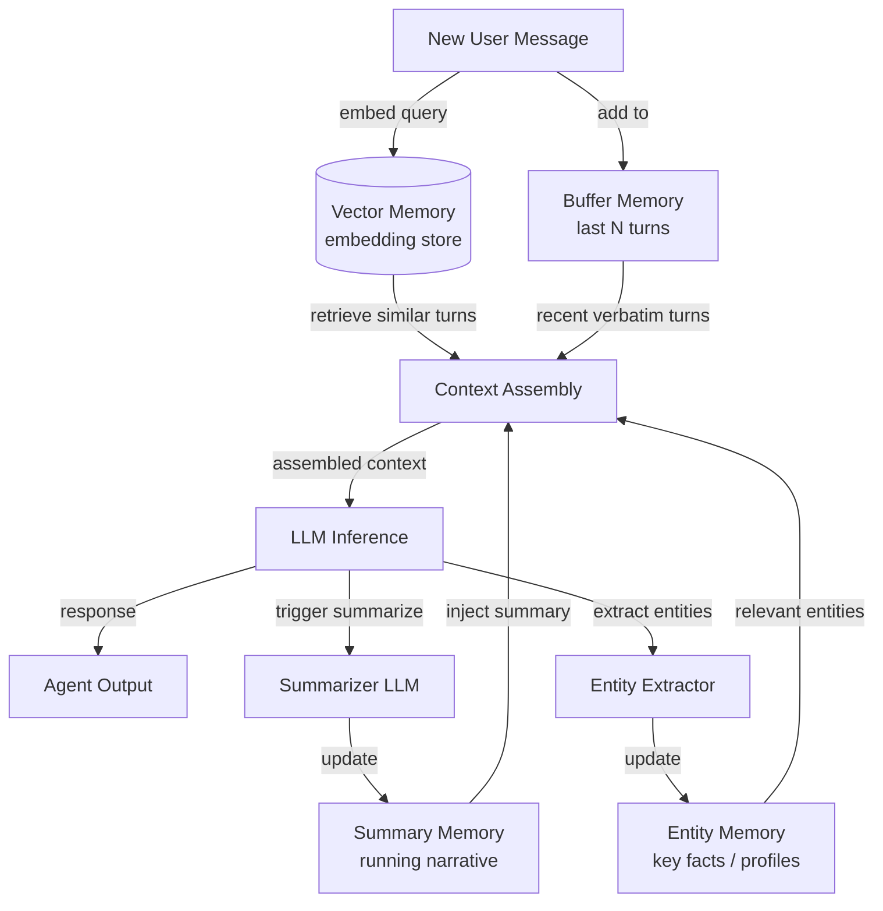

# Konversationsgedächtnis

## Definition

Konversationsgedächtnis bezeichnet die Menge an Techniken, die einem Chat-Agenten ermöglichen, Informationen aus früheren Gesprächsrunden zu behalten und zu nutzen. Im Gegensatz zur Retrieval-Augmented Generation, die externe Dokumente einbezieht, befasst sich das Konversationsgedächtnis ausschließlich damit, was bereits zwischen dem Benutzer und dem Agenten gesagt wurde. Dies richtig umzusetzen trennt einen frustrierenden Chatbot, der Sie bittet, sich zu wiederholen, von einem Agenten, der sich aufmerksam anfühlt.

Es gibt verschiedene Strategien zur Verwaltung des Gesprächsverlaufs, jede mit unterschiedlichen Abwägungen zwischen Kosten, Wiedergabetreue und Skalierbarkeit. Der einfachste Ansatz — jede Nachricht wörtlich beizubehalten — funktioniert bei kurzen Gesprächen gut, erschöpft aber schnell das Kontextfenster des Modells. Ausgefeiltere Muster verwenden Zusammenfassung oder semantische Indizierung, um den relevantesten Verlauf für den aktuellen Gesprächszug zu komprimieren oder selektiv abzurufen.

Die Wahl des richtigen Gedächtnismusters hängt stark von der erwarteten Gesprächslänge, der Bedeutung genauer Formulierungen gegenüber semantischer Bedeutung und den Kostenbeschränkungen der Bereitstellung ab. In der Praxis kombinieren produktive Chat-Agenten häufig zwei oder mehr Muster: einen kurzfristigen wörtlichen Puffer für unmittelbare Kohärenz und eine Zusammenfassungs- oder Vektorschicht für langfristiges Abrufen.

## Funktionsweise

### Puffergedächtnis

Puffergedächtnis ist das unkomplizierteste Muster: Der Agent führt eine geordnete Liste der letzten N Nachrichtenpaare und stellt sie jedem neuen Kontextfenster voran. Wenn der Puffer voll ist, wird das älteste Paar verworfen (FIFO). Dies garantiert, dass der Agent immer Zugang zu den jüngsten Austauschen hat, ohne Transformation oder verlustbehaftete Komprimierung. Puffergedächtnis ist ideal für kurze bis mittlere Gespräche und verursacht keine zusätzlichen LLM-Aufrufe. Der Hauptnachteil ist, dass älterer Kontext still verworfen wird, ohne eine Zusammenfassung.

### Zusammenfassungsgedächtnis

Zusammenfassungsgedächtnis behebt das Vergessen-Problem, indem ein LLM periodisch eine laufende Zusammenfassung des bisherigen Gesprächs generiert. Wenn der Puffer zu groß wird, verdichtet der Agent ihn zu einer kompakten Erzählung — erfasst Schlüsselfakten, Entscheidungen und Stimmung — und verwirft dann die Rohnachrichten. Die Zusammenfassung belegt weit weniger Token als die ursprünglichen Gesprächszüge. Der Kompromiss ist ein sekundärer LLM-Aufruf für jeden Zusammenfassungsschritt, was Latenz und Kosten erhöht.

### Vektorgedächtnis

Vektorgedächtnis bettet jeden Gesprächszug ein und speichert ihn in einer Vektordatenbank. Bei jedem neuen Gesprächszug werden die semantisch relevantesten vergangenen Austausche durch Ähnlichkeitssuche abgerufen und in das Kontextfenster eingefügt. Dieses Muster glänzt, wenn Gespräche sehr lang sind oder wenn die aktuelle Frage etwas betrifft, das viele Gesprächszüge zurückliegt. Vektorgedächtnis erfordert Einbettungsinfrastruktur und führt zu Abruflatenz.

### Entitätsgedächtnis

Entitätsgedächtnis extrahiert benannte Entitäten — Personen, Orte, Produkte, Präferenzen — aus dem Gespräch und pflegt einen strukturierten Datensatz darüber, was der Agent über jede Entität weiß. Wenn eine Entität erneut erwähnt wird, wird ihr gespeichertes Profil in den Kontext eingefügt. Entitätsgedächtnis ist ideal für persönliche Assistenten, bei denen es wertvoller ist, sich zu erinnern, dass "Alice morgendliche Meetings bevorzugt" oder "der Projekttermin der 10. Juni ist".



## Wann verwenden / Wann NICHT verwenden

| Verwenden wenn | Vermeiden wenn |
|---|---|
| Gespräche sich über mehr als ein paar Gesprächszüge erstrecken | Die Aufgabe ein einzelner Gesprächszug ohne Verlaufsbedarf ist |
| Benutzer erwarten, dass der Agent sich an ihre früheren Aussagen erinnert | Gesprächsdaten aus Datenschutz- oder Compliance-Gründen nicht gespeichert werden können |
| Kontextfensterkosten erheblich sind und der Verlauf lang ist | Das Gespräch immer kurz genug ist, um vollständig ins Kontextfenster zu passen |
| Benutzer mehrere Entitäten oder Themen in der Sitzung besprechen | Zusammenfassungslatenz für den Anwendungsfall inakzeptabel ist |
| Sitzungsübergreifendes Abrufen erforderlich ist (Vektor-/Entitätsmuster) | Die zusätzliche Infrastrukturkomplexität den Wiedergabetreue-Nutzen überwiegt |

## Vergleiche

| Kriterium | Puffergedächtnis | Zusammenfassungsgedächtnis | Vektorgedächtnis |
|---|---|---|---|
| Kosten pro Gesprächszug | Niedrig (kein zusätzlicher LLM-Aufruf) | Mittel (gelegentlicher Zusammenfassungsaufruf) | Mittel (Einbettungsaufruf + DB-Abfrage) |
| Wiedergabetreue des Abrufens | Genau aber auf die letzten N Gesprächszüge begrenzt | Verlustbehaftete Komprimierung älterer Gesprächszüge | Hoch für semantisch relevante Inhalte |
| Kontextlängenverarbeitung | Schlecht — älteste Gesprächszüge werden still verworfen | Gut — Zusammenfassung komprimiert alte Gesprächszüge | Ausgezeichnet — ruft nur relevante Teile ab |
| Latenz | Minimal | Mäßig (Zusammenfassung fügt einen Schritt hinzu) | Mäßig (Einbettung + Nächster-Nachbar-Suche) |
| Sitzungsübergreifendes Abrufen | Nein (In-Memory-Puffer) | Möglich wenn Zusammenfassung persistiert wird | Ja (Vektorspeicher ist persistent) |
| Implementierungskomplexität | Sehr niedrig | Niedrig–mittel | Mittel–hoch |

## Code-Beispiele

```python
"""
Conversational memory patterns using LangChain.

Demonstrates:
1. ConversationBufferMemory  — keep verbatim last N messages
2. ConversationSummaryMemory — compress history into a running summary
3. ConversationBufferWindowMemory — sliding window variant
"""
# pip install langchain langchain-openai openai
from langchain.memory import (
    ConversationBufferMemory,
    ConversationSummaryMemory,
    ConversationBufferWindowMemory,
)
from langchain.chains import ConversationChain
from langchain_openai import ChatOpenAI


# ---------------------------------------------------------------------------
# 1. Buffer memory — keeps ALL messages (use for short conversations)
# ---------------------------------------------------------------------------
def demo_buffer_memory():
    llm = ChatOpenAI(model="gpt-4o-mini", temperature=0)
    memory = ConversationBufferMemory(return_messages=True)
    chain = ConversationChain(llm=llm, memory=memory, verbose=False)

    reply1 = chain.predict(input="My name is Alice. I enjoy hiking.")
    reply2 = chain.predict(input="What outdoor activities would you recommend for me?")

    # The second call has access to the first turn verbatim
    print("Buffer memory — reply 2:", reply2)
    print("History length:", len(memory.chat_memory.messages), "messages\n")


# ---------------------------------------------------------------------------
# 2. Summary memory — LLM compresses history on each turn
# ---------------------------------------------------------------------------
def demo_summary_memory():
    llm = ChatOpenAI(model="gpt-4o-mini", temperature=0)
    # The same LLM is used to generate summaries; you can use a cheaper model here
    memory = ConversationSummaryMemory(llm=llm, return_messages=True)
    chain = ConversationChain(llm=llm, memory=memory, verbose=False)

    chain.predict(input="I'm planning a trip to Japan next spring.")
    chain.predict(input="I'm most interested in traditional temples and local food.")
    reply3 = chain.predict(input="Can you suggest a one-week itinerary?")

    print("Summary memory — reply 3:", reply3)
    # The buffer contains only the latest summary, not all past raw messages
    print("Summary:", memory.moving_summary_buffer[:200], "...\n")


# ---------------------------------------------------------------------------
# 3. Window memory — keeps only the last k turns (sliding window)
# ---------------------------------------------------------------------------
def demo_window_memory(k: int = 3):
    llm = ChatOpenAI(model="gpt-4o-mini", temperature=0)
    # k=3 means only the last 3 HumanMessage+AIMessage pairs are retained
    memory = ConversationBufferWindowMemory(k=k, return_messages=True)
    chain = ConversationChain(llm=llm, memory=memory, verbose=False)

    for i in range(6):
        reply = chain.predict(input=f"This is message number {i + 1}.")
        print(f"Turn {i + 1}: {reply[:80]}")

    print(
        f"\nWindow memory keeps {len(memory.chat_memory.messages)} messages "
        f"(max {k * 2} for k={k} turn pairs)\n"
    )


# ---------------------------------------------------------------------------
# Manual entity-style memory (illustrative, no extra dependency)
# ---------------------------------------------------------------------------
def demo_entity_memory_manual():
    """
    Minimal entity memory: parse key facts from each turn and inject them.
    In production, use LangChain's ConversationEntityMemory or a dedicated NER model.
    """
    entity_store: dict[str, str] = {}

    def extract_entities_mock(text: str) -> dict[str, str]:
        """Mock extraction — real impl would call an LLM or NER model."""
        entities = {}
        if "my name is" in text.lower():
            name = text.lower().split("my name is")[-1].strip().split()[0].rstrip(".,")
            entities["user_name"] = name.capitalize()
        if "deadline" in text.lower():
            entities["deadline"] = "mentioned but not parsed in this mock"
        return entities

    turns = [
        ("user", "My name is Bob and my project deadline is end of July."),
        ("user", "Can you help me prioritize my tasks?"),
    ]
    for role, msg in turns:
        entity_store.update(extract_entities_mock(msg))
        entity_context = "; ".join(f"{k}={v}" for k, v in entity_store.items())
        print(f"[{role}] {msg}")
        print(f"  Entity context injected: {entity_context}\n")


if __name__ == "__main__":
    import os

    if os.getenv("OPENAI_API_KEY"):
        demo_buffer_memory()
        demo_summary_memory()
        demo_window_memory()
    else:
        print("Set OPENAI_API_KEY to run LangChain demos.")
    demo_entity_memory_manual()
```

## Praktische Ressourcen

- [LangChain Speicher-Dokumentation](https://python.langchain.com/docs/concepts/memory/) — Umfassende Referenz für alle LangChain-Speicherklassen mit Verwendungsbeispielen.
- [Rethinking Memory in Conversational AI (Lilian Weng)](https://lilianweng.github.io/posts/2023-06-23-agent/#memory) — Ausführlicher Blog-Beitrag über Gedächtnis-Taxonomie und Design-Abwägungen in Agentensystemen.
- [MemoryOS: Memory-based Operating System for LLM Agents](https://arxiv.org/abs/2506.06326) — Forschung zur hierarchischen Speicherverwaltung, inspiriert vom OS-Design.
- [OpenAI Assistants Thread Management](https://platform.openai.com/docs/assistants/how-it-works/managing-threads) — Wie die verwaltete API von OpenAI persistente Gesprächs-Threads behandelt.

## Siehe auch

- [Agentengedächtnis](/docs/agents/memory)
- [KI-Agenten](/docs/agents)
- [RAG-Einbettungen](/docs/rag/embeddings)
