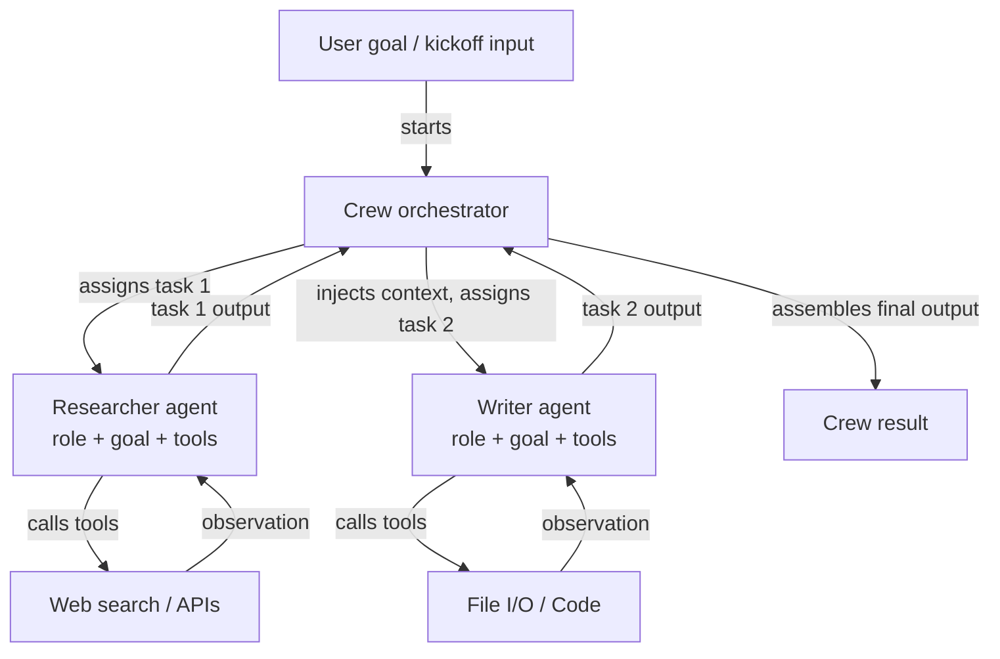

# CrewAI

## Definition

CrewAI ist ein Open-Source-Python-Framework zur Orchestrierung **rollenbasierter Multi-Agenten-Systeme**. Jeder Agent in einer Crew wird durch drei Dinge definiert: eine **Rolle** (was der Agent tut, z. B. "Senior Researcher"), ein **Ziel** (was der Agent zu erreichen versucht, z. B. "Genaue und aktuelle Informationen finden") und eine **Hintergrundgeschichte** (eine Persona-Beschreibung, die das Verhalten und den Ton des Agenten prägt). Diese Struktur macht das Agentenverhalten intuitiv spezifizierbar und leicht verständlich – es spiegelt wider, wie man ein menschliches Teammitglied einarbeiten würde.

Aufgaben in CrewAI sind diskrete Arbeitseinheiten, die Agenten zugewiesen werden. Eine Aufgabe hat eine Beschreibung, eine erwartete Ausgabe und optional Kontext aus früheren Aufgaben. Aufgaben werden in einer **Crew** zusammengefasst, die den Ausführungsprozess definiert: **sequenziell** (Aufgaben werden nacheinander ausgeführt, wobei die Ausgabe jeder Aufgabe in die nächste einfließt) oder **hierarchisch** (ein Manager-Agent delegiert und koordiniert Aufgaben unter Arbeitern). Dieses deklarative Modell abstrahiert die Nachrichtenübermittlungsschleife weg und lässt Entwickler sich darauf konzentrieren, *was* getan werden muss, anstatt *wie* die Agenten miteinander kommunizieren.

CrewAI verfügt über integrierte Tool-Integration und unterstützt LangChain-Tools, benutzerdefinierte Python-Funktionen, die mit `@tool` dekoriert sind, und eine wachsende Bibliothek eingebauter Tools (Websuche, Datei-I/O, Code-Ausführung). Agenten können auch mit Gedächtnis ausgestattet werden (Kurzzeit-, Langzeit-, Entity-Gedächtnis), um Kontext über Aufgabenausführungen und Crew-Läufe hinweg zu erhalten.

## Funktionsweise

### Agenten: Rollen, Ziele und Hintergrundgeschichten

Ein Agent ist die fundamentale Arbeitseinheit in CrewAI. Man instanziiert einen `Agent` mit einer Rolle, einem Ziel und einer Hintergrundgeschichte, plus optionalen Tools und einem LLM-Override. Die Hintergrundgeschichte grundiert den System-Prompt des Agenten und gibt ihm eine konsistente Persona über alle Aufgabeninteraktionen hinweg. Agenten können mit `verbose=True` konfiguriert werden, um ihre internen Denkschritte offenzulegen. Jeder Agent arbeitet unabhängig innerhalb der Orchestrierungsschicht der Crew, empfängt Aufgaben vom Prozessmanager und gibt strukturierte Ausgaben zurück. Das Agentengedächtnis (wenn aktiviert) persistiert Beobachtungen zwischen Aufgaben, was für lang laufende Forschungs- oder Analyse-Workflows entscheidend ist.

### Aufgaben: Beschreibungen, erwartete Ausgaben und Kontext

Ein `Task`-Objekt beschreibt, was ein Agent tun muss, wie eine gute Ausgabe aussieht und welcher Agent sie ausführen soll. Aufgaben können `context`-Abhängigkeiten von anderen Aufgaben deklarieren, wodurch deren Ausgaben automatisch als Kontext eingefügt werden. Erwartete Ausgabebeschreibungen leiten das LLM an, strukturierte, verwendbare Ergebnisse zu produzieren. Aufgaben unterstützen Ausgabeformate: einfacher Text, JSON über Pydantic-Modelle oder Dateiausgaben. Bei Verwendung eines hierarchischen Prozesses nutzt der Manager-Agent Aufgabenbeschreibungen, um Zuweisung und Sequenzierung dynamisch zu entscheiden, ohne dass der Entwickler Abhängigkeiten fest kodieren muss.

### Prozesse: sequenziell und hierarchisch

Das `Crew`-Objekt verbindet Agenten und Aufgaben und gibt einen `Process` an. In `Process.sequential` werden Aufgaben in der Listenreihenfolge ausgeführt, wobei die Ausgabe jeder Aufgabe an die nächste weitergegeben wird. In `Process.hierarchical` wird automatisch ein Manager-LLM instanziiert, um Ziele zu zerlegen, Arbeit zuzuweisen und Ergebnisse zu überprüfen – was emergente Koordination ohne explizite Verkabelung ermöglicht. Sequenziell ist vorhersehbar und leicht zu testen; hierarchisch ist flexibler, aber weniger deterministisch. Die Wahl zwischen beiden hängt davon ab, ob der Workflow einen festen DAG hat (sequenziell) oder dynamische Aufgabenverteilung benötigt (hierarchisch).

### Eingebaute Tool-Integration

CrewAI wird mit einem `@tool`-Dekorator geliefert, der mit LangChain-Tools kompatibel ist, was es einfach macht, Agenten mit Websuche (SerperDev, DuckDuckGo), Code-Ausführung, Dateilesen/-schreiben und benutzerdefinierten API-Aufrufen auszustatten. Tools werden pro Agent registriert, sodass der Forscher-Agent Suchwerkzeuge haben kann, während der Schreiber-Agent Datei-Tools hat. Tool-Beschreibungen werden in den Prompt des Agenten einbezogen, und das Framework übernimmt die Tool-Aufruf-Schleife transparent. Für den Produktionseinsatz bietet das `CrewAI Tools`-Paket eine kuratierte Sammlung vorgefertigter Integrationen.



## Wann verwenden / Wann NICHT verwenden

| Verwenden wenn | Vermeiden wenn |
|---|---|
| Das Problem natürlicherweise auf distinkte menschenähnliche Rollen abbildbar ist (Forscher, Schreiber, Prüfer) | Ein einzelner Agent mit Tools benötigt wird – CrewAIs Overhead ist unnötig |
| Eine deklarative High-Level-API gewünscht wird, die die Nachrichtenübermittlungs-Komplexität verbirgt | Präzise Kontrolle über jede zwischen Agenten ausgetauschte Nachricht benötigt wird |
| Inhalts-Pipelines, Recherche-Workflows oder Analyse-Systeme aufgebaut werden | Der Workflow komplexes bedingtes Branching oder Zyklen erfordert, die von sequenziell/hierarchisch nicht unterstützt werden |
| Eingebautes Gedächtnis und Tool-Integration mit minimaler Konfiguration gewünscht wird | Echtzeit-Latenz kritisch ist – Multi-Agenten-sequenzielle Läufe fügen Overhead hinzu |
| Das Team kein Experte in Agent-Frameworks ist und eine intuitive API benötigt | Feinkörnige Beobachtbarkeit jeder Agenteninteraktion auf Graph-Ebene benötigt wird |

## Vergleiche

| Kriterium | CrewAI | AutoGen | LangGraph |
|---|---|---|---|
| **Abstraktionsebene** | Hoch: deklarative Rollen, Ziele, Aufgaben | Mittel: konversationale Agenten mit nachrichtenbasierter API | Niedrig: explizite Graph-Knoten und -Kanten |
| **Multi-Agenten-Modell** | Rollenbasierte Crew mit sequenziellen oder hierarchischen Prozessen | Konversationsgesteuerte Agentenpaare oder Gruppen-Chats | Subgraphen; einzelner zustandsbehafteter Graph mit mehreren Knoten pro Agent |
| **Zustandsverwaltung** | Implizit: über Aufgabenkontext und Crew-Gedächtnis weitergegeben | Implizit: Nachrichtenhistorie | Explizit: TypedDict-Zustand geteilt über alle Knoten |
| **Einfachheit der Einrichtung** | Sehr einfach: 10–20 Zeilen für eine funktionierende Multi-Agenten-Crew | Moderat: erfordert Verständnis von Agententypen und Initiierungsmustern | Schwieriger: erfordert Graph-Konstruktions-Denkmodell |
| **Bedingte/zyklische Flows** | Begrenzt: sequenziell ist linear, hierarchisch ist undurchsichtig | Begrenzt: hängt von Agentenantworten ab | Erstklassig: bedingte Kanten und Zyklen sind das Kernmerkmal |

## Code-Beispiele

```python
import os
from crewai import Agent, Task, Crew, Process
from crewai_tools import SerperDevTool

# --- Tool setup ---
# Requires SERPER_API_KEY environment variable for web search
search_tool = SerperDevTool()

# --- Agent definitions ---
# Each agent has a role, a goal that guides its behavior, and a backstory
# that sets its persona. Tools are assigned per-agent.

researcher = Agent(
    role="Senior AI Research Analyst",
    goal="Uncover the latest developments and practical applications of AI agent frameworks",
    backstory=(
        "You are an expert AI researcher with 10 years of experience evaluating "
        "LLM frameworks. You excel at finding accurate, up-to-date information "
        "and synthesizing it into clear technical summaries."
    ),
    tools=[search_tool],
    verbose=True,  # shows reasoning steps
    allow_delegation=False,
)

writer = Agent(
    role="Technical Content Writer",
    goal="Transform technical research into clear, engaging documentation",
    backstory=(
        "You are a seasoned technical writer who specializes in AI and machine learning. "
        "You turn dense research into accessible content without losing precision."
    ),
    tools=[],  # writer does not need search tools
    verbose=True,
)

reviewer = Agent(
    role="Editorial Reviewer",
    goal="Ensure accuracy, clarity, and completeness of technical content",
    backstory=(
        "You are a detail-oriented editor with a background in computer science. "
        "You catch technical inaccuracies, improve clarity, and verify all claims."
    ),
    verbose=True,
)

# --- Task definitions ---
# Tasks describe what to do, what output to expect, and which agent executes them.
# Context dependencies are declared explicitly.

research_task = Task(
    description=(
        "Research the current state of AI agent frameworks in 2024-2025. "
        "Focus on CrewAI, AutoGen, LangGraph, and Anthropic Tool Use. "
        "Cover: architecture, use cases, community size, and key differentiators."
    ),
    expected_output=(
        "A structured research report with sections for each framework, "
        "covering architecture, strengths, weaknesses, and best use cases. "
        "Include specific version numbers and recent updates where available."
    ),
    agent=researcher,
)

writing_task = Task(
    description=(
        "Using the research report, write a 500-word technical blog post comparing "
        "the four agent frameworks. Target audience: senior software engineers "
        "who are evaluating frameworks for production use."
    ),
    expected_output=(
        "A well-structured blog post with an introduction, per-framework sections, "
        "a comparison table, and a recommendation section. "
        "Use clear headings and avoid jargon where possible."
    ),
    agent=writer,
    context=[research_task],  # injects research_task output as context
)

review_task = Task(
    description=(
        "Review the blog post for technical accuracy, clarity, and completeness. "
        "Fix any errors and improve readability without changing the core content."
    ),
    expected_output=(
        "A polished, publication-ready blog post with all inaccuracies corrected "
        "and prose improved. Return the full revised text."
    ),
    agent=reviewer,
    context=[writing_task],
)

# --- Crew assembly ---
# Process.sequential runs tasks in order, passing outputs as context.
# Switch to Process.hierarchical for dynamic task allocation by a manager LLM.

crew = Crew(
    agents=[researcher, writer, reviewer],
    tasks=[research_task, writing_task, review_task],
    process=Process.sequential,
    verbose=True,
)

# --- Execution ---
result = crew.kickoff(inputs={"topic": "AI agent frameworks comparison 2025"})
print(result.raw)
```

## Praktische Ressourcen

- [CrewAI offizielle Dokumentation](https://docs.crewai.com/) — Vollständige Referenz für Agenten, Aufgaben, Crews, Prozesse, Tools und Gedächtniskonfiguration.
- [CrewAI GitHub-Repository](https://github.com/crewAIInc/crewAI) — Quellcode, Beispiele und Issue-Tracker für das Open-Source-Framework.
- [CrewAI Tools Dokumentation](https://docs.crewai.com/concepts/tools) — Vorgefertigte Tool-Integrationen: Websuche, Datei-I/O, Code-Ausführung und benutzerdefinierte Tool-Erstellung.
- [CrewAI + LangChain Integrations-Leitfaden](https://docs.crewai.com/how-to/llm-connections) — Wie verschiedene LLM-Anbieter einschließlich OpenAI, Anthropic und lokaler Modelle konfiguriert werden.

## Siehe auch

- [Überblick über Agent-Frameworks](/docs/agents/frameworks-overview)
- [AutoGen](/docs/agents/autogen)
- [LangGraph](/docs/agents/langgraph)
- [Multi-Agenten-Systeme](/docs/agents/multi-agent-systems)
- [KI-Agenten](/docs/agents)
