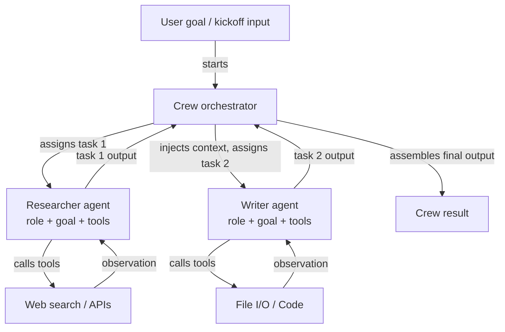

# CrewAI

## Definition

CrewAI ist ein Open-Source-Python-Framework zur Orchestrierung **rollenbasierter Multi-Agenten-Systeme**. Jeder Agent in einer Crew wird durch drei Dinge definiert: eine **Rolle** (was der Agent tut, z.B. "Senior Researcher"), ein **Ziel** (was der Agent erreichen möchte, z.B. "Genaue und aktuelle Informationen finden") und eine **Hintergrundgeschichte** (eine Persona-Beschreibung, die das Verhalten und den Ton des Agenten prägt). Diese Struktur macht das Agentenverhalten intuitiv zu spezifizieren und leicht zu verstehen — sie spiegelt wider, wie Sie ein menschliches Teammitglied einarbeiten würden.

Aufgaben in CrewAI sind diskrete Arbeitseinheiten, die Agenten zugewiesen werden. Eine Aufgabe hat eine Beschreibung, eine erwartete Ausgabe und optional Kontext aus vorherigen Aufgaben. Aufgaben werden in einer **Crew** gruppiert, die den Ausführungsprozess definiert: **sequentiell** (Aufgaben laufen nacheinander, wobei die Ausgabe jeder Aufgabe in die nächste einfließt) oder **hierarchisch** (ein Manager-Agent delegiert und koordiniert Aufgaben unter Arbeitern). Dieses deklarative Modell abstrahiert die Nachrichtenweiterleitungsschleife, sodass sich Entwickler darauf konzentrieren können, *was* getan werden muss, anstatt *wie* die Agenten miteinander kommunizieren.

CrewAI verfügt über integrierte Werkzeugintegration und unterstützt LangChain-Werkzeuge, benutzerdefinierte Python-Funktionen, die mit `@tool` dekoriert sind, und eine wachsende Bibliothek von eingebauten Werkzeugen (Websuche, Datei-E/A, Code-Ausführung). Agenten können auch mit Gedächtnis ausgestattet werden (Kurzzeitgedächtnis, Langzeitgedächtnis, Entitätsgedächtnis), um Kontext über Aufgabenausführungen und Crew-Läufe hinweg zu pflegen.

## Funktionsweise

### Agenten: Rollen, Ziele und Hintergrundgeschichten

Ein Agent ist die grundlegende Arbeitseinheit in CrewAI. Sie instantiieren einen `Agent` mit einer Rolle, einem Ziel und einer Hintergrundgeschichte sowie optionalen Werkzeugen und einem LLM-Override. Die Hintergrundgeschichte prägt die Systemaufforderung des Agenten und verleiht ihm eine konsistente Persona in allen Aufgabeninteraktionen. Agenten können mit `verbose=True` konfiguriert werden, um ihre internen Denkschritte zu zeigen. Jeder Agent arbeitet unabhängig innerhalb der Orchestrierungsschicht der Crew und empfängt Aufgaben vom Prozessmanager und liefert strukturierte Ausgaben zurück.

### Aufgaben: Beschreibungen, erwartete Ausgaben und Kontext

Ein `Task`-Objekt beschreibt, was ein Agent tun muss, wie eine gute Ausgabe aussieht und welcher Agent sie ausführen soll. Aufgaben können `context`-Abhängigkeiten von anderen Aufgaben deklarieren, wodurch deren Ausgaben automatisch als Kontext eingefügt werden. Beschreibungen der erwarteten Ausgabe leiten das LLM zu strukturierten, verwendbaren Ergebnissen. Aufgaben unterstützen Ausgabeformate: einfachen Text, JSON über Pydantic-Modelle oder Dateiausgaben. Bei einem hierarchischen Prozess entscheidet der Manager-Agent anhand von Aufgabenbeschreibungen über Zuweisung und Sequenzierung dynamisch.

### Prozesse: sequentiell und hierarchisch

Das `Crew`-Objekt verbindet Agenten und Aufgaben und gibt einen `Process` an. In `Process.sequential` werden Aufgaben in Listenreihenfolge ausgeführt, wobei jede Aufgabenausgabe an die nächste weitergegeben wird. In `Process.hierarchical` wird automatisch ein Manager-LLM instantiiert, um Ziele zu zerlegen, Arbeit zuzuweisen und Ergebnisse zu überprüfen — was emergente Koordination ohne explizite Verdrahtung ermöglicht. Sequentiell ist vorhersehbar und einfach zu testen; hierarchisch ist flexibler, aber weniger deterministisch.

### Integrierte Werkzeugintegration

CrewAI enthält einen `@tool`-Dekorator, der mit LangChain-Werkzeugen kompatibel ist, was es einfach macht, Agenten mit Websuche (SerperDev, DuckDuckGo), Code-Ausführung, Dateilesen/-schreiben und benutzerdefinierten API-Aufrufen auszustatten. Werkzeuge sind pro Agent registriert, sodass der Forscher-Agent Suchwerkzeuge haben kann, während der Schreiber-Agent Datei-Werkzeuge hat.



## Wann verwenden / Wann NICHT verwenden

| Verwenden wenn | Vermeiden wenn |
|---|---|
| Ihr Problem auf natürliche Weise auf menschenähnliche Rollen abbildet (Forscher, Autor, Prüfer) | Sie einen einzelnen Agenten mit Werkzeugen benötigen — der Overhead von CrewAI ist unnötig |
| Sie eine deklarative, hochstufige API möchten, die die Komplexität des Nachrichtenaustausches verbirgt | Sie präzise Kontrolle über jede ausgetauschte Nachricht zwischen Agenten benötigen |
| Sie Inhaltspipelines, Forschungsworkflows oder Analysesysteme erstellen | Ihr Workflow komplexe bedingte Verzweigungen oder Zyklen erfordert, die von sequentiell/hierarchisch nicht unterstützt werden |
| Sie eingebautes Gedächtnis und Werkzeugintegration mit minimaler Konfiguration wünschen | Echtzeit-Latenz kritisch ist — multi-agenten sequentielle Läufe fügen Overhead hinzu |
| Ihr Team kein Experte in Agent-Frameworks ist und eine intuitive API benötigt | Sie detaillierte Beobachtbarkeit jeder Agenteninteraktion auf Graphebene benötigen |

## Vergleiche

| Kriterium | CrewAI | AutoGen | LangGraph |
|---|---|---|---|
| **Abstraktionsebene** | Hoch: deklarative Rollen, Ziele, Aufgaben | Mittel: Konversationsagenten mit nachrichtenbasierter API | Niedrig: explizite Graphknoten und -kanten |
| **Multi-Agenten-Modell** | Rollenbasierte Crew mit sequentiellen oder hierarchischen Prozessen | Konversationsgesteuerte Agentenpaare oder Gruppenchats | Teilgraphen; einzelner zustandsbehafteter Graph mit mehreren Knoten pro Agent |
| **Zustandsverwaltung** | Implizit: über Aufgabenkontext und Crew-Gedächtnis weitergegeben | Implizit: Nachrichtenhistorie | Explizit: TypedDict-Zustand über alle Knoten geteilt |
| **Einrichtungsleichtigkeit** | Sehr einfach: 10–20 Zeilen für eine funktionierende Multi-Agenten-Crew | Mäßig: erfordert das Verstehen von Agententypen und Initiationsmustern | Schwieriger: erfordert Graphkonstruktions-Denkmodell |
| **Bedingte/zyklische Flüsse** | Begrenzt: sequentiell ist linear, hierarchisch ist undurchsichtig | Begrenzt: hängt von Agentenantworten ab | Erstklassig: bedingte Kanten und Zyklen sind das Kernfeature |

## Code-Beispiele

```python
import os
from crewai import Agent, Task, Crew, Process
from crewai_tools import SerperDevTool

# --- Tool setup ---
# Requires SERPER_API_KEY environment variable for web search
search_tool = SerperDevTool()

# --- Agent definitions ---
# Each agent has a role, a goal that guides its behavior, and a backstory
# that sets its persona. Tools are assigned per-agent.

researcher = Agent(
    role="Senior AI Research Analyst",
    goal="Uncover the latest developments and practical applications of AI agent frameworks",
    backstory=(
        "You are an expert AI researcher with 10 years of experience evaluating "
        "LLM frameworks. You excel at finding accurate, up-to-date information "
        "and synthesizing it into clear technical summaries."
    ),
    tools=[search_tool],
    verbose=True,  # shows reasoning steps
    allow_delegation=False,
)

writer = Agent(
    role="Technical Content Writer",
    goal="Transform technical research into clear, engaging documentation",
    backstory=(
        "You are a seasoned technical writer who specializes in AI and machine learning. "
        "You turn dense research into accessible content without losing precision."
    ),
    tools=[],  # writer does not need search tools
    verbose=True,
)

reviewer = Agent(
    role="Editorial Reviewer",
    goal="Ensure accuracy, clarity, and completeness of technical content",
    backstory=(
        "You are a detail-oriented editor with a background in computer science. "
        "You catch technical inaccuracies, improve clarity, and verify all claims."
    ),
    verbose=True,
)

# --- Task definitions ---
# Tasks describe what to do, what output to expect, and which agent executes them.
# Context dependencies are declared explicitly.

research_task = Task(
    description=(
        "Research the current state of AI agent frameworks in 2024-2025. "
        "Focus on CrewAI, AutoGen, LangGraph, and Anthropic Tool Use. "
        "Cover: architecture, use cases, community size, and key differentiators."
    ),
    expected_output=(
        "A structured research report with sections for each framework, "
        "covering architecture, strengths, weaknesses, and best use cases. "
        "Include specific version numbers and recent updates where available."
    ),
    agent=researcher,
)

writing_task = Task(
    description=(
        "Using the research report, write a 500-word technical blog post comparing "
        "the four agent frameworks. Target audience: senior software engineers "
        "who are evaluating frameworks for production use."
    ),
    expected_output=(
        "A well-structured blog post with an introduction, per-framework sections, "
        "a comparison table, and a recommendation section. "
        "Use clear headings and avoid jargon where possible."
    ),
    agent=writer,
    context=[research_task],  # injects research_task output as context
)

review_task = Task(
    description=(
        "Review the blog post for technical accuracy, clarity, and completeness. "
        "Fix any errors and improve readability without changing the core content."
    ),
    expected_output=(
        "A polished, publication-ready blog post with all inaccuracies corrected "
        "and prose improved. Return the full revised text."
    ),
    agent=reviewer,
    context=[writing_task],
)

# --- Crew assembly ---
# Process.sequential runs tasks in order, passing outputs as context.
# Switch to Process.hierarchical for dynamic task allocation by a manager LLM.

crew = Crew(
    agents=[researcher, writer, reviewer],
    tasks=[research_task, writing_task, review_task],
    process=Process.sequential,
    verbose=True,
)

# --- Execution ---
result = crew.kickoff(inputs={"topic": "AI agent frameworks comparison 2025"})
print(result.raw)
```

## Praktische Ressourcen

- [CrewAI offizielle Dokumentation](https://docs.crewai.com/) — Vollständige Referenz zu Agenten, Aufgaben, Crews, Prozessen, Werkzeugen und Gedächtniskonfiguration.
- [CrewAI GitHub-Repository](https://github.com/crewAIInc/crewAI) — Quellcode, Beispiele und Issue-Tracker für das Open-Source-Framework.
- [CrewAI Tools Dokumentation](https://docs.crewai.com/concepts/tools) — Vorgefertigte Werkzeugintegrationen: Websuche, Datei-E/A, Code-Ausführung und benutzerdefinierte Werkzeugerstellung.
- [CrewAI + LangChain Integrationsleitfaden](https://docs.crewai.com/how-to/llm-connections) — Wie verschiedene LLM-Anbieter einschließlich OpenAI, Anthropic und lokaler Modelle konfiguriert werden.

## Siehe auch

- [Agent-Frameworks-Übersicht](/docs/agents/frameworks-overview)
- [AutoGen](/docs/agents/autogen)
- [LangGraph](/docs/agents/langgraph)
- [Multi-Agenten-Systeme](/docs/agents/multi-agent-systems)
- [KI-Agenten](/docs/agents)
