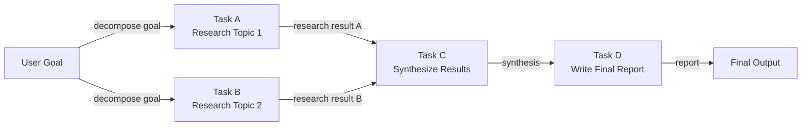

# DAG-basierte Agenten

## Definition

Ein DAG-basierter Agent organisiert seine Arbeit als **gerichteter azyklischer Graph (DAG)**: eine Menge von Knoten (Aufgaben oder Agentenschritte), die durch gerichtete Kanten verbunden sind, die Abhängigkeiten zwischen ihnen kodieren. "Azyklisch" bedeutet, dass es keine zirkulären Abhängigkeiten gibt – die Ausführung fließt strikt von Eingaben zu Ausgaben. Der wesentliche Vorteil gegenüber sequenziellen Pipelines besteht darin, dass **unabhängige Knoten parallel ausgeführt werden können**, was die Wanduhr-Zeit für komplexe mehrstufige Workflows erheblich reduziert.

In der Praxis kann jeder Knoten im DAG ein LLM-Aufruf, ein Tool-Aufruf, eine Datentransformation oder sogar ein Sub-Agent sein. Ein Knoten feuert, sobald alle seine Vorgänger erfolgreich abgeschlossen haben, und gibt ihre Ausgaben als Eingaben weiter. Dieses Modell eignet sich natürlich für Aufgaben wie Wettbewerbsanalyse (drei Unternehmen parallel recherchieren, dann synthetisieren), Code-Review (Sicherheit, Stil und Tests gleichzeitig prüfen, dann berichten) oder Datenpipelines (mehrere Datenquellen parallel abrufen, zusammenführen, dann aggregieren).

Dynamische DAG-Konstruktion geht noch weiter: Anstatt eines festen Graphs, der zur Entwurfszeit definiert wird, baut oder modifiziert der Agent den Graph zur Laufzeit basierend auf Zwischenergebnissen. Ein Planungs-Agent könnte eine Aufgabenliste erzeugen, deren Abhängigkeiten erst bekannt werden, wenn er die Daten sieht, und dann den entsprechenden DAG on-the-fly konstruieren und ausführen. Dies kombiniert den strukturierten Parallelismus von DAGs mit der Anpassungsfähigkeit von Planungs-Agenten, auf Kosten zusätzlicher Implementierungskomplexität.

## Funktionsweise

### Graph-Definition und Knotentypen

Ein DAG wird durch eine Menge von Knoten und eine Menge gerichteter Kanten definiert. Jeder Knoten trägt eine Funktion (die zu erledigende Arbeit), eine Eingabespezifikation (welche Ausgaben vorgelagerter Knoten zu akzeptieren sind) und eine Ausgabespezifikation (was er produziert). Kanten werden als `(upstream_node, downstream_node)`-Paare definiert. Knoten ohne eingehende Kanten sind Einstiegspunkte; Knoten ohne ausgehende Kanten sind Ausgangspunkte. Knotenfunktionen können synchron oder asynchron sein – asynchrone Knoten sind wesentlich für echten Parallelismus in I/O-gebundenen Workflows.

### Topologische Sortierung und Scheduling

Vor der Ausführung berechnet der Scheduler eine **topologische Ordnung** des Graphs: eine lineare Sequenz von Knoten, so dass jeder Knoten nach allen seinen Vorgängern erscheint. Wenn mehrere Knoten auf der gleichen Tiefe sind (keine Abhängigkeit voneinander), können sie gleichzeitig ausgeführt werden. Der Standardalgorithmus ist der Kahn-Algorithmus, der Knoten schichtweise verarbeitet. Zur Laufzeit hält eine Warteschlange Knoten, deren Abhängigkeiten alle erfüllt sind; Worker ziehen aus der Warteschlange und führen Knoten aus, dann stellen sie neu entsperrte nachgelagerte Knoten in die Warteschlange.

### Parallele Ausführung

Unabhängige Knoten – solche ohne gemeinsame Abhängigkeiten – werden parallel mit Threads, asynchronen Coroutinen oder einem Process-Pool ausgeführt. Der Grad der Parallelität wird durch die Struktur des DAG begrenzt: Eine vollständig sequenzielle Kette bietet keine Parallelität, während ein breites Fan-out gefolgt von einer Fan-in-Aggregation Dutzende von Aufgaben gleichzeitig ausführen kann. In Agenten-Workflows ist dies besonders wertvoll für Aufgaben wie Massen-Websuchen, Multi-Source-Datenabrufe oder unabhängige Sub-Agenten-Aufrufe.

### Dynamische DAG-Konstruktion

Im dynamischen Modus läuft zuerst ein Planungsschritt und gibt eine Graph-Spezifikation aus (z. B. eine JSON-Liste von Knoten und Kanten). Der Scheduler instanziiert den DAG, validiert ihn auf Zyklen und beginnt die Ausführung. Dynamische DAGs müssen eine Zykluserkennung – typischerweise über DFS – beinhalten, bevor das Scheduling beginnt. Dieses Muster ist fragiler als statische DAGs, weil ein fehlerhafter Plan einen ungültigen Graph erzeugen kann, aber es ermöglicht viel reichere Anpassungsfähigkeit.



## Wann verwenden / Wann NICHT verwenden

| Verwenden wenn | Vermeiden wenn |
|---|---|
| Der Workflow mehrere unabhängige Teilaufgaben hat, die parallel laufen können | Alle Aufgaben strikt sequenziell sind ohne Parallelismuspotenzial |
| Ausführungszeit Priorität hat und Aufgaben I/O-gebunden sind | Das Abhängigkeitsgraph einfach genug ist, dass eine lineare Pipeline ausreicht |
| Aufgabenabhängigkeiten klar definiert und von vornherein spezifizierbar sind | Dynamisches Replanning wichtiger ist als parallele Ausführung |
| Feinkörnige Beobachtbarkeit darüber benötigt wird, welche Aufgaben bestanden oder fehlgeschlagen sind | Das Team mit Graph-Scheduling-Konzepten nicht vertraut ist |
| Der Workflow einer Datenpipeline mit Fan-out- und Fan-in-Phasen ähnelt | Aufgaben so schnell sind, dass der Scheduling-Overhead den Parallelismus-Nutzen überwiegt |

## Vergleiche

| Kriterium | DAG-basierte Agenten | Sequenzielle Pipeline | Planner-Executor |
|---|---|---|---|
| Parallelismus | Nativ — unabhängige Branches laufen gleichzeitig | Keiner | Standardmäßig keiner |
| Flexibilität / dynamische Anpassung | Niedrig-mittel (fester Graph) | Niedrig | Hoch (Replanning-Schleife) |
| Implementierungskomplexität | Hoch (Scheduler, Zykluserkennung, async) | Sehr niedrig | Mittel |
| Überprüfbarkeit | Hoch — Graph-Struktur ist explizit | Mittel | Hoch — Plan-Artefakt ist explizit |
| Fehlerbehandlung | Pro-Knoten-Wiederholung, partielle Neuläufe möglich | Neustart vom Anfang | Replanning bei Fehler |
| Beste Verwendung für | Breite, parallelisierbare Workflows | Einfache sequenzielle Aufgaben | Mehrstufige adaptive Aufgaben |

## Code-Beispiele

```python
"""
Simple DAG execution engine with topological sort.

Nodes are Python callables. Edges encode dependencies.
Independent nodes execute concurrently using asyncio.
"""
from __future__ import annotations

import asyncio
from collections import defaultdict, deque
from dataclasses import dataclass, field
from typing import Any, Callable, Coroutine


# ---------------------------------------------------------------------------
# DAG data structures
# ---------------------------------------------------------------------------

@dataclass
class Node:
    """A single unit of work in the DAG."""
    name: str
    # func receives a dict of {upstream_node_name: result} for all predecessors
    func: Callable[..., Coroutine[Any, Any, Any]]
    depends_on: list[str] = field(default_factory=list)


class DAGExecutionError(Exception):
    pass


# ---------------------------------------------------------------------------
# DAG engine
# ---------------------------------------------------------------------------

class DAGExecutor:
    """
    Executes a DAG of async nodes respecting dependencies.
    Independent nodes are dispatched concurrently.
    """

    def __init__(self):
        self._nodes: dict[str, Node] = {}

    def add_node(self, node: Node) -> "DAGExecutor":
        self._nodes[node.name] = node
        return self

    def _validate(self) -> list[str]:
        """
        Kahn's topological sort algorithm.
        Returns an ordered list of node names, or raises on cycle detection.
        """
        in_degree: dict[str, int] = {n: 0 for n in self._nodes}
        dependents: dict[str, list[str]] = defaultdict(list)

        for node in self._nodes.values():
            for dep in node.depends_on:
                if dep not in self._nodes:
                    raise DAGExecutionError(f"Dependency '{dep}' not found in DAG.")
                in_degree[node.name] += 1
                dependents[dep].append(node.name)

        queue = deque(n for n, deg in in_degree.items() if deg == 0)
        order: list[str] = []

        while queue:
            current = queue.popleft()
            order.append(current)
            for downstream in dependents[current]:
                in_degree[downstream] -= 1
                if in_degree[downstream] == 0:
                    queue.append(downstream)

        if len(order) != len(self._nodes):
            raise DAGExecutionError("Cycle detected in DAG — cannot execute.")

        return order

    async def run(self) -> dict[str, Any]:
        """Execute the DAG and return a mapping of node_name -> result."""
        self._validate()

        results: dict[str, Any] = {}
        completed: set[str] = set()
        pending: dict[str, asyncio.Task] = {}
        in_degree: dict[str, int] = {n: len(self._nodes[n].depends_on) for n in self._nodes}

        async def execute_node(node: Node) -> Any:
            upstream = {dep: results[dep] for dep in node.depends_on}
            return await node.func(upstream)

        # Start nodes with no dependencies immediately
        ready = [n for n, deg in in_degree.items() if deg == 0]
        for name in ready:
            pending[name] = asyncio.create_task(execute_node(self._nodes[name]))

        # Build reverse adjacency for unblocking
        dependents: dict[str, list[str]] = defaultdict(list)
        for node in self._nodes.values():
            for dep in node.depends_on:
                dependents[dep].append(node.name)

        while pending:
            # Wait for any one task to finish
            done_tasks, _ = await asyncio.wait(
                pending.values(), return_when=asyncio.FIRST_COMPLETED
            )
            for task in done_tasks:
                # Find the node name for this task
                finished_name = next(n for n, t in pending.items() if t is task)
                results[finished_name] = task.result()
                completed.add(finished_name)
                del pending[finished_name]

                # Unblock downstream nodes
                for downstream in dependents[finished_name]:
                    in_degree[downstream] -= 1
                    if in_degree[downstream] == 0 and downstream not in completed:
                        pending[downstream] = asyncio.create_task(
                            execute_node(self._nodes[downstream])
                        )

        return results


# ---------------------------------------------------------------------------
# Example: Research DAG (mirrors the Mermaid diagram above)
# ---------------------------------------------------------------------------

async def research_topic_1(upstream: dict) -> str:
    await asyncio.sleep(0.1)  # Simulate async I/O (e.g., web search)
    return "Research result for Topic 1: renewable energy trends in Europe."

async def research_topic_2(upstream: dict) -> str:
    await asyncio.sleep(0.1)  # Runs in parallel with research_topic_1
    return "Research result for Topic 2: renewable energy adoption in Asia."

async def synthesize(upstream: dict) -> str:
    result_a = upstream["task_a"]
    result_b = upstream["task_b"]
    return f"Synthesis of:\n  A: {result_a}\n  B: {result_b}"

async def write_report(upstream: dict) -> str:
    synthesis = upstream["task_c"]
    return f"Final report based on synthesis:\n{synthesis}"


async def main():
    dag = DAGExecutor()
    dag.add_node(Node("task_a", research_topic_1, depends_on=[]))
    dag.add_node(Node("task_b", research_topic_2, depends_on=[]))
    dag.add_node(Node("task_c", synthesize, depends_on=["task_a", "task_b"]))
    dag.add_node(Node("task_d", write_report, depends_on=["task_c"]))

    import time
    start = time.perf_counter()
    results = await dag.run()
    elapsed = time.perf_counter() - start

    print(f"DAG completed in {elapsed:.3f}s (task_a and task_b ran in parallel)\n")
    for name, result in results.items():
        print(f"[{name}]\n{result}\n")


if __name__ == "__main__":
    asyncio.run(main())
```

## Praktische Ressourcen

- [LangGraph Dokumentation](https://langchain-ai.github.io/langgraph/) — Produktionsreifes Graph-Ausführungs-Framework für LLM-Agenten, mit erstklassiger Unterstützung für Branching, parallele Ausführung und Zyklen.
- [LLM Compiler: Parallel Function Calling (Kim et al., 2023)](https://arxiv.org/abs/2312.04511) — Paper zur Einführung DAG-basierter paralleler Tool-Aufrufe für LLM-Agenten mit erheblichen Latenzverbesserungen.
- [Apache Airflow DAG-Konzepte](https://airflow.apache.org/docs/apache-airflow/stable/core-concepts/dags.html) — Bewährtes DAG-Orchestrierungsmodell aus dem Data-Engineering-Bereich; viele Agenten-DAG-Engines lehnen sich an diese Konzepte an.
- [Prefect — Workflow-Orchestrierung](https://docs.prefect.io/latest/concepts/flows/) — Moderne Workflow-Orchestrierung mit eingebauter paralleler Aufgabenausführung, anwendbar auf Agenten-Workflows.

## Siehe auch

- [Planner-Executor-Architektur](/docs/agents/planner-executor)
- [KI-Agenten](/docs/agents)
- [Airflow](/docs/mlops/data-engineering/airflow)
