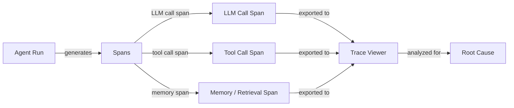

# Agenten-Debugging und Beobachtbarkeit

## Definition

Agenten-Debugging und Beobachtbarkeit ist die Disziplin, KI-Agentensysteme so transparent zu machen, dass Fehler, Regressionen und Ineffizienzen identifiziert, diagnostiziert und behoben werden können. Anders als herkömmliches Software-Debugging – bei dem ein Stack-Trace auf eine exakte Zeile zeigt – sind Agentenfehler oft emergent: Ein korrekter LLM-Aufruf produziert plausible, aber falsche Ausgabe, die sich durch nachfolgende Tool-Aufrufe fortpflanzt, den Agentenzustand korrumpiert und eine falsche Endantwort liefert, ohne dass eine Exception ausgelöst wird. Beobachtbarkeit liefert die Daten, die benötigt werden, um nachzuvollziehen, was passiert ist.

Die drei Säulen der Beobachtbarkeit – Logs, Metriken und Traces – gelten für Agenten wie für verteilte Systeme, aber mit wichtigen Anpassungen. Logs müssen nicht nur Fehler, sondern auch den semantischen Inhalt von LLM-Ein- und -Ausgaben erfassen. Metriken müssen Token-Counts, Latenz pro Span und Tool-Aufruf-Häufigkeiten neben den üblichen Systemmetriken beinhalten. Traces müssen die hierarchische Struktur eines Agenten-Laufs modellieren: ein Root-Span für die Gesamtaufgabe, Child-Spans für jeden LLM-Aufruf, Grandchild-Spans für jede Tool-Invokation und so weiter. Zusammen geben diese einen vollständigen, wiederabspielbarern Datensatz jeder Agentenausführung.

Ohne gute Beobachtbarkeit wird Debugging zur Raterei: Man startet den Agenten neu, erhält vielleicht aufgrund von Nicht-Determinismus ein anderes Ergebnis und kann nicht sicher sein, ob die Lösung die Ursache behoben hat. Mit Beobachtbarkeit kann man den genauen LLM-Aufruf identifizieren, bei dem das Reasoning falsch lief, feststellen, welches Tool unerwartete Daten zurückgegeben hat, den Latenz-Beitrag jedes Schritts messen und zwei Läufe nebeneinander vergleichen, um zu verstehen, was sich geändert hat.

## Funktionsweise



### Strukturiertes Logging

Strukturiertes Logging bedeutet, maschinenlesbare JSON-Logs anstatt freiem Text auszugeben. Für Agenten sollte jeder Log-Eintrag enthalten: Run-ID, Schritt-Nummer, Span-Typ (llm/tool/memory), Eingabe-Payload, Ausgabe-Payload, Zeitstempel, Token-Counts und alle Fehler. Strukturierte Logs ermöglichen es, Ereignisse über einen verteilten Lauf hinweg zu filtern, zu aggregieren und zu korrelieren, ohne manuellem String-Parsing. Bibliotheken wie Pythons `structlog` oder `loguru` machen dies unkompliziert.

### Verteiltes Tracing und Spans

Ein Trace ist ein gerichteter azyklischer Graph von Spans, der eine einzelne Agentenausführung repräsentiert. Der Root-Span deckt den gesamten Lauf ab; Child-Spans decken LLM-Aufrufe, Tool-Invokationen und Gedächtnisabfragen ab. Jeder Span trägt eine Trace-ID (geteilt über den Lauf) und eine Span-ID (einzigartig pro Span), was eine vollständige Rekonstruktion ermöglicht. OpenTelemetry (OTel) ist der offene Standard zum Ausgeben von Traces; es hat Exporter für Jaeger, Zipkin, Phoenix und LangSmith. Die Instrumentierung eines Agenten mit OTel-Spans erfordert das Einwickeln von LLM-Aufrufen und Tool-Aufrufen mit Span-Kontext-Managern.

### Trace-Visualisierung

Trace-Viewer rendern den Span-Baum visuell und zeigen die Zeitleiste, Dauer, Eingaben, Ausgaben und Fehler für jeden Span. LangSmith bietet einen zweckgebauten Trace-Viewer für LangChain-Agenten mit Token-Level-Detail. Phoenix (Arize) ist eine Open-Source-Alternative, die jede OpenTelemetry-kompatible Quelle unterstützt. Weights & Biases Traces integriert sich mit W&B-Läufen für Teams, die es bereits für Experiment-Tracking nutzen. Gute Trace-Viewer erlauben es, zwei Läufe nebeneinander zu vergleichen, Spans nach Typ zu filtern und in die exakte token-level Ein-/Ausgabe einzutauchen, die einen Fehler verursacht hat.

### Ursachenanalyse

Mit vorliegenden Traces folgt die Ursachenanalyse einem systematischen Prozess: Den ersten Span finden, bei dem die Ausgabe von der Erwartung abwich, seine Eingaben inspizieren (waren sie korrekt?) und bestimmen, ob der Fehler im LLM-Reasoning, einem Tool, das schlechte Daten zurückgab, oder einem Gedächtnis-/Kontextproblem lag. Nicht-Determinismus macht dies schwieriger – dasselbe Input zweimal zu starten kann unterschiedliche Ergebnisse produzieren – daher ist es wesentlich, Traces für jeden Lauf (nicht nur Fehler) zu erfassen und mit einem bekannt guten Trace zu vergleichen. Das Markieren von Traces mit Metadaten (User-ID, Aufgabentyp, Prompt-Version) ermöglicht Kohorten-Analyse, um Muster über viele Läufe hinweg zu erkennen.

### Häufige Debugging-Herausforderungen

Nicht-Determinismus bedeutet, dass derselbe Bug beim nächsten Lauf möglicherweise nicht reproduzierbar ist, was statistische Analyse über viele Traces hinweg erfordert. Mehrstufige Fehler häufen sich: Ein Fehler in Schritt 2 tritt möglicherweise erst in Schritt 7 auf, weshalb man die Fehlerausbreitung rückwärts verfolgen muss. Tool-Fehler – Netzwerk-Timeouts, fehlerhafte API-Antworten, Berechtigungsfehler – sind oft still (der Agent erhält einen Fehler-String als Tool-Ergebnis und macht weiter). Prompt Injection und Kontextfenster-Limits können plötzliche Verhaltensänderungen verursachen, die ohne Trace-Kontext zufällig erscheinen.

## Wann verwenden / Wann NICHT verwenden

| Verwenden wenn | Vermeiden wenn |
|---|---|
| Ein spezifischer Agentenfehler in Produktion diagnostiziert wird | Beobachtbarkeit als nachträglichen Gedanken nach dem Deployment behandelt wird |
| Zwei Prompt-Versionen verglichen werden, um Verhaltensunterschiede zu verstehen | Jedes Token in einer Niedrig-Latenz-Hochvolumen-Pipeline ohne Sampling überprotokolliert wird |
| Identifiziert werden soll, welcher Tool-Aufruf der Latenz-Flaschenhals ist | Nur auf die endgültige Antwort vertraut wird, um zu beurteilen, ob ein Lauf erfolgreich war |
| Eine Regressions-Suite aufgebaut wird, die Trace-Level-Assertionen erfordert | Rohe PII ohne Schwärzung in Multi-Tenant-Systemen protokolliert wird |
| Tool-Aufruf-Häufigkeiten und Argumentverteilungen überprüft werden | Print-Statements anstatt strukturierter, korrelierter Traces verwendet werden |

## Vor- und Nachteile

| Vorteile | Nachteile |
|---|---|
| Ermöglicht präzise Ursachenanalyse bei mehrstufigen Fehlern | Instrumentierung fügt Code-Komplexität und geringen Latenz-Overhead hinzu |
| Bietet einen vollständigen Prüfpfad für Compliance und Debugging | Die Speicherung vollständiger LLM-I/O-Traces erzeugt erhebliches Datenvolumen |
| Macht nicht-deterministisches Verhalten durch Lauf-Vergleich handhabbar | Trace-Viewer haben eine Lernkurve für neue Teammitglieder |
| Integriert sich mit vorhandenen MLOps- und Monitoring-Stacks | Sampling-Strategien müssen abgestimmt werden, um Abdeckung vs. Kosten zu balancieren |
| Strukturierte Logs ermöglichen automatische Anomalie-Erkennung | Sensible Benutzerdaten in Traces erfordern sorgfältige Zugangskontrolle |

## Code-Beispiele

```python
# Agent observability with OpenTelemetry + Phoenix (Arize)
# pip install opentelemetry-api opentelemetry-sdk openinference-instrumentation-openai arize-phoenix

import os
import time
import json
import structlog
from opentelemetry import trace
from opentelemetry.sdk.trace import TracerProvider
from opentelemetry.sdk.trace.export import BatchSpanProcessor
from opentelemetry.exporter.otlp.proto.http.trace_exporter import OTLPSpanExporter
from opentelemetry.sdk.resources import Resource


# --- Configure structured logger ---
structlog.configure(
    processors=[
        structlog.processors.TimeStamper(fmt="iso"),
        structlog.stdlib.add_log_level,
        structlog.processors.JSONRenderer(),
    ]
)
log = structlog.get_logger()


# --- Set up OpenTelemetry tracer pointing at Phoenix (default port 6006) ---
resource = Resource.create({"service.name": "my-agent", "service.version": "0.1.0"})
provider = TracerProvider(resource=resource)
otlp_exporter = OTLPSpanExporter(
    endpoint="http://localhost:6006/v1/traces",  # Phoenix local endpoint
)
provider.add_span_processor(BatchSpanProcessor(otlp_exporter))
trace.set_tracer_provider(provider)
tracer = trace.get_tracer("agent.tracer")


# --- Simulated LLM call (replace with real client) ---
def call_llm(messages: list[dict], run_id: str) -> dict:
    """Wrap an LLM call in an OTel span."""
    with tracer.start_as_current_span("llm.call") as span:
        span.set_attribute("llm.model", "gpt-4o-mini")
        span.set_attribute("llm.prompt_tokens", sum(len(m["content"]) for m in messages))
        span.set_attribute("run.id", run_id)

        # Simulate LLM response with a tool call decision
        time.sleep(0.05)  # Simulate network latency
        response = {
            "content": None,
            "tool_call": {"name": "search_web", "args": {"query": messages[-1]["content"]}},
            "completion_tokens": 42,
        }
        span.set_attribute("llm.completion_tokens", response["completion_tokens"])
        log.info("llm_call_complete", run_id=run_id, tool_call=response.get("tool_call"))
        return response


# --- Simulated tool call ---
def call_tool(name: str, args: dict, run_id: str) -> str:
    """Wrap a tool call in an OTel span."""
    with tracer.start_as_current_span(f"tool.{name}") as span:
        span.set_attribute("tool.name", name)
        span.set_attribute("tool.input", json.dumps(args))
        span.set_attribute("run.id", run_id)

        start = time.time()
        # Simulate tool execution
        time.sleep(0.1)
        result = f"Search results for: {args.get('query', '')}"
        duration_ms = (time.time() - start) * 1000

        span.set_attribute("tool.output", result)
        span.set_attribute("tool.duration_ms", round(duration_ms, 1))
        log.info("tool_call_complete", run_id=run_id, tool=name, duration_ms=duration_ms)
        return result


# --- Agent run with full trace ---
def run_agent(task: str, run_id: str, max_steps: int = 5) -> str:
    """Run a simple ReAct-style agent with full OTel tracing."""
    with tracer.start_as_current_span("agent.run") as root_span:
        root_span.set_attribute("agent.task", task)
        root_span.set_attribute("run.id", run_id)
        log.info("agent_run_start", run_id=run_id, task=task)

        messages = [
            {"role": "system", "content": "You are a helpful assistant with tool access."},
            {"role": "user", "content": task},
        ]

        for step in range(max_steps):
            with tracer.start_as_current_span(f"agent.step.{step}") as step_span:
                step_span.set_attribute("agent.step", step)

                response = call_llm(messages, run_id)

                if response.get("tool_call"):
                    tool_call = response["tool_call"]
                    tool_result = call_tool(tool_call["name"], tool_call["args"], run_id)
                    # Append tool result to conversation
                    messages.append({"role": "assistant", "content": str(response["content"])})
                    messages.append({"role": "tool", "content": tool_result})
                else:
                    # No tool call: agent has a final answer
                    final_answer = response.get("content", "")
                    root_span.set_attribute("agent.final_answer", str(final_answer))
                    log.info("agent_run_complete", run_id=run_id, steps=step + 1)
                    return final_answer

        root_span.set_attribute("agent.stopped", "max_steps_reached")
        log.warning("agent_max_steps_reached", run_id=run_id, max_steps=max_steps)
        return "Agent stopped: max steps reached."


# --- Run the agent ---
if __name__ == "__main__":
    import uuid
    run_id = str(uuid.uuid4())
    answer = run_agent("What are the latest developments in AI agents?", run_id)
    print(f"Answer: {answer}")
    # Traces are now visible at http://localhost:6006 in Phoenix UI
```

## Praktische Ressourcen

- [LangSmith Dokumentation](https://docs.smith.langchain.com/) — Vollständige Tracing-, Dataset-Management- und Evaluationsplattform für LangChain-basierte Agenten mit einem zweckgebauten Trace-Viewer.
- [Phoenix by Arize Dokumentation](https://docs.arize.com/phoenix) — Open-Source-LLM-Beobachtbarkeitsplattform mit Unterstützung für OpenTelemetry-Traces; funktioniert mit jedem Agent-Framework.
- [OpenTelemetry Python Dokumentation](https://opentelemetry-python.readthedocs.io/) — Offizielle Docs zur Instrumentierung von Python-Anwendungen mit verteiltem Tracing, Metriken und Logs.
- [Weights & Biases Weave](https://wandb.github.io/weave/) — W&Bs Tracing- und Evaluations-Tool für LLM-Apps, integriert mit W&B Experiment-Tracking.
- [OpenInference Instrumentierung](https://github.com/Arize-ai/openinference) — Open-Source-OTel-basierte Instrumentierungsbibliotheken für LLMs, Agenten und Vektorspeicher (verwendet von Phoenix).

## Siehe auch

- [Agenten-Evaluation und -Testing](/docs/agents/evaluation)
- [Agenten](/docs/agents)
- [MLOps-Monitoring](/docs/mlops/monitoring)
