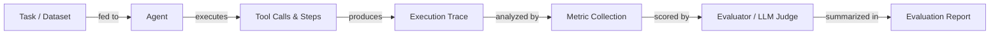

# Agenten-Evaluation und -Testing

## Definition

Agenten-Evaluation ist die Praxis, zu messen, wie gut ein KI-Agent Aufgaben erledigt, Tools korrekt verwendet, innerhalb von Kosten- und Latenzbudgets bleibt und genaue Ausgaben produziert. Anders als die statische Modellevaluation – bei der man eine feste Ausgabe mit einer Referenz vergleicht – muss die Agenten-Evaluation mehrstufige Trajektorien, nicht-deterministische Pfade, Zwischen-Tool-Aufrufe und die kumulierende Wirkung von Fehlern über Schritte hinweg berücksichtigen. Eine einzelne Aufgabe kann durch viele verschiedene Ausführungspfade erfolgreich abgeschlossen werden, was traditionelle Genauigkeitswerte allein unzureichend macht.

Rigorose Evaluation trennt eine Demo von einem Produktionssystem. Ohne sie kann man nicht wissen, ob eine Prompt-Änderung das Verhalten verbessert oder verschlechtert hat, ob eine neue Tool-Definition korrekt verwendet wird oder ob die Latenz unter realer Last akzeptabel ist. Evaluation sollte auf mehreren Ebenen stattfinden: Unit-Level-Testing einzelner Tools, Integration-Level-Testing vollständiger Agentenläufe und Regressions-Testing gegen einen Golden-Dataset repräsentativer Aufgaben.

Eine ausgereifte Evaluationsstrategie kombiniert automatisierte Metriken (Aufgabenabschlussrate, Genauigkeit, Latenz, Kosten, Tool-Nutzungseffizienz) mit menschlicher Überprüfung für Randfälle und subjektive Qualität. Benchmarks wie AgentBench und SWE-bench bieten standardisierte Aufgabensätze zum Vergleich über Modelle und Frameworks hinweg, während Frameworks wie LangSmith, Ragas und DeepEval Infrastruktur zum Ausführen von Evaluationen im großen Maßstab und zur Verfolgung von Ergebnissen über die Zeit bereitstellen.

## Funktionsweise



### Aufgaben- und Dataset-Vorbereitung

Ein gutes Evaluations-Dataset enthält repräsentative Aufgaben aus echten oder realistischen Benutzeranfragen, jeweils mit erwarteten Ergebnissen oder Referenzantworten. Aufgaben sollten Happy Paths, Randfälle, adversarielle Eingaben und mehrstufige Workflows abdecken. Für die Agenten-Evaluation sollte jede Aufgabe die erwartete endgültige Antwort spezifizieren und optional die erwartete Sequenz von Tool-Aufrufen. Die Dataset-Qualität ist der wichtigste Hebel für die Evaluationsqualität – garbage in, garbage out.

### Ausführung und Trace-Sammlung

Der Agent führt jede Aufgabe im Dataset aus, und jeder Schritt – LLM-Aufrufe, Tool-Invokationen, Gedächtnislesungen und Ausgaben – wird als strukturierter Trace erfasst. Traces zeichnen Eingaben, Ausgaben, Zeitstempel, Token-Counts und Fehler für jeden Span auf. Dies ist das Rohmaterial für alle nachgelagerten Metriken und ist auch für das Debugging von Fehlern unschätzbar. Determinismus kann durch Fixieren von Zufalls-Seeds und Temperatur verbessert werden, aber einige Variabilität sollte durch mehrere Versuche pro Aufgabe erwartet und berücksichtigt werden.

### Metrik-Sammlung

Kernmetriken für die Agenten-Evaluation umfassen: **Aufgabenabschlussrate** (hat der Agent die Aufgabe erfolgreich abgeschlossen?), **Genauigkeit** (ist die endgültige Antwort korrekt?), **Latenz** (End-to-End-Wanduhrzeit), **Kosten** (Gesamttokens × Preis) und **Tool-Nutzungseffizienz** (wurden Tools die richtige Anzahl von Malen mit korrekten Argumenten aufgerufen?). Sekundäre Metriken umfassen Schritt-Anzahl, Wiederholungsrate, Halluzinationsrate und Treue zu abgerufenem Kontext. Metriken werden pro Aufgabe berechnet und über das Dataset aggregiert.

### Evaluation und Bewertung

Viele Metriken – besonders Korrektheit für offene Ausgaben – erfordern einen Richter. Ein LLM-Richter (z. B. GPT-4 oder Claude) erhält die Aufgabe, die Antwort des Agenten und optional eine Referenzantwort und bewertet die Qualität anhand einer Rubrik. Dies wird manchmal "LLM-as-a-judge" genannt und ist das Rückgrat von Frameworks wie Ragas und DeepEval. Für deterministische Aufgaben (Code-Ausführung, SQL-Abfragen, strukturierte Extraktion) sind regelbasierte Überprüfungen zuverlässiger und kostengünstiger. Menschliche Überprüfung sollte verwendet werden, um LLM-Richter zu kalibrieren und systematische Verzerrungen zu erkennen.

### Berichterstattung und Regressions-Tracking

Evaluationsergebnisse werden in einem Bericht zusammengefasst und zusammen mit der Agenten-Version, Prompt-Version und Modell-Version gespeichert. Dies ermöglicht Regressions-Tracking: Man kann den aktuellen Agenten mit einer Baseline vergleichen und Regressionen erkennen, bevor sie deployed werden. Dashboards in Tools wie LangSmith zeigen Metrik-Trends über die Zeit und helfen Teams, subtile Degradierungen zu erkennen, die einzelne Test-Läufe verpassen würden.

## Wann verwenden / Wann NICHT verwenden

| Verwenden wenn | Vermeiden wenn |
|---|---|
| Zwei Agenten-Versionen oder Prompts vor dem Deployment verglichen werden | Evaluation übersprungen wird, weil die Aufgabe in einer Demo "richtig aussieht" |
| Eine Regressions-Suite aufgebaut wird, um prompt-brechende Änderungen zu erkennen | Evaluation nur einmal zu Projektbeginn und nie wieder durchgeführt wird |
| Kosten und Latenz gemessen werden, um SLAs zu erfüllen | Nur eine einzige Metrik (z. B. nur Genauigkeit) zur Beurteilung der Gesamtqualität verwendet wird |
| Tool-Aufruf-Verhalten und Argumentkorrektheit validiert werden | Ein Dataset mit nur einfachen, sauberen Aufgaben ohne Randfälle verwendet wird |
| Ein neues Modell integriert wird, um den Fähigkeitstransfer zu überprüfen | LLM-Richter-Scores als Ground Truth ohne menschliche Kalibrierung behandelt werden |

## Vergleiche

| Kriterium | LangSmith | DeepEval | Ragas |
|---|---|---|---|
| **Benutzerfreundlichkeit** | Enge LangChain-Integration, schnelle Einrichtung für LangChain-Nutzer; steiler für andere | Saubere Python-API, minimaler Boilerplate, leicht zu jeder Pipeline hinzuzufügen | Optimiert für RAG-Pipelines; unkompliziert für Retrieval-Aufgaben |
| **Metrik-Abdeckung** | Tracing, benutzerdefinierte Evaluatoren, Dataset-Management; weniger eingebaute LLM-Metriken | 20+ eingebaute Metriken (Halluzination, Treue, Tool-Korrektheit, Toxizität) | RAG-fokussierte Metriken (Treue, Antwortrelevanz, Kontext-Recall, Präzision) |
| **Tracing-Integration** | Erstklassig: vollständige Trace-Erfassung, Span-Visualisierung, Lauf-Vergleich | Trace-Erfassung über Dekoratoren; weniger native Visualisierung | Kein eingebautes Tracing; integriert über LangSmith oder W&B |
| **Preisgestaltung** | Kostenloser Tarif + bezahlte gehostete Pläne; selbst hostbar | Open Source; Cloud-Dashboard verfügbar | Open Source; kein gehostetes Dashboard |
| **Anpassbarkeit** | Benutzerdefinierte Evaluatoren über Python oder Prompt-Templates | Erweiterbar durch Subklassen von Metrik-Klassen | Benutzerdefinierte Metriken über Python; starke NLP-Metrik-Bibliotheksunterstützung |

## Vor- und Nachteile

| Vorteile | Nachteile |
|---|---|
| Erkennt Regressionen, bevor sie Benutzer erreichen | Das Aufbauen eines guten Datasets ist zeitaufwändig |
| Liefert objektive Beweise für Prompt-/Modell-Entscheidungen | LLM-Richter können voreingenommen oder inkonsistent sein |
| Ermöglicht Kosten- und Latenzbudgetierung | Nicht-Determinismus erfordert mehrere Versuche, was die Kosten erhöht |
| Skaliert auf große Datasets mit Automatisierung | Agenten-Traces können groß und teuer zu speichern sein |
| Integriert sich in CI/CD für kontinuierliche Qualitätsgates | Metrik-Auswahl ist schwierig und domänenspezifisch |

## Code-Beispiele

```python
# Agent evaluation with DeepEval
# pip install deepeval langchain-openai

from deepeval import evaluate
from deepeval.metrics import (
    TaskCompletionMetric,
    ToolCorrectnessMetric,
    HallucinationMetric,
)
from deepeval.test_case import LLMTestCase, ToolCall
from langchain_openai import ChatOpenAI
from langchain.agents import AgentExecutor, create_openai_tools_agent
from langchain_core.prompts import ChatPromptTemplate
from langchain_core.tools import tool


# --- Define a simple tool for the agent ---
@tool
def get_weather(city: str) -> str:
    """Return the current weather for a city."""
    # In production this would call a real API
    return f"The weather in {city} is sunny and 22°C."


# --- Build a minimal agent ---
llm = ChatOpenAI(model="gpt-4o-mini", temperature=0)
prompt = ChatPromptTemplate.from_messages([
    ("system", "You are a helpful assistant. Use tools when needed."),
    ("human", "{input}"),
    ("placeholder", "{agent_scratchpad}"),
])
agent = create_openai_tools_agent(llm, [get_weather], prompt)
agent_executor = AgentExecutor(agent=agent, tools=[get_weather], verbose=False)


def run_agent(user_input: str) -> tuple[str, list[ToolCall]]:
    """Run the agent and return (final_answer, tool_calls)."""
    result = agent_executor.invoke({"input": user_input})
    # In a real setup, parse the intermediate steps for tool call records
    actual_output = result["output"]
    tool_calls_used = [
        ToolCall(name="get_weather", input_parameters={"city": "Paris"})
    ]  # Extracted from result["intermediate_steps"] in production
    return actual_output, tool_calls_used


# --- Build DeepEval test cases from an evaluation dataset ---
dataset = [
    {
        "input": "What is the weather in Paris?",
        "expected_output": "The weather in Paris is sunny and 22°C.",
        "expected_tools": [
            ToolCall(name="get_weather", input_parameters={"city": "Paris"})
        ],
        "context": ["get_weather tool returns current conditions"],
    },
    {
        "input": "Tell me the weather in London.",
        "expected_output": "The weather in London is sunny and 22°C.",
        "expected_tools": [
            ToolCall(name="get_weather", input_parameters={"city": "London"})
        ],
        "context": ["get_weather tool returns current conditions"],
    },
]

test_cases = []
for item in dataset:
    actual_output, tool_calls_used = run_agent(item["input"])

    test_case = LLMTestCase(
        input=item["input"],
        actual_output=actual_output,
        expected_output=item["expected_output"],
        tools_called=tool_calls_used,
        expected_tools=item["expected_tools"],
        context=item["context"],
    )
    test_cases.append(test_case)

# --- Define metrics ---
task_completion = TaskCompletionMetric(
    threshold=0.7,
    model="gpt-4o-mini",
    include_reason=True,
)
tool_correctness = ToolCorrectnessMetric()  # Checks tool name + args match
hallucination = HallucinationMetric(
    threshold=0.3,
    model="gpt-4o-mini",
)

# --- Run evaluation ---
results = evaluate(
    test_cases=test_cases,
    metrics=[task_completion, tool_correctness, hallucination],
)

# --- Print summary ---
for tc, result in zip(test_cases, results.test_results):
    print(f"Input: {tc.input}")
    for metric_result in result.metrics_data:
        status = "PASS" if metric_result.success else "FAIL"
        print(f"  [{status}] {metric_result.name}: {metric_result.score:.2f}")
        if metric_result.reason:
            print(f"         Reason: {metric_result.reason}")
    print()
```

## Praktische Ressourcen

- [DeepEval Dokumentation](https://docs.confident-ai.com/) — Umfassender Leitfaden zu DeepEval-Metriken, Testfällen und CI/CD-Integration für LLM- und Agenten-Evaluation.
- [Ragas Dokumentation](https://docs.ragas.io/) — Ragas-Framework zur Evaluation von RAG-Pipelines und Agenten-Treue mit Metriken wie Antwortrelevanz und Kontext-Recall.
- [LangSmith Dokumentation](https://docs.smith.langchain.com/) — LangSmith-Evaluations-, Tracing- und Dataset-Management-Funktionen für LangChain-basierte Agenten.
- [AgentBench Paper und Leaderboard](https://github.com/THUDM/AgentBench) — Benchmark zur Evaluation von LLM-Agenten über diverse reale Aufgaben hinweg, einschließlich Web, Coding und OS-Umgebungen.
- [SWE-bench](https://www.swebench.com/) — Benchmark zur Messung der Agentenfähigkeit, echte GitHub-Issues in Software-Engineering-Repositories zu lösen.

## Siehe auch

- [Agenten](/docs/agents)
- [Agenten-Debugging und Beobachtbarkeit](/docs/agents/debugging)
- [Evaluationsmetriken](/docs/evaluation-metrics)
- [Benchmarks](/docs/benchmarks)
