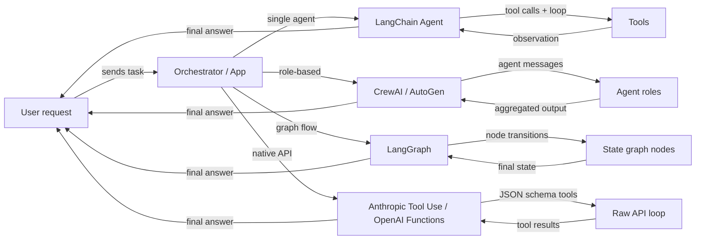

# Überblick über Agent-Frameworks

## Definition

Ein **Agent-Framework** ist eine Bibliothek oder ein SDK, das die Infrastrukturprobleme beim Aufbau von KI-Agenten übernimmt: Tool-Registrierung, Nachrichtenübermittlung, Zustandsverwaltung, Orchestrierung und Integration mit LLM-Anbietern. Ohne ein Framework schreibt man diese Infrastrukturschichten selbst; mit einem Framework beschreibt man, *was* der Agent tun soll, und es übernimmt, *wie* die Schleife läuft.

Die Agent-Framework-Landschaft ist schnell gewachsen und umfasst jetzt mehrere unterschiedliche Kategorien. Einige Frameworks konzentrieren sich auf einen einzelnen Agenten mit Tools (LangChain-Agenten), andere priorisieren rollenbasierte Zusammenarbeit zwischen vielen Agenten (CrewAI, AutoGen), andere modellieren Agentenverhalten als explizite zustandsbehaftete Graphen (LangGraph), und einige überspringen das Framework völlig und verlassen sich auf die nativen Fähigkeiten des Modellanbieters (Anthropic Tool Use, OpenAI Function Calling). Jede Kategorie spiegelt eine andere Philosophie darüber wider, wo Kontrolle und Komplexität angesiedelt sein sollten.

Die Wahl des richtigen Frameworks ist nicht nur eine technische Entscheidung – sie prägt, wie man über das System nachdenkt, Fehler debuggt und in die Produktion skaliert. Ein Anfänger, der einen einfachen Recherche-Assistenten aufbaut, hat sehr andere Bedürfnisse als ein Plattform-Team, das ein Dutzend spezialisierter Agenten in einer Produktionspipeline verbindet.

## Funktionsweise

### Single-Agent-Frameworks (LangChain-Agenten)

Single-Agent-Frameworks geben einem LLM Zugang zu einer Reihe von Tools und führen eine Schleife aus: Das Modell entscheidet, welches Tool aufgerufen werden soll, das Framework führt es aus, die Beobachtung wird an die Konversation angehängt, und die Schleife setzt sich fort, bis das Modell eine endgültige Antwort ausgibt. LangChain ist das kanonische Beispiel und stellt `create_react_agent` und `AgentExecutor` für unkomplizierte ReAct-artige Agenten bereit. Der Entwickler registriert Tools (Python-Funktionen mit Docstrings oder Pydantic-Schemas) und das Framework übernimmt die Prompt-Konstruktion und Ergebnis-Analyse. Single-Agent ist der richtige Ausgangspunkt: geringere Latenz, einfacher zu debuggen und einfacher zu testen. Komplexität entsteht, wenn mehrere spezialisierte Rollen parallel arbeiten müssen oder wenn der Zustand für ein Kontextfenster zu groß wird.

### Multi-Agenten-Frameworks (CrewAI, AutoGen)

Multi-Agenten-Frameworks koordinieren mehrere LLM-gestützte Agenten, jeder mit seiner eigenen Rolle, Anweisungen und Tools, auf ein gemeinsames Ziel hin. CrewAI verwendet eine Crew-Metapher mit Rollen, Zielen und Hintergrundgeschichten; AutoGen verwendet eine Konversationsmetapher, bei der Agenten Nachrichten austauschen. Beide unterstützen sequenzielle und parallele Ausführungsmuster. Das Framework verwaltet Nachrichten-Routing, Ausgabeübergabe zwischen Agenten und optional Human-in-the-Loop-Checkpoints. Multi-Agenten-Ansätze glänzen, wenn das Problem natürlicherweise in distinkte Spezialisierungen zerfällt (Forscher, Schreiber, Kritiker) oder wenn Redundanz und Debatte zur Verbesserung der Ausgabequalität benötigt werden.

### Graphbasierte Frameworks (LangGraph)

Graphbasierte Frameworks repräsentieren Agentenverhalten als expliziten gerichteten Graphen: Knoten sind Python-Funktionen (jede kann ein LLM oder ein Tool aufrufen), Kanten sind Übergänge zwischen Knoten, und der gemeinsame Zustand ist ein typisiertes Dictionary. LangGraph, aufgebaut auf LangChain, hat diesen Ansatz populär gemacht. Zyklen im Graphen ermöglichen es dem Agenten, zu schleifen, bis eine Abbruchbedingung erfüllt ist; bedingte Kanten erlauben dynamisches Routing basierend auf Zwischenergebnissen. Die Explizitheit eines Graphen macht komplexe Flows einfacher zu verstehen, isoliert zu testen und über Unterbrechungen hinweg zu persistieren. Dies ist das bevorzugte Muster, wenn feinkörnige Kontrolle über den Ausführungsfluss, Checkpointing oder Human-in-the-Loop-Genehmigungen an bestimmten Schritten benötigt werden.

### Natives Tool Use (Anthropic Tool Use, OpenAI Function Calling)

Natives Tool Use überspringt die Framework-Schicht vollständig und verwendet den eingebauten Mechanismus des Modellanbieters für strukturiertes Function Calling. Anthropics API akzeptiert einen `tools`-Parameter mit JSON-Schema-Definitionen; das Modell gibt `tool_use`-Blöcke zurück, die der eigene Code ausführt, dann werden `tool_result`-Blöcke zurückgegeben. OpenAIs Äquivalent sind `functions` / `tools` mit `function_call`-Antworten. Dieser Ansatz hat minimalen Abstraktions-Overhead, volle Kontrolle über die Schleife und die engste Integration mit modellspezifischen Funktionen wie Streaming und parallelen Tool-Aufrufen. Der Kompromiss ist, dass man die Orchestrierungslogik selbst schreibt, was für einfache Anwendungsfälle in Ordnung ist, aber im großen Maßstab komplex wird.



## Wann verwenden / Wann NICHT verwenden

| Verwenden wenn | Vermeiden wenn |
|---|---|
| Tool-augmentiertes LLM-Verhalten über einen einzelnen Prompt hinaus benötigt wird | Die Aufgabe ein Einmal-Prompt ohne externe Datenbedürfnisse ist |
| Das Problem sich in mehrere spezialisierte Rollen zerlegen lässt (Multi-Agenten) | Ultra-niedrige Latenz benötigt wird und keine mehrstufigen Schleifen leistbar sind |
| Reproduzierbare, inspizierbare Agenten-Flows gewünscht werden (graphbasiert) | Das Team das Fachwissen fehlt, um nicht-deterministische Agentenschleifen zu debuggen |
| Nahe an der Anbieter-API mit minimaler Abstraktion gearbeitet werden soll (nativ) | Schnelles Prototyping benötigt wird und kein Orchestrierungs-Boilerplate geschrieben werden soll |
| Ein Produktionssystem aufgebaut wird, das Checkpointing und Persistenz benötigt | Die Aufgabe mit einer einfachen RAG-Pipeline oder einer einzelnen Prompt-Kette lösbar ist |

## Vergleiche

| Kriterium | CrewAI | AutoGen | LangGraph | Anthropic Tool Use |
|---|---|---|---|---|
| **Architektur** | Rollenbasierte Crew mit Aufgaben und Prozessen | Konversationsgesteuerte Agentenpaare und Gruppen-Chats | Expliziter Zustandsgraph mit Knoten und Kanten | Rohe API mit JSON-Schema-Tool-Definitionen |
| **Multi-Agenten-Unterstützung** | Erstklassig: Agenten sind Crew-Mitglieder mit Rollen und Zielen | Erstklassig: Agenten kommunizieren über einen Nachrichtenbus | Möglich über Subgraphen, aber primär Single-Agent-Graphen | Manuell: Multi-Agenten-Koordination selbst implementieren |
| **Zustandsverwaltung** | Implizit: zwischen Aufgaben über Crew-Kontext weitergegeben | Implizit: Nachrichtenhistorie in der Konversation | Explizit: TypedDict-Zustand geteilt über alle Knoten | Manuell: eigenes State-Dict pflegen |
| **Lernkurve** | Niedrig: deklarative YAML-artige API | Mittel: erfordert Verständnis von Agentenrollen und Gruppen-Chat | Mittel-Hoch: erfordert Graphentheorie-Intuition | Niedrig: nur Python + JSON Schema, aber mehr Boilerplate |
| **Community & Ökosystem** | Wächst schnell, starke Tutorials | Groß (Microsoft-gestützt), starke Forschungs-Community | Wächst schnell, enge LangChain-Integration | Offizielles Anthropic SDK, gut dokumentiert |
| **Beste Verwendung für** | Strukturierte rollenbasierte Pipelines, Content-Workflows | Forschung, Code-Generierung, Human-in-the-Loop-Experimente | Komplexe Branching-Flows, Produktionspipelines | Einfache bis mittlere Tools, enge Modellintegration |
| **Streaming-Unterstützung** | Begrenzt | Begrenzt | Unterstützt über LangChain-Streaming | Vollständiges Streaming über Anthropic SDK |

## Code-Beispiele

```python
# --- LangChain agent (single-agent, ReAct) ---
from langchain_anthropic import ChatAnthropic
from langchain.agents import create_react_agent, AgentExecutor
from langchain_core.tools import tool

@tool
def search(query: str) -> str:
    """Search the web for information."""
    return f"Results for: {query}"

llm = ChatAnthropic(model="claude-3-5-sonnet-20241022")
agent = create_react_agent(llm, tools=[search])
executor = AgentExecutor(agent=agent, tools=[search])
result = executor.invoke({"input": "What is LangGraph?"})


# --- CrewAI minimal setup ---
from crewai import Agent, Task, Crew

researcher = Agent(role="Researcher", goal="Find accurate information", backstory="Expert researcher")
task = Task(description="Research LangGraph", agent=researcher)
crew = Crew(agents=[researcher], tasks=[task])
result = crew.kickoff()


# --- AutoGen minimal setup ---
import autogen

assistant = autogen.AssistantAgent(name="assistant", llm_config={"model": "gpt-4o"})
user = autogen.UserProxyAgent(name="user", human_input_mode="NEVER")
user.initiate_chat(assistant, message="Explain LangGraph in one paragraph.")


# --- LangGraph minimal setup ---
from langgraph.graph import StateGraph, END
from typing import TypedDict

class State(TypedDict):
    message: str

def process(state: State) -> State:
    return {"message": f"Processed: {state['message']}"}

graph = StateGraph(State)
graph.add_node("process", process)
graph.set_entry_point("process")
graph.add_edge("process", END)
app = graph.compile()
result = app.invoke({"message": "hello"})


# --- Anthropic Tool Use minimal setup ---
import anthropic

client = anthropic.Anthropic()
tools = [{"name": "search", "description": "Search the web", "input_schema": {"type": "object", "properties": {"query": {"type": "string"}}, "required": ["query"]}}]
response = client.messages.create(
    model="claude-opus-4-5",
    max_tokens=1024,
    tools=tools,
    messages=[{"role": "user", "content": "Search for LangGraph documentation."}]
)
```

## Praktische Ressourcen

- [LangChain Agenten-Dokumentation](https://python.langchain.com/docs/concepts/agents/) — Umfassender Leitfaden zum Aufbau von Agenten mit LangChain, einschließlich ReAct, Tool Use und Gedächtnis.
- [CrewAI offizielle Dokumentation](https://docs.crewai.com/) — Vollständige Referenz für Rollen, Aufgaben, Crews und Prozesse in CrewAI.
- [AutoGen Dokumentation (Microsoft)](https://microsoft.github.io/autogen/) — Deckt ConversableAgent, Gruppen-Chats, Code-Ausführung und Human-in-the-Loop-Muster ab.
- [LangGraph Dokumentation](https://langchain-ai.github.io/langgraph/) — Graphbasierte Agenten-Zustandsmaschinen, Persistenz und Human-in-the-Loop-Checkpoints.
- [Anthropic Tool Use Leitfaden](https://docs.anthropic.com/en/docs/build-with-claude/tool-use) — Offizieller Leitfaden zur Definition von Tools mit JSON Schema und zur Handhabung von tool_use / tool_result Nachrichtentypen.
- [AgentsKit](https://emersonbraun.github.io/agentskit/) — Produktionsreifes Framework zum Aufbau von KI-Agenten mit Gedächtnis, Tools und Multi-Agenten-Orchestrierung

## Siehe auch

- [CrewAI](/docs/agents/crewai)
- [AutoGen](/docs/agents/autogen)
- [LangGraph](/docs/agents/langgraph)
- [Anthropic Tool Use](/docs/agents/anthropic-tool-use)
- [Multi-Agenten-Systeme](/docs/agents/multi-agent-systems)
- [KI-Agenten](/docs/agents)
