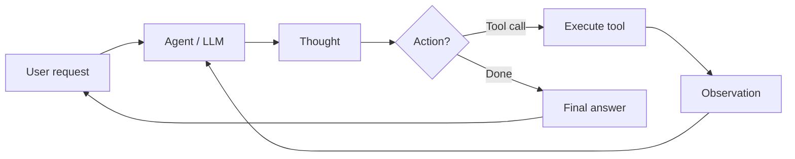

# KI-Agenten

## Definition

An **AI agent** ist ein System, das seine Umgebung wahrnimmt (z. B. user input, tool outputs), Schlussfolgerungen zieht (möglicherweise mit einem LLM) und Aktionen ausführt (z. B. calling APIs, writing code) um Ziele zu erreichen. Agenten verwenden oft Werkzeuge und Schleifen aus Denken–Aktion–Beobachtung.

Formaler: **Ein Agent ist ein autonomes Programm, das mit einem KI-Modell kommuniziert, um zielbasierte Operationen auszuführen, using the tools and context it has, and is capable of autonomous Entscheidung-making grounded in truth.** Agents bridge the gap between a one-off prototype (z. B. in AI Studio) and a scalable application: you define tools, give the agent access to them, and it decides when to call which tool and how to combine results to satisfy the user's goal.

## Funktionsweise

Typical loop: receive task → plan or reason → choose action (z. B. tool call) → observe result → repeat until done or limit. The **user** sends a request; the **agent** (backed by an LLM) erzeugt a **thought** (Schlussfolgern) and a **Entscheidung**: either call a **tool** (z. B. search, API, code runner) and get an **observation**, or return a **final answer**. The observation is fed back into the agent für den next step. LLMs provide Schlussfolgern and tool selection; frameworks (LangChain, LlamaIndex, Google ADK) handle orchestration, tool registration, and message passing. [Multi-agent](/docs/agents/multi-agent-systems) and [subagent](/docs/subagents) setups extend this with multiple agents or a parent delegating to children.



```python
# Conceptual agent loop (pseudocode)
def agent_loop(task):
    state = {"messages": [user_message(task)]}
    while not done(state):
        response = llm.invoke(state["messages"])
        if response.tool_calls:
            for call in response.tool_calls:
                result = tools.execute(call)
                state["messages"].append(tool_result(result))
        else:
            return response.content
    return state
```

## Anwendungsfälle

Agenten eignen sich, wenn die Aufgabe mehrere Schritte, Tool-Nutzung oder Entscheidungen erfordert, die über einen einzelnen LLM-Aufruf hinausgehen.

- Aufgabenautomatisierung (Terminplanung, Datenpipelines, Formulare ausfüllen)
- Codegenerierung und -bearbeitung mit Zugriff auf Dateien und APIs
- Recherche-Assistenten, die suchen, zusammenfassen und zitieren
- Mehrstufige Workflows, die Tools und menschliche Eingriffe kombinieren

## Vor- und Nachteile

| Pros | Cons |
|------|------|
| Flexible, can use many tools | Unpredictable, can loop or fail |
| Handles multi-step tasks | Latency and cost from many LLM calls |
| Enables automation | Needs good tool Entwurf and safety |
| Scale from prototype to production | Requires monitoring and guardrails |

## Externe Dokumentation

- [From Prototypes to Agents with ADK – Google Codelabs](https://codelabs.developers.google.com/your-first-agent-with-adk#0) — Erstellen Sie Ihren ersten Agenten with Google's Agent Development Kit (ADK)
- [LangChain – Agents](https://python.langchain.com/docs/concepts/agents/) — Agenten-Konzepte und Tool-Nutzung
- [LlamaIndex – Agents](https://docs.llamaindex.ai/en/stable/module_guides/deploying/agents/) — Agent and query engine guides
- [OpenAI Assistants API](https://platform.openai.com/docs/assistants/overview) — Managed agents with tools

## Siehe auch

- [Multi-agent systems](/docs/agents/multi-agent-systems)
- [Subagents](/docs/subagents)
- [ReAct](/docs/reasoning-patterns/react)
- [RDD](/docs/reasoning-patterns/rdd)
