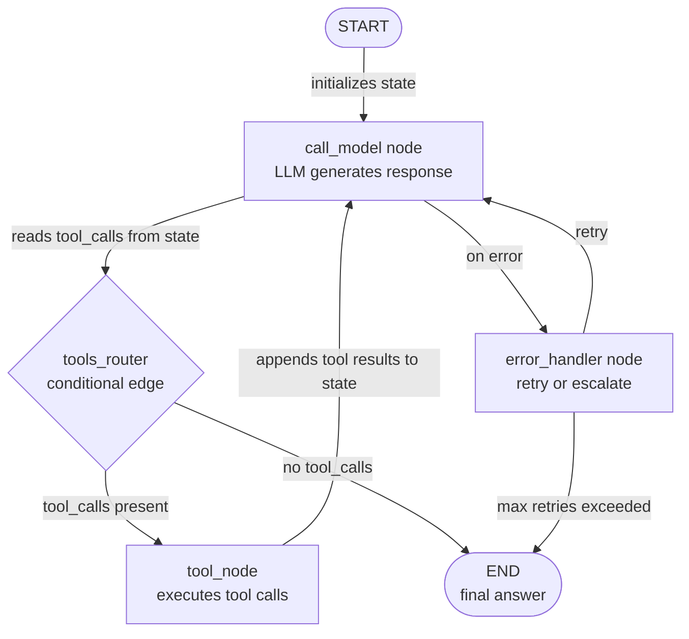

# LangGraph

## Definition

LangGraph ist eine Open-Source-Python-Bibliothek, die auf LangChain aufgebaut ist und dazu dient, **zustandsbehaftete Agenten-Workflows als explizite gerichtete Graphen** zu konstruieren. Während die meisten Agent-Frameworks die Ausführungsschleife hinter einem undurchsichtigen `run()`-Aufruf verstecken, stellt LangGraph sie als erstklassiges Graph-Objekt bereit, das man inspizieren, testen und modifizieren kann. Knoten sind gewöhnliche Python-Funktionen (jede kann ein LLM, ein Tool oder beliebige Logik aufrufen); Kanten sind Übergänge zwischen Knoten; und der gesamte Workflow teilt ein einziges **Zustandsobjekt** – ein typisiertes Dictionary, das jeder Knoten lesen und schreiben kann.

Die zentrale Erkenntnis in LangGraph ist, dass viele Agentenverhaltensweisen, die komplex erscheinen – Schleifen bis eine Bedingung erfüllt ist, Branching auf den Inhalt einer LLM-Antwort, Pause für menschliche Genehmigung, Wiederaufnahme von einem gespeicherten Checkpoint – sauber auf Graph-Primitive abbilden: Zyklen, bedingte Kanten, Interrupts und persistenter Zustand. Diese Explizitheit hat einen Preis (mehr Boilerplate als CrewAI oder AutoGen), zahlt sich aber in der Produktion aus: Man kann jeden Knoten isoliert unit-testen, genau verfolgen, welchen Pfad eine Ausführung nahm, und einen Workflow von jedem Checkpoint aus wiederholen.

LangGraph unterstützt sowohl **Single-Agent**-Muster (ein Graph mit einigen Knoten, der Tools in einer Schleife aufruft) als auch **Multi-Agenten**-Muster (mehrere Subgraphen, die zusammen komponiert werden, mit cross-graph Zustandsteilen). Es integriert sich nativ mit LangChains Tool-Ökosystem, Chat-Modellen und LangSmith für Beobachtbarkeit. Das Framework ist das Fundament von LangChains empfohlener Produktions-Agenten-Architektur ab 2024–2025.

## Funktionsweise

### Knoten: Python-Funktionen als Ausführungseinheiten

Ein Knoten in LangGraph ist ein beliebiges Python-Callable, das den aktuellen Zustand akzeptiert und einen (partiellen) aktualisierten Zustand zurückgibt. Knoten werden dem Graphen mit `graph.add_node("name", function)` hinzugefügt. Die Funktionssignatur ist immer `(state: State) -> dict` – sie liest, was sie aus dem Zustand benötigt, erledigt ihre Arbeit (LLM-Aufruf, Tool-Ausführung, Datentransformation) und gibt nur die Schlüssel zurück, die aktualisiert werden sollen. Dies macht Knoten einfach unabhängig zu testen: Mock-Zustand hineingeben, die zurückgegebene Dict assertieren. LangChains `ToolNode` ist ein vorgefertigter Knoten, der Tool-Aufrufe aus der Antwort eines LLM ausführt, was das häufigste Agentenmuster von Haus aus abdeckt.

### Kanten: Routing und bedingtes Branching

Kanten verbinden Knoten und bestimmen die Ausführungsreihenfolge. Eine einfache Kante (`graph.add_edge("a", "b")`) geht immer von Knoten `a` zu Knoten `b` über. Eine bedingte Kante (`graph.add_conditional_edges`) ruft eine Routing-Funktion mit dem aktuellen Zustand auf und verwendet den zurückgegebenen String, um den nächsten Knoten zu entscheiden. Dies ist der Mechanismus für dynamischen Kontrollfluss: Nachdem ein LLM eine Antwort generiert hat, prüft ein Router, ob sie Tool-Aufrufe enthält (Route zu `tools`) oder eine endgültige Antwort (Route zu `END`). Bedingte Kanten machen LangGraph deutlich leistungsstärker als eine sequenzielle Pipeline – man kann komplexe Entscheidungsbäume, Retry-Logik und Eskalationspfade als lesbare Graph-Struktur ausdrücken.

### Zustand: gemeinsames TypedDict über alle Knoten

Zustand ist das Rückgrat einer LangGraph-Anwendung. Man definiert ein `TypedDict` (oder ein Pydantic-Modell) mit allen Feldern, die der Workflow benötigt: Nachrichten, Zwischenergebnisse, Flags, Zähler. Jeder Knoten empfängt den vollständigen Zustand und gibt nur die Felder zurück, die er modifiziert. LangGraph führt partielle Updates mit dem aktuellen Zustand über **Reducer** zusammen – standardmäßig überschreiben Zuweisungen; mit dem `add_messages`-Reducer wird die Nachrichtenliste angehängt statt ersetzt. Explizite Zustandstypisierung bedeutet, dass Typ-Checker Fehler vor der Laufzeit abfangen können, und der Zustand-Snapshot bei jedem Checkpoint ist ein vollständiger, inspizierbarer Datensatz darüber, was passiert ist.

### Zyklen, Persistenz und Human-in-the-Loop

LangGraph behandelt Zyklen nativ: Ein Knoten kann basierend auf einer Bedingung zu einem früheren Knoten (oder sich selbst) zurückkehren, was Agenten-Retry-Schleifen, Selbstkorrekturmuster und mehrstufige Tool-Nutzung ohne spezielle Behandlung ermöglicht. Persistenz wird durch **Checkpointer** bereitgestellt (SQLite, Postgres, Redis oder In-Memory): Der Graph speichert den vollständigen Zustand nach jeder Knotenausführung, so dass man nach einem Absturz oder einer Unterbrechung von jedem Punkt aus fortfahren kann. Human-in-the-Loop wird über `interrupt_before` und `interrupt_after` implementiert – der Graph hält am angegebenen Knoten an, stellt dem Aufrufer den aktuellen Zustand zur Verfügung, nimmt menschlichen Input an und setzt fort. Dies macht LangGraph zur stärksten Wahl, wenn überprüfbare, unterbrechbare, produktionsreife Agenten-Pipelines benötigt werden.



## Wann verwenden / Wann NICHT verwenden

| Verwenden wenn | Vermeiden wenn |
|---|---|
| Feinkörnige Kontrolle über jeden Schritt der Agentenausführung benötigt wird | Eine deklarative High-Level-API gewünscht wird und keine Schritt-Level-Kontrolle benötigt wird |
| Persistenz und die Möglichkeit zur Wiederaufnahme von Workflows mitten in der Ausführung erforderlich sind | Der Workflow einfach und linear ist – eine Kette oder Single-Agent-Schleife reicht aus |
| Human-in-the-Loop-Genehmigungen an bestimmten Schritten erforderlich sind | Das Team mit Graphentheorie nicht vertraut ist und ein einfacheres mentales Modell bevorzugt |
| Produktionssysteme aufgebaut werden, die vollständige Beobachtbarkeit und Replay benötigen | Agenten Forschungsprototypen sind, die keine produktionsreife Zuverlässigkeit benötigen |
| Der Workflow komplexes bedingtes Branching oder Zyklen hat, die linear schwer ausgedrückt werden können | Multi-Agenten-Rollenkoordination der primäre Bedarf ist – CrewAI oder AutoGen sind einfacher |

## Vergleiche

| Kriterium | LangGraph | CrewAI | AutoGen |
|---|---|---|---|
| **Abstraktionsebene** | Niedrig: expliziter Graph, Knoten, Kanten und Zustand | Hoch: deklarative Rollen, Ziele, Aufgaben | Mittel: konversationale Agenten mit Nachrichtenhistorie |
| **Kontrollfluss** | Explizite bedingte Kanten und Zyklen | Sequenzieller oder hierarchischer Prozess (undurchsichtig) | Nachrichtengesteuert, turn-basiert (undurchsichtig) |
| **Persistenz** | Erstklassig: Checkpointer für SQLite, Postgres, Redis | Nicht eingebaut | Nicht eingebaut |
| **Human-in-the-Loop** | Erstklassig: `interrupt_before` / `interrupt_after` | Nur manuell | Erstklassig: `human_input_mode` pro Agent |
| **Testbarkeit** | Hoch: Knoten sind reine Funktionen, leicht zu unit-testen | Mittel: Aufgaben können getestet werden, aber Crew-Ausführung ist undurchsichtig | Niedrig: Konversationsflows sind schwer deterministisch zu unit-testen |

## Code-Beispiele

```python
import os
from typing import Annotated, TypedDict, Literal
from langchain_anthropic import ChatAnthropic
from langchain_core.tools import tool
from langchain_core.messages import HumanMessage, AIMessage, BaseMessage
from langgraph.graph import StateGraph, END
from langgraph.graph.message import add_messages
from langgraph.prebuilt import ToolNode

# --- State definition ---
# add_messages is a reducer: it appends to the messages list instead of replacing it.
class AgentState(TypedDict):
    messages: Annotated[list[BaseMessage], add_messages]
    step_count: int  # track how many steps we have taken

# --- Tool definitions ---
# Tools are standard LangChain tools decorated with @tool.
# The docstring becomes the tool description sent to the LLM.

@tool
def search_web(query: str) -> str:
    """Search the web for current information on a topic."""
    # In production, replace with a real search API (Serper, Tavily, etc.)
    return f"Search results for '{query}': LangGraph is a stateful agent framework by LangChain."

@tool
def add_numbers(a: float, b: float) -> str:
    """Add two numbers together and return the result."""
    return f"Result: {a + b}"

tools = [search_web, add_numbers]

# --- LLM setup ---
# Bind tools to the model so it knows what functions are available.
llm = ChatAnthropic(model="claude-opus-4-5")
llm_with_tools = llm.bind_tools(tools)

# --- Node definitions ---
# Each node is a plain Python function: (state) -> partial state update.

def call_model(state: AgentState) -> dict:
    """Primary agent node: calls the LLM and returns its response."""
    response = llm_with_tools.invoke(state["messages"])
    return {
        "messages": [response],  # add_messages reducer will append this
        "step_count": state["step_count"] + 1,
    }

def handle_error(state: AgentState) -> dict:
    """Error handling node: appends a fallback message if something went wrong."""
    fallback = AIMessage(content="I encountered an error. Let me try a different approach.")
    return {"messages": [fallback]}

# --- Routing function (conditional edge) ---
# Returns the name of the next node based on the current state.

def should_continue(state: AgentState) -> Literal["tools", "end"]:
    """Route to tools if the LLM made tool calls, otherwise end."""
    last_message = state["messages"][-1]
    # Safety limit: stop after 10 steps to prevent infinite loops
    if state["step_count"] >= 10:
        return "end"
    if hasattr(last_message, "tool_calls") and last_message.tool_calls:
        return "tools"
    return "end"

# --- Graph construction ---
tool_node = ToolNode(tools)  # prebuilt node that executes tool calls

graph = StateGraph(AgentState)

# Add nodes
graph.add_node("agent", call_model)
graph.add_node("tools", tool_node)
graph.add_node("error_handler", handle_error)

# Set entry point
graph.set_entry_point("agent")

# Add conditional edge from agent: either call tools or end
graph.add_conditional_edges(
    "agent",
    should_continue,
    {
        "tools": "tools",  # route to tool execution
        "end": END,        # route to terminal node
    },
)

# After tool execution, always return to the agent (creates a cycle)
graph.add_edge("tools", "agent")

# Error handler routes back to agent for a retry
graph.add_edge("error_handler", "agent")

# Compile the graph into a runnable application
app = graph.compile()

# --- Optional: add persistence with a checkpointer ---
# from langgraph.checkpoint.sqlite import SqliteSaver
# memory = SqliteSaver.from_conn_string(":memory:")
# app = graph.compile(checkpointer=memory)
# Use config={"configurable": {"thread_id": "session-1"}} to resume sessions.

# --- Run the agent ---
initial_state = {
    "messages": [HumanMessage(content="What is LangGraph and what is 42 plus 17?")],
    "step_count": 0,
}

result = app.invoke(initial_state)
print("Final answer:", result["messages"][-1].content)
print("Total steps:", result["step_count"])

# --- Inspect the graph structure ---
# app.get_graph().print_ascii()  # print ASCII diagram of the graph
```

## Praktische Ressourcen

- [LangGraph offizielle Dokumentation](https://langchain-ai.github.io/langgraph/) — Vollständige Referenz für Graph-Konstruktion, Zustandsverwaltung, Checkpointer und Human-in-the-Loop-Muster.
- [LangGraph GitHub-Repository](https://github.com/langchain-ai/langgraph) — Quellcode, Issue-Tracker und Beispiel-Notebooks zu gängigen Mustern.
- [LangGraph "How-to"-Leitfäden](https://langchain-ai.github.io/langgraph/how-tos/) — Praktische Rezepte für Persistenz, Streaming, Subgraphen, Multi-Agenten-Koordination und mehr.
- [LangSmith Tracing für LangGraph](https://docs.smith.langchain.com/) — Beobachtbarkeitsplattform zum Tracing von LangGraph-Ausführungen, zur Inspektion des Zustands bei jedem Knoten und zum Debugging von Fehlern.

## Siehe auch

- [Überblick über Agent-Frameworks](/docs/agents/frameworks-overview)
- [CrewAI](/docs/agents/crewai)
- [AutoGen](/docs/agents/autogen)
- [LangChain](/docs/tools/langchain)
- [Multi-Agenten-Systeme](/docs/agents/multi-agent-systems)
- [ReAct](/docs/reasoning-patterns/react)
