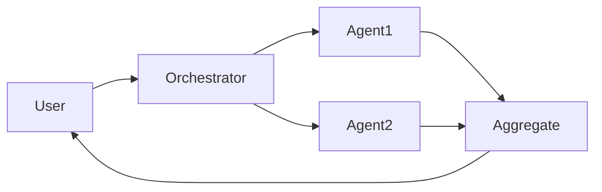

# Multi-Agenten-Systeme

## Definition

Multi-Agenten-Systeme umfassen mehrere KI-Agenten, die interagieren, um Aufgaben zu lösen: Zusammenarbeit (Arbeit teilen, Zustand teilen), Debatte (argumentieren und Antworten verfeinern) oder spezialisierte Rollen (Planer, Ausführer, Kritiker).

Sie erweitern single [agents](/docs/agents) when one model or one loop is insufficient: z. B. one agent for [RAG](/docs/rag) Abruf, another for generation, another for critique. [Subagents](/docs/subagents) are a hierarchical form where a root agent delegates to children; here we focus on flat or peer-to-peer multi-agent patterns.

## Funktionsweise

The **user** sends a task to an **orchestrator** (was sein kann an LLM or a fixed workflow). The orchestrator assigns work to **Agent1**, **Agent2**, etc., each with its own role, tools, und optional model. Agents may share a common state, pass messages, or be invoked in sequence/parallel. Their outputs are **aggregated** (z. B. combined, voted, or summarized) and returned to the user. Design-Entscheidungen include role assignment, communication protocol, and conflict resolution. MAS are useful wenn Sie want **modularity** (each agent has a clear responsibility), **specialization** (different models or tools per role), **reusability** (same agent in different workflows), and **structured control flow**.

## Anwendungsfälle

Multi-Agenten-Systeme helfen, wenn ein einzelner Agent nicht ausreicht: Sie benötigen unterschiedliche Rollen, Debatten oder modulare Pipelines.

- Orchestrierung von Planer-, Ausführer- und Kritiker-Agenten für komplexe Aufgaben
- Debate or review flows where multiple agents refine an answer
- Specialized pipelines (z. B. one agent for Abruf, one for generation)

## Externe Dokumentation

- [From Prototypes to Agents with ADK – Google Codelabs](https://codelabs.developers.google.com/your-first-agent-with-adk#0) — ADK supports composing multiple agents into a multi-agent system
- [LangChain – Multi-agent](https://python.langchain.com/docs/concepts/multi_agent/) — Multi-agent orchestration patterns

## Siehe auch

- [Agents](/docs/agents)
- [Subagents](/docs/subagents)
- [Autonomous agents](/docs/autonomous-agents)
