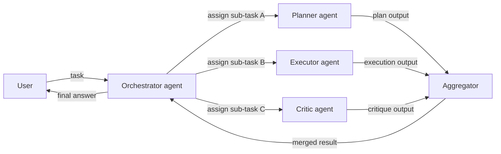
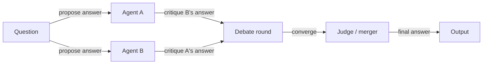

# Multi-Agenten-Systeme

## Definition

Multi-Agenten-Systeme (MAS) umfassen mehrere KI-Agenten, die interagieren, um Aufgaben zu lösen: Zusammenarbeit (Arbeit aufteilen, Zustand teilen), Debatte (argumentieren und Antworten verfeinern) oder spezialisierte Rollen (Planer, Ausführer, Kritiker). Anstatt eines einzigen monolithischen Agenten, der alles versucht zu tun, weist MAS verschiedenen Agenten unterschiedliche Verantwortlichkeiten zu und kombiniert deren Ausgaben.

Sie erweitern einzelne [Agenten](/docs/agents), wenn ein Modell oder eine Schleife nicht ausreicht: zum Beispiel ein Agent für [RAG](/docs/rag)-Abruf, ein anderer für die Generierung und ein weiterer für Kritik und Faktenprüfung. Jeder Agent kann ein anderes Modell, einen anderen Satz von Werkzeugen und einen anderen System-Prompt verwenden, der auf seine Rolle zugeschnitten ist. Diese Modularität macht einzelne Agenten einfacher, zuverlässiger und einfacher auszutauschen oder zu upgraden.

[Subagenten](/docs/subagents) sind eine hierarchische Form, bei der ein Root-Agent an Kinder delegiert; Multi-Agenten-Systeme können auch flach (Peer-to-Peer) oder mesh-strukturiert sein, wobei Agenten ohne einen zentralen Orchestrator miteinander kommunizieren. Die richtige Topologie – hierarchisch, flach oder hybrid – hängt davon ab, ob der Workflow eine natürliche Zerlegung in unabhängige oder sequentiell abhängige Teilaufgaben aufweist.

## Funktionsweise

### Orchestrierte (hierarchische) Topologie



### Debatte / Überprüfungs-Topologie



Der **Benutzer** sendet eine Aufgabe an einen **Orchestrator** (der ein LLM oder ein fester Workflow sein kann). Der Orchestrator weist Arbeit an **Agent 1**, **Agent 2** usw. zu, jeweils mit seiner eigenen Rolle, Werkzeugen und optional Modell. Agenten können einen gemeinsamen Zustand teilen, Nachrichten übergeben oder sequentiell oder parallel aufgerufen werden. Ihre Ausgaben werden **aggregiert** (kombiniert, gewählt oder zusammengefasst) und zurückgegeben. MAS sind nützlich, wenn Sie **Modularität**, **Spezialisierung**, **Wiederverwendbarkeit** und **strukturierten Kontrollfluss** über komplexe mehrstufige Aufgaben hinweg möchten.

## Wann verwenden / Wann NICHT verwenden

| Szenario | MAS verwenden | MAS nicht verwenden |
|---|---|---|
| Aufgabe zerlegt sich sauber in unterschiedliche Rollen | Ja — Planer + Ausführer + Kritiker ist eine natürliche Aufteilung | Nein — wenn die Aufgabe einrollig ist, reicht ein Agent |
| Hohe Konfidenz durch Debatte/Überprüfung benötigt | Ja — Debatte-Muster filtert Fehler durch Uneinigkeit | Nein — Single-Agent ist für gut verstandene Domänen ausreichend |
| Verschiedene Teilaufgaben brauchen verschiedene Werkzeuge/Modelle | Ja — jeder Agent verwendet nur, was er braucht | Nein — ein Agent mit allen Werkzeugen ist einfacher, wenn Rollen stark überlappen |
| Schnelles Prototyping oder einfache Pipelines | Nein — MAS-Overhead fügt Komplexität hinzu | Ja — mit einem einzelnen Agenten beginnen und bei Bedarf Komplexität hinzufügen |
| Starke Echtzeit-Latenzanforderungen | Nein — parallele Agenten fügen Koordinations-Overhead hinzu | Ja — Single-Agent ist schneller für knappe Latenzbudgets |

## Vergleiche

| Muster | Struktur | Kommunikation | Autonomie | Am besten für |
|---|---|---|---|---|
| Single-Agent | Monolithisch | Keine | Hoch pro Agent | Einfache oder moderate Aufgaben |
| Hierarchisches MAS | Baum (Root → Kinder) | Root delegiert | Mittel pro Agent | Strukturierte Workflows |
| Flaches / Peer-to-Peer MAS | Mesh oder Ring | Direkte Nachrichtenübermittlung | Hoch | Kollaboratives Reasoning |
| Debatte / Überprüfung | Parallel + Zusammenführen | Kritikunterbasiert | Mittel | Hochvertrauens-Generierung |
| Subagent (strikte Hierarchie) | Baum (Root besitzt Ziel) | Kontrollierte Delegation | Niedrig pro Subagent | Komplexe, langfristige Aufgaben |

## Vor- und Nachteile

| Vorteile | Nachteile |
|---|---|
| Modular — jeder Agent hat eine klare, testbare Verantwortung | Koordinations-Overhead (Latenz, Token, Zustandssynchronisation) |
| Spezialisierte Agenten übertreffen Generalisten in ihrer Rolle | Schwieriger zu debuggen als ein Single-Agent-Trace |
| Wiederverwendbar — gleicher Agent in verschiedenen Workflows | Design des Kommunikationsprotokolls ist nicht trivial |
| Debatte-Muster können die Genauigkeit erheblich verbessern | Risiko von kaskadierenden Fehlern über Agenten hinweg |

## Code-Beispiele

```python
from langchain_openai import ChatOpenAI
from langchain_core.messages import HumanMessage, SystemMessage

llm = ChatOpenAI(model="gpt-4o-mini")

def planner_agent(task: str) -> str:
    """Break a task into a numbered plan."""
    response = llm.invoke([
        SystemMessage(content="You are a planning agent. Break the task into 3–5 clear steps."),
        HumanMessage(content=task),
    ])
    return response.content

def executor_agent(plan: str) -> str:
    """Execute the plan and produce a draft output."""
    response = llm.invoke([
        SystemMessage(content="You are an execution agent. Follow the plan and produce a detailed output."),
        HumanMessage(content=f"Plan:\n{plan}"),
    ])
    return response.content

def critic_agent(draft: str) -> str:
    """Review the draft and suggest improvements."""
    response = llm.invoke([
        SystemMessage(content="You are a critic agent. Identify flaws and suggest concrete improvements."),
        HumanMessage(content=f"Draft:\n{draft}"),
    ])
    return response.content

# Orchestrate
task = "Write a short guide on how to get started with RAG."
plan = planner_agent(task)
print("Plan:\n", plan)

draft = executor_agent(plan)
print("\nDraft:\n", draft)

critique = critic_agent(draft)
print("\nCritique:\n", critique)
```

## Praktische Ressourcen

- [From Prototypes to Agents with ADK – Google Codelabs](https://codelabs.developers.google.com/your-first-agent-with-adk#0) — ADK unterstützt die Komposition mehrerer Agenten zu einem Multi-Agenten-System
- [LangChain – Multi-agent orchestration](https://python.langchain.com/docs/concepts/multi_agent/) — Multi-Agenten-Muster einschließlich Supervisor- und Schwarm-Topologien
- [Microsoft AutoGen](https://microsoft.github.io/autogen/) — Framework zum Aufbau von Multi-Agenten-Konversationssystemen
- [AgentsKit](https://emersonbraun.github.io/agentskit/) — Produktionsreifes Framework zum Aufbau von KI-Agenten mit Speicher, Werkzeugen und Multi-Agent-Orchestrierung

## Siehe auch

- [Agents](/docs/agents)
- [Subagents](/docs/subagents)
- [Autonomous agents](/docs/autonomous-agents)
- [ReAct](/docs/reasoning-patterns/react)
