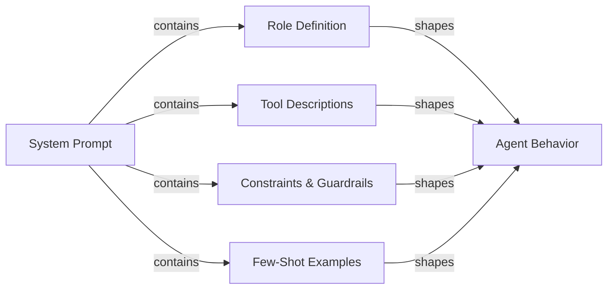

# Agenten-Prompt Engineering

## Definition

Agenten-Prompt Engineering ist die Kunst des Schreibens von System-Prompts und Tool-Definitionen, die zuverlässig das gewünschte Verhalten von einem KI-Agenten erzeugen. Anders als Prompt Engineering für einen Single-Turn-Chatbot – bei dem es vor allem um Format und Ton geht – müssen Agenten-Prompts mehrstufiges Reasoning, Tool-Auswahlsdisziplin, Constraint-Einhaltung, Fehlerwiederherstellung und Abbruchbedingungen über eine unbegrenzte Sequenz von Schritten hinweg steuern. Ein schlecht geschriebener Agenten-Prompt produziert Agenten, die endlos schleifen, Tools mit falschen Argumenten aufrufen, Benutzerbeschränkungen ignorieren oder Ergebnisse erfinden, wenn Tools fehlschlagen.

Der System-Prompt ist die Verfassung des Agenten. Er definiert, was der Agent ist, was er tun kann, was er niemals tun darf, wie er denken soll und wie seine Ausgabe aussehen soll. Da LLMs sehr empfindlich auf Formulierungen, Struktur und Reihenfolge reagieren, können kleine Änderungen am System-Prompt große Verhaltensauswirkungen haben. Agenten-Prompt Engineering ist daher eine iterative, empirische Disziplin: Man schreibt einen Prompt, evaluiert ihn gegen ein Task-Dataset, identifiziert Fehlermuster und verfeinert. Tools wie LangSmith und DeepEval (siehe [Evaluation](/docs/agents/evaluation)) machen diese Feedback-Schleife schneller.

Gute Agenten-Prompts sind modular und explizit. Sie trennen Rollendefinition, Fähigkeitsdeklaration, Constraint-Spezifikation, Ausgabeformat-Regeln und Few-Shot-Beispiele in klar abgegrenzte Abschnitte. Diese Struktur macht Prompts einfacher zu warten, zu überprüfen und zu erweitern, wenn sich die Fähigkeiten des Agenten entwickeln. Sie hilft dem LLM auch, den richtigen "Modus" für jeden Abschnitt zu aktivieren, anstatt Belange zu vermischen.

## Funktionsweise



### Rollendefinition

Die Rollendefinition sagt dem Agenten, wer er ist, was sein primärer Zweck ist und welche Persona er annehmen soll. Eine gute Rollendefinition ist spezifisch: "Du bist ein erfahrener Software-Ingenieur, der sich auf Python und PostgreSQL spezialisiert hat und Entwicklern hilft, Produktionsprobleme zu debuggen" ist nützlicher als "Du bist ein hilfreicher Assistent". Spezifität aktiviert relevantes Wissen und setzt einen angemessenen Antwortton. Die Rolle sollte auch die Beziehung des Agenten zum Benutzer festlegen (Peer, Assistent, Experte), was beeinflusst, wie der Agent mit Unsicherheit und Meinungsverschiedenheiten umgeht. Die Rollendefinition kurz halten (3-5 Sätze) und zuerst im System-Prompt platzieren, damit sie alle nachfolgenden Anweisungen rahmt.

### Tool-Beschreibungen und Tool-Auswahl

Jedes Tool, auf das der Agent Zugriff hat, muss präzise beschrieben werden. Der Tool-Name, die Beschreibung, Parameternamen, Parametertypen und das Rückgabeformat sollten alle ausgeführt werden. Mehrdeutige Tool-Beschreibungen sind eine der häufigsten Ursachen für falsche Tool-Auswahl und fehlerhafte Argumente. Einzuschließen: was das Tool tut, wann es zu verwenden ist (und kritisch, wann nicht), welche Eingaben es erwartet und welches Ausgabeformat zu erwarten ist. Für Tools mit ähnlichen Zwecken explizite Disambiguierung hinzufügen: "Verwende `search_web` für aktuelle Ereignisse und Nachrichten; verwende `search_documents` für interne Unternehmens-Wissensdatenbank-Abfragen." Few-Shot-Beispiele korrekter Tool-Invokationen (im System-Prompt oder als Konversationshistorie) reduzieren Tool-Auswahlfehler erheblich.

### Chain-of-Thought für Agenten

Chain-of-Thought (CoT) Prompting bittet den Agenten, explizit vor dem Handeln zu denken. Für Agenten bedeutet dies, nachzudenken über: Was fragt der Benutzer, welche Informationen habe ich, welche Informationen benötige ich, welches Tool soll ich als nächstes aufrufen und wie sieht das Ergebnis voraussichtlich aus. Den Agenten anzuweisen, vor dem Handeln zu denken ("Bevor du irgendein Tool aufrufst, beschreibe kurz deinen Plan") verbessert die Genauigkeit bei komplexen mehrstufigen Aufgaben und macht Traces interpretierbarer. Einige Frameworks (ReAct, siehe [ReAct](/docs/reasoning-patterns/react)) formalisieren dies als Thought/Action/Observation-Zyklen. Im Prompt explizit sein, ob das Reasoning in der Ausgabe oder nur im Scratchpad sein soll.

### Constraints und Guardrails in Prompts

Constraints definieren, was der Agent nicht tun darf. Sie sollten wo möglich positiv formuliert werden ("immer um Bestätigung bitten, bevor Daten gelöscht werden") anstatt nur negativ ("niemals Daten ohne Anfrage löschen"). Einzuschließen: Bereichs-Constraints (nur Fragen über X beantworten), Ausgabe-Constraints (immer auf Englisch antworten, immer valides JSON verwenden), Verhaltens-Constraints (niemals URLs oder Dateipfade erfinden) und Sicherheits-Constraints (niemals schädliche Inhalte generieren). Guardrails in Prompts sind eine erste Verteidigungslinie, kein Ersatz für technische Kontrollen (siehe [Sicherheit](/docs/agents/security)); sie sind am effektivsten, wenn sie das genaue Verhalten in Grenzfällen spezifizieren.

### Ausgabeformat-Spezifikation

Agenten, die strukturierte Ausgaben produzieren (JSON, Markdown, Funktionsaufrufe), benötigen explizite Formatanweisungen. Das exakte Schema, Feldnamen, Typen und Pflicht- vs. optionale Felder spezifizieren. Ein gültiges Beispiel in den Prompt einschließen. Für Tool-aufrufende Agenten klarstellen, wann eine endgültige Antwort zurückgegeben werden soll gegenüber dem weiteren Aufrufen von Tools, und wie die Abbruchbedingung aussieht. Wenn der Agent mit nachgelagerten Systemen interagiert, ist das Ausgabeformat ein Vertrag; Mehrdeutigkeit hier pflanzt sich in kaputte Integrationen fort.

## Wann verwenden / Wann NICHT verwenden

| Verwenden wenn | Vermeiden wenn |
|---|---|
| Agent mehrere Tools aufruft und Tool-Auswahl inkonsistent ist | Der System-Prompt als einmalige Einrichtung behandelt wird, die nie überarbeitet wird |
| Agent schleift oder vorzeitig abbricht ohne die Aufgabe abzuschließen | Ein enormer Textwand-Prompt ohne Struktur oder Abschnitte geschrieben wird |
| Agent Benutzerbeschränkungen ignoriert oder Sicherheitsrichtlinien verletzt | Nur auf die Standardeinstellungen des Modells ohne Rollen- oder Constraint-Spezifikation vertraut wird |
| Ein neues LLM integriert wird und Verhalten vom vorherigen Modell übertragen werden muss | Neue Anweisungen ad-hoc ohne Evaluation auf Regressionen hinzugefügt werden |
| Ein mehrstufiger Workflow mit deterministischen Ausgabeformat-Anforderungen aufgebaut wird | Erwartet wird, dass der Prompt allein Sicherheitsbedrohungen behandelt (technische Kontrollen auch verwenden) |

## Vergleiche

| Prompt-Element | Zweck | Häufige Fehler |
|---|---|---|
| Rollendefinition | Legt Persona, Expertise und Ton fest | Zu vage ("hilfreicher Assistent") oder zu lang; nach anderen Abschnitten platziert |
| Tool-Beschreibungen | Leitet korrekte Tool-Auswahl und Argumentbildung | Fehlende Wann-/Wann-nicht-zu-verwenden-Anleitung; keine Beispielaufrufungen |
| Constraints | Setzt Bereichs-, Sicherheits- und Formatgrenzen durch | Nur negative Constraints ("niemals X tun") ohne Spezifikation der korrekten Alternative |
| Chain-of-Thought-Anweisung | Verbessert Reasoning-Genauigkeit bei komplexen Aufgaben | Reasoning mit Tool-Aufruf-Ausgabe vermischen, wenn es im Scratchpad bleiben sollte |
| Few-Shot-Beispiele | Demonstriert erwartetes Verhalten für Tool Use und Ausgabeformat | Beispiele, die zu einfach sind, um echte Randfälle darzustellen |

## Vor- und Nachteile

| Vorteile | Nachteile |
|---|---|
| Sofortige Wirkung: kein Fine-Tuning oder Neutraining erforderlich | Prompt-Empfindlichkeit bedeutet, dass kleine Formulierungsänderungen Verhalten brechen können |
| Modulare Struktur macht Wartung und Überprüfung unkompliziert | Lange Prompts verbrauchen Tokens bei jedem Aufruf, was die Kosten erhöht |
| Few-Shot-Beispiele reduzieren Tool-Auswahlfehler erheblich | Anweisungen können konfligieren; LLMs priorisieren möglicherweise spätere Anweisungen |
| Constraints bieten eine erste Verteidigung gegen Missbrauch | Prompts sind für das Modell sichtbar, aber nicht kryptographisch geschützt |
| Chain-of-Thought verbessert Genauigkeit und Trace-Interpretierbarkeit | Zu genaue Verhaltensangaben können den Agenten bei Randfällen brüchig machen |

## Code-Beispiele

```python
# Well-structured agent system prompt with tool definitions
# pip install anthropic

import os
import json
import anthropic

# ---------------------------------------------------------------------------
# Tool definitions with precise descriptions
# ---------------------------------------------------------------------------

TOOLS = [
    {
        "name": "search_documents",
        "description": (
            "Search the internal company knowledge base for documents, policies, and procedures. "
            "Use this tool when the user asks about internal processes, company policies, or "
            "historical project information. Do NOT use this for current news or external information."
        ),
        "input_schema": {
            "type": "object",
            "properties": {
                "query": {
                    "type": "string",
                    "description": "The search query. Use specific keywords; avoid vague terms.",
                },
                "max_results": {
                    "type": "integer",
                    "description": "Maximum number of results to return. Default 5. Max 20.",
                    "default": 5,
                },
            },
            "required": ["query"],
        },
    },
    {
        "name": "create_ticket",
        "description": (
            "Create a support ticket in the project management system. "
            "Use this ONLY after confirming the details with the user. "
            "Never call this tool without explicit user confirmation of the ticket content."
        ),
        "input_schema": {
            "type": "object",
            "properties": {
                "title": {
                    "type": "string",
                    "description": "Short, descriptive title (under 80 characters).",
                },
                "description": {
                    "type": "string",
                    "description": "Full description of the issue or request.",
                },
                "priority": {
                    "type": "string",
                    "enum": ["low", "medium", "high", "critical"],
                    "description": "Ticket priority. Ask the user if unclear.",
                },
                "assignee": {
                    "type": "string",
                    "description": "Email address of the assignee. Optional.",
                },
            },
            "required": ["title", "description", "priority"],
        },
    },
]

# ---------------------------------------------------------------------------
# System prompt with all sections
# ---------------------------------------------------------------------------

SYSTEM_PROMPT = """
## Role
You are a senior IT support specialist for Acme Corp, helping internal employees resolve
technical issues and navigate company processes. You are thorough, patient, and always
confirm destructive actions before proceeding. You do not have access to external systems
or the public internet.

## Capabilities
You have access to two tools:
- `search_documents`: Search the internal knowledge base. Use this to find policies,
  procedures, troubleshooting guides, and historical decisions.
- `create_ticket`: Create a support ticket. ALWAYS confirm ticket details with the user
  before calling this tool.

## Reasoning approach
Before calling any tool, briefly state your plan in one sentence (e.g., "I'll search for
the VPN setup guide first."). After receiving tool results, summarize what you found and
what you'll do next. If a tool returns no results, say so and ask the user for more
details rather than guessing.

## Constraints
- Only answer questions about Acme Corp's internal systems and processes.
- If asked about external topics (competitor products, news, general knowledge),
  politely decline and redirect to your area of expertise.
- Never make up document names, ticket IDs, or employee contact information.
- If you do not know the answer and cannot find it in the knowledge base, say so clearly.
- Never create a ticket without explicit user confirmation of the title, description,
  and priority.
- Always respond in clear, professional English, regardless of the user's language.

## Output format
- For search results: summarize the key points in 2-4 bullet points, then offer to help
  with a follow-up action.
- For ticket creation: confirm the ticket details in a structured block before calling
  the tool, wait for user approval, then report the created ticket ID.
- Keep responses concise: under 300 words unless the user asks for more detail.

## Examples of correct tool use

Example 1 — searching the knowledge base:
User: "How do I request VPN access?"
Plan: I'll search the knowledge base for VPN access request procedures.
[call search_documents with query="VPN access request procedure"]
Response: summarize results in bullet points.

Example 2 — creating a ticket with confirmation:
User: "Can you create a ticket to fix my broken monitor?"
Response: "I'll create a ticket with these details — please confirm:
- Title: Broken monitor replacement request
- Description: User's monitor is not functioning; replacement needed.
- Priority: medium
Shall I proceed?"
[wait for user confirmation before calling create_ticket]
"""

# ---------------------------------------------------------------------------
# Simulated tool implementations
# ---------------------------------------------------------------------------

def search_documents(query: str, max_results: int = 5) -> list[dict]:
    """Simulated knowledge base search."""
    # In production, this calls a vector database or search API
    return [
        {
            "title": "VPN Access Request Process",
            "summary": "Submit an IT request form via the portal. Approval takes 1-2 business days.",
            "url": "internal://kb/vpn-access",
        }
    ][:max_results]


def create_ticket(title: str, description: str, priority: str, assignee: str = "") -> dict:
    """Simulated ticket creation."""
    return {
        "ticket_id": "TICK-4821",
        "title": title,
        "priority": priority,
        "status": "open",
        "assignee": assignee or "unassigned",
    }


def dispatch_tool(tool_name: str, tool_input: dict) -> str:
    """Route tool calls to their implementations."""
    if tool_name == "search_documents":
        results = search_documents(**tool_input)
        return json.dumps(results, indent=2)
    elif tool_name == "create_ticket":
        result = create_ticket(**tool_input)
        return json.dumps(result, indent=2)
    else:
        return json.dumps({"error": f"Unknown tool: {tool_name}"})


# ---------------------------------------------------------------------------
# Agent loop
# ---------------------------------------------------------------------------

def run_support_agent(user_message: str) -> str:
    """Run the support agent with the structured system prompt."""
    client = anthropic.Anthropic(api_key=os.environ["ANTHROPIC_API_KEY"])
    messages = [{"role": "user", "content": user_message}]

    while True:
        response = client.messages.create(
            model="claude-opus-4-5",
            max_tokens=1024,
            system=SYSTEM_PROMPT,
            tools=TOOLS,
            messages=messages,
        )

        # Append assistant response to conversation history
        messages.append({"role": "assistant", "content": response.content})

        if response.stop_reason == "end_turn":
            # Extract text response
            for block in response.content:
                if hasattr(block, "text"):
                    return block.text
            return ""

        elif response.stop_reason == "tool_use":
            # Process all tool calls in this response
            tool_results = []
            for block in response.content:
                if block.type == "tool_use":
                    print(f"  [Tool call] {block.name}({json.dumps(block.input)})")
                    result = dispatch_tool(block.name, block.input)
                    tool_results.append({
                        "type": "tool_result",
                        "tool_use_id": block.id,
                        "content": result,
                    })

            messages.append({"role": "user", "content": tool_results})

        else:
            # Unexpected stop reason
            return f"Agent stopped unexpectedly: {response.stop_reason}"


# ---------------------------------------------------------------------------
# Example run
# ---------------------------------------------------------------------------
if __name__ == "__main__":
    queries = [
        "How do I request VPN access for a new employee?",
        "What's the weather like in São Paulo today?",  # Out of scope — should be declined
    ]
    for query in queries:
        print(f"\nUser: {query}")
        answer = run_support_agent(query)
        print(f"Agent: {answer}")
```

## Praktische Ressourcen

- [Anthropic – Prompt Engineering Übersicht](https://docs.anthropic.com/en/docs/build-with-claude/prompt-engineering/overview) — Anthropics offizielle Anleitung zu System-Prompt-Struktur, Rollendefinition und Chain-of-Thought für Claude-Modelle.
- [Anthropic – Tool Use Dokumentation](https://docs.anthropic.com/en/docs/build-with-claude/tool-use) — Vollständige Referenz zum Schreiben von Tool-Definitionen, Behandlung von Tool-Aufrufen und Strukturierung von Tool-Use-Konversationen mit Claude.
- [OpenAI – Prompt Engineering Guide](https://platform.openai.com/docs/guides/prompt-engineering) — Grundlegende Techniken für strukturiertes Prompting, einschließlich Few-Shot-Beispiele, explizite Formatanweisungen und Constraint-Spezifikation.
- [ReAct: Synergizing Reasoning and Acting in Language Models](https://arxiv.org/abs/2210.03629) — Originalpaper, das das Thought/Action/Observation-Prompting-Muster beschreibt, das grundlegend für die meisten Agent-Frameworks ist.

## Siehe auch

- [Agenten](/docs/agents)
- [Prompt Engineering](/docs/prompt-engineering)
- [Agenten-Tools und -Aktionen](/docs/agents/tools-actions)
- [Anthropic Tool Use](/docs/agents/anthropic-tool-use)
