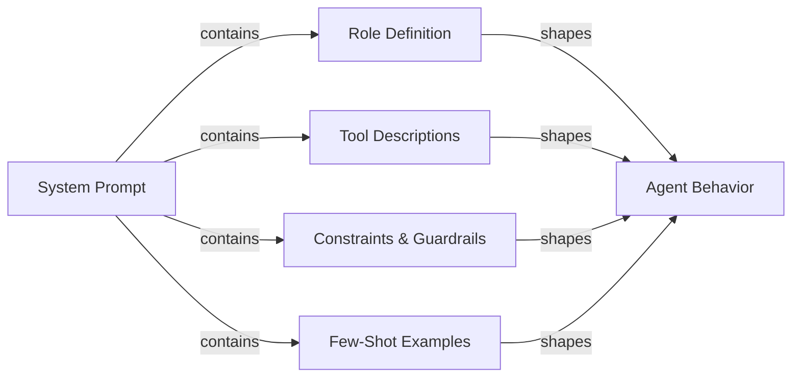

# Agenten-Prompt Engineering

## Definition

Agenten-Prompt Engineering ist die Kunst, System-Prompts und Werkzeugdefinitionen zu schreiben, die zuverlässig das gewünschte Verhalten eines KI-Agenten erzeugen. Anders als das Prompt Engineering für einen Single-Turn-Chatbot – wo es hauptsächlich um Format und Ton geht – müssen Agenten-Prompts mehrstufiges Reasoning, Werkzeugauswahl-Disziplin, Einhaltung von Einschränkungen, Fehlerwiederherstellung und Abbruchbedingungen über eine unbegrenzte Sequenz von Schritten hinweg steuern. Ein schlecht geschriebener Agenten-Prompt erzeugt Agenten, die endlos schleifen, Werkzeuge mit falschen Argumenten aufrufen, Benutzereinschränkungen ignorieren oder Ergebnisse konfabulieren, wenn Werkzeuge fehlschlagen.

Der System-Prompt ist die Verfassung des Agenten. Er definiert, was der Agent ist, was er tun kann, was er niemals tun darf, wie er denken sollte und wie seine Ausgabe aussehen soll. Da LLMs sehr empfindlich auf Formulierung, Struktur und Reihenfolge reagieren, können kleine Änderungen am System-Prompt große Verhaltenseffekte haben. Agenten-Prompt Engineering ist daher eine iterative, empirische Disziplin: Sie schreiben einen Prompt, evaluieren ihn gegen einen Aufgabendatensatz, identifizieren Fehlermodi und verfeinern. Tools wie LangSmith und DeepEval (siehe [Evaluation](/docs/agents/evaluation)) machen diese Feedback-Schleife schneller.

Gute Agenten-Prompts sind modular und explizit. Sie trennen Rollendefinition, Fähigkeitsdeklaration, Einschränkungsspezifikation, Ausgabeformat-Regeln und Few-Shot-Beispiele in klar abgegrenzte Abschnitte. Diese Struktur erleichtert die Pflege, Prüfung und Erweiterung von Prompts, wenn sich die Fähigkeiten des Agenten weiterentwickeln. Sie hilft dem LLM auch, den richtigen „Modus" für jeden Abschnitt zu aktivieren, anstatt Belange zu vermischen.

## Funktionsweise



### Rollendefinition

Die Rollendefinition teilt dem Agenten mit, wer er ist, was sein primärer Zweck ist und welche Persona er annehmen soll. Eine gute Rollendefinition ist spezifisch: „Sie sind ein Senior Software Engineer, spezialisiert auf Python und PostgreSQL, der Entwicklern bei der Behebung von Produktionsproblemen hilft" ist nützlicher als „Sie sind ein hilfreicher Assistent." Spezifität aktiviert relevantes Wissen und setzt einen angemessenen Antworton. Die Rolle sollte auch das Verhältnis des Agenten zum Benutzer (Kollege, Assistent, Experte) festlegen, was beeinflusst, wie der Agent mit Unsicherheit und Meinungsverschiedenheiten umgeht. Halten Sie die Rollendefinition prägnant (3-5 Sätze) und platzieren Sie sie an erster Stelle im System-Prompt, damit sie alle nachfolgenden Anweisungen rahmt.

### Werkzeugbeschreibungen und Werkzeugauswahl

Jedes Werkzeug, auf das der Agent Zugang hat, muss präzise beschrieben werden. Werkzeugname, Beschreibung, Parameternamen, Parametertypen und Rückgabeformat sollten alle angegeben werden. Mehrdeutige Werkzeugbeschreibungen sind eine der häufigsten Ursachen für falsche Werkzeugauswahl und fehlerhafte Argumente. Fügen Sie hinzu: was das Werkzeug tut, wann es verwendet werden soll (und kritisch, wann nicht), welche Eingaben es erwartet und welches Ausgabeformat zu erwarten ist. Für Werkzeuge mit ähnlichen Zwecken fügen Sie explizite Disambiguierung hinzu: „Verwenden Sie `search_web` für aktuelle Ereignisse und Nachrichten; verwenden Sie `search_documents` für Abfragen der internen Firmenwissensdatenbank." Few-Shot-Beispiele korrekter Werkzeugaufrufungen (innerhalb des System-Prompts oder als Konversationsverlauf) reduzieren Fehler bei der Werkzeugauswahl erheblich.

### Chain-of-Thought für Agenten

Chain-of-Thought (CoT)-Prompting bittet den Agenten, explizit zu denken, bevor er handelt. Bei Agenten bedeutet dies, darüber nachzudenken: Was fragt der Benutzer, welche Informationen habe ich, welche Informationen brauche ich, welches Werkzeug sollte ich als nächstes aufrufen, und wie erwarte ich, dass das Ergebnis aussieht. Den Agenten anzuweisen, vor dem Handeln zu denken („Bevor Sie ein Werkzeug aufrufen, skizzieren Sie kurz Ihren Plan"), verbessert die Genauigkeit bei komplexen mehrstufigen Aufgaben und macht Traces interpretierbarer. Einige Frameworks (ReAct, siehe [ReAct](/docs/reasoning-patterns/react)) formalisieren dies als Gedanke/Aktion/Beobachtungs-Zyklen. Seien Sie explizit im Prompt, ob das Reasoning in der Ausgabe oder nur im Entwurfsblock sein soll.

### Einschränkungen und Guardrails in Prompts

Einschränkungen definieren, was der Agent nicht tun darf. Sie sollten möglichst positiv formuliert werden („immer um Bestätigung bitten, bevor Daten gelöscht werden") anstatt nur negativ („niemals Daten löschen ohne Nachfragen"). Fügen Sie hinzu: Bereichseinschränkungen (nur Fragen zu X beantworten), Ausgabeeinschränkungen (immer auf Englisch antworten, immer gültiges JSON verwenden), Verhaltenseinschränkungen (niemals URLs oder Dateipfade erfinden) und Sicherheitseinschränkungen (niemals schädliche Inhalte generieren). Guardrails in Prompts sind eine erste Verteidigungslinie, kein Ersatz für technische Kontrollen (siehe [Sicherheit](/docs/agents/security)); sie sind am wirksamsten, wenn sie das genaue erwartete Verhalten in Grenzfällen spezifizieren.

### Ausgabeformat-Spezifikation

Agenten, die strukturierte Ausgaben erzeugen (JSON, Markdown, Funktionsaufrufe), benötigen explizite Format-Anweisungen. Geben Sie das genaue Schema, Feldnamen, Typen und erforderliche vs. optionale Felder an. Fügen Sie ein gültiges Beispiel in den Prompt ein. Für Werkzeugaufruf-Agenten klären Sie, wann eine Endantwort zurückgegeben werden soll versus weiterhin Werkzeuge aufgerufen werden sollen, und wie die Abbruchbedingung aussieht. Wenn der Agent mit nachgelagerten Systemen interagiert, ist das Ausgabeformat ein Vertrag; Mehrdeutigkeit hier überträgt sich in fehlerhafte Integrationen.

## Wann verwenden / Wann NICHT verwenden

| Verwenden wenn | Vermeiden wenn |
|---|---|
| Agent mehrere Werkzeuge aufruft und die Werkzeugauswahl inkonsistent ist | Den System-Prompt als einmalige Einrichtung behandeln, die nie überarbeitet wird |
| Agent schleift oder bricht vorzeitig ab ohne die Aufgabe zu erfüllen | Einen riesigen Fließtext-Prompt ohne Struktur oder Abschnitte schreiben |
| Agent ignoriert Benutzereinschränkungen oder verletzt Sicherheitsrichtlinien | Sich ausschließlich auf die Standardvorgaben des Modells verlassen ohne Rollen- oder Einschränkungsspezifikation |
| Neues LLM eingebunden wird und Verhalten vom vorherigen Modell übertragen werden soll | Neue Anweisungen ad hoc hinzufügen ohne Regression-Evaluation |
| Mehrstufiger Workflow mit deterministischen Ausgabeformat-Anforderungen gebaut wird | Erwarten, dass der Prompt allein Sicherheitsbedrohungen bewältigt (technische Kontrollen verwenden) |

## Vergleiche

| Prompt-Element | Zweck | Häufige Fehler |
|---|---|---|
| Rollendefinition | Setzt Persona, Expertise und Ton | Zu vage („hilfreicher Assistent") oder zu lang; Platzierung nach anderen Abschnitten |
| Werkzeugbeschreibungen | Leitet korrekte Werkzeugauswahl und Argumentbildung | Fehlende Wann/Wann-nicht-Anleitung; keine Beispielaufrufungen |
| Einschränkungen | Erzwingt Bereich, Sicherheit und Formatgrenzen | Nur negative Einschränkungen („niemals X tun") ohne Angabe der korrekten Alternative |
| Chain-of-Thought-Anweisung | Verbessert Reasoning-Genauigkeit bei komplexen Aufgaben | Reasoning in den Werkzeugaufruf-Output mischen, wenn es im Entwurfsblock bleiben soll |
| Few-Shot-Beispiele | Demonstriert erwartetes Verhalten für Werkzeug-Nutzung und Ausgabeformat | Beispiele, die zu einfach sind, um echte Randfälle darzustellen |

## Vor- und Nachteile

| Vorteile | Nachteile |
|---|---|
| Sofortige Wirkung: kein Fine-Tuning oder Retraining erforderlich | Prompt-Empfindlichkeit bedeutet kleine Formulierungsänderungen können Verhalten brechen |
| Modulare Struktur macht Pflege und Prüfung unkompliziert | Lange Prompts verbrauchen Token bei jedem Aufruf und erhöhen die Kosten |
| Few-Shot-Beispiele reduzieren Fehler bei der Werkzeugauswahl erheblich | Anweisungen können konfliktieren; LLMs priorisieren möglicherweise spätere Anweisungen |
| Einschränkungen bieten eine erste Verteidigungslinie gegen Missbrauch | Prompts sind für das Modell sichtbar, aber nicht kryptografisch geschützt |
| Chain-of-Thought verbessert Genauigkeit und Trace-Interpretierbarkeit | Übermäßige Verhaltensangabe kann den Agenten bei Randfällen brüchig machen |

## Code-Beispiele

```python
# Well-structured agent system prompt with tool definitions
# pip install anthropic

import os
import json
import anthropic

# ---------------------------------------------------------------------------
# Tool definitions with precise descriptions
# ---------------------------------------------------------------------------

TOOLS = [
    {
        "name": "search_documents",
        "description": (
            "Search the internal company knowledge base for documents, policies, and procedures. "
            "Use this tool when the user asks about internal processes, company policies, or "
            "historical project information. Do NOT use this for current news or external information."
        ),
        "input_schema": {
            "type": "object",
            "properties": {
                "query": {
                    "type": "string",
                    "description": "The search query. Use specific keywords; avoid vague terms.",
                },
                "max_results": {
                    "type": "integer",
                    "description": "Maximum number of results to return. Default 5. Max 20.",
                    "default": 5,
                },
            },
            "required": ["query"],
        },
    },
    {
        "name": "create_ticket",
        "description": (
            "Create a support ticket in the project management system. "
            "Use this ONLY after confirming the details with the user. "
            "Never call this tool without explicit user confirmation of the ticket content."
        ),
        "input_schema": {
            "type": "object",
            "properties": {
                "title": {
                    "type": "string",
                    "description": "Short, descriptive title (under 80 characters).",
                },
                "description": {
                    "type": "string",
                    "description": "Full description of the issue or request.",
                },
                "priority": {
                    "type": "string",
                    "enum": ["low", "medium", "high", "critical"],
                    "description": "Ticket priority. Ask the user if unclear.",
                },
                "assignee": {
                    "type": "string",
                    "description": "Email address of the assignee. Optional.",
                },
            },
            "required": ["title", "description", "priority"],
        },
    },
]

# ---------------------------------------------------------------------------
# System prompt with all sections
# ---------------------------------------------------------------------------

SYSTEM_PROMPT = """
## Role
You are a senior IT support specialist for Acme Corp, helping internal employees resolve
technical issues and navigate company processes. You are thorough, patient, and always
confirm destructive actions before proceeding. You do not have access to external systems
or the public internet.

## Capabilities
You have access to two tools:
- `search_documents`: Search the internal knowledge base. Use this to find policies,
  procedures, troubleshooting guides, and historical decisions.
- `create_ticket`: Create a support ticket. ALWAYS confirm ticket details with the user
  before calling this tool.

## Reasoning approach
Before calling any tool, briefly state your plan in one sentence (e.g., "I'll search for
the VPN setup guide first."). After receiving tool results, summarize what you found and
what you'll do next. If a tool returns no results, say so and ask the user for more
details rather than guessing.

## Constraints
- Only answer questions about Acme Corp's internal systems and processes.
- If asked about external topics (competitor products, news, general knowledge),
  politely decline and redirect to your area of expertise.
- Never make up document names, ticket IDs, or employee contact information.
- If you do not know the answer and cannot find it in the knowledge base, say so clearly.
- Never create a ticket without explicit user confirmation of the title, description,
  and priority.
- Always respond in clear, professional English, regardless of the user's language.

## Output format
- For search results: summarize the key points in 2-4 bullet points, then offer to help
  with a follow-up action.
- For ticket creation: confirm the ticket details in a structured block before calling
  the tool, wait for user approval, then report the created ticket ID.
- Keep responses concise: under 300 words unless the user asks for more detail.

## Examples of correct tool use

Example 1 — searching the knowledge base:
User: "How do I request VPN access?"
Plan: I'll search the knowledge base for VPN access request procedures.
[call search_documents with query="VPN access request procedure"]
Response: summarize results in bullet points.

Example 2 — creating a ticket with confirmation:
User: "Can you create a ticket to fix my broken monitor?"
Response: "I'll create a ticket with these details — please confirm:
- Title: Broken monitor replacement request
- Description: User's monitor is not functioning; replacement needed.
- Priority: medium
Shall I proceed?"
[wait for user confirmation before calling create_ticket]
"""

# ---------------------------------------------------------------------------
# Simulated tool implementations
# ---------------------------------------------------------------------------

def search_documents(query: str, max_results: int = 5) -> list[dict]:
    """Simulated knowledge base search."""
    # In production, this calls a vector database or search API
    return [
        {
            "title": "VPN Access Request Process",
            "summary": "Submit an IT request form via the portal. Approval takes 1-2 business days.",
            "url": "internal://kb/vpn-access",
        }
    ][:max_results]


def create_ticket(title: str, description: str, priority: str, assignee: str = "") -> dict:
    """Simulated ticket creation."""
    return {
        "ticket_id": "TICK-4821",
        "title": title,
        "priority": priority,
        "status": "open",
        "assignee": assignee or "unassigned",
    }


def dispatch_tool(tool_name: str, tool_input: dict) -> str:
    """Route tool calls to their implementations."""
    if tool_name == "search_documents":
        results = search_documents(**tool_input)
        return json.dumps(results, indent=2)
    elif tool_name == "create_ticket":
        result = create_ticket(**tool_input)
        return json.dumps(result, indent=2)
    else:
        return json.dumps({"error": f"Unknown tool: {tool_name}"})


# ---------------------------------------------------------------------------
# Agent loop
# ---------------------------------------------------------------------------

def run_support_agent(user_message: str) -> str:
    """Run the support agent with the structured system prompt."""
    client = anthropic.Anthropic(api_key=os.environ["ANTHROPIC_API_KEY"])
    messages = [{"role": "user", "content": user_message}]

    while True:
        response = client.messages.create(
            model="claude-opus-4-5",
            max_tokens=1024,
            system=SYSTEM_PROMPT,
            tools=TOOLS,
            messages=messages,
        )

        # Append assistant response to conversation history
        messages.append({"role": "assistant", "content": response.content})

        if response.stop_reason == "end_turn":
            # Extract text response
            for block in response.content:
                if hasattr(block, "text"):
                    return block.text
            return ""

        elif response.stop_reason == "tool_use":
            # Process all tool calls in this response
            tool_results = []
            for block in response.content:
                if block.type == "tool_use":
                    print(f"  [Tool call] {block.name}({json.dumps(block.input)})")
                    result = dispatch_tool(block.name, block.input)
                    tool_results.append({
                        "type": "tool_result",
                        "tool_use_id": block.id,
                        "content": result,
                    })

            messages.append({"role": "user", "content": tool_results})

        else:
            # Unexpected stop reason
            return f"Agent stopped unexpectedly: {response.stop_reason}"


# ---------------------------------------------------------------------------
# Example run
# ---------------------------------------------------------------------------
if __name__ == "__main__":
    queries = [
        "How do I request VPN access for a new employee?",
        "What's the weather like in São Paulo today?",  # Out of scope — should be declined
    ]
    for query in queries:
        print(f"\nUser: {query}")
        answer = run_support_agent(query)
        print(f"Agent: {answer}")
```

## Praktische Ressourcen

- [Anthropic - Prompt engineering overview](https://docs.anthropic.com/en/docs/build-with-claude/prompt-engineering/overview) — Anthropics offizielle Anleitungen zu System-Prompt-Struktur, Rollendefinition und Chain-of-Thought für Claude-Modelle.
- [Anthropic - Tool use documentation](https://docs.anthropic.com/en/docs/build-with-claude/tool-use) — Vollständige Referenz für das Schreiben von Werkzeugdefinitionen, den Umgang mit Werkzeugaufrufen und das Strukturieren von Werkzeug-Nutzungs-Gesprächen mit Claude.
- [OpenAI - Prompt engineering guide](https://platform.openai.com/docs/guides/prompt-engineering) — Grundlegende Techniken für strukturiertes Prompting, einschließlich Few-Shot-Beispiele, explizite Format-Anweisungen und Einschränkungsspezifikation.
- [ReAct: Synergizing Reasoning and Acting in Language Models](https://arxiv.org/abs/2210.03629) — Originales Paper, das das Gedanke/Aktion/Beobachtungs-Prompting-Muster beschreibt, das den meisten Agenten-Frameworks zugrunde liegt.

## Siehe auch

- [Agents](/docs/agents)
- [Prompt engineering](/docs/prompt-engineering)
- [Agent tools and actions](/docs/agents/tools-actions)
- [Anthropic tool use](/docs/agents/anthropic-tool-use)
