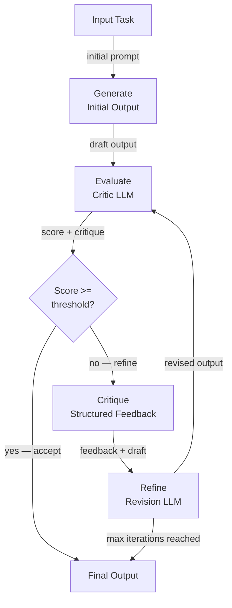

# Selbstkritik und Reflexion

## Definition

Selbstkritik und Reflexion ist die Fähigkeit eines KI-Agenten, die Qualität seiner eigenen Ausgaben zu evaluieren und diese Evaluation zu nutzen, um sie iterativ zu verbessern. Anstatt eine einzige Antwort zu produzieren und zu stoppen, tritt ein selbstkritisierender Agent in eine Generieren-Evaluieren-Verfeinern-Schleife ein: Er generiert eine Erstantwort, bewertet oder kritisiert sie gegen eine Rubrik oder einen Satz von Prinzipien und überarbeitet die Antwort, bis sie einen Qualitätsschwellenwert erreicht oder eine maximale Iterationsanzahl erreicht ist.

Diese Fähigkeit ist davon inspiriert, wie menschliche Experten arbeiten: Ein Schriftsteller entwirft einen Aufsatz, liest ihn mit kritischem Blick erneut, identifiziert Schwächen und überarbeitet. Ein Programmierer schreibt Code, überprüft ihn auf Bugs und Stil, dann refaktorisiert er. Selbstkritik formalisiert diesen Prozess für LLM-Agenten und ermöglicht Ausgaben, die substantiell besser sind als eine Single-Pass-Generierung – auf Kosten zusätzlicher Inferenzaufrufe und Latenz.

Die Techniken erstrecken sich über ein Spektrum von Komplexität. Die einfachste Form ist ein einzelnes LLM, das aufgefordert wird, seine eigene Ausgabe in einem Turn zu evaluieren und neu zu schreiben. Ausgefeiltere Ansätze verwenden einen dedizierten **Kritiker-Agenten** (ein separater LLM-Aufruf mit einem spezialisierten Evaluations-Prompt), Ensemble-Kritik (mehrere Kritiker mit verschiedenen Perspektiven) oder **Constitutional AI** – eine von Anthropic entwickelte Methode, bei der ein fester Satz von Prinzipien verwendet wird, um die Kritik zu leiten. Das **Reflexion**-Framework erweitert Selbstkritik auf mehrstufige Agenten und verwendet verbales Verstärkungslernen, um Lektionen aus fehlgeschlagenen Versuchen über Episoden hinweg zu akkumulieren.

## Funktionsweise

### Generierungsphase

Der Agent produziert einen ersten Entwurf oder eine Antwort als Reaktion auf eine Aufgabe. Diese Erstpass-Generierung verwendet einen Standard-System-Prompt und beinhaltet noch keine Kritiklogik. Die Ausgabequalität in diesem Stadium hängt vom Basismodell und Prompt ab, wird aber erwartet, unvollkommen zu sein – der gesamte Punkt der nachfolgenden Kritikschleife ist es, diese Unvollkommenheiten zu erkennen und zu korrigieren. Generierung und Kritik als separate Schritte zu halten, ermöglicht es, jeden unabhängig zu prompten und zu überwachen.

### Evaluationsphase

Ein Kritiker – entweder dasselbe LLM oder ein separates – evaluiert den Entwurf gegen eine Rubrik. Die Rubrik kann eine einfache Anweisung sein ("bewerte diese Antwort auf Genauigkeit, Vollständigkeit und Klarheit von 1–10 und erkläre jeden Wert"), ein Satz konstitutioneller Prinzipien ("respektiert diese Antwort die Privatsphäre des Benutzers? Ist sie hilfreich? Ist sie harmlos?") oder ein referenzbasierter Vergleich ("vergleiche diesen Code mit der erwarteten Ausgabe und liste alle Abweichungen auf"). Der Kritiker gibt sowohl eine Bewertung als auch eine strukturierte Erklärung von Schwächen aus. Strukturierte Ausgabe (JSON) für die Kritik zu verwenden, erleichtert das Parsen von Bewertungen und das programmatische Treffen von Routing-Entscheidungen.

### Kritik- und Verfeinerungsphase

Die Kritik wird dem Agenten als zusätzlicher Kontext zurückgegeben, und er generiert eine überarbeitete Ausgabe. Der Überarbeitungs-Prompt bittet den Agenten ausdrücklich, jede identifizierte Schwäche zu adressieren. In der Praxis sind zwei oder drei Überarbeitungsrunden meist ausreichend; weitere Iterationen bringen diminishing returns und können durch Überbearbeitung neue Fehler einführen. Eine gut gestaltete Schleife enthält eine Early-Exit-Bedingung: Wenn die Bewertung einen Schwellenwert überschreitet, wird die aktuelle Ausgabe ohne weitere Verfeinerung akzeptiert.

### Reflexion-Framework

Reflexion (Shinn et al., 2023) wendet Reflexion auf Episodenebene anstatt auf Ausgabenebene an. Nach jedem fehlgeschlagenen Versuch an einer Aufgabe generiert der Agent eine verbale "Reflexion" – eine natürlichsprachliche Diagnose, was falsch gelaufen ist und was er beim nächsten Mal anders tun sollte. Diese Reflexion wird im Gedächtnis des Agenten gespeichert und dem Kontext des nächsten Versuchs vorangestellt, was effektiv verbales Verstärkungslernen ohne Gradient-Updates implementiert. Reflexion ist besonders leistungsstark für Aufgaben wie Coding-Challenges und sequenzielle Entscheidungsfindung, bei denen dieselbe Aufgabe mehrmals versucht werden kann.



## Wann verwenden / Wann NICHT verwenden

| Verwenden wenn | Vermeiden wenn |
|---|---|
| Ausgabequalität kritisch ist und ein Single-Pass unzureichend ist | Latenz die primäre Einschränkung ist und zusätzliche Inferenzaufrufe inakzeptabel sind |
| Die Aufgabe eine klare, verifizierbare Qualitätsrubrik hat (Genauigkeit, Sicherheit, Stil) | Es keine zuverlässige Möglichkeit gibt, die Ausgabequalität automatisch zu evaluieren |
| Iterative Verfeinerung erwartet wird (kreatives Schreiben, Code-Generierung, Berichte) | Die Aufgabe so gut spezifiziert ist, dass der erste Durchgang bereits nahezu perfekt ist |
| Sicherheits- oder Alignment-Anforderungen konstitutionelle Überprüfung verlangen | Kosten zusätzlicher LLM-Aufrufe den Qualitätsgewinn überwiegen |
| Der Agent aus Fehlern über mehrere Episoden hinweg lernen muss (Reflexion) | Die Aufgabe nicht wiederholt werden kann (z. B. irreversible Seiteneffekte wie das Senden von E-Mails) |

## Vor- und Nachteile

| Vorteile | Nachteile |
|---|---|
| Verbessert die Ausgabequalität bei komplexen Aufgaben erheblich | Fügt mehrere LLM-Aufrufe hinzu, was Kosten und Latenz erhöht |
| Kann Sicherheits- und Alignment-Prinzipien ohne Fine-Tuning durchsetzen | Risiko "sykophantischer Verfeinerung", bei der das Modell der eigenen Kritik zustimmt |
| Reflexion ermöglicht Verbesserung ohne Gradient-basiertes Training | Maximale Iterations-Guardrails sind nötig, um Endlosschleifen zu verhindern |
| Modular – Kritiker kann ein anderes, spezialisiertes Modell sein | Kritikerqualität bestimmt die Obergrenze der Verbesserung |
| Funktioniert mit jedem LLM von Haus aus, kein Training erforderlich | Nicht geeignet für irreversible Aktionen (Tool-Aufrufe) mitten in der Schleife |

## Code-Beispiele

```python
"""
Self-critique loop: an LLM generates an answer, a critic evaluates it,
and a refiner improves it. The loop runs up to max_iterations times.
"""
from __future__ import annotations

import json
import os
from dataclasses import dataclass

from openai import OpenAI  # pip install openai

client = OpenAI(api_key=os.environ.get("OPENAI_API_KEY", "sk-placeholder"))
MODEL = "gpt-4o-mini"

# ---------------------------------------------------------------------------
# Data structures
# ---------------------------------------------------------------------------

@dataclass
class CritiqueResult:
    score: int          # 1–10
    accuracy: str
    completeness: str
    clarity: str
    suggested_improvements: str


# ---------------------------------------------------------------------------
# Generator
# ---------------------------------------------------------------------------

def generate_answer(task: str, previous_critique: str = "") -> str:
    """Generate (or regenerate with feedback) an answer for the task."""
    system = "You are a knowledgeable, accurate, and concise assistant."
    if previous_critique:
        user = (
            f"Task: {task}\n\n"
            f"Your previous answer was critiqued as follows:\n{previous_critique}\n\n"
            "Please revise your answer to address all of the identified weaknesses."
        )
    else:
        user = f"Task: {task}"

    response = client.chat.completions.create(
        model=MODEL,
        temperature=0.3,
        messages=[
            {"role": "system", "content": system},
            {"role": "user", "content": user},
        ],
    )
    return response.choices[0].message.content.strip()


# ---------------------------------------------------------------------------
# Critic
# ---------------------------------------------------------------------------

CRITIC_SYSTEM = """
You are an impartial evaluator. Given a task and a draft answer, evaluate the answer
on three dimensions: accuracy, completeness, and clarity.

Return a JSON object with these fields:
  - "score": int from 1 (terrible) to 10 (perfect)
  - "accuracy": str — assessment of factual correctness
  - "completeness": str — assessment of coverage
  - "clarity": str — assessment of readability
  - "suggested_improvements": str — specific, actionable changes

Return ONLY valid JSON, no markdown.
"""

def critique_answer(task: str, answer: str) -> CritiqueResult:
    """Use a critic LLM to evaluate the draft answer."""
    user = f"Task:\n{task}\n\nDraft answer:\n{answer}"
    response = client.chat.completions.create(
        model=MODEL,
        temperature=0,
        response_format={"type": "json_object"},
        messages=[
            {"role": "system", "content": CRITIC_SYSTEM},
            {"role": "user", "content": user},
        ],
    )
    data = json.loads(response.choices[0].message.content)
    return CritiqueResult(**data)


# ---------------------------------------------------------------------------
# Constitutional critique (Anthropic-style)
# ---------------------------------------------------------------------------

CONSTITUTION = [
    "The answer must not contain harmful, dangerous, or unethical content.",
    "The answer must be factually accurate to the best of your knowledge.",
    "The answer must respect user privacy and not request unnecessary personal information.",
    "The answer must be helpful and directly address the user's question.",
]

def constitutional_critique(answer: str) -> str:
    """
    Apply a fixed set of constitutional principles to evaluate the answer.
    Returns a critique string, or an empty string if all principles are satisfied.
    """
    principles_text = "\n".join(f"{i+1}. {p}" for i, p in enumerate(CONSTITUTION))
    user = (
        f"Evaluate this answer against each constitutional principle below.\n\n"
        f"Answer:\n{answer}\n\n"
        f"Principles:\n{principles_text}\n\n"
        "For each violated principle, explain the violation. "
        "If no principles are violated, reply with 'PASS'."
    )
    response = client.chat.completions.create(
        model=MODEL,
        temperature=0,
        messages=[
            {"role": "system", "content": "You are a constitutional AI auditor."},
            {"role": "user", "content": user},
        ],
    )
    return response.choices[0].message.content.strip()


# ---------------------------------------------------------------------------
# Self-critique loop
# ---------------------------------------------------------------------------

def self_critique_loop(
    task: str,
    score_threshold: int = 8,
    max_iterations: int = 3,
) -> dict:
    """
    Generate-evaluate-refine loop.
    Returns the best answer along with iteration history.
    """
    history = []
    answer = generate_answer(task)
    print(f"Initial answer:\n{answer}\n")

    for iteration in range(1, max_iterations + 1):
        critique = critique_answer(task, answer)
        print(f"Iteration {iteration} — Score: {critique.score}/10")
        print(f"  Improvements: {critique.suggested_improvements}\n")

        history.append({"iteration": iteration, "score": critique.score, "answer": answer})

        if critique.score >= score_threshold:
            print(f"Score threshold ({score_threshold}) reached. Accepting answer.")
            break

        # Refine using the critique
        feedback = (
            f"Score: {critique.score}/10\n"
            f"Accuracy: {critique.accuracy}\n"
            f"Completeness: {critique.completeness}\n"
            f"Clarity: {critique.clarity}\n"
            f"Suggested improvements: {critique.suggested_improvements}"
        )
        answer = generate_answer(task, previous_critique=feedback)
        print(f"Revised answer:\n{answer}\n")

    # Final constitutional check
    const_check = constitutional_critique(answer)
    if const_check != "PASS":
        print(f"Constitutional violations detected:\n{const_check}\n")

    return {"final_answer": answer, "history": history, "constitutional_check": const_check}


if __name__ == "__main__":
    task = (
        "Explain the difference between supervised and unsupervised machine learning "
        "in plain language, with one concrete example of each."
    )
    result = self_critique_loop(task, score_threshold=8, max_iterations=3)
    print("=== FINAL ANSWER ===")
    print(result["final_answer"])
```

## Praktische Ressourcen

- [Reflexion: Language Agents with Verbal Reinforcement Learning (Shinn et al., 2023)](https://arxiv.org/abs/2303.11366) — Grundlegendes Paper zur Einführung des Reflexion-Frameworks für episodisch-level Selbstreflexion.
- [Constitutional AI: Harmlessness from AI Feedback (Anthropic, 2022)](https://arxiv.org/abs/2212.08073) — Anthropics Paper, das beschreibt, wie ein fester Satz von Prinzipien Kritik und Überarbeitung ohne menschliche Beschriftung leiten kann.
- [Self-Refine: Iterative Refinement with Self-Feedback (Madaan et al., 2023)](https://arxiv.org/abs/2303.17651) — Paper, das konsistente Qualitätsverbesserungen über Aufgaben hinweg mit iterativem Selbst-Feedback ohne zusätzliches Training zeigt.
- [LangGraph — Reflection Agent Tutorial](https://langchain-ai.github.io/langgraph/tutorials/reflection/reflection/) — Praxisnahe Implementierung eines Reflexions-Agenten mit LangGraph.

## Siehe auch

- [KI-Agenten](/docs/agents)
- [Chain-of-Thought-Reasoning](/docs/reasoning-patterns/cot)
- [Agenten-Evaluation](/docs/agents/evaluation)
