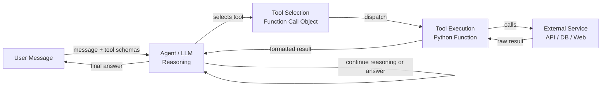

# Agenten-Tools und -Aktionen

## Definition

Tools und Aktionen sind die Hände eines KI-Agenten. Während das LLM Reasoning und Sprachverständnis bereitstellt, geben Tools dem Agenten die Fähigkeit, die Welt zu beeinflussen: das Web zu durchsuchen, Code auszuführen, eine Datenbank abzufragen, Nachrichten zu senden oder eine externe API aufzurufen. Ohne Tools ist ein Agent auf das beschränkt, was er aus seinen Trainingsdaten weiß; mit Tools kann er auf Echtzeit-Informationen zugreifen, Berechnungen durchführen und Aktionen mit Seiteneffekten ausführen.

In den OpenAI- und Anthropic-Ökosystemen wird der Mechanismus für Tool Use als **function calling** (OpenAI) oder **tool use** (Anthropic) bezeichnet. Der Entwickler definiert eine Reihe von Tool-Schemas – strukturierte JSON-Beschreibungen des Namens, Zwecks und der Parameter jedes Tools – und schließt sie in die API-Anfrage ein. Wenn das LLM entscheidet, dass ein Tool benötigt wird, gibt es ein strukturiertes Tool-Aufruf-Objekt zurück anstatt Klartext. Der aufrufende Code führt das Tool aus und speist das Ergebnis in die Konversation zurück. Diese Schleife wiederholt sich, bis der Agent eine endgültige Antwort produziert.

Die Bandbreite verfügbarer Tools ist im Wesentlichen unbegrenzt: Wenn sich etwas als Python-Funktion ausdrücken lässt, kann es ein Tool sein. Häufige Kategorien umfassen Websuche, Code-Ausführungs-Sandboxes, SQL- oder NoSQL-Datenbankabfragen, Dateisystemzugriff, REST-API-Aufrufe, E-Mail- und Messaging-Integrationen sowie Computer-Use-Tools, die mit GUIs interagieren. Das Entwerfen guter Tools – mit klaren Schemas, vorhersehbarem Verhalten und hilfreichen Fehlermeldungen – ist eines der wirkungsvollsten Dinge, die ein Entwickler tun kann, um die Agenten-Zuverlässigkeit zu verbessern.

## Funktionsweise

### Tool-Schema-Definition

Jedes Tool wird durch ein Schema beschrieben, das das LLM verwendet, um zu verstehen, wann und wie es aufzurufen ist. Ein Schema enthält: einen Namen (kurzer, snake_case-Bezeichner), eine Beschreibung (klare natürlichsprachliche Erklärung, was das Tool tut und wann es zu verwenden ist) und ein Parameter-Objekt (JSON Schema, das jedes Argument beschreibt: Name, Typ, Beschreibung und ob es erforderlich ist). Die Qualität der Beschreibung beeinflusst direkt, wie zuverlässig der Agent das Tool korrekt auswählt und aufruft. Vage Beschreibungen führen zu Fehlgebrauch; präzise Beschreibungen mit Beispielen führen zu genauen Tool-Aufrufen.

### Tool-Auswahl

Wenn das LLM eine Benutzernachricht zusammen mit einer Reihe von Tool-Schemas empfängt, entscheidet es bei jedem Schritt, ob es direkt antwortet oder ein Tool aufruft. Diese Entscheidung wird implizit beim Fine-Tuning auf Function-Calling-Daten gelernt. In der Praxis wird die Tool-Auswahl durch den System-Prompt (der den Agenten anweisen kann, wann bestimmte Tools zu bevorzugen sind), die Spezifität der Tool-Beschreibungen und das Vertrauen des Modells beeinflusst, ob es aus den Trainingsdaten allein antworten kann. Die Bereitstellung eines `tool_choice`-Parameters kann die Tool-Auswahl programmatisch erzwingen oder einschränken.

### Tool-Ausführung und Ergebnis-Injektion

Wenn das LLM einen Tool-Aufruf ausgibt, fängt der aufrufende Code ihn ab, validiert die Argumente gegen das Schema, führt die entsprechende Funktion aus und erhält ein Ergebnis. Dieses Ergebnis – ob ein String, JSON-Objekt oder eine Fehlermeldung – wird als `tool`-Rollennachricht formatiert und der Konversationshistorie angehängt. Das LLM generiert dann den nächsten Schritt mit vollständiger Kenntnis der Tool-Ausgabe. Fehlermeldungen von fehlgeschlagenen Tool-Aufrufen sind wichtig: Der Agent muss wissen, dass ein Tool fehlgeschlagen ist, damit er erneut versuchen, eine Alternative versuchen oder den Benutzer um Klärung bitten kann.

### Multi-Tool- und parallele Tool-Aufrufe

Moderne LLM-APIs unterstützen parallele Tool-Aufrufe: Das Modell kann mehrere Tool-Invokationen in einer einzigen Antwort anfordern, wenn es feststellt, dass sie unabhängig sind. Beispielsweise könnte ein Agent `web_search` für drei verschiedene Abfragen gleichzeitig aufrufen anstatt sequenziell, was die Latenz um zwei Drittel reduziert. Der aufrufende Code führt alle Tools parallel aus, sammelt die Ergebnisse und speist sie zusammen in den nächsten Turn ein. Tools wo möglich zustandslos und idempotent zu gestalten, maximiert den Nutzen der parallelen Ausführung.



## Wann verwenden / Wann NICHT verwenden

| Verwenden wenn | Vermeiden wenn |
|---|---|
| Der Agent Echtzeit- oder externe Informationen benötigt, die nicht in den Trainingsdaten sind | Die Aufgabe vollständig aus dem Wissen des Modells beantwortet werden kann |
| Aktionen mit Seiteneffekten erforderlich sind (E-Mail senden, Datei schreiben, DB aktualisieren) | Tools Sicherheitsrisiken ohne ordnungsgemäßes Sandboxing oder Rate-Limiting einführen |
| Berechnungen über die Fähigkeiten des LLM hinaus benötigt werden (Arithmetik, Code-Ausführung) | Jeder Tool-Aufruf Latenz hinzufügt und die Aufgabe zeitkritisch ist |
| Strukturierter Datenabruf (SQL-Abfragen, API-Antworten) wesentlich ist | Das Tool-Schema so komplex ist, dass das Modell es häufig missbraucht |
| Mehrere spezialisierte Tools kombiniert werden können, um komplexe Aufgaben zu lösen | Die Fehlerszenarien des Tools nicht wiederherstellbar sind und Schaden verursachen könnten |

## Vor- und Nachteile

| Vorteile | Nachteile |
|---|---|
| Erweitert den Agenten über statische Trainingsdaten hinaus | Jeder Tool-Aufruf fügt Latenz und API-Kosten hinzu |
| Ermöglicht reale Seiteneffekte und Automatisierung | Tool-Missbrauch kann irreversible Aktionen verursachen |
| Unterstützt strukturierte, validierte I/O über JSON Schema | Das Entwerfen klarer Schemas erfordert sorgfältiges Prompt Engineering |
| Parallele Tool-Aufrufe reduzieren die Gesamtantwortzeit | Mehr Tools erhöhen die kognitive Last auf das Modell für die Auswahl |
| Vollständig erweiterbar – jede Python-Funktion kann ein Tool werden | Fehlerbehandlung und Wiederholungen müssen explizit implementiert werden |

## Code-Beispiele

```python
"""
OpenAI function calling example with multiple tools:
- web_search: retrieve current information from the web
- safe_math: evaluate arithmetic using operator-based parsing (no eval)
- get_weather: fetch weather data for a city

The agent loop continues until the LLM produces a final text response
with no tool calls.
"""
from __future__ import annotations

import json
import math
import operator
import os
from typing import Any

from openai import OpenAI  # pip install openai

client = OpenAI(api_key=os.environ.get("OPENAI_API_KEY", "sk-placeholder"))
MODEL = "gpt-4o-mini"

# ---------------------------------------------------------------------------
# Tool implementations
# ---------------------------------------------------------------------------

def web_search(query: str, num_results: int = 3) -> str:
    """
    Mock web search. Replace with a real search API such as
    Tavily (https://tavily.com) or Serper (https://serper.dev).
    """
    return json.dumps({
        "query": query,
        "results": [
            {
                "title": f"Result {i + 1} for '{query}'",
                "snippet": f"Relevant information about {query}.",
            }
            for i in range(min(num_results, 10))
        ],
    })


def safe_math(operation: str, a: float, b: float) -> str:
    """
    Perform basic arithmetic safely using an explicit operator table.
    Supports: add, subtract, multiply, divide, power, sqrt (b unused), log.
    This avoids arbitrary code execution entirely.
    """
    ops: dict[str, Any] = {
        "add": operator.add,
        "subtract": operator.sub,
        "multiply": operator.mul,
        "divide": operator.truediv,
        "power": operator.pow,
        "sqrt": lambda x, _: math.sqrt(x),
        "log": lambda x, base: math.log(x, base) if base else math.log(x),
    }
    if operation not in ops:
        return f"Unknown operation '{operation}'. Supported: {', '.join(ops)}"
    try:
        result = ops[operation](a, b)
        return json.dumps({"operation": operation, "a": a, "b": b, "result": result})
    except (ValueError, ZeroDivisionError, OverflowError) as exc:
        return json.dumps({"error": str(exc)})


def get_weather(city: str, units: str = "celsius") -> str:
    """
    Mock weather API. Replace with OpenWeatherMap or similar.
    """
    mock_data = {
        "city": city,
        "temperature": 22,
        "units": units,
        "condition": "Partly cloudy",
        "humidity_percent": 65,
    }
    return json.dumps(mock_data)


# Map tool names to Python functions
TOOL_FUNCTIONS: dict[str, Any] = {
    "web_search": web_search,
    "safe_math": safe_math,
    "get_weather": get_weather,
}

# ---------------------------------------------------------------------------
# Tool schemas (sent to the LLM with every request)
# ---------------------------------------------------------------------------

TOOLS = [
    {
        "type": "function",
        "function": {
            "name": "web_search",
            "description": (
                "Search the web for current information. Use this tool when the user asks "
                "about recent events, facts that may have changed, or anything that requires "
                "up-to-date information."
            ),
            "parameters": {
                "type": "object",
                "properties": {
                    "query": {
                        "type": "string",
                        "description": "The search query to execute.",
                    },
                    "num_results": {
                        "type": "integer",
                        "description": "Number of results to return (default 3, max 10).",
                        "default": 3,
                    },
                },
                "required": ["query"],
            },
        },
    },
    {
        "type": "function",
        "function": {
            "name": "safe_math",
            "description": (
                "Perform a mathematical operation on two numbers. "
                "Supported operations: add, subtract, multiply, divide, power, sqrt, log. "
                "Use this instead of trying to compute arithmetic mentally."
            ),
            "parameters": {
                "type": "object",
                "properties": {
                    "operation": {
                        "type": "string",
                        "enum": ["add", "subtract", "multiply", "divide", "power", "sqrt", "log"],
                        "description": "The arithmetic operation to perform.",
                    },
                    "a": {
                        "type": "number",
                        "description": "The first operand (or the only operand for sqrt).",
                    },
                    "b": {
                        "type": "number",
                        "description": "The second operand (base for log, ignored for sqrt).",
                    },
                },
                "required": ["operation", "a", "b"],
            },
        },
    },
    {
        "type": "function",
        "function": {
            "name": "get_weather",
            "description": (
                "Get the current weather for a city. Use this tool when the user asks "
                "about weather conditions, temperature, or humidity in a specific location."
            ),
            "parameters": {
                "type": "object",
                "properties": {
                    "city": {
                        "type": "string",
                        "description": "The city name, e.g. 'Tokyo' or 'New York'.",
                    },
                    "units": {
                        "type": "string",
                        "enum": ["celsius", "fahrenheit"],
                        "description": "Temperature units (default: celsius).",
                        "default": "celsius",
                    },
                },
                "required": ["city"],
            },
        },
    },
]

# ---------------------------------------------------------------------------
# Agent loop
# ---------------------------------------------------------------------------

def dispatch_tool_call(tool_call) -> str:
    """Execute a single tool call and return the result as a string."""
    name = tool_call.function.name
    args = json.loads(tool_call.function.arguments)
    print(f"  [Tool call] {name}({args})")

    if name not in TOOL_FUNCTIONS:
        return f"Error: unknown tool '{name}'"

    result = TOOL_FUNCTIONS[name](**args)
    preview = result[:120] + ("..." if len(result) > 120 else "")
    print(f"  [Tool result] {preview}")
    return result


def run_agent(user_message: str, system_prompt: str = "You are a helpful assistant.") -> str:
    """
    Agent loop: send message, handle tool calls, repeat until a final answer is produced.
    """
    messages = [
        {"role": "system", "content": system_prompt},
        {"role": "user", "content": user_message},
    ]

    print(f"User: {user_message}\n")

    max_turns = 10  # Safety limit to prevent infinite loops
    for _ in range(max_turns):
        response = client.chat.completions.create(
            model=MODEL,
            messages=messages,
            tools=TOOLS,
            tool_choice="auto",  # Let the model decide; "none" disables tools
        )
        msg = response.choices[0].message

        # If no tool calls, we have the final answer
        if not msg.tool_calls:
            print(f"\nAssistant: {msg.content}")
            return msg.content

        # Append the assistant message with tool calls to history
        messages.append(msg)

        # Execute all tool calls (for parallel execution use asyncio + concurrent.futures)
        for tool_call in msg.tool_calls:
            result = dispatch_tool_call(tool_call)
            messages.append({
                "role": "tool",
                "tool_call_id": tool_call.id,
                "content": result,
            })

    return "Max turns reached without a final answer."


if __name__ == "__main__":
    # Example 1: requires web search
    run_agent("What are the main differences between GPT-4 and Claude 3?")

    print("\n" + "=" * 60 + "\n")

    # Example 2: requires safe_math tool
    run_agent("What is 2 raised to the power of 16, and what is the square root of that?")

    print("\n" + "=" * 60 + "\n")

    # Example 3: requires weather tool
    run_agent("What's the weather like in London right now?")
```

## Praktische Ressourcen

- [OpenAI Function Calling Leitfaden](https://platform.openai.com/docs/guides/function-calling) — Offizielle Dokumentation zu Tool-Schemas, parallelen Aufrufen und Best Practices für Funktionsdefinitionen.
- [Anthropic Tool Use Dokumentation](https://docs.anthropic.com/en/docs/tool-use) — Anthropics Leitfaden für Tool Use mit Claude, einschließlich Streaming, Computer Use und Multi-Tool-Muster.
- [Tavily AI Search API](https://tavily.com/) — Zweckgebaute Such-API für LLM-Agenten, die saubere strukturierte Ergebnisse ideal für Tool Use liefert.
- [LangChain Tools Konzepte](https://python.langchain.com/docs/concepts/tools/) — Überblick über Tool-Design-Muster in LangChain, einschließlich benutzerdefinierter Tools und eingebauter Integrationen.
- [Gorilla: Large Language Model Connected with Massive APIs (Patil et al., 2023)](https://arxiv.org/abs/2305.15334) — Forschung zum Fine-Tuning von LLMs für genaue API-/Tool-Auswahl über Tausende von Tools hinweg.

## Siehe auch

- [KI-Agenten](/docs/agents)
- [Anthropic Tool Use](/docs/agents/anthropic-tool-use)
- [Überblick über Agent-Frameworks](/docs/agents/frameworks-overview)
