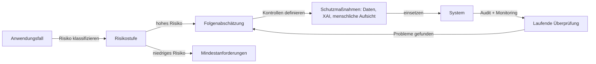

# KI-Ethik

## Definition

KI-Ethik ist das Feld, das sich mit den moralischen Prinzipien, Governance-Strukturen und praktischen Standards befasst, die die Gestaltung, den Einsatz und die Überwachung von KI-Systemen leiten. Zu den Kernprinzipien gehören Fairness (Vermeidung von Diskriminierung), Transparenz (Systeme für Betroffene verständlich machen), Verantwortlichkeit (klare Verantwortung für Ergebnisse zuweisen) und Datenschutz (Respektierung der Datenrechte von Individuen). Diese Prinzipien werden durch Verhaltenskodizes, Folgenabschätzungen, Auditprozesse und zunehmend durch verbindliche Regulierung umgesetzt.

Ethische KI geht nicht nur darum, Schaden zu verhindern — es geht auch darum, aktiv vorteilhafte Ergebnisse für diverse Stakeholder zu fördern. Dies umfasst die Sicherstellung, dass die Vorteile von KI gerecht verteilt werden, dass betroffene Gemeinschaften sinnvolle Rechtsmittel haben, wenn etwas schiefläuft, und dass die KI-Entwicklung keine Macht auf eine Weise konzentriert, die demokratische Institutionen oder individuelle Autonomie untergräbt. Ethik liefert den normativen Rahmen, innerhalb dessen technische Sicherheits- und Fairnessarbeit stattfindet.

In der Praxis verbindet sich KI-Ethik direkt mit [KI-Sicherheit](/docs/ai-safety) bei Risiken und Alignment, mit [Bias in KI](/docs/bias-in-ai) bei Fairness-Ergebnissen und mit [Erklärbarer KI](/docs/xai) bei Transparenzanforderungen. Regulierung setzt Ethik schnell in Recht um: Der EU AI Act führt gestufte Risikoklassifizierung, obligatorische Transparenzpflichten und verbotene Praktiken ein, wodurch Ethik- und Folgenabschätzungen für risikoreiche Anwendungen gesetzlich vorgeschrieben werden. Organisationen müssen nun abstrakte Prinzipien in konkrete Designentscheidungen, [Evaluierungspraktiken](/docs/evaluation-metrics) und Deployment-Kontrollen übersetzen.

## Funktionsweise

### Übersetzung von Prinzip zu Praxis

Ethische Prinzipien werden durch strukturierte Prozesse umsetzbar gemacht. Eine Folgenabschätzung identifiziert, wer von einem System betroffen ist, was schiefgehen könnte, wie schwerwiegend der Schaden wäre und welche Schutzmaßnahmen verfügbar sind. Ethikausschüsse (intern oder extern) bewerten vorgeschlagene Systeme vor dem Einsatz gegen organisatorische und regulatorische Standards.

### Regulatorische Compliance



### Governance-Strukturen

Organisationen implementieren Governance durch Richtlinien für verantwortungsvolle KI, Modellkarten, Datenblätter für Datensätze und Dokumentation von Designentscheidungen und Verantwortlichkeitsketten. Human-in-the-loop-Mechanismen bewahren eine sinnvolle Aufsicht für folgenreiche Entscheidungen. Die Einbeziehung von Stakeholdern stellt sicher, dass betroffene Gemeinschaften Einfluss auf Systeme haben, die sie betreffen.

## Wann verwenden / Wann NICHT verwenden

| Verwenden wenn | Vermeiden wenn |
|----------------|----------------|
| Gestaltung oder Einsatz von KI in regulierten oder risikoreichen Bereichen (Gesundheit, Einstellung, Kredit) | Das System trifft keine folgenreichen Entscheidungen und betrifft keine Menschen direkt |
| Regulierungskonformität erforderlich (EU AI Act, DSGVO, branchenspezifische Regeln) | Die Anwendung ist ein reiner Forschungsprototyp ohne Deploymentpfad |
| Einführung eines öffentlich zugänglichen KI-Produkts oder -Dienstleistung | Alle Ausgaben werden von qualifizierten Menschen überprüft, bevor Maßnahmen ergriffen werden |
| Verwaltung von Drittanbieter-KI-Tools, die Kunden oder Mitarbeiter betreffen | Das Tool ist rein intern und Ergebnisse sind vollständig reversibel |

## Vergleiche

| Konzept | Umfang | Hauptergebnis |
|---------|--------|---------------|
| KI-Ethik | Prinzipien, Governance, Werte | Richtlinien, Folgenabschätzungen, Verantwortlichkeitsrahmen |
| KI-Sicherheit | Technisches Alignment und Risiko | Robustheitstechniken, Leitplanken, Monitoring-Systeme |
| Bias in KI | Fairness über Gruppen hinweg | Fairness-Audits, Debiasing-Methoden, Metriken-Berichte |
| Erklärbare KI | Interpretierbarkeit | Erklärungen, Feature-Attribution, Audit-Tools |

## Vor- und Nachteile

| Vorteile | Nachteile |
|----------|-----------|
| Reduziert rechtliches und Reputationsrisiko | Ethikprüfungen können Entwicklungszyklen verlangsamen |
| Stärkt Nutzer- und öffentliches Vertrauen | Prinzipien sind oft vage und schwer zu operationalisieren |
| Schafft Verantwortlichkeit und Prüfpfade | Fairness-Metriken können sich gegenseitig und mit Genauigkeit widersprechen |
| Fördert proaktive Schadensverhinderung | Globale regulatorische Fragmentierung erhöht die Compliance-Komplexität |

## Codebeispiele

### Einfache Modellkarte generieren (Python)

```python
from dataclasses import dataclass, asdict
import json

@dataclass
class ModelCard:
    model_name: str
    version: str
    intended_use: str
    out_of_scope_use: str
    training_data: str
    evaluation_metrics: list[str]
    known_limitations: str
    ethical_considerations: str
    contact: str

card = ModelCard(
    model_name="loan-approval-classifier",
    version="1.2.0",
    intended_use="Assist loan officers in reviewing consumer loan applications.",
    out_of_scope_use="Fully automated loan decisions without human review.",
    training_data="Internal loan data 2015-2023; balanced by income bracket and region.",
    evaluation_metrics=["accuracy", "F1", "demographic_parity", "equalized_odds"],
    known_limitations="Underperforms for applicants with non-traditional credit histories.",
    ethical_considerations="Reviewed by ethics board Q1 2024. Fairness audited across gender and race.",
    contact="ai-governance@example.com",
)

print(json.dumps(asdict(card), indent=2))
```

## Praktische Ressourcen

- [EU AI Act](https://digital-strategy.ec.europa.eu/en/policies/regulatory-framework-artificial-intelligence) — EU-Regulierungsrahmen mit Risikostufen und Compliance-Anforderungen
- [OECD – KI-Prinzipien](https://oecd.ai/en/ai-principles) — Internationale Prinzipien zu vertrauenswürdiger KI
- [Google – Responsible AI Practices](https://ai.google/responsibility/responsible-ai-practices/) — Praktische Leitfäden zur Anwendung von Ethik in der KI-Entwicklung
- [Model Cards for Model Reporting (Mitchell et al.)](https://arxiv.org/abs/1810.03993) — Grundlegendes Paper zur Transparenzdokumentation
- [AI Now Institute](https://ainowinstitute.org/) — Forschung zu sozialen Auswirkungen von KI

## Siehe auch

- [KI-Sicherheit](/docs/ai-safety)
- [Bias in KI](/docs/bias-in-ai)
- [Erklärbare KI](/docs/xai)
