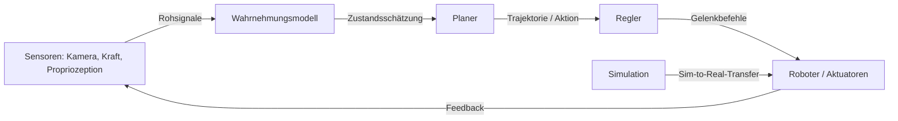

# KI und Robotik

## Definition

KI in der Robotik ist das Feld, das maschinelles Lernen und KI-Techniken auf physische Agenten anwendet, die in der realen Welt agieren. Es umfasst drei Kernprobleme: Wahrnehmung (Verstehen des Zustands der Welt aus Sensordaten), Planung (Entscheidung, was als nächstes zu tun ist) und Steuerung (Ausführung von Aktionen durch Aktuatoren). Im Gegensatz zu rein digitalen KI-Anwendungen müssen Robotersysteme mit physischer Unsicherheit, Latenz und Sicherheitsbeschränkungen in realer Zeit umgehen.

Moderne KI-Robotik nutzt [Reinforcement Learning](/docs/rl), Imitationslernen und [Computer Vision](/docs/cv), um Richtlinien zu trainieren, die direkt aus Sensorinput auf Aktionen abbilden. Ein wichtiges Paradigma ist sim-to-real: Trainieren von Richtlinien in der Simulation (wo Daten günstig sind und Ausfälle sicher sind), dann Übertragen auf echte Hardware. Dies erfordert Domain-Randomisierung, Systemidentifikation und manchmal Online-Anpassung, um die Lücke zwischen Simulations- und Realweltdynamik zu überbrücken.

In der Praxis verbindet sich Robotik mit [tiefem Reinforcement Learning](/docs/drl) für richtlinienbasierte Steuerung, [multimodaler KI](/docs/multimodal-ai) für reichhaltige Sensorwahrnehmung und [Inferenz am Edge](/docs/local-inference) für Echtzeit-Onboard-Verarbeitung. Die Bandbreite reicht von industrieller Manipulation und Lagerhaltung bis hin zu chirurgischen Robotern und autonomer Navigation — jeder Anwendungsfall bringt unterschiedliche Kompromisse zwischen Geschwindigkeit, Präzision und Sicherheitsbeschränkungen mit sich.

## Funktionsweise

### Wahrnehmung-Planung-Steuerungs-Pipeline

Sensoren (Kameras, Kraft/Drehmoment, Propriozeption) fließen in **Wahrnehmungs**modelle ein, die den Zustand schätzen (z. B. Objektposen, Szenenlayout). **Planer** (klassisch oder gelernt) erzeugen Trajektorien oder hochrangige Aktionen (z. B. "Block A greifen"). **Regler** (z. B. PID, gelernte Richtlinie) führen niederstufige Befehle (Gelenkdrehmomente, Geschwindigkeiten) aus, um dem Plan zu folgen.

**End-to-End**-Lernen bildet rohen Sensorinput in einem Netzwerk auf Aktionen ab; **modulare** Pipelines trennen Wahrnehmung, Planung und Steuerung für Interpretierbarkeit und Wiederverwendung. Training erfolgt oft in Simulation ([DRL](/docs/drl)); Sim-to-Real (Domain-Randomisierung, Systemidentifikation) und Sicherheitsbeschränkungen sind kritisch für den Einsatz.



### Sim-to-Real-Transfer

Simulation ermöglicht unbegrenzte Trainingsdaten und sichere Erkundung. Sim-to-Real-Techniken überbrücken die Lücke: Domain-Randomisierung variiert Physikparameter und visuelle Texturen, damit Richtlinien auf echte Variation verallgemeinern. Systemidentifikation kalibriert Simulationsparameter gegen echte Hardware. Residualrichtlinien lernen kleine Korrekturen on top of Simulation.

## Wann verwenden / Wann NICHT verwenden

| Verwenden wenn | Vermeiden wenn |
|----------------|----------------|
| Die Aufgabe erfordert physische Interaktion mit unstrukturierten Umgebungen | Die Aufgabe ist vollständig regelbasiert und deterministisch (klassische Robotik ausreichend) |
| Sim-to-Real-Transfer ist durchführbar und Sicherheitsbeschränkungen sind bewältigbar | Sicherheitskritische Anwendungen ohne ausreichende Ausfallsicherheit und Tests |
| Genügend Demonstrations- oder Simulationsdaten verfügbar sind | Echtzeit-Hardware-Latenz nicht mit Inferenzanforderungen vereinbar ist |
| Adaptive Richtlinien in realer Zeit für sich verändernde Umgebungen benötigt werden | Beschriftungs- oder Demonstrations-Daten zu knapp oder zu kostspielig sind |

## Vergleiche

| Ansatz | Trainingsquelle | Stärken | Einschränkungen |
|--------|----------------|---------|-----------------|
| Reinforcement Learning | Simulations-Rollouts | Erforscht neuartige Strategien | Benötigt viele Proben, Sim-Lücke |
| Imitationslernen | Menschliche Demonstrationen | Lernt schnell aus Demonstrationen | Generalisiert schlecht über Demos hinaus |
| Klassische Steuerung | Modell + Regeln | Interpretierbar, deterministisch | Skaliert nicht auf komplexe Wahrnehmung |
| End-to-End-Lernen | Sensoren → Aktionen | Einheitliches Training | Schwerer zu debuggen und einzusetzen |

## Vor- und Nachteile

| Vorteile | Nachteile |
|----------|-----------|
| Anpassungsfähig an unstrukturierte Umgebungen | Sim-to-Real-Lücke kann aufwendige Kalibrierung erfordern |
| Lernt Richtlinien aus Daten, keine explizite Programmierung | Sicherheitsbeschränkungen schwer in gelernte Richtlinien zu kodieren |
| Simulation ermöglicht kostengünstiges Training | Erfordert sorgfältige Sensorausrichtung und Hardware-Integration |
| Modelle können in Multi-Task-Szenarien übertragen werden | Echtzeit-Inferenzanforderungen begrenzen Modellgröße |

## Codebeispiele

### Einfache Richtlinienschleife (Python / OpenAI Gym-Stil)

```python
import gymnasium as gym

env = gym.make("FetchReach-v2", render_mode="human")
obs, info = env.reset()

for step in range(200):
    # Gelernte Richtlinie ersetzen; hier zufällige Aktion
    action = env.action_space.sample()
    obs, reward, terminated, truncated, info = env.step(action)
    if terminated or truncated:
        obs, info = env.reset()

env.close()
```

### Domain-Randomisierung (konzeptionell)

```python
import numpy as np

def randomize_env_params(base_mass: float, base_friction: float) -> dict:
    """Physikeigenschaften randomisieren, um Sim-to-Real zu verbessern."""
    return {
        "mass": base_mass * np.random.uniform(0.8, 1.2),
        "friction": base_friction * np.random.uniform(0.5, 1.5),
        "joint_damping": np.random.uniform(0.01, 0.1),
    }

# Während des Trainings: Umgebungsparameter bei jedem Reset neu samplen
params = randomize_env_params(base_mass=1.0, base_friction=0.5)
```

## Praktische Ressourcen

- [Spinning Up in Deep RL (OpenAI)](https://spinningup.openai.com/) — RL-Grundlagen für Robotersteuerung
- [Google Robotics Research](https://research.google/pubs/robotics/) — Forschungsübersicht zu lernender Robotik
- [Gymnasium Robotics](https://robotics.farama.org/) — Standardumgebungen für Roboterlern-RL-Forschung
- [Isaac Gym / Isaac Lab (NVIDIA)](https://developer.nvidia.com/isaac-gym) — GPU-beschleunigtes Physiksimulationsframework für Roboter-RL

## Siehe auch

- [Reinforcement Learning](/docs/rl)
- [Tiefes Reinforcement Learning](/docs/drl)
- [Computer Vision](/docs/cv)
- [Multimodale KI](/docs/multimodal-ai)
- [Inferenz am Edge](/docs/local-inference)
