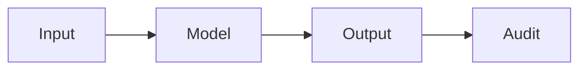

# KI-Sicherheit

## Definition

KI-Sicherheit adressiert Risiken fortgeschrittener KI: Missbrauch, unbeabsichtigtes Verhalten und Alignierung (Systeme tun, was wir beabsichtigen). Es umfasst Robustheit, Interpretierbarkeit und Wertealignierung.

Es überschneidet sich mit [AI ethics](/docs/ai-ethics) (governance, fairness) and [bias in AI](/docs/bias-in-ai) (unfair outcomes). For [LLMs](/docs/llms) and [agents](/docs/agents), alignment (z. B. RLHF, constitutional AI) and guardrails are die wichtigsten levers; [explainable AI](/docs/xai) supports auditing and debugging.

## Funktionsweise

**Eingabe** wird vom **Modell** verarbeitet, um **Ausgabe** zu erzeugen. **Audit** (Tests, Monitoring, Red-Teaming) prüft, ob Ausgaben sicher, ausgerichtet und robust. Research and practice focus on: **alignment** (RLHF, constitutional AI, scalable oversight) so models follow intent; **robustness** (adversarisch testing, distribution shift) sodass sie behave under edge cases; **monitoring** in production to detect misuse or drift. Safety is considered across the lifecycle from Entwurf and data to training, evaluation, und Bereitstellung. Formal methods and interpretability ([XAI](/docs/xai)) support the audit step.

## Anwendungsfälle

KI-Sicherheit ist relevant für jedes hochriskante oder öffentlichkeitswirksame System: Ausrichtung, Robustheit und Überwachung von der Konzeption bis zur Bereitstellung.

- Auditierung und Red-Teaming von hochriskanten oder öffentlichkeitswirksamen Modellen
- Ausrichtung und Leitplanken für LLMs und Agenten (z. B. RLHF, constitutional AI)
- Robustheitstests und Überwachung in der Produktion

## Externe Dokumentation

- [Anthropic – Safety](https://www.anthropic.com/research) — Research on AI safety and alignment
- [OpenAI – Safety and responsibility](https://openai.com/safety)

## Siehe auch

- [AI ethics](/docs/ai-ethics)
- [Explainable AI](/docs/xai)
- [Bias in AI](/docs/bias-in-ai)
